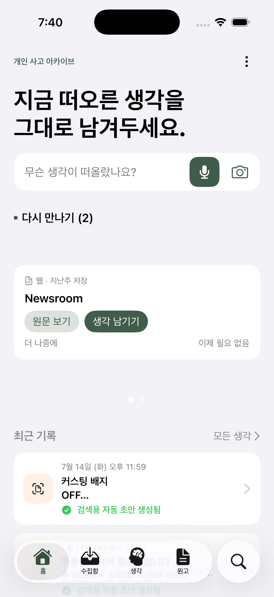
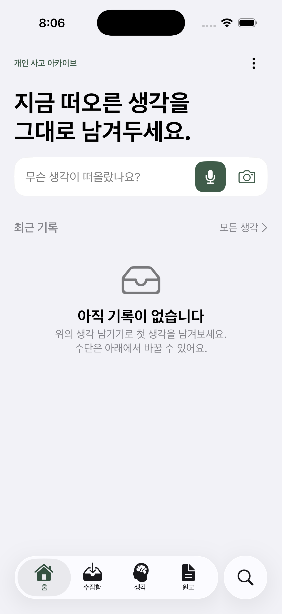
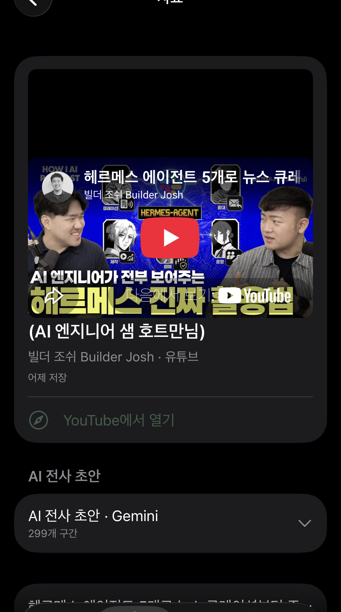
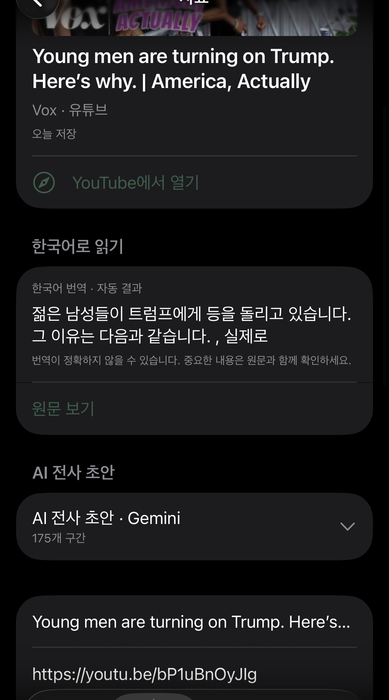

## 결과물

이번 주에는 기존 웹앱과 별개의 SwiftUI 네이티브 앱 **갈피(GALPI)**를 실제 iPhone에서 사용할 수 있는 수준까지 구현했다. 갈피는 기록 도구를 넘어, **좋은 인풋 → 나의 생각 → 표현 가능한 원고**가 이어지도록 돕는 개인 사고 아카이브다.

### 1. 생각을 놓치지 않는 빠른 기록

- 홈의 한 입력 바에서 글·음성·손글씨 기록으로 바로 진입한다.
- 음성 원본(M4A)과 손글씨 원본(JPEG)은 인식 결과와 분리해 변경 불가능한 원본으로 보존한다.
- Apple Speech 전사와 Apple Vision OCR 결과는 `rawText`, 사용자가 교정한 검색용 텍스트는 `editedText`로 분리했다.
- 앱 단축어와 제어 센터·잠금 화면 Control을 통해 음성·글·손글씨 화면을 바로 열 수 있다.

### 2. 양질의 인풋을 모으고 다시 만나는 수집함

- Safari·YouTube 등에서 공유한 URL을 Share Extension으로 즉시 저장한다.
- YouTube는 제목·채널명·섬네일을 자동 보강하고, 일반 웹과 Instagram도 가능한 범위에서 미리보기를 저장한다.
- 저장 후 시간이 지난 자료는 홈의 **다시 만나기** 큐에서 하루 최대 2개를 다시 보여준다. 단순 저장에서 끝나지 않고, 잊히기 전에 사용자가 자기 생각을 붙이도록 설계했다.
- 자료에서 바로 음성·글·손글씨 생각을 남길 수 있으며, 연결된 생각이 없어진 자료는 다시 후보가 된다.

### 3. 인풋에서 생각과 원고로 이어지는 흐름

- 앱의 정보 구조를 **홈 → 수집함 → 생각 → 원고 → 검색**의 5개 탭으로 재구성했다.
- 외부 자료에서 기록한 생각은 출처와 연결되고, 사용자는 “이 자료에서 내가 가져갈 생각”을 자기 언어의 한 문장으로 남길 수 있다.
- 한 문장은 AI 요약이 아니라 사용자가 직접 소화한 결과로 저장하며, 이후 원고에서 관련 자료와 생각을 다시 연결할 수 있다.
- 자료 수집량보다 **소화하고 표현한 흔적**이 남도록 상태와 연결 관계를 분리했다.

### 4. YouTube 영상과 AI 전사를 함께 읽는 화면

- 사용자의 Gemini API 키를 Keychain에만 저장하는 BYOK 방식으로 YouTube 영상의 전사 초안을 만든다.
- 전사 구간과 타임스탬프를 보존하고, 타임스탬프를 누르면 앱 안의 YouTube 플레이어가 해당 위치로 이동한다.
- 재생 중 스크롤하면 하나의 플레이어가 상단에 고정되어 영상을 보면서 아래 전사를 계속 읽을 수 있다.
- 전체 전사를 한국어로 번역하고, 전사 본문까지 통합 검색에 포함했다.
- 원본 영상·AI 전사·번역은 서로 덮어쓰지 않는 파생 데이터로 관리한다.

### 5. 실사용을 위한 데이터 안전장치

- SwiftData와 원본 자산을 포함하는 ZIP 백업·복원 흐름을 구현했다.
- 복원은 검증→격리 스테이징→재시작 시 전환→실패 시 롤백 순서로 동작하며, 빈 저장소를 만들어 기존 데이터를 덮는 경우를 차단했다.
- 흐름 재구성을 위해 기존 모델을 직접 변형하지 않고 V5 보조 모델과 백업 포맷 v3를 추가했다.
- 업데이트 설치 전후마다 SQLite 무결성과 원본 자산 SHA-256을 대조했고, 실제 iPhone에서 기존 데이터가 유지되는지 확인했다.

## 삽질 과정

가장 큰 시행착오는 기능을 많이 넣는 것보다 **어떤 흐름으로 묶어야 사용자의 사고를 방해하지 않는가**를 정하는 일이었다. 처음에는 손글씨·말·글이라는 입력 방식이 홈의 주요 분류였지만, 사용자의 관점에서는 모두 생각을 남기는 도구일 뿐이었다. 그래서 기록 방식은 하나의 입력 바로 줄이고, 제품의 구조는 수집함·생각·원고라는 의미의 흐름으로 다시 정리했다.

두 번째 문제는 자료가 잘 쌓여도 다시 보지 않으면 저장소가 묘지가 된다는 점이었다. 단순 알림을 늘리는 대신, 일정 시간이 지난 자료 중 아직 유효한 생각 연결이 없는 것만 하루 최대 2개 보여주는 **다시 만나기 큐**를 설계했다. 화면이 다시 그려질 때마다 카드가 바뀌거나 할당량을 소모하지 않도록 후보 조회와 하루 확정을 분리했다.

YouTube 플레이어는 스크롤에 맞춰 고정하면서도 재생 상태와 타임스탬프 연결을 유지해야 했다. 처음에는 인라인 영역과 고정 영역에 각각 플레이어를 두었지만, 스크롤 후 WebView가 다시 만들어져 재생이 끊겼다. 이를 **WKWebView 한 개를 화면 수명 동안 유지하고 좌표만 바꾸는 단일 호스트 구조**로 교체했다. 이후 전역 좌표와 로컬 좌표를 혼용해 플레이어가 제목을 덮는 문제도 실기기에서 반복 측정해 바로잡았다.

Gemini 전사는 실제 진행률을 제공하지 않아 멈춘 것처럼 보였다. 정확한 완료율인 척하지 않으면서도 기다릴 수 있도록 경과 시간, 예상 진행 곡선, 단계별 문구와 취소 기능을 추가했다. 또한 YouTube 앱이 URL을 일반 텍스트로 공유하는 경우를 Share Extension과 importer 양쪽에서 방어해, 링크와 원문을 잃지 않도록 했다.

마지막으로 SwiftData 스키마는 기존 버전들이 같은 모델 클래스를 공유하므로 기존 필드에 직접 손대면 마이그레이션 위험이 있었다. 그래서 다시 만나기 상태와 한 문장 증류 결과를 별도 보조 모델로 추가하고, 백업·복원 검증까지 함께 확장했다.

## 인사이트

> 기록의 양보다 중요한 것은 좋은 인풋을 잊기 전에 다시 만나고, 그것을 사용자의 언어로 소화해 자신의 표현으로 이어가게 만드는 흐름이다.
