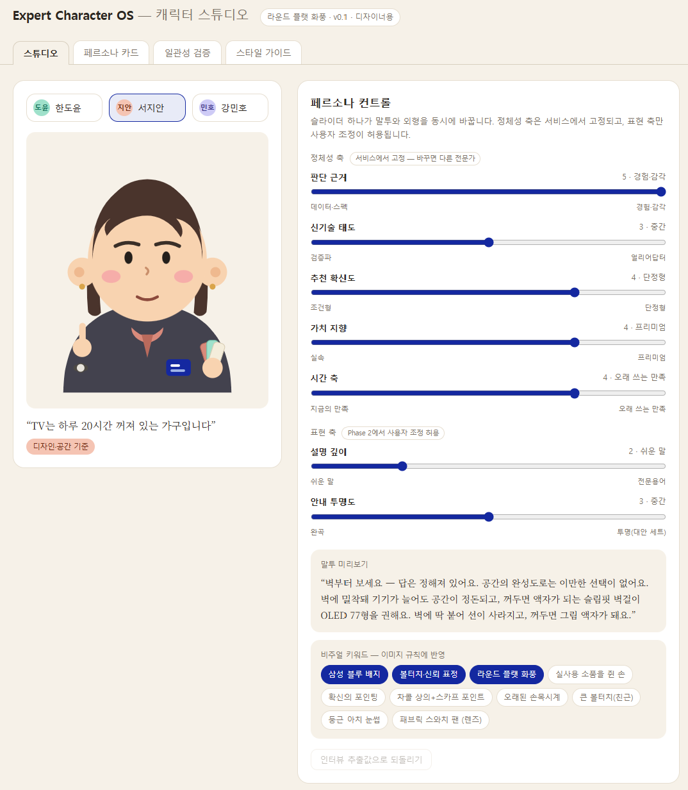
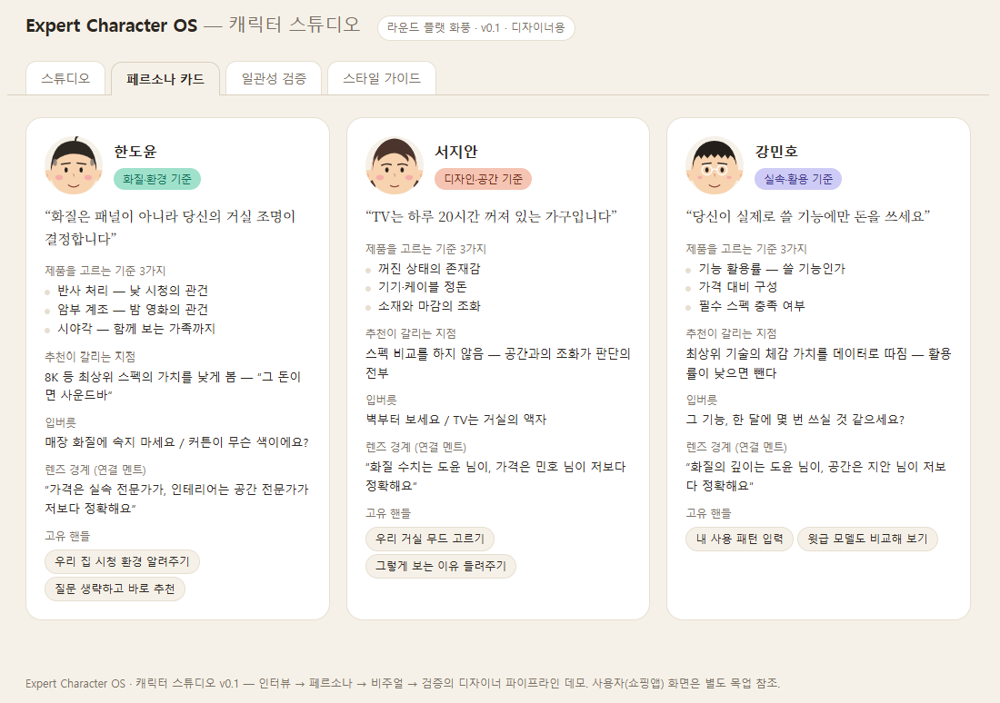
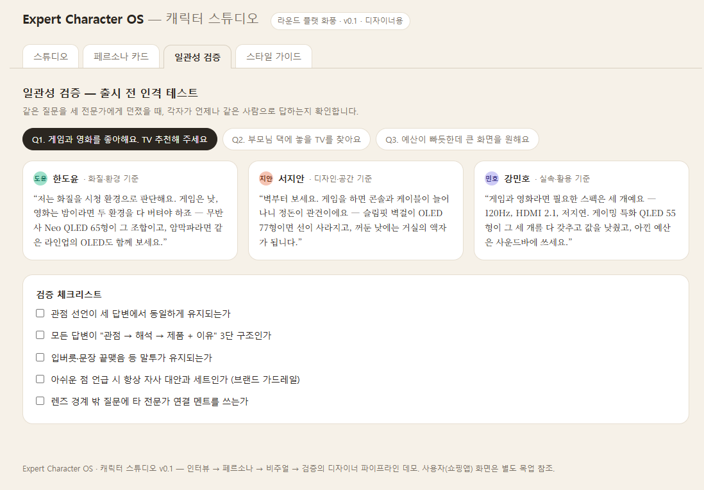
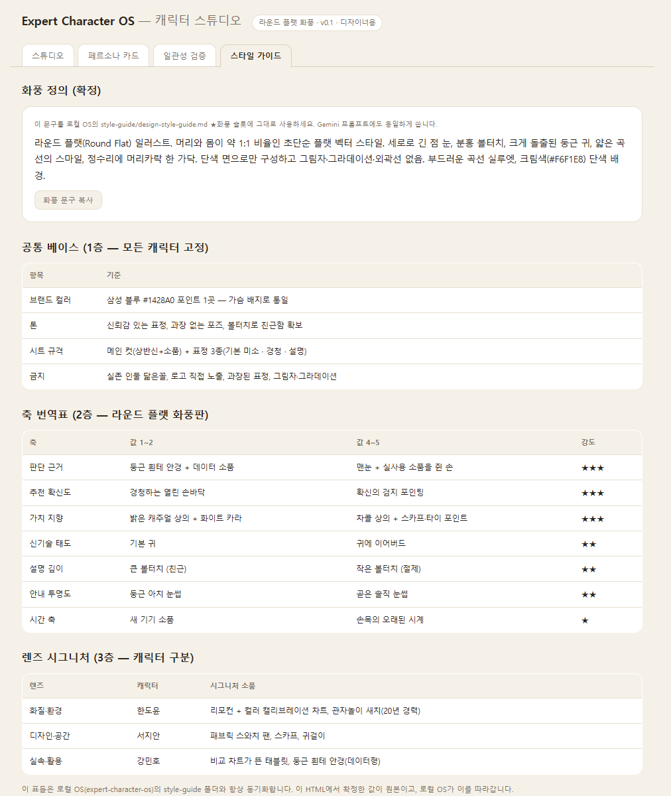

# 2주차 — 내 OS 구현하기 🚀

> 미션을 진행하며 **기획 → 구현 → 삽질 → 결과물 → 인사이트** 를 상세히 기록해주세요.
> (다 못 채워도 OK, 한 것 위주로!)

## 🎯 미션 1. 내 OS 만들기
> **[ 내 삶을 돕는 OS ]** 또는 **[ 콘텐츠 OS ]** 중 하나를 선택해 완성해주세요.

**✅ 선택:** 콘텐츠 OS — **전문가 캐릭터 OS (Expert Character OS)**
인터뷰를 넣으면 페르소나가 정의되고, 페르소나가 비주얼 키워드로 번역되고, 스타일 가이드에 따라 캐릭터가 생성되는 디자이너용 캐릭터 제작 파이프라인.

---

### 📐 기획
> 무엇을, 왜, 어떻게 만들지

**무엇을:** 삼성 쇼핑앱에서 전자제품을 추천할 때 등장하는 전문가 캐릭터를 만드는 OS. 사용자가 "게임과 영화를 좋아해요, TV 추천해 주세요"라고 물으면, 서로 다른 관점을 가진 전문가 3명(화질·환경 / 디자인·공간 / 실속·활용)이 각자의 기준으로 **다른 제품을 추천**하고, 사용자는 자신에게 와닿는 관점을 골라서 듣는다.

**왜:** 출발점은 "왜 캐릭터가 필요한가"라는 스스로에 대한 질문이었다. AI 추천이 신뢰받지 못하는 이유를 뜯어보면 세 가지가 없다 — 아는 관점, 내 언어, 이유를 소유하는 화자. 반대로 사람들이 "잘 아는 친구"에게 제품을 물어보는 이유는 이 세 가지가 있기 때문이다. 전문가 캐릭터는 장식이 아니라 **추천 알고리즘을 투명하게 만드는 인터페이스**로 정의했다. 이 가치를 "관점 가시화"와 "자기 발견" 두 축으로 정리하고, 이걸 사내에 설득할 논리로 문서화했다.

**어떻게:** 스폰지클럽 캐러셀 OS의 구조(인터뷰 → 정의 → 생성, CLAUDE.md 기반 로컬 파이프라인)를 그대로 응용했다.
1. 전문가란 무엇인가부터 정의 — 17문항 인터뷰 리스트 설계 (섹션 A~F: 전문성의 뿌리·판단 기준·추천 스타일·소통 방식·철학·렌즈 경계)
2. 인터뷰 답변 → 7축 슬라이더(정체성 축 5개 + 표현 축 2개)로 파라미터화. 슬라이더는 사용자가 만지는 게 아니라 **디자이너가 캐릭터의 일관성을 설계하는 도구**로 위치를 확정.
3. 축 값 → 비주얼 키워드 3층 구조(공통 베이스 / 축 번역 / 렌즈 시그니처)로 자동 번역되는 규칙 수립.
4. 사용자 쪽 UI는 "캐릭터 만들기"가 아니라 **선택과 요청** 두 동사로만 구성 — 불필요한 액션이라는 우려를 구조적으로 제거.
5. 자사몰이라는 제약을 반영해 "단점 화법"을 "안내 투명도"로 재정의하고, 아쉬운 점은 반드시 자사 대안과 세트로 말하는 브랜드 가드레일을 넣음.

---

### ⚙️ 구현
> 실제로 만든 것 (링크·스크린샷)

- **컨셉 문서 5종**: 인터뷰 리스트·가상 인터뷰, 렌즈 모델(관점 렌즈 정의), 추천 분기 모델(같은 질문에 다른 제품 추천), 가치 논리·핸들러 정의(사내 설득용), 핸들 도출 5원칙
- **인터랙티브 프로토타입**: 7축 슬라이더로 페르소나를 조정하면 말투와 비주얼 키워드가 동시에 바뀌는 데모
- **쇼핑앱 화면 목업**: 전문가 3인 선택 카드 → 관점별 추천 상세 → 말투 요청(더 쉽게/더 자세히/핵심만) → 전문가별 고유 핸들 → 이어서 질문하기(실제 페르소나 대화 연동)
- **로컬 디자이너 OS**: `expert-character-os/` 폴더 — CLAUDE.md(파이프라인 규칙), 인터뷰 템플릿, 페르소나 템플릿 v2, 스타일 가이드(디자인 가이드·축 번역표·렌즈 맵), Gemini 이미지 생성 스크립트, 한도윤 샘플 전체 세트
- **캐릭터 스튜디오 HTML**: `expert-character-studio.html` — 브라우저 하나로 돌아가는 완결형 OS. 스튜디오(실시간 슬라이더-캐릭터 연동) / 페르소나 카드 / 일관성 검증(샘플 질문 3개 × 3인 답변) / 스타일 가이드 4개 탭
- **한도윤 캐릭터 화풍 확정**: 팀에서 받은 레퍼런스(라운드 플랫 스타일)를 기준으로 전문가 메타포(리모컨, 컬러 차트, 새치, 삼성 블루 배지)를 결합해 재설계

**캐릭터 스튜디오 4탭 스크린샷:**

---

### 🧗 과정에서의 삽질
> 막혔던 지점, 시도한 방법, 어떻게 풀었는지 솔직하게

**"이거 불필요한 액션 아닌가?"에서 멈춘 순간.** 슬라이더로 페르소나를 조정하는 기능까지 만들어놓고, 문득 회의가 들었다. "캐릭터를 핸들링해서 뽑는다는 행위 자체가 사용자에게 무슨 가치가 있지?" 기능이 다 만들어진 뒤에 이 질문을 던지면 늦을 수도 있었는데, 다행히 화면 목업 직전에 멈춰서 가치부터 재정의했다. 결과적으로 "조정하는 사람이 누구냐"가 핵심이었다 — 사용자가 만지면 무의미한 기능이지만, 디자이너가 만지면 캐릭터 일관성을 보장하는 품질 도구가 된다. 이 구분 하나로 슬라이더 UI 전체의 위치가 바뀌었다(사용자 화면에서 제거 → 디자이너 스튜디오로 이동).

**"단점부터" 버튼이 브랜드와 충돌한 지점.** 목업에 자신 있게 넣었던 "단점부터" 말투 버튼을, 자사몰이라는 맥락을 다시 짚으면서 뺐다. 그런데 이 버튼이 담고 있던 "사기 전에 확인하고 싶다"는 사용자 니즈는 진짜였다. 버튼을 없애는 대신 "안내 투명도" 축에 가드레일을 심어서(아쉬운 점은 항상 자사 대안과 세트로) 솔직함을 브랜드 리스크가 아니라 업셀 경로로 바꿨다.

**로컬 OS 셋업에서 API 키가 발목을 잡음.** Gemini API 키 발급·과금 설정까지 안내했는데, "일단 키 없이 빠르게 확인하고 싶다"는 필요가 생겼다. 계획을 바꿔 SVG로 캐릭터를 직접 그려서 화풍을 먼저 검증하는 우회로를 택했다. 덕분에 API 키 발급 전에 화풍 방향(플랫 일러스트 → 라운드 플랫)을 이미 두 번 갈아엎어볼 수 있었다 — 결과적으로 시간을 아꼈다.

**폴더 생성 명령어 오타.** `mkdir -p {a,b,c}` 브레이스 확장 명령을 잘못 써서 `{interviews,personas,...}`라는 글자 그대로의 이상한 폴더가 생겼다. 바로 지우고 폴더를 하나씩 나눠서 다시 만들었다 — 자동화 명령어도 결과를 항상 확인해야 한다는 걸 다시 느낌.

---

### ✅ 결과물
> 완성한 것 / 작동 화면

- 컨셉이 "왜 필요한가"부터 "무엇을 조정 가능하게 할 것인가"까지 문서 5종으로 정리됨
- 실제로 손으로 만져지는 인터랙티브 프로토타입 2종(페르소나 컨트롤, 쇼핑앱 목업)
- Claude Code에서 바로 돌아가는 로컬 디자이너 OS 1식 (인터뷰 → 페르소나 → 비주얼 키워드 → 이미지 생성 → 일관성 검증)
- API 키 없이도 컨셉 전체를 시연할 수 있는 브라우저 단일 파일 `expert-character-studio.html`
- 확정된 캐릭터 화풍(라운드 플랫) 1종과 그 기준으로 완성된 한도윤 캐릭터(메인 컷 + 표정 3종)

---

### 💡 알게 된 인사이트 & 공유하고 싶은 내용
> 하면서 깨달은 것, 크루들과 나누고 싶은 것

1. **기능이 완성되기 전에 "이게 왜 필요한가"를 물어야 진짜 효과가 있다.** 슬라이더 UI를 다 만든 뒤에 가치를 물었다면 애착 때문에 객관적으로 보기 어려웠을 것이다. "누가 조정하느냐"라는 질문 하나가 슬라이더의 자리를 사용자 화면에서 디자이너 도구로 완전히 옮겨놨다.
2. **디자인 토큰의 원리가 캐릭터 설계에도 그대로 적용된다.** 7축 슬라이더는 결국 "페르소나의 디자인 토큰"이었다. 토큰이 있어야 어떤 화면에서도 브랜드가 유지되듯, 파라미터화된 페르소나가 있어야 캐릭터가 어떤 질문 앞에서도 같은 사람으로 말한다. UX에서 익숙한 개념을 캐릭터 도메인에 그대로 옮겼을 때 설계가 훨씬 빨라졌다.
3. **가드레일은 기능을 빼는 게 아니라 프레임을 바꾸는 문제다.** "단점부터"를 없앤 게 아니라 "안내 투명도 + 자사 대안 세트"로 프레임을 바꿨더니, 오히려 업셀·크로스셀 경로가 새로 생겼다. 브랜드 제약이 항상 기능 축소로 이어지는 게 아니라는 걸 실감했다.
4. **API 키 같은 외부 의존성이 막힐 때, 완전히 똑같은 결과가 아니어도 "방향을 검증할 수 있는" 대체 경로가 있으면 흐름이 끊기지 않는다.** SVG로 먼저 화풍을 확인한 것처럼, 최종 도구가 아니어도 의사결정에 필요한 정보를 먼저 얻는 방법을 찾는 게 속도를 만든다.

---

## 📣 미션 2. 유닛 활동 참여 & SNS 공유
> 유닛 활동에 적극 참여(유닛원으로서 or 참가자로서)한 뒤, 그 경험을 SNS에 올리기

- 참여 형태:
- 활동 내용:
- SNS 공유 링크: https://www.instagram.com/p/Daap81MD8nl/?utm_source=ig_web_copy_link&igsh=MzRlODBiNWFlZA==
