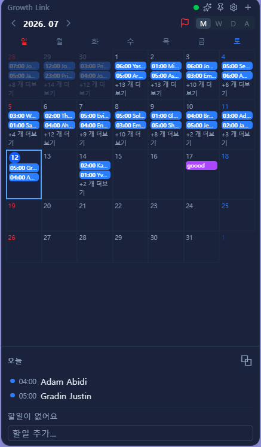
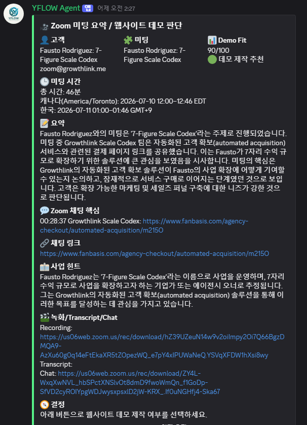

# 2주차 — 내 OS 구현하기 🚀

> 미션을 진행하며 **기획 → 구현 → 삽질 → 결과물 → 인사이트** 를 상세히 기록해주세요.
> (다 못 채워도 OK, 한 것 위주로!)

## 🎯 미션 1. 내 OS 만들기
> **[ 내 삶을 돕는 OS ]** 또는 **[ 콘텐츠 OS ]** 중 하나를 선택해 완성해주세요.

**✅ 선택:** (내 삶을 돕는 OS / 콘텐츠 OS 중 택1 — 골라서 적어주세요)

내 삶을 돕는 OS

### 📐 기획
> 무엇을, 왜, 어떻게 만들지

기존 해외에 판매하고 있던 대시보드는 데스크탑이나 노트북에서 네트워크연결이 되지않으면 
데이터를 볼수없는 오류가 있었는데 이문제를 해결하고자
로컬에서 작동하는 데스크탑 캘린더를 제작하게 되었습니다.

### ⚙️ 구현
> 실제로 만든 것 (링크·스크린샷 — 이미지는 `이미지첨부/` 폴더에)

### 🧗 과정에서의 삽질
> 막혔던 지점, 시도한 방법, 어떻게 풀었는지 솔직하게

먼저 페이블5 토큰한도 및 한번호출시 작업할때 드는 토큰이 많아 처음에는 기다리다가 새로운 워크플로우
페이블은 기획 작업은 오퍼스, 소넷으로 작업 하는 워크플로우를 활용해 비싼 토큰소비량을 감소했습니다.

-> 추가로 거기에서도 부족해서 토큰 추가로 구매했습니다 ㅎㅎ

보안문제가 있기때문에 보안데이터는 슈퍼베이스 데이터를 활용, 로그인은 IP, 디바이스 설정란을 추가하였습니다.
-> 가장강력한 보안체계

추가로 헤르메스 에이전트를 활용해

디스코드에 헤르메스 에이전트도입
회사 내부 자체서버로 n8n을 수정할수있고
대화내용을 학습, 미팅일정 트래킹 및 클라이언트 분석
을 진행해주는 에이전트 도입을 진행했습니다.

### ✅ 결과물
> 완성한 것 / 작동 화면

현재 투두리스트 및 기존 대시보드 캘린더 외 다른 캘린더를 연결할수있는 기능을 추가해두었고 디자인을 보다 깔끔하고 가시성 좋게만들었습니다. 잘못누르는 일을 방지하기위해 고스트 락업 기능도 추가했습니다.

### 💡 알게 된 인사이트 & 공유하고 싶은 내용
> 하면서 깨달은 것, 크루들과 나누고 싶은 것
페이블은 이제끝나지만 오퍼스를 사용하더라도 모든것을 오퍼스에 맡기는것이 아닌 소넷이나 기타 모델들도 잘활용할것 같습니다.

## 📣 미션 2. 유닛 활동 참여 & SNS 공유
> 유닛 활동에 적극 참여(유닛원으로서 or 참가자로서)한 뒤, 그 경험을 SNS에 올리기

- **참여한 유닛 / 활동:**
- **무엇을 했나 (경험):**
- **SNS 인증 링크:**
https://www.linkedin.com/posts/thinkys_swmudutfmtmmrvp-spuujosvitmmrvp-share-7481792386520494082-f_6T/?utm_source=share&utm_medium=member_desktop&rcm=ACoAAEkUG7EBWf-aSRdClqvoqLnb72Q5PnusCoY