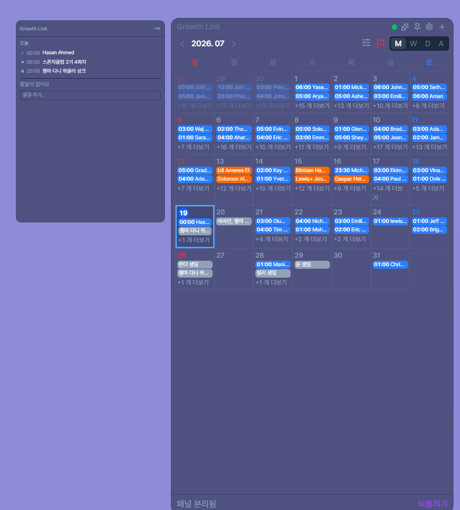
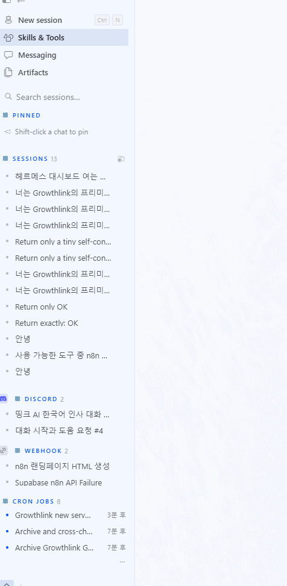

# 3주차 — 내 OS 최종 완성 🏁

> 미션을 진행하며 과정과 결과를 기록해주세요. (다 못 채워도 OK, 한 것 위주로!)

## 🎯 미션 1. 내 삶을 돕는 OS 최종 완성
> 지금까지 공유하며 받은 **피드백을 반영해 최종 완성**!
- **완성한 것 (무엇을):** 회사대시보드 캘린더와 - 연동해서 쓸수있는 데스크탑 캘린더 완성
- **피드백 반영한 점:**
1. 구글캘린더 연동기능과, 캘린더가 분리되서 원하는 캘린더만 연동할수있도록 하기
2. 캘린더 일정부분 분리되서 따로 오늘의 일정 볼수있도록 추가 작업진행
3. 캘린더 내의 연동캘린더들 색 분류작업 진행
4. 메모기능 활성화 및 추가
5. 캘린더 내의 일정 클릭시 대시보드의 상세내용 끌어오기 기능 추가

- **결과물 (링크·스크린샷 — 이미지는 `이미지첨부/` 폴더에):**
- **알게 된 인사이트:**
최근에 Fable이 강화된것인지 제가 권한을 많이 줘서인지는 모르겠지만 
구글 aouth 기능을 너가 알아서 해줘 라고하니
직접 크롬에연결된 클로드플러그인을 활용해 구글 aouth 설정부터 API 연동까지 진행해주었습니다.
-> 저는 로그인 한것 밖에 없어요

새로 알게된 토큰 아끼는 방법인
페이블은 기획 -> 코드는 오퍼스 ->파일을 읽고 분류하는것은 하이큐를 활용해 작업했더니 작업속도는 조금 늘어났지만 -> 토큰소모량이 눈의 띄게 줄어들었습니다 
60%정도 감소된것 같습니다.

이번에 헤르메스 에이전트를 이전작업을 진행하면서
헤르메스를 서버에 띄워두고 -> 헤르메스 데스크탑앱에
연동해 서버에서 24시간 돌아가는 헤르메스의 작업내용을 컴퓨터에서 직관적으로 확인할수있도록 수정했습니다.

## 📣 미션 2. 스폰지 토크데이 SNS 후기
> 오늘 토크데이 후기를 SNS에 올리기 (**#스폰지클럽 필수 · 셀 3개 지급!**)
- **후기 내용:**
- **SNS 인증 링크:**
