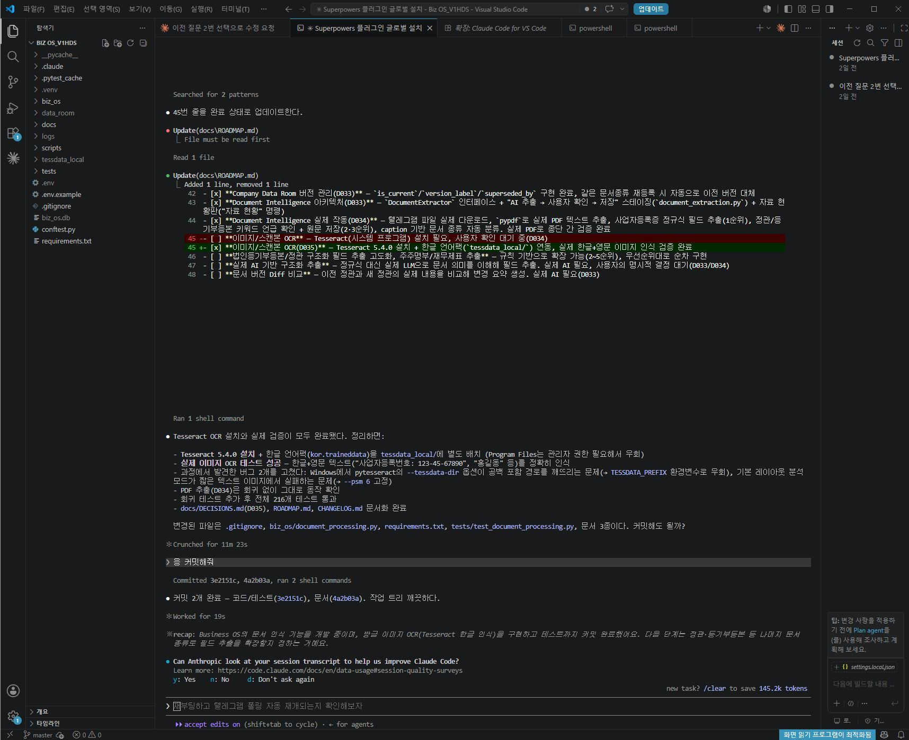
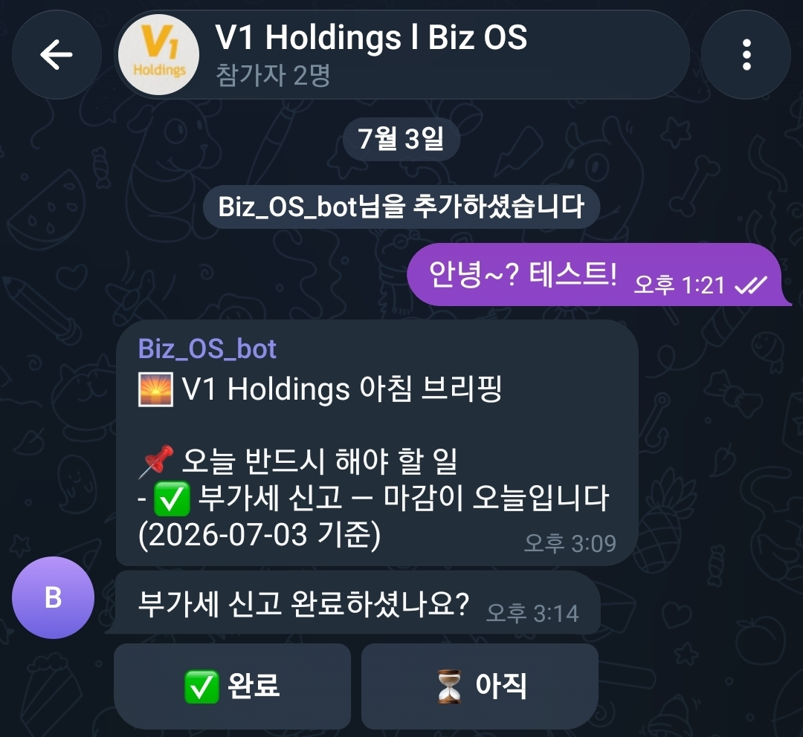
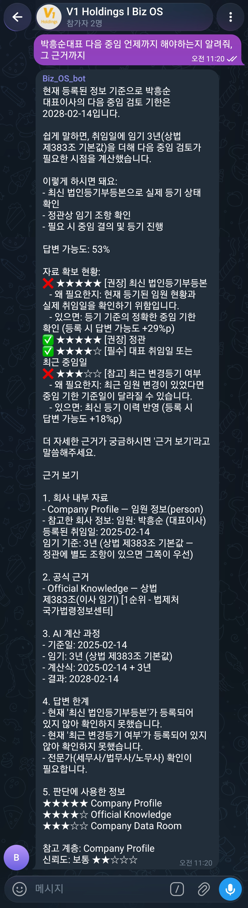
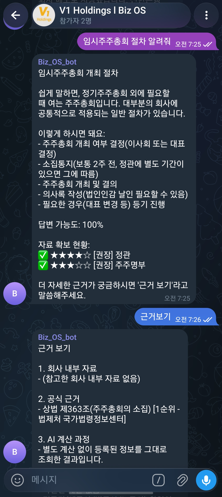

# 1주차 — 나만의 OS 만들기 🛠️

> 미션을 진행하며 **과정과 결과물**을 기록해주세요. (다 못 채워도 OK, 한 것 위주로!)

## 🎯 미션 1. 내 OS 재료 찾기
> 인터뷰 스킬(아이데이션)로 "내 삶에 필요한 게 뭔지" 찾기

- **과정 (어떻게 찾았나):**
  인터뷰 스킬을 써서 5단계 질문을 따라갔다. 오늘 하루에서 시간을 제일 많이 쓴 일(메일·메시지, 사업자 운영 조사)부터 시작해 → 매번 짜증나는 반복 지점을 좁히고 → 일 vs 삶 중 무게를 재서 "일(법인 운영)" 쪽을 골랐다. 지금 그 일을 어떻게 처리하는지까지 되짚으며 재료 카드를 완성했다.

- **결과:** OS 재료 카드
  - **영역**: 일 (법인·사업 운영)
  - **걸리는 지점**: 여러 법인을 운영하며 챙길 게 너무 많음 — 세금 납부일, 월급날, 인증서 갱신, 임원 중임, 정기·임시 주주총회 등
  - **지금은**: 한곳에 모인 데가 없음. 세무사에게 묻고, 친구에게 묻고, 안 되면 상법을 직접 검색. 주주총회는 특히 어려워 사람·책까지 총동원.
  - **OS가 된다면**: 법인별 "할 일 + 기한" 자동 캘린더 — 세금일·월급날·인증서 갱신·중임·정기주총을 법인마다 따로, 한눈에.
  - **한 문장**: "법인이 몇 개여도 빠뜨리는 게 없다"
  - **첫 한 걸음**: 클로드 코드로 법인 1개부터 '챙길 일 + 기한' 목록을 만들어 캘린더로 정리

- **느낀 점:**
  "딱히 불편한 게 없다"고 느꼈는데, 하루를 되짚어보니 매번 흩어진 정보를 새로 찾느라 쓰는 시간이 꽤 컸다. 반복되면서 귀찮은 일이 바로 OS로 만들기 좋은 재료라는 걸 알게 됐다.

## 🧩 미션 2. 내 OS 기획
> 인터뷰 결과 + 세션 내용(흐민·배짱·키노) 활용해 기획

- **기획 내용:** 이름 = **Biz 집사(執事)** (법인뿐 아니라 개인사업자도 쓸 수 있게)
  > 여러 사업체의 챙길 일을 자연어로 던지면, 집사가 알아서 기한별로 정리하고 때 되면 먼저 알려주는 운영 OS.

  허민님의 "지식 OS" 구조(자연어 인풋 → 에이전트 분류·저장 → 연결 → 제안 → 발행)와 배짱님 온맘의 "정해진 시각 자동 알림"을 법인 운영용으로 변환했다.

  **5단계 루프**
  | 단계 | 내용 |
  |------|------|
  | 1. 인풋 | 텔레그램에 자연어로: "A법인 임시주총 열어야 함" |
  | 2. 저장·판단 | 집사 에이전트가 상황 판단 → 필요 서류·기한·공증까지 절차로 풀어 해당 법인 폴더에 저장 |
  | 3. 연결 | 법인 규모(1인/5인미만/10인↑) 상법 기준과 연결해 체크리스트 완성 |
  | 4. 제안 | 매주 월요일 이번 주/이번 달 마감 임박 항목 브리핑 |
  | 5. 발행 | 기한 D-3에 텔레그램 알림 ("A법인 부가세 3일 남음") |

  **폴더 구조** (법인별 분리 = 카드의 "법인마다 따로 관리" 니즈 구현)
  ```
  Biz집사/
  ├── A사업체/  (등기부·정관 요약 / 세무일정 / 주총기록)
  ├── B사업체/
  ├── C사업체/
  └── _공통지식/  (규모별 의무, 주총 절차 템플릿, 공증 가이드)
  ```

  **단계별 로드맵**
  - 1단계(이번 주): 법인 1개의 '챙길 일 + 기한'을 표로 → 임박 3건을 텔레그램 D-3 알림
  - 2단계: 법인 B·C 추가 + "상황 입력 → 절차 안내" 켜기
  - 3단계: 규모별 상법 체크까지 자동 반영

- **막혔던 점 / 어떻게 풀었나:**
  처음엔 "무슨 기능을 만들까"부터 생각해서 막막했다. 인터뷰 스킬이 "내 하루의 어디가 걸리는가"부터 되묻는 방식이라, 기능이 아니라 실제 반복되는 고통 지점(법인 의무 챙기기)에서 출발할 수 있었다.

## ⚙️ 미션 3. 내 OS 구현
> 실제로 만들어본 것 (클로드코드 '채널' 기능 활용 OK)

- **결과물:** **Biz 집사 (V1 Holdings) — 사업체 운영 텔레그램 봇** 실제 구현 완료 ✅
  VS Code + Claude Code로 Python 프로젝트(`biz_os`)를 만들고, 텔레그램 봇(`Biz_OS_bot`)과 연동해 기획한 "Biz 집사"를 실제로 작동시켰다. 법인뿐 아니라 개인사업자도 쓸 수 있게 이름을 "Biz 집사"로 정했다. 온보딩 때 받은 회사 정보 + 내가 텔레그램으로 전달한 문서를 바탕으로, **물어보면 답하고 챙길 일은 먼저 푸시**해주는 OS다.

  **① 온보딩 & 문서 인텔리전스 (자료 흡수)**
  - 처음 시작할 때 봇이 회사 정보를 물어보며 세팅한다.
  - 질문에 답하려면 회사 자료가 더 필요할 경우, **초보자도 알아들을 수 있게 난이도를 맞춰** 어떤 자료가 필요한지 나에게 요청한다.
  - 나는 PDF·이미지를 **텔레그램으로 전달**하면, 봇이 텍스트로 추출(Tesseract 한글 OCR)해 법인 자료로 흡수한다. → 이후 모든 질문·일정 안내가 이 자료를 토대로 이뤄진다. (`001.JPG`)

  **② 하루 2회 자동 브리핑 (푸시)**
  - **아침 브리핑 (오전 8시)**: 오늘 진행해야 할 일 + 준비해야 할 일 + **오늘 뜬 사업자 맞춤 지원사업·이벤트** 추천을 푸시. `✅완료 / ⏳아직` 버튼으로 처리. (`002.jpg`)
  - **오후 브리핑 (오후 4시)**: 아침에 '완료'를 누르지 않은 **나머지 할 일**만 다시 알림.
  - **미완료 이월**: 당일에 완료를 누르지 않으면 **다음 날 아침에 다시 푸시**한다.

  **③ 상황 질문 → 근거·신뢰도 기반 답변**
  - **절차 안내**: "임시주주총회 절차 알려줘" → 상법 제363조 등 **공신력 높은 자료를 우선**해 절차를 안내하고, **답변 신뢰도**와 근거를 함께 표시. (`004.jpg`)
  - **기한 자동 계산**: "박흥순 대표이사 다음 중임 언제까지?" → 상법 제383조 기준으로 2028-02-14 **자동 계산** + 근거·신뢰도 제시. (`003.jpg`)
  - 이렇게 사업체를 운영하며 궁금한 걸 물어보면, 흡수해둔 내 회사 자료 + 상법을 토대로 **내 상황에 맞춰 정리해** 알려준다.

- **막혔던 점 / 배운 점:**
  - **여러 법인을 봇 하나로 관리하는 법** (가장 큰 배움): 법인이 여러 개라 "봇을 법인 수만큼 만들어야 하나?" 고민했다. 결론은 **봇은 1개, 그룹방을 법인마다 따로** 만드는 것. 상법 같은 **공통 지식은 봇에 다 들어가** 공유되고, **그룹방마다 각 사업장 정보**가 들어가니, 봇 하나로도 방마다 그 **사업장 맞춤형**으로 안내·답변해준다.
  - **Tesseract 한글 OCR 경로 문제**: 한글 인식 언어 데이터 경로 설정에서 시행착오가 있었으나, 로컬에 `tessdata_local`을 두고 환경변수로 잡아 해결.
  - *(그 외 만들면서 겪은 막혔던 점·배운 점은 이어서 추가 예정)*

- **링크 / 스크린샷:**

  **1) VS Code + Claude Code 개발 화면**

  

  **2) 텔레그램 봇 아침 브리핑·기한 알림**

  

  **3) 대표이사 중임 기한 계산 답변**

  

  **4) 임시주주총회 절차 안내 답변**

  

## 📱 미션 4. SNS 1주차 소감
> AI 도움 없이 직접 작성! (인증하면 셀 지급)

- **인증 링크:** https://www.instagram.com/p/DaVkd8jEmMV/
