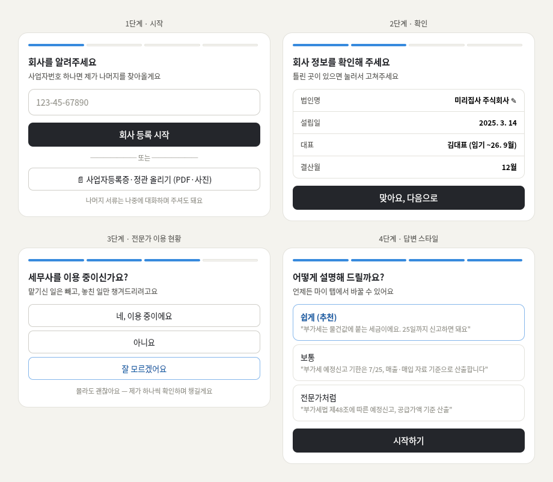
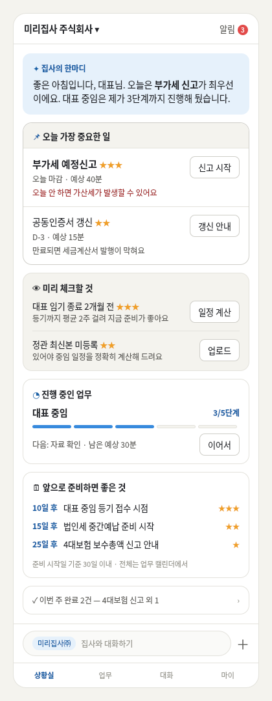
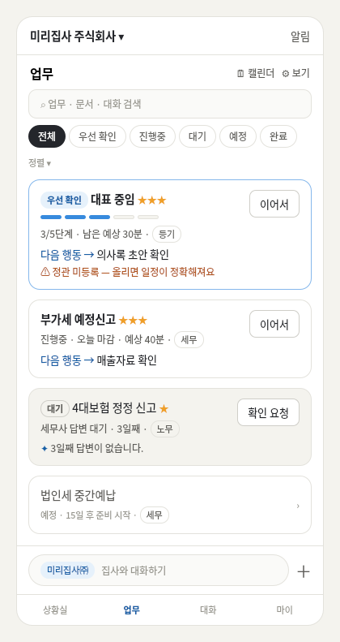
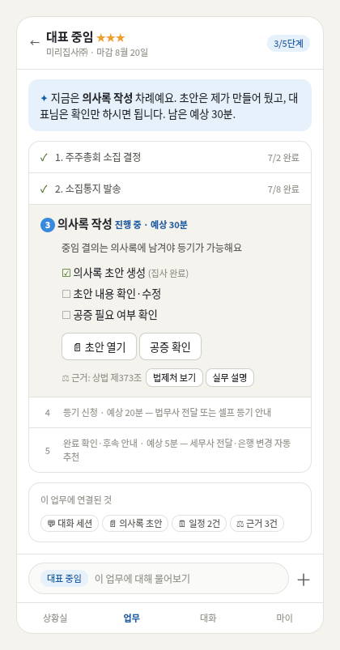
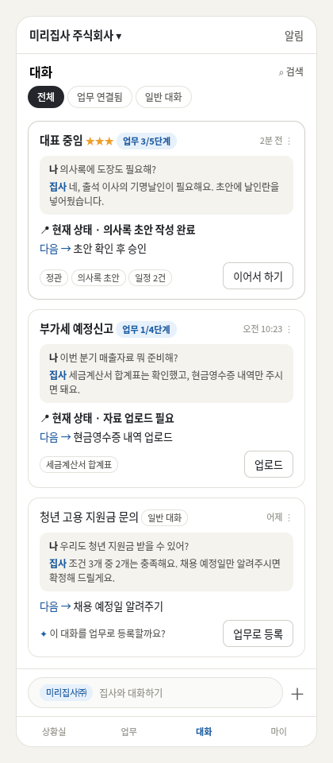

## 결과물

> 개발을 멈추고, 처음부터 다시 기획했습니다

이번 주에 만든 것은 코드가 아니라 설계도입니다.

지난주에 Business OS(사업자 운영 OS)를 처음 기획하고, VS Code에서 Claude Code로 텔레그램 봇을 연결해 실제 동작까지 만들어봤습니다. 그런데 이번 주에는 그 개발을 과감히 멈추고, Claude Chat(Fable 5)에서 처음부터 다시 기획을 진행했습니다. 그 결과물이 아래입니다.

1. 기획 코칭 스킬 1개 — 가치 정의 → BM → 벤치마킹 → 타겟 → 브랜딩 → 구조·기능 → IA → 와이어프레임 → 핸드오프까지 9단계를 순차 진행하는 스킬을 직접 만들었습니다. AI가 "Ask Your Question" 방식으로 질문을 던지고 내 답을 기획서로 정리해 주는 구조라, 기획 경험이 없어도 빠짐없이 밀고 나갈 수 있었습니다.
2. 서비스 브랜드 확정 — 서비스명 '미리집사', 슬로건 "미리 알면, 사업이 쉬워집니다". 이름 하나 짓는 데 후보를 70개 넘게 뽑고 4라운드를 돌았습니다.
3. 기획 마스터 문서 + 핸드오프 문서 3종 — 전체 기획서(400줄+), 클로드 디자인용 디자인 브리프, 클로드 코드용 개발 브리프(데이터 구조 14개 엔티티 포함). 개발자가 바뀌어도 이어받을 수 있는 수준을 목표로 MVP/확장을 전 항목 구분해 작성했습니다.
4. 핵심 화면 와이어프레임 — 상황실·업무 목록·업무 상세(실행 모드)·대화(세션)·온보딩까지, 화면마다 목업을 그리고 뒤집기를 반복하며 확정했습니다.

## 삽질 과정

> 이번 주 최대의 삽질은 "지난주의 나"였습니다.

지난주에는 아이디어가 떠오르자마자 바로 Claude Code를 켰습니다. 
텔레그램이 연결되고 봇이 대답하는 걸 보면 뭔가 되고 있는 것 같아 신이 났습니다. 문제는 그다음부터였습니다. 기능이 하나씩 추가될 때마다 구조가 복잡해졌고, 처음부터 체계적으로 설계하지 않은 상태라 작은 수정 하나에도 전체 코드를 계속 건드려야 했습니다. 알림 로직을 고치면 대화 처리가 꼬이고, 대화를 고치면 데이터 저장이 어긋나는 식이었습니다. 어느 순간 계산이 서더군요. "이대로 계속 가면 오히려 더 오래 걸리겠다."

그래서 개발을 멈추고 기획으로 돌아갔습니다.
다시 기획하는 과정에서도 뒤집기는 계속됐습니다. 대표적인 세 가지만 소개합니다.

사례 1 — 채팅은 '메뉴'가 아니라 '공기'여야 했다
    상황: 여느 앱처럼 AI 채팅 탭을 따로 만들었다.
    문제: 사용자는 어떤 화면을 보다가도 궁금한 게 생기는데, 그때마다 채팅 탭으로 이동하면 흐름이 끊긴다.
    결론: 채팅을 탭이 아닌 모든 화면에 항상 떠 있는 입력창으로 바꿨다. 대신 채팅 탭은 "부가세 신고", "대표 임기 갱신"처럼 대화를 업무 주제별로 묶어 보관하고 이어가는 공간으로 역할을 바꿔 남겼다.

사례 2 — 사업 업무의 절반은 '기다림'이었다
    상황: 업무 목록을 '시급 / 오늘 할 일 / 예정 / 완료'로 분류했다.
    문제: 막상 실제 업무를 대입해 보니 "세무사 답변 대기", "등기 처리 대기"처럼 내가 아닌 누군가를 기다리는 업무가 상당수인데, 이걸 담을 칸이 없었다. 기존 도구들이 이런 업무를 잊게 만드는 이유이기도 했다.
    결론: '대기' 상태를 신설하고 분류 체계 전체를 다시 짰다. 덤으로 "답변이 3일째 없어요, 확인해 볼까요?"라고 AI가 챙겨주는 기능 아이디어까지 얻었다.

사례 3 — 첫 화면은 '보여주는 곳'이 아니라 '시작하는 곳'이었다
    상황: 첫 화면을 매출·일정을 보여주는 전형적인 대시보드로 그렸다. (세 번 갈아엎었습니다)
    문제: 그려놓고 보니 사장님이 아침에 원하는 건 정보 구경이 아니라 **"그래서 오늘 뭐부터 하면 돼?"**라는 답이었다.
    결론: 화면의 기준을 '보여주기'에서 '행동 시작하기'로 바꾸고, 두 가지 원칙을 세웠다.
     - 카드 3원칙: 모든 카드에 "왜 중요한지 + 왜 지금인지 + 바로 누를 버튼"을 담는다. (예: "부가세 신고 · 오늘 마감 · 안 하면 가산세 [신고 시작]")
     - 5초 테스트: 어떤 화면이든 열고 5초 안에 할 일과 누를 버튼이 보여야 통과.

이 뒤집기들이 코드 위에서 벌어졌다면 매번 만든 걸 부수고 다시 지어야 했겠지만, 기획 단계였기에 문서 몇 줄 수정으로 끝났습니다.

## 인사이트

> 
1. 코드는 수정이 비싸고, 기획은 수정이 싸다. 방향이 흔들리는 동안에는 개발이 아니라 설계를 해야 한다. 이번 주 우리가 뒤집은 결정만 수십 건 — 코드였다면 몇 주짜리, 문서라서 몇 분짜리였다.

2. 사용자는 정보가 아니라 '다음 행동'을 원한다. 대시보드를 세 번 갈아엎고 얻은 결론. 화면의 완성도는 담긴 정보량이 아니라 "5초 안에 뭘 누를지 아는가"로 결정된다.

3. AI가 개발을 빨라지게 할수록, 승부는 설계에서 갈린다. Claude Code 덕에 '만드는 것'은 더 이상 병목이 아니었다. 진짜 병목은 '무엇을 만들지'였고, 그걸 정하는 데 일주일을 쓴 게 이번 주 가장 빠른 길이었다.

## 📣 미션 2. 유닛 활동 참여 & SNS 공유

- **참여한 유닛 / 활동:** 나만의 OS
- **무엇을 했나 (경험):** OT, 유닛원 소개 및 각자 고민 중인 나만의 OS 발표, 앞으로의 유닛 활동에 대한 전반적인 내용 공유
- **SNS 인증 링크:** https://www.instagram.com/p/DanYwUZAVHq/?utm_source=ig_web_copy_link&igsh=MzRlODBiNWFlZA==