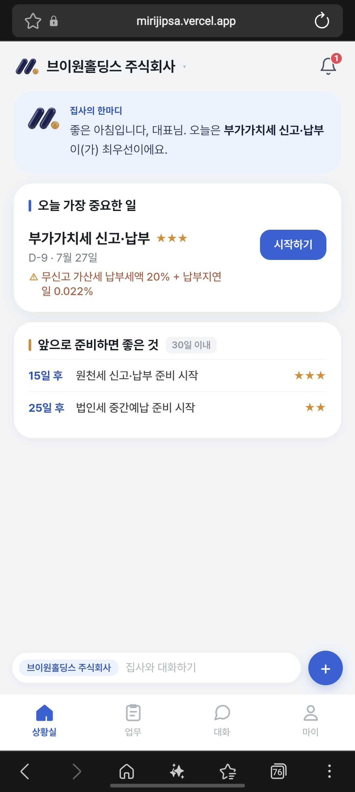
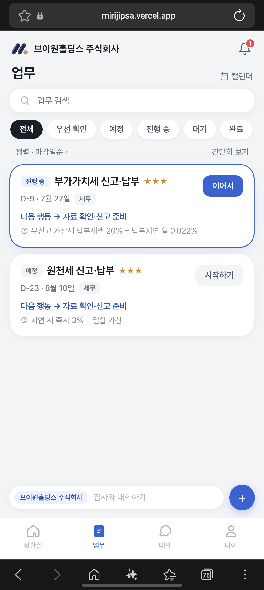
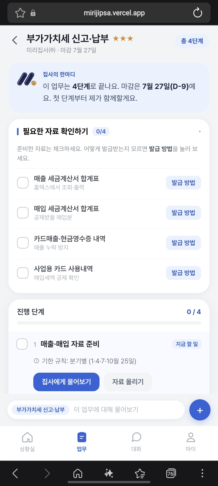
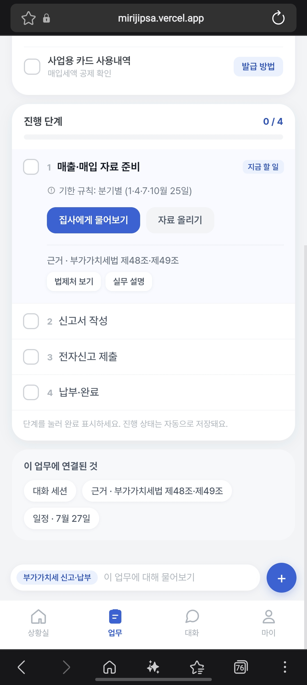
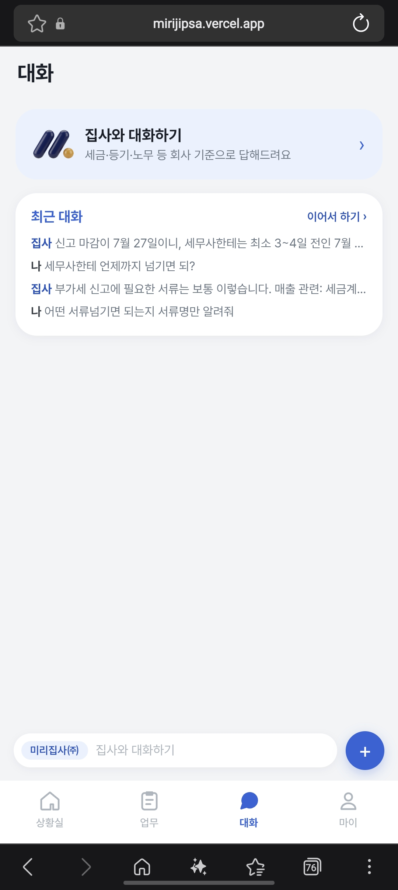
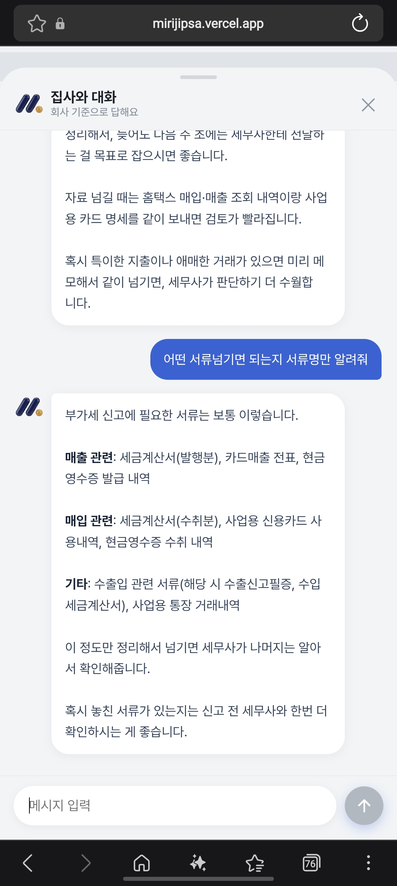
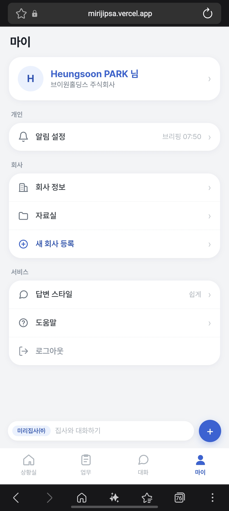
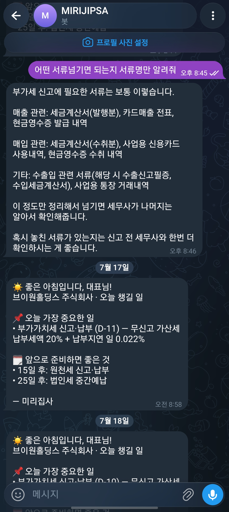

# 3주차 — 내 OS 최종 완성 🏁

> 미션을 진행하며 과정과 결과를 기록해주세요. (다 못 채워도 OK, 한 것 위주로!)

## 🎯 미션 1. 내 삶을 돕는 OS 최종 완성
> 지금까지 공유하며 받은 **피드백을 반영해 최종 완성**!
- **완성한 것:**
법인 대표가 세무·등기·노무처럼 놓치기 쉬운 일들을 미리 챙길 수 있게 도와주는 ‘미리집사’를, 실제로 돌아가는 서비스로 1차 완성해보았습니다. 제 회사 정보로 진짜 작동하고, 핸드폰과 텔레그램에서 바로 쓸 수 있습니다.

- 아침마다 텔레그램으로 “오늘 챙길 일”을 자동으로 보내주는 브리핑
- 국세청 사업자 상태, 공휴일 같은 공공데이터를 실시간으로 불러와 마감일을 계산
- 집사에게 말을 걸면 제 회사 기준으로 답해주는 AI 대화 (웹·텔레그램 어디서 시작해도 이어짐)
- 서류를 올려두는 보관함과, 공인인증서 만료 미리 알림
- 업무를 단계로 쪼개고, 체크하면 진행률이 저장되는 실행 모드
- 세무사를 쓰는 회사면 ‘자료 넘기기’ 흐름으로 단계가 바뀌는 맞춤 안내
- 필요한 서류가 뭔지, 어디서 어떻게 발급받는지 초보 눈높이로 설명해주는 팝업
- 핸드폰에서 진짜 앱처럼 화면을 꽉 채우고, 하단 탭은 고정되는 UI

- **피드백 반영한 점:**
써보면서 걸리는 부분을 그때그때 이야기했고, 대부분 바로 반영됐습니다.

- “내 상황에 맞는 것만 떠야지, 왜 가짜 예시가 있냐” → 데모용 가짜 데이터를 전부 걷어내고, 자료가 없으면 솔직하게 빈 화면으로 안내하도록 바꿨습니다.
“시작하기를 눌러도 안 넘어가고, 버튼 글자가 자꾸 바뀐다” → 업무 상태를 저장하게 만들어서 시작·진행·완료가 남고, 버튼도 상태에 맞춰 일관되게 정리했습니다.
- “너무 이른 날짜부터 알림이 온다” → 서류 준비 시간과 세무사 처리 시간까지 계산해서, 딱 필요한 때에 알림이 오도록 바꿨습니다.
- “브리핑이 설정한 시간에 안 오고 들쭉날쭉하다” → 1분 단위로 정확히, 설정한 시각에 맞춰 오도록 고쳤습니다.
- “주말엔 알림을 받고 싶지 않을 수도 있다” → 주말 알림 끄기 스위치를 넣었습니다.
- “핸드폰인데 폰 테두리랑 가짜 시계가 보인다” → 화면을 꽉 채우고, 가짜 상태바를 제거했습니다.
- “채팅이 다른 탭 다녀오면 사라진다” → 대화가 저장되고 이어지게, 텔레그램에서도 웹에서 한 대화를 기억하게 했습니다.
- “필요한 자료가 뭔지 불친절하다” → 자료 이름·발급처·어려운 용어 설명을 붙였습니다.

- **결과물 (링크·스크린샷 — 이미지는 `이미지첨부/` 폴더에):**
https://mirijipsa.vercel.app/

- **알게 된 인사이트:**
- 알림이 오는 원리를 알게 됐습니다. 알람시계(스케줄러)가 서버를 깨우면, 서버가 계산해서 텔레그램(배달부)으로 보내는 구조더라고요. 각자 역할이 나뉘어 있다는 게 신기했습니다.
- AI를 안 써도 되는 일이 훨씬 많다는 걸 배웠습니다. 기한 계산 같은 건 정해진 규칙이라 AI 없이 처리해서 매일 보내도 공짜였고, AI는 대화나 서류 판독처럼 꼭 필요할 때만 쓰는 게 품질과 비용에 다 좋았습니다.
깃허브는 그냥 코드 백업 창고일 뿐, 알림이 오는 것과는 상관이 없다는 걸 알았습니다. 심지어 연결이 안 돼 있어도 서비스는 잘 돌아가더라고요.
클라우드 서비스마다 역할이 다르다는 걸 이제 구분합니다. 서비스가 사는 집(Vercel), 데이터 창고(Supabase), AI를 쓴 만큼 돈이 나가는 계량기(클로드 콘솔) 이렇게요.
- ‘무료’에도 조건이 있다는 걸 배웠습니다. 무료 요금제는 알람을 하루 한 번밖에 못 울려서, 더 정밀하게 하려면 다른 무료 도구를 얹어야 했습니다.
그런데 그 한계를 우회하는 방법도 있더라고요. 돈을 더 내지 않고도 외부 무료 스케줄러를 붙여서 원하는 정확도를 얻을 수 있었습니다.
정확도와 비용은 맞바꾸는 관계지만, 막상 사람이 체감 못 하는 차이도 많다는 걸 알았습니다 (1분이든 5분이든 아침 알림은 별 차이가 없더군요).
좋아 보이는 아이디어에 함정이 숨어 있을 수 있다는 걸 배웠습니다. “오전에만 확인하면 효율적이겠다” 싶었는데, 오후에 알림 받는 사람은 놓치는 맹점이 있었습니다.
- 여러 버그가 사실 한 뿌리에서 나온다는 걸 알았습니다. 시작 버튼·필터·체크박스가 안 되던 게 전부 “상태를 저장 안 해서” 생긴 문제였고, 근본을 고치니 한 번에 풀렸습니다.
- 눈에 안 보이는 캐시(임시 저장) 때문에 화면이 옛날 상태로 보일 수 있다는 것도 처음 알았습니다.
- 모바일을 먼저 만들고 PC는 나중에 확장하는 게 낭비가 적다는 걸 이해했습니다. 기능이 계속 바뀌는 중에 화면을 두 벌 만들면 두 배로 고쳐야 하니까요.
공통 부품(디자인·컴포넌트)으로 짜두면 한 번 고칠 때 여러 화면이 같이 바뀐다는 것도 알게 됐습니다.
- 정직한 설계가 신뢰를 만든다는 걸 느꼈습니다. 안 한 일을 한 척 가짜로 체크하지 않고, 없으면 “서류 주시면 확인해드릴게요”라고 하는 편이 훨씬 낫더라고요.
- 서류 한 장이 여러 일을 할 수 있다는 관점을 얻었습니다. 올리기만 하면 자동 체크, 세무사 전달, 정보 자동 입력, 일정 재계산, 답변 정확도 향상까지 연결될 수 있다는 걸요.
- 마감일 하나에도 준비 시간·전문가 처리 시간·여유가 다 들어간다는 걸 알았습니다. “언제 알려줄지”가 생각보다 훨씬 복잡한 계산이더라고요.
채널(웹·텔레그램)은 껍데기고 두뇌는 하나여야 어디서 말하든 대화가 이어진다는 구조를 이해했습니다.
- 만드는 과정에서 제가 직접 한 일은 생각보다 적었습니다. 봇 만들고, 열쇠(토큰) 넘기고, 연결 버튼 누르는 정도였고, 나머지 복잡한 배관 공사는 대부분 맡기면 됐습니다.
- 사소한 거라도 “왜 이렇게 되지?”를 그냥 넘기지 않고 물어본 게 원리를 이해하는 데 큰 도움이 됐습니다.
- 완성은 한 방에 끝나는 게 아니라 써보고 → 피드백 주고 → 고치고를 반복하는 일이라는 걸 몸으로 배웠습니다.
- 결국 비전문가도 방향만 잘 잡아주면 꽤 복잡한 서비스를 만들 수 있다는 자신감이 생겼습니다.

## 📣 미션 2. 스폰지 토크데이 SNS 후기
> 오늘 토크데이 후기를 SNS에 올리기 (**#스폰지클럽 필수 · 셀 3개 지급!**)
- **후기 내용:**
지난 7월 12일, 스폰지클럽 2기 오프라인 모임을 다녀왔습니다.

이번 모임에서 가장 좋았던 건 역시 사람들과 직접 만나 이야기를 나눈 시간이었어요. 세션별로 주제가 나뉘어 있어서, 각자 관심 있는 이야기를 깊이 있게 나눌 수 있었습니다. 화면 너머로만 알던 조원들을 실제로 만나니 확실히 더 가까워진 느낌이었고요.

혼자 하는 공부보다 함께 배우고 나누는 게 훨씬 힘이 된다는 걸 다시 한번 느꼈습니다.

같이 성장하는 스폰지클럽 2기, 다음 모임도 기대됩니다~!
- **SNS 인증 링크:**
https://www.instagram.com/p/Da1dxXngcw-/?utm_source=ig_web_copy_link&igsh=MzRlODBiNWFlZA==