## 🎯 과제 1. PRD 기획 및 구현

> 

**1. 미리집사 — 사업자 운영 OS (웹앱 → 앱 버전까지 완성)**
https://mirijipsa.vercel.app/
"미리 알면, 사업이 쉬워집니다" 라는 슬로건의 서비스로, 사업자가 몰라서 놓치기 쉬운 일(법인 등기 기한, 세금 신고일, 인증서 갱신 등)을 미리 알려주는 도구입니다.
원래 웹앱 위주로 개발돼 있었는데, 이번 주에 자잘한 버그와 오류를 수정하고 기능을 몇 개 보강하면서 앱 버전까지 만들었습니다.

핵심 가치: 사업자가 몰라서 놓치는 일(등기 기한·세금 신고·인증서 갱신)을 미리 알려줌 — "미리 알면, 사업이 쉬워집니다"
페르소나: 관리 인력이 부족한 초보·다(多)사업자 대표 — 과태료를 '몰라서' 물어본 경험이 있는 사람
소구 방식: 내 회사를 이해한 상태에서 기한을 선제 알림
구현: 웹앱 → 앱 버전까지 완성, 버그 수정·기능 보강, 법인 지인 2명에게 배포
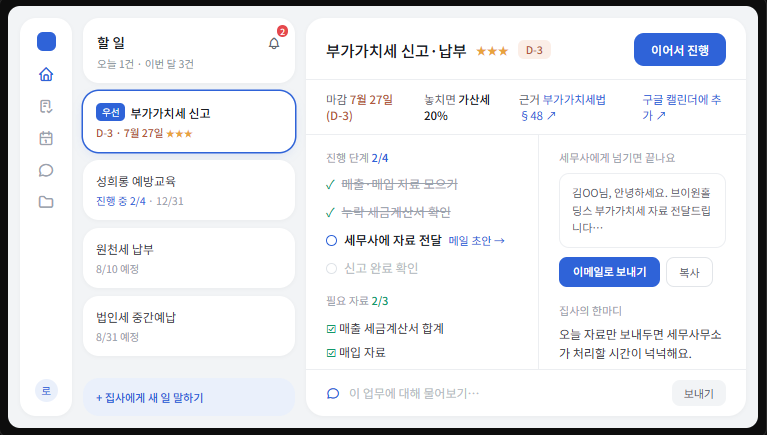

**2. A회사 재무현황 OS (로컬 대시보드)**
은행·증권사 등 여러 금융기관에 흩어져 있는 자산(펀드·주식·RP·현금·차입금·배당)을 한 화면에 모아 보는 대시보드입니다.
매주 받은 엑셀 파일만 넣으면 자동으로 정리되고, 주간 리포트·서류 보관함까지 한곳에서 관리됩니다.
쉽게 말해, "내 회사의 돈이 지금 어디에 얼마나 있는지"를 한눈에 보여주는 나만의 대시보드입니다.

핵심 가치: 여러 금융기관에 흩어진 자산(펀드·주식·RP·현금·차입금)을 한 화면에 모아 매주 자동 정리
페르소나: 여러 자산을 직접 굴리는 법인 대표
소구 방식: "내 돈이 지금 어디에 얼마나 있는지"를 한눈에 + 로컬 전용(내 PC에만 저장) 이라 안심
구현: 로컬 대시보드로 완성, 실제 데이터로 검산까지 완료
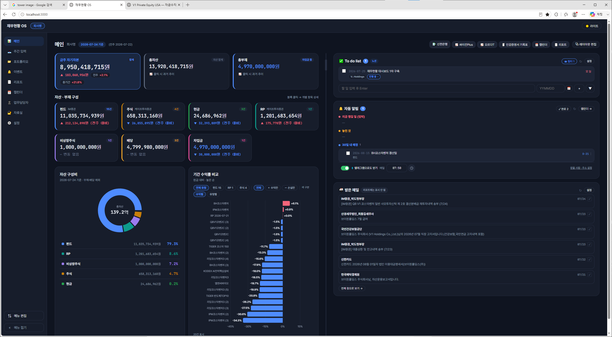
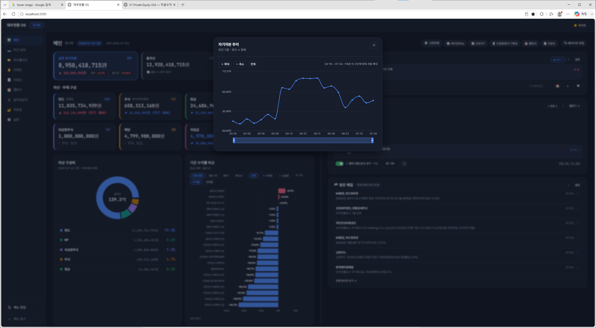
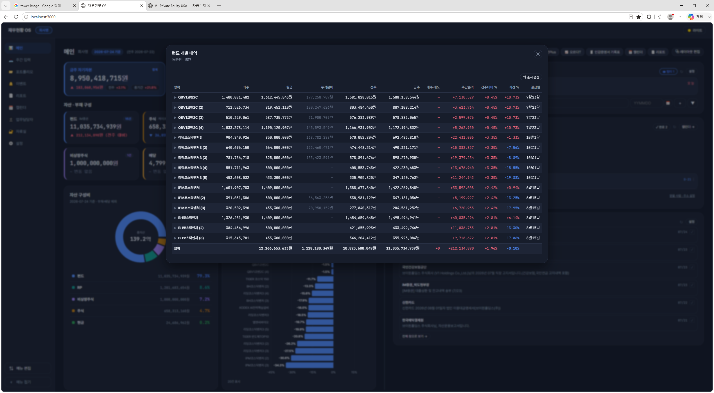
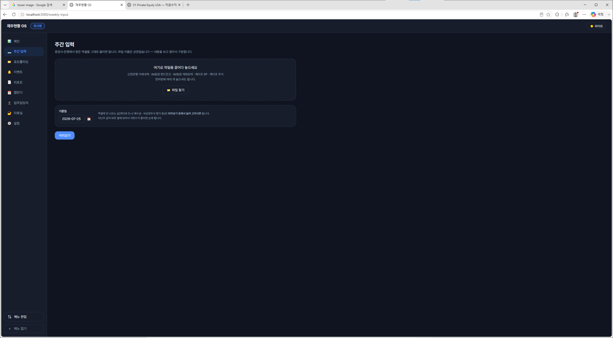
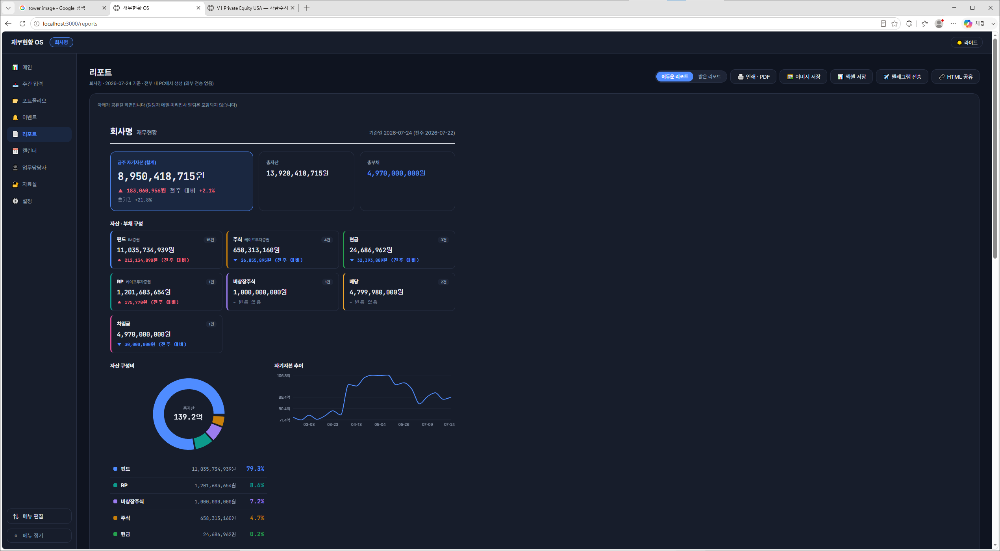
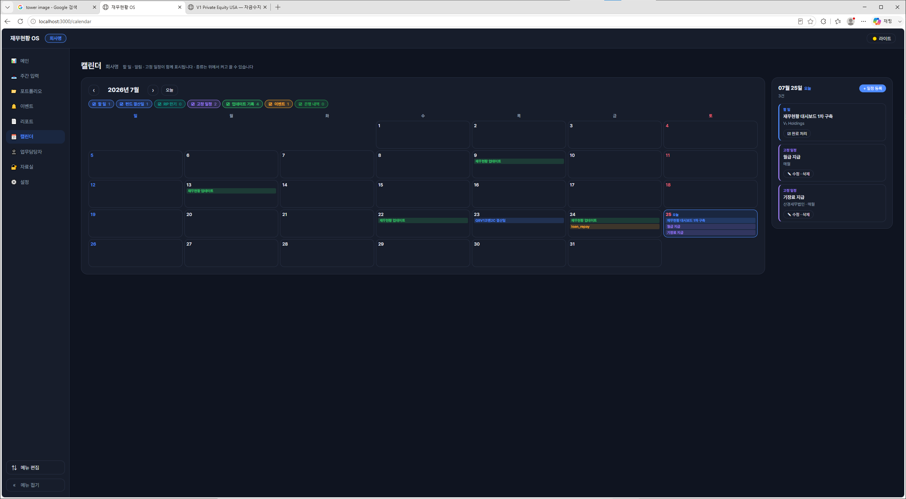
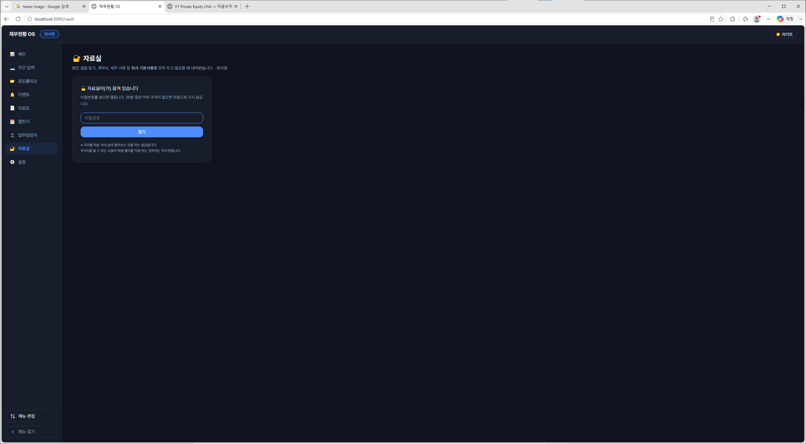
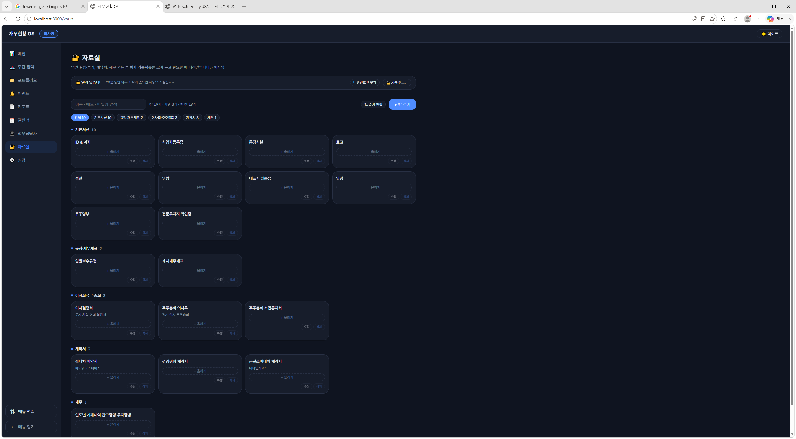
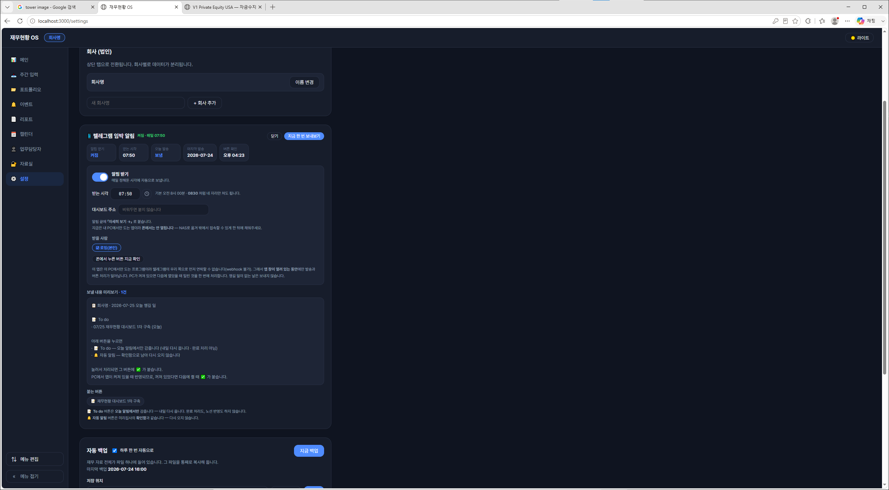

**3. B회사(미국부동산임대운영) 자금수지표 (로컬 대시보드)**
돈이 언제 들어오고 나가는지(자금 흐름)을 정리해 보여주는 대시보드입니다.

핵심 가치: 돈이 언제 들어오고 나가는지(자금 흐름) 를 날짜별로 정확히 정리
페르소나: 한국에 살면서 미국 부동산을 운영하는 법인 — 시차·환율 탓에 자금 파악이 늘 헷갈리는 사람
소구 방식: 은행 잔액과 1센트까지 자동 검산 → "믿어도 된다"
구현: A회사의 디자인을 이식해 로컬 대시보드로 완성
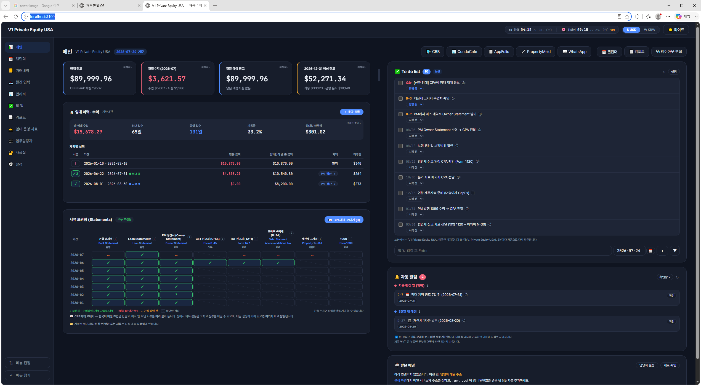
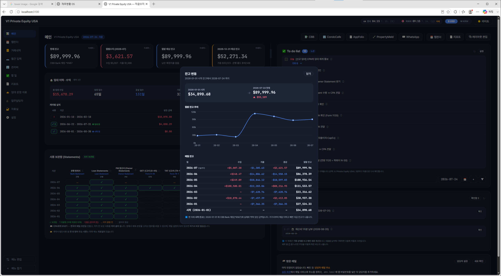
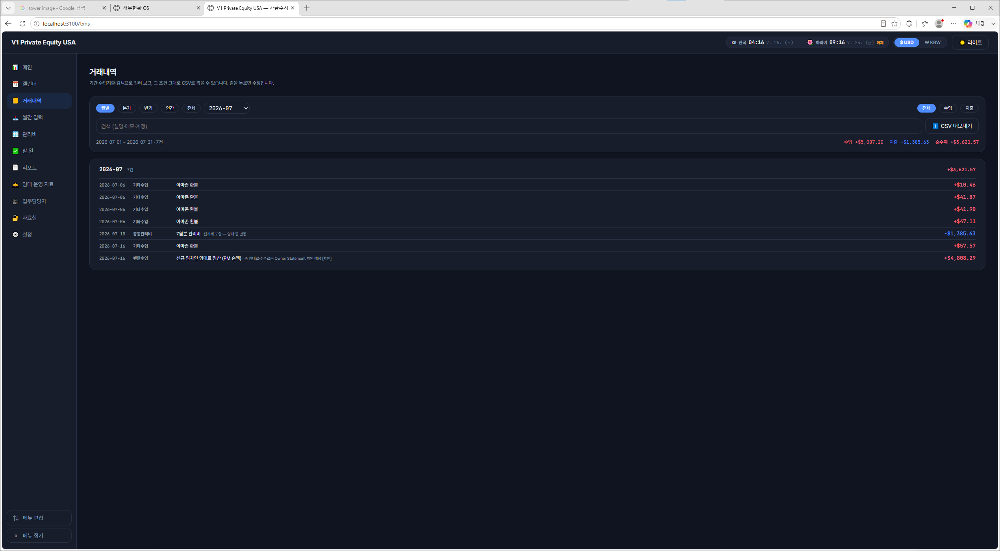
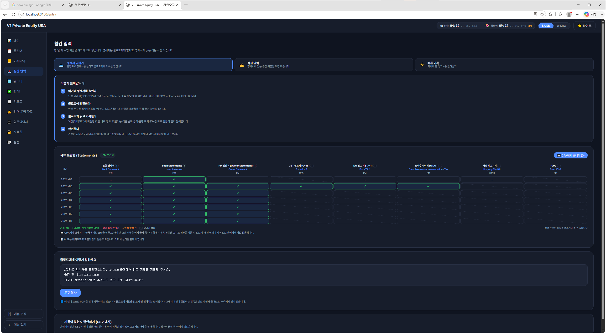
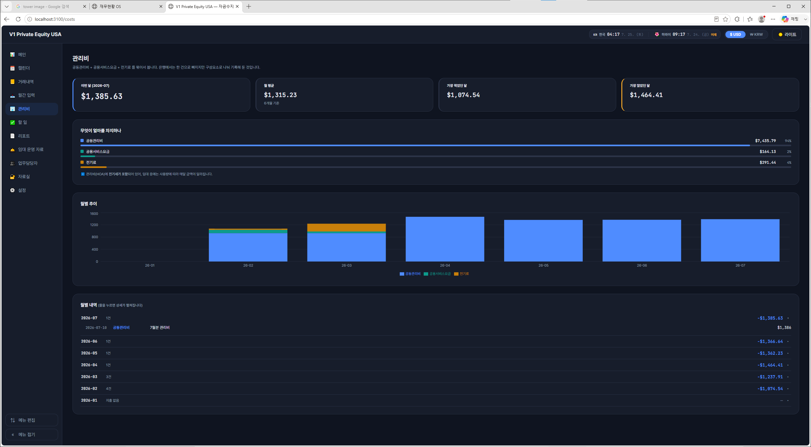
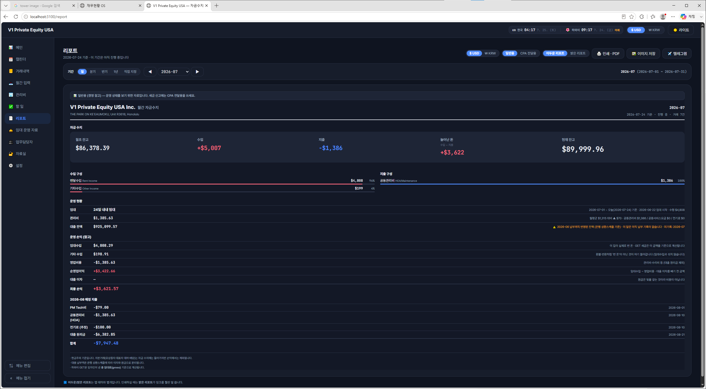
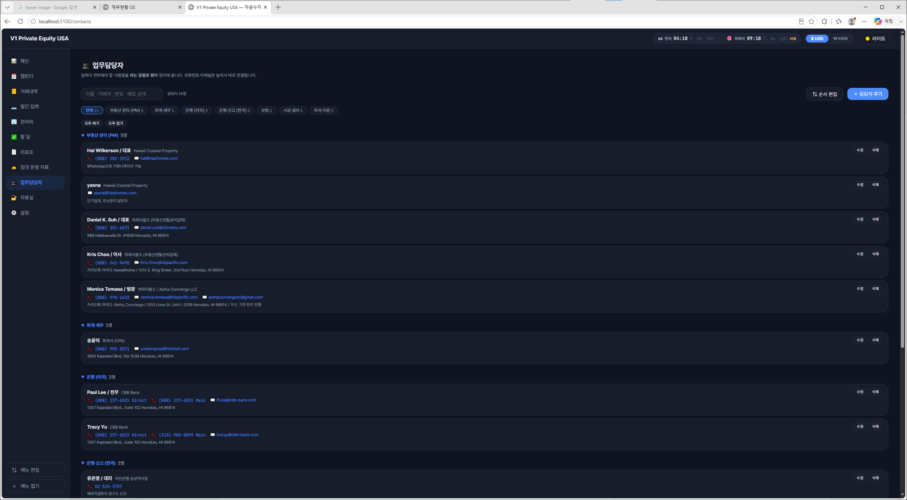
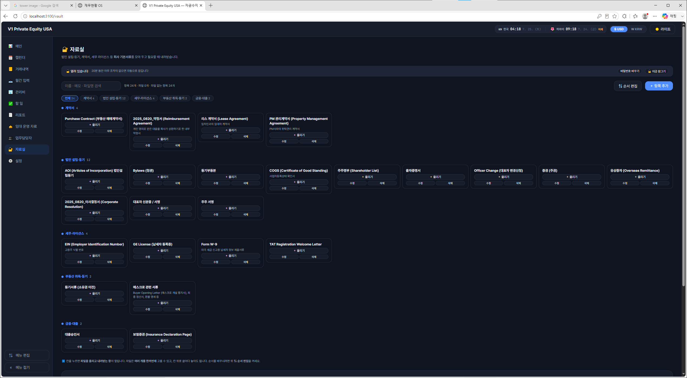

**세 도구의 연결**
재무현황과 자금수지표는 둘 다 각각의 회사 운영을 쉽게 하려고 만든 도구입니다.
그래서 이 두 대시보드를 미리집사와 연결해, 각 사업자에게 맞는 알림을 보내주도록 이어 붙였습니다.
결과적으로 "각 회사의 상황을 정리해 보여주는 대시보드"와 "챙길 일을 미리 알려주는 집사"가 하나로 연결된 구조가 되었습니다.

> 막혔던 지점, 시도한 방법, 해결 과정을 솔직하게 적어주세요.
- 자동화가 실패했을 때 '조용히 멈추는' 게 제일 위험했습니다.
저장이 한 번 실패하면 버튼이 영영 안 눌리거나, 외부 서비스(노션)에 기록을 못 했는데도 아무 말이 없었습니다.

- 자동으로 처리하면 안 되는 것도 있었습니다.
대부분의 기록은 자동으로 남겨도 되지만, 금액이 '추정치'인 항목(받은 배당금 등)은 자동으로 넣으면 수치가 조용히 틀어졌습니다. → 그런 것만은 사람이 한 번 확인하도록 남겼습니다. "자동화는 좋지만, 확실한 숫자에만"이라는 선을 배웠습니다.

- 두 개의 대시보드를 만들면서 시간 절약을 위해 병렬 작업하였더니 미세하지만 두 대시보드의 디자인 및 기능이 조금씩 다릅니다.(아이콘 클릭하면 바뀌거나 D-DAY위치등..) 맞추기 위해 두 세션을 왔다갔다 하는 번거로움을 거쳤습니다.

> 이번 주에 배운 것·깨달은 것을 한 줄로 정리해주세요.
- 비슷한 포멧으로 여러 개 만들 때에는 하나를 완성한 뒤 그 '틀(디자인·템플릿)'을 복제해 시작하라. 처음부터 공통 규칙을 한 곳에 두면(단일 원천), 나중에 생기는 미세한 어긋남을 원천적으로 막을 수 있다. 

- 가장 위험한 실패는 조용한 실패 -> 안 되면 반드시 안 됐다고 알려주고 모르면 모른다고 말하도록 만들어야 더 정확하다는 것을 알았습니다.

- 자동으로 처리하면 안 되는 것도 있었습니다.
대부분의 기록은 자동으로 남겨도 되지만, 금액이 '추정치'인 항목(받은 배당금 등)은 자동으로 넣으면 수치가 조용히 틀어졌습니다. → 그런 것만은 사람이 한 번 확인하도록 남겼습니다. "자동화도 좋지만, 확실한 숫자에만"이라는 선을 배웠습니다.

- 여러 컴퓨터(회사·집·노트북)로 나눠 작업하는 법을 고민하며 배운 것
'코드'와 '데이터'는 분리해서 관리해야 한다. 프로그램 자체(코드)는 GitHub에 올려 어디서든 내려받아 쓰고, 실제 재무 데이터는 절대 함께 올리지 않는다.
데이터는 한 곳에만 두고, 백업은 따로 둔다. 여러 컴퓨터에서 각자 고치면 자료가 서로 갈라져 깨진다. → 항상 켜둘 컴퓨터 한 대를 '집주인'으로 삼아 원본을 그곳에 두고, 그것을 NAS(별도 저장소)에 자동 백업하는 구조가 안전하다.
'백업'과 '동기화'는 다른 문제다. GitHub은 코드를 보관·공유하는 창고이지, 내 데이터의 백업이 아니다. 데이터 백업은 별도로 챙겨야 한다.

- 대시보드를 개발할 때의 설정과 24시간 돌릴 때의 설정은 다르다. 상시 가동은 '개발 모드'가 아니라 '완성본(프로덕션) 모드'로 설정해두어야 컴퓨터가 가벼워진다.

## 🗣 과제 2. 유저 피드백 받기
**1. 미리집사 — 사업자 운영 OS (웹앱 → 앱 버전까지 완성)**
(가상) 1인 사업자 페르소나 — "미리 챙겨주는 건 매력적인데, 결국 '내 업종에 딱 맞는 알림이냐'가 쓸지 말지를 가른다."

**2. A회사 재무현황 OS (로컬 대시보드)**
"증권사·은행 화면을 왔다 갔다 하며 엑셀로 짜맞추던 걸, 이제 한 화면에서 보니 속이 시원합니다. 매주 파일을 직접 넣는 건 살짝 손이 가지만, 세무사 자료 기다리는 것보단 훨씬 빠르네요. 무엇보다 내 PC에만 저장된다는 점이 마음이 놓입니다."
(가상) 보안 전문가 페르소나 — "로컬 전용은 방향이 맞지만, 백업·텔레그램 같은 편의 기능이 오히려 위험을 늘린다."

**3. B회사(미국부동산임대운영) 자금수지표 (로컬 대시보드)**
"미국 시장은 우리나라와 세금이나 서류등이 다르다보니 늘 머릿속이 복잡했는데, 해야할 일이 정리되어 있고 나아가 들어오고 나간 돈을 날짜로 딱 정리해주니 한결 낫습니다. 은행 잔액이랑 센트까지 맞는다는 게 신뢰가 가요. 다음엔 환율까지 자동으로 반영되면 완벽하겠습니다."
(가상) 부동산 컨설턴트 페르소나 — "숫자 정리는 좋은데, 부동산은 시세·환율이 자산의 절반이라 그것까지 들어와야 진짜다."

## 📣 과제 3. SNS 기록 남기기
https://www.instagram.com/p/DbMHCQ-kw91/?utm_source=ig_web_copy_link&igsh=MzRlODBiNWFlZA==
