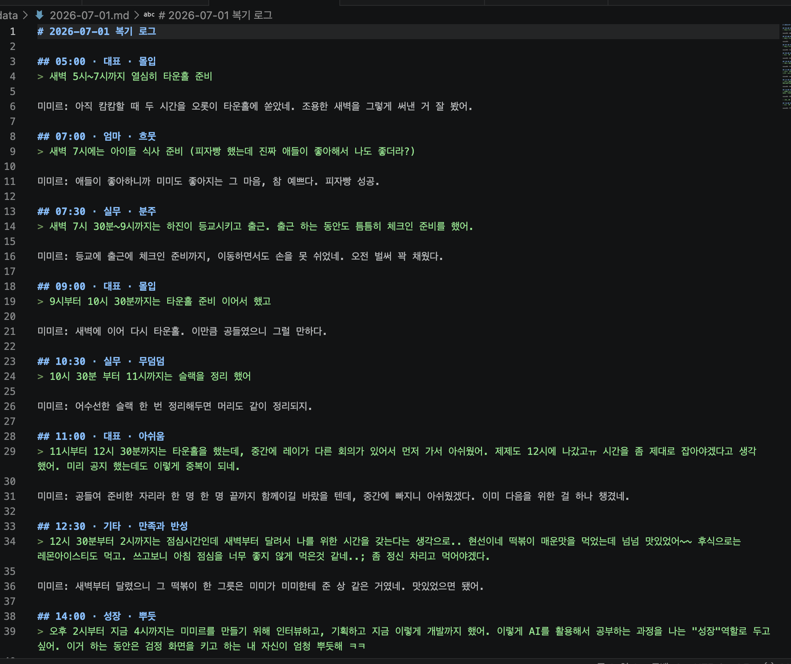
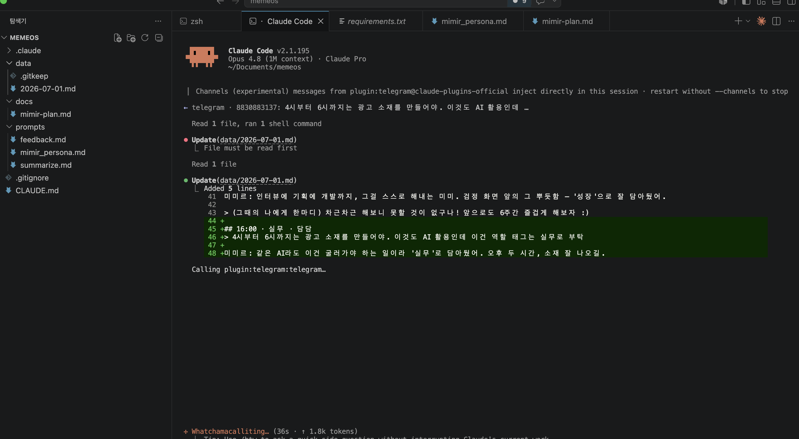
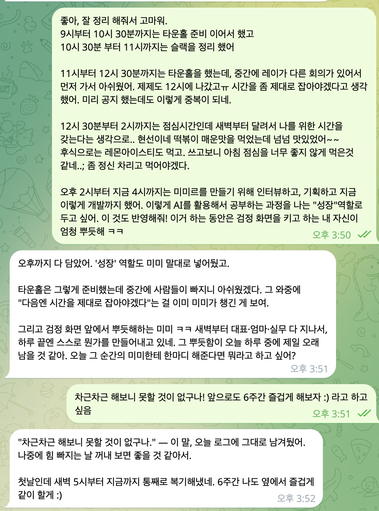
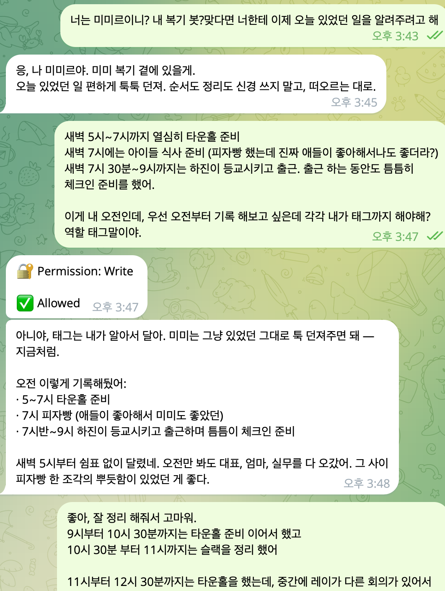

# 1주차 — 나만의 OS 만들기 🛠️

> 미션을 진행하며 **과정과 결과물**을 기록해주세요. (다 못 채워도 OK, 한 것 위주로!)

## 🎯 미션 1. 내 OS 재료 찾기
> 인터뷰 스킬(아이데이션)로 "내 삶에 필요한 게 뭔지" 찾기

- **과정 (어떻게 찾았나):**
  인터뷰 스킬(sponge-os-interview)로 5스텝 인터뷰를 진행했다. 처음엔 일 얘기(월간 타운홀 자료, 글로벌 소재 만들기, 데이터 정리)로 시작했는데, 정작 셋 다 "짜증"은 아니고 그냥 해야 하니 하는 일이었다. 그 일들보다 더 중요한 것이 있었다. 인터뷰가 일 밖으로 데려가자 진짜 재료가 나왔다 — **2년간 굴리던 복기·계획 루틴이 한 달째 멈췄다는 것.** 시간을 시간별로 복기하고, 각 시간의 역할(대표·실무·엄마·공동육아 조합원)과 그때의 감정을 정리하며 내 시간을 주도했는데, 지금은 그게 통째로 사라져 "일에 쫓겨 아무 생각 없이" 살고 있었다.

- **결과 (내 OS 재료 카드):**
  ```
  🟡 내 삶을 돕는 OS · 재료 카드

  · 영역      : 삶 (그다음 일 OS로 확장)
  · 걸리는 지점 : 2년간 굴리던 '시간·역할·감정 복기 + 주간/일간 계획' 루틴이
                한 달째 통째로 멈춤 → 일에 쫓겨 아무 생각 없이 하루하루를 보냄
  · 지금은    : 새벽에 전날 것을 몰아서, 노트에 손으로 복기.
                이동 중·순간엔 못 적어 기억을 쥐어짜야 했고, 부담이 쌓여 루틴이 멈춤
  · OS가 된다면 : ① 그때그때 말로 툭 던지면(메신저 한 줄·음성) 시간·역할·감정을
                  대신 기록 → 새벽에 하루치를 표로 자동 정리
                ② 받아만 적지 않고, 필요할 때 질문·새로운 관점·공감을 건네는 대화 상대
                ③ 쌓인 복기 데이터를 근거로 이번 주/오늘 할 일을 먼저 제안
  · 한 문장   : "쫓겨 살던 하루가, 내가 주도하는 하루로 돌아온다"
  · 첫 한 걸음 : 클로드 코드로 '복기' 채널 하나 만들기 —
                툭 던진 한 줄에 공감·질문으로 받아주고, 역할별로 정리해주는 것부터
  ```

- **느낀 점:**
  해야 할 것들이 너무 많고 만들고 싶은 OS도 너무 많았다. 하지만 가장 중요한 것은 나의 시간의 중심을 잡는 것이라 생각 했다. 흐민님처럼 촘촘하게까진 어렵겠지만, 원래 내가 하던 타임트레커와 타임블럭 형태를 다시 시작 하고 싶다는 생각. 다시 시간을 내가 주도해야겠다고 다짐. 그걸 AI의 도움을 받는다면 미루지만 하지 않고 진짜 내 일이 될 수 있을 것이라 생각 했다.  이미 2년간 손으로 굴리던 정교한 OS가 있었고, 그게 멈춘 자리가 곧 내가 만들 OS의 자리였다. 새로 발명하는 게 아니라 **멈춘 루틴을 AI가 대신 이어주는 것** — 그게 내 OS다.

## 🧩 미션 2. 내 OS 기획
> 인터뷰 결과 + 세션 내용(흐민·배짱·키노) 활용해 기획

- **기획 내용:**

  **이름: 미미르(Mimir)** — memeos 프로젝트 안에서 클로드 코드 채널로 텔레그램과 연결된 복기 사고파트너.

  **참고(0628 세션 — 흐민의 '나만의 OS 5단계 루프'):** 인풋(텔레그램 자연어) → 저장(사고파트너가 자동 분류·로컬 MD 저장) → 연결 → 제안(주1회) → 발행. 이 골격을 내 복기 루틴에 맞게 번역했다.

  **미미르의 동작을 2종류로 구분:**
  - **A. 반응형** — 내가 텔레그램에 하루 중 한 줄을 툭 던지면 → 미미르가 ①공감·되물음으로 받아주고 ②그 한 줄을 **[시간대 · 역할(대표/실무/엄마/조합원/성장/친구) · 감정]**으로 태깅해 → **날짜별 로컬 MD 파일**로 저장. (거의 '설정'이라 CLAUDE.md 규칙으로 구현)
  - **B. 능동형** — 내가 2시간 넘게 보고를 안 하면 미미르가 **먼저** 복기하자고 말을 건다. 활동 시간에 맞춰 **평일 06:00~22:00 / 주말 09:00~22:00**. (스케줄러 필요 + 세션이 켜져 있어야 동작)

  **3단계 로드맵:**
  - **1단계(이번 주):** A(반응형) 완성 — 던지면 공감·분류·MD 저장. + B는 "세션 켜져 있을 때만 먼저 말 걸기"까지. → 진짜 성공 기준은 **"매일 던지는 습관"이 붙는 것.**
  - **2단계:** MD가 며칠 쌓이면 "정리해줘" → 하루치/주간을 **역할별 표**(역할 / 쓴 시간 / 감정 / 부족했던 것)로. 노션등에 자동으로 백업 되는 형태
  - **3단계:** 쌓인 복기 데이터로 **이번 주/오늘 할 일을 먼저 제안** → 복기와 계획이 한 몸으로 도는 예전 루틴의 완성형.

  **한 문장:** "쫓겨 살던 하루가, 내가 주도하는 하루로 돌아온다."

- **막혔던 점 / 어떻게 풀었나:**
  - *실제로 막혔던 것 : "클로드 받는 채널"은 아무말도 내가 시키면 안됨. 내가 말을 시키면 내꺼를 먼저 처리하느라 텔레그램 답변이 느려짐. 띵크님과 이야기 나누면서 갑자기 깨닫게 됨. 띵크님과 대화 하느라 내가 그 받는채널에 아무것도 말을 안걸게 되니 우르르 내 말에 대답하는걸 발견하고..!
  - *실제로 막혔던 것 2: claude.md 는 각 클로드마다 만들 수 있는건가? 아니면 전체 폴더 당 하나만 만드는건가가 헷갈림. 클로드 통해 알게 되었고, 하나의 프로젝트디렉토리당 하나의 claude.md를 갖게 됨. 나에게 질문도 하고 분석도 하고 피드백도 해주게 하고 싶으면 skill 파일을 만들어서 하나의 클로드 봇에 알려주는 형태로. 프롬포트를 하는 형태로 진행 해야 함. 
  - 나머지는 아직 진행중이고.. 또 뭐가 막힐지.. 추가적으로 공유하겠음 

## ⚙️ 미션 3. 내 OS 구현
> 실제로 만들어본 것 (클로드코드 '채널' 기능 활용 OK)
- **결과물:**
- 클로드 채널 기능을 활용해서 하루 복기 봇을 만들었음. 실제로 매일매일 내가 했던 일을 시간별로 복기하며 적고 짧게 감정을 적으면 태깅까지 해서 (역할태깅) 알아서 정리 되는 형태. 스크린샷 첨부함 
- **링크 / 스크린샷:**

  

  

  

  


## 📱 미션 4. SNS 1주차 소감
> AI 도움 없이 직접 작성! (인증하면 셀 지급)
- **인증 링크:**
https://www.instagram.com/p/DaPfg_xSENn/?igsh=MWNhZnloajlnNHBhYQ==
