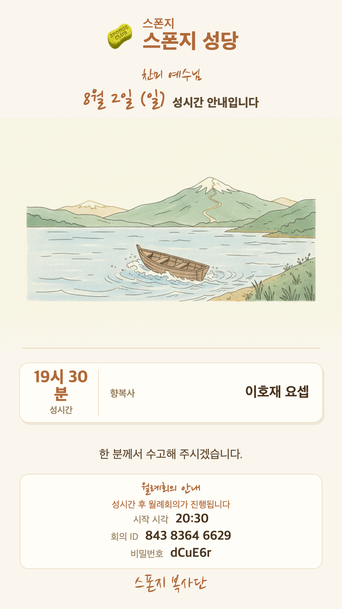
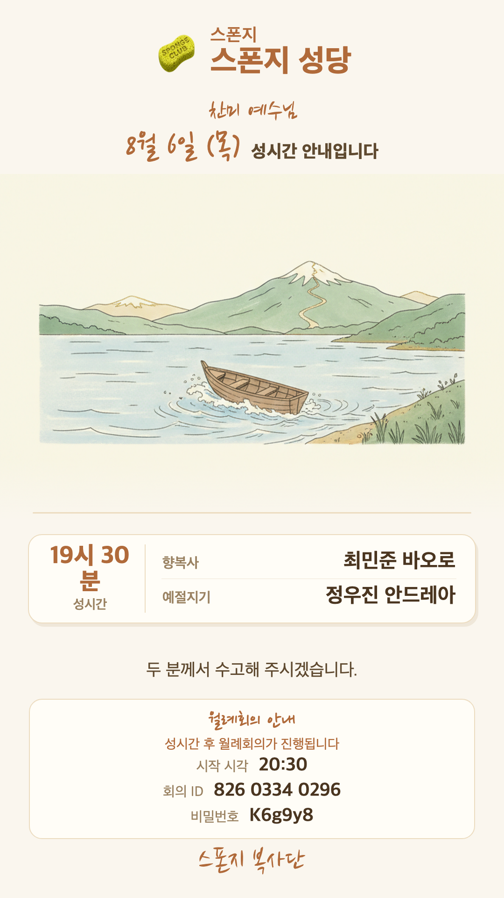
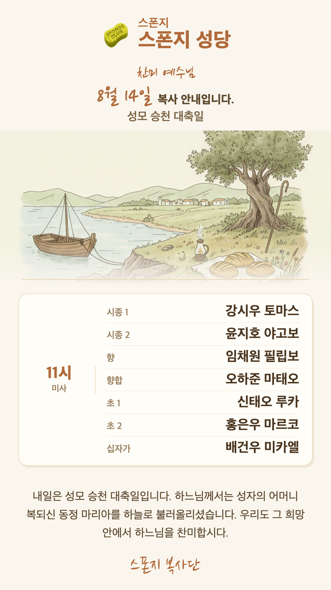

# 5주차 — 마지막 과제 🏁

> 이번 기수의 마지막 과제예요. 과정과 소회를 기록해주세요. (다 못 채워도 OK!)

## 🎯 과제 1. 구현, 그 다음의 것


> 만드는 건 끝났는데 — 그 다음이 진짜 시작이에요 (답이 안 나와 있어도 OK, 고민을 꺼내놓는 것 자체가 과제)

- **지금 걸려 있는 고민 하나:**
  어느 정도 앱이 구체화되고 나니, 부족한 부분의 디테일을 조금씩 수정해 나가는 데 드는 시간이
  **실제 기획에서 지금까지 걸린 시간보다 더 걸리는 것 같다.**

- **그게 왜 고민인지 (무엇이 걸리는지):**
  시간을 너무 많이 잡아먹는다. 만들수록 생각해야 할 부분이 오히려 더 많아진다.
  오랜 작업은 지치게 된다.

- **어떻게 풀어볼 생각인지:**
  실제 구현을 어느 정도 했으므로, 우선 잠시 내려놓고 **쉬는 시간**이 필요할 것 같다.

- **필요한 게 있다면 무엇인지:**
  휴식. 그리고 다시 처음으로 돌아가서 — **왜 이 앱을 만들게 되었는지, 사용상의 가치가 있는지,
  시간과 돈을 들일 이유가 충분한지, 나만을 위한 작업인지 다른 사람들에게도 유용한 작업인지** —
  에 대한 고민을 해봐야 할 것 같다.

## 🏁 과제 2. 구현 마무리 + 실제 유저 피드백 받기


> 시작할 때 "이번엔 이건 꼭 만들겠다" 했던 것 — 지금 어디까지 왔나요?

- **최종 완성한 것 (지금 어디까지):**

  **i_Boksa 웹앱 1.0** — 성당 복사단 배정 안내장을 만들어 단톡방에 보내는 앱.
  매주 손으로 만들던 안내 이미지를, **날짜만 고르면** 나머지가 채워진다:
  1. 배정표를 읽어 그날 **복사 배정 자동 입력** (주일 미사 · 성시간 · 대축일 7인 복사까지)
  2. 굿뉴스 전례 정보로 그날에 맞는 **해설 멘트** 생성
  3. AI가 **배경 그림 후보 3장**을 그리면 골라서 확정
  4. 안내장 한 장 완성 → 아침에 **텔레그램 자동 발송**

  실사용에서 다듬은 것들: 안내장 생성 **115초 → 8.4초**(launchd QoS), **저장 버튼 제거**
  (고치면 즉시 저장, 미리보기와 발송이 완전히 같은 경로), 이름을 못 읽으면 그 자리에서
  고르게 하는 막다른 길 없애기, 사용 설명서·버전 히스토리 내장.

  **핵심 원칙 — "글자는 코드가, 그림만 AI가."** AI 이미지 생성은 한글을 늘 깨뜨린다
  (세례명 '네오테리오'가 '네오테리요'가 된다). 그래서 배경만 AI가 그리고,
  이름·시간은 HTML로 정확히 얹는다.

- **🚀 실제 배포 URL:** 공개 URL 없음 — 성당 실명 데이터를 다뤄 **맥미니 로컬 전용**으로 운영.
  대신 **스폰지클럽용 데모 모드**를 만들었다 (가명 · 스폰지 성당 · 오프라인 · API 키 불필요):
  ```bash
  cd iboksa && IBOKSA_DEMO=1 python3 web/app.py   # → http://127.0.0.1:8770
  ```

- **결과물 (링크·스크린샷 — 이미지는 `이미지첨부/` 폴더에):**

  | 성시간(1인) | 성시간(2인) | 대축일 7인 복사 |
  |---|---|---|
  |  |  |  |

  *(위 이미지는 데모 출력 — 이름은 전부 가명, 성당은 '스폰지 성당')*

- **받은 유저 피드백:**
  - **i_Smile** — 실제 진료에서 **환자·보호자에게 설명하는 데 사용 중**. 쓰면서 스스로 피드백을 주어
    부족한 부분을 채워 나가고 있다.
  - **i_Note · i_Day(한눈에)** — **아들들에게 배포해서 피드백을 받고 있고**, 받은 내용대로 수정 중이다.
  - **i_Boksa** — **실제 성당에서 안내장을 만들어 배포하는 데 사용 중**. 디자인을 계속 개발해서
    좀 더 다양하게 만들어 볼 생각이다.
  - **i_Day(한눈에)** — 스폰지클럽에 피드백 요청을 올려 두었는데, 너무 늦게 올려서 아직... 🙏

## 📣 과제 3. SNS에 남기기


> 구현했던 것들 + 그 다음 단계에 대한 생각

- **구현했던 것들 (무엇을 / 어떻게 굴러가는지 / 뭐가 달라졌는지):**
  6주 동안 하루가 지나가는 자리마다 OS를 하나씩 놓았다 —
  진료실엔 **i_Smile**(교정 사진 AI 정리), 손안엔 **i_Note**(텔레그램 두 번째 뇌)와
  **i_Day**(구글 연동 캘린더), 아이폰엔 **한눈에**(EventKit 캘린더 앱), 그리고 성당 봉사엔
  **i_Boksa**(복사 안내장 자동 생성·발송). 코딩을 거의 못 하는 치과의사가
  클로드 코드와의 대화만으로, "매번 반복되는데 시간 잡아먹는 것"들을 하나씩 앱으로 바꿨다.

- **다음 단계 생각 (뭘 더 하고 싶은지 / 남은 것 / 어디로):**
  ① '한눈에' TestFlight 출시 + 홈 화면 위젯(가상 고객이 꼽은 1순위)
  ② i_Note 안드로이드 스토어 배포 (릴리스 서명까지 완료)
  ③ i_Boksa를 다른 성당 복사단에 건네보기 — "내가 없어도 도는지"가 진짜 시험

- **SNS 인증 링크:** 🟡 업로드 후 첨부 예정
