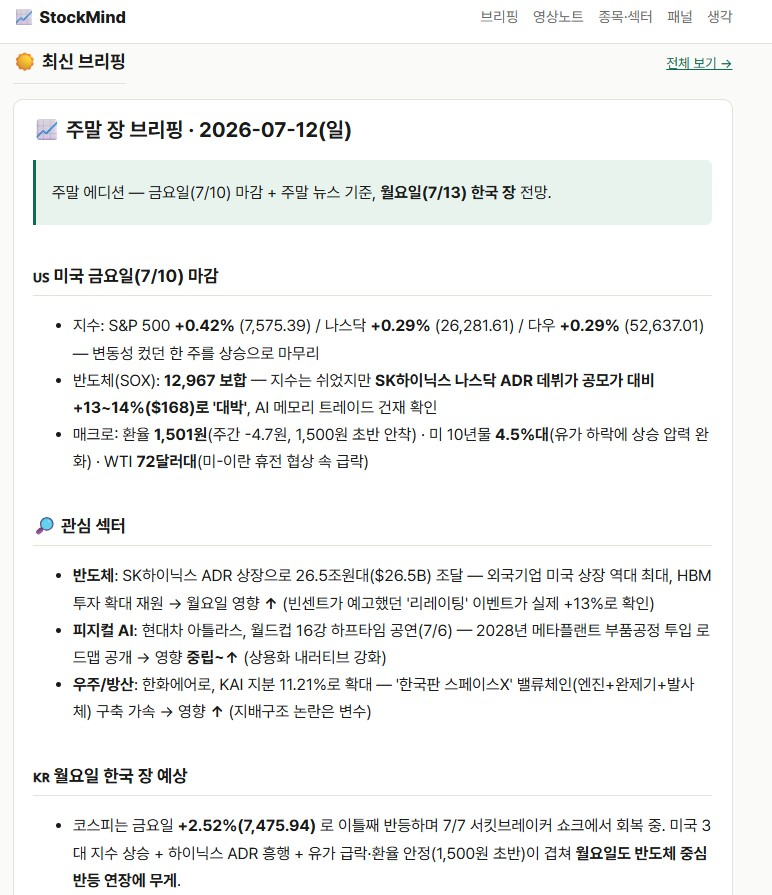
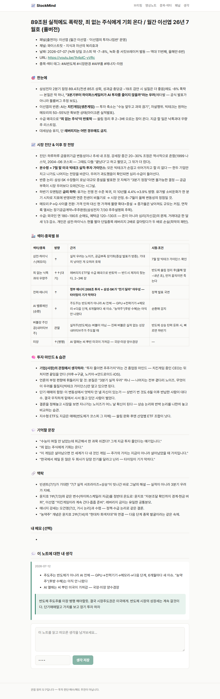
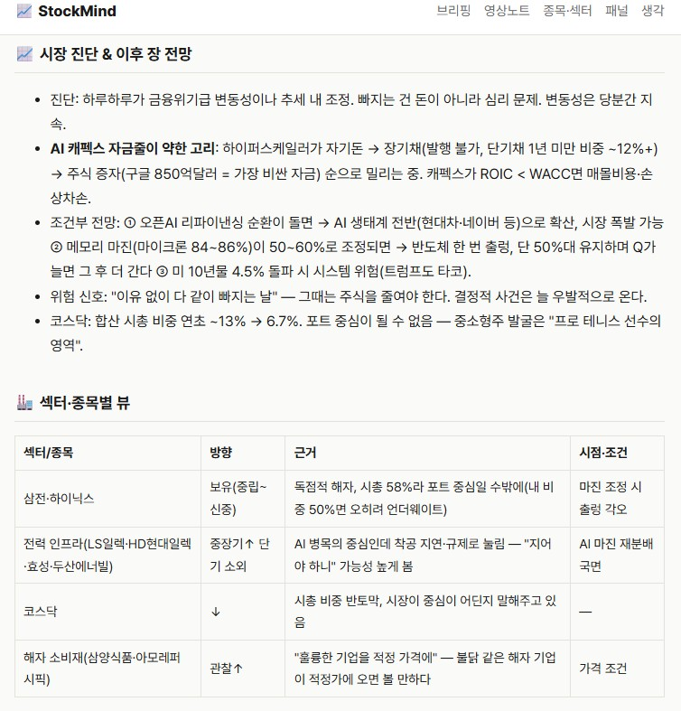
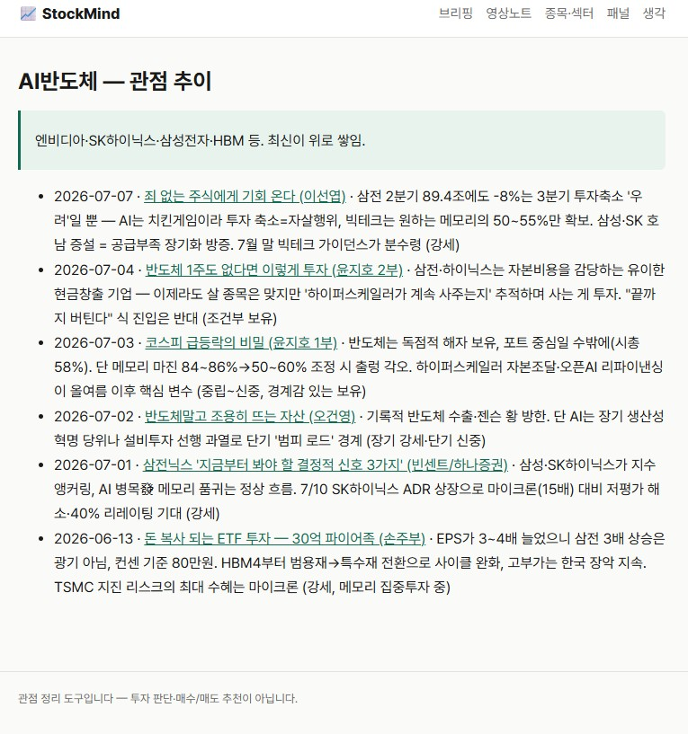
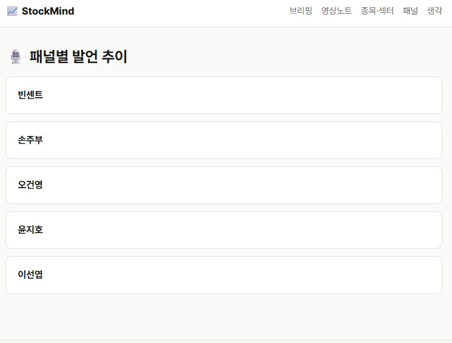
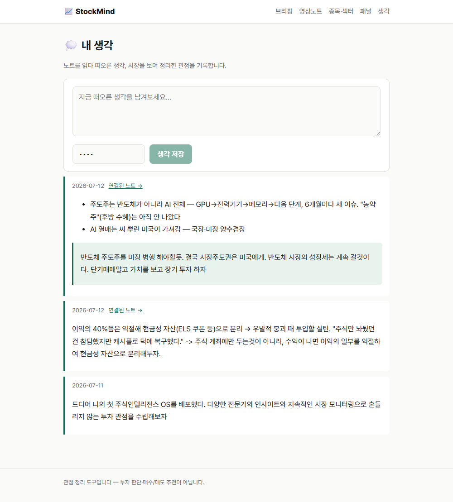

# 2주차 — 내 OS 구현하기 🚀

> 미션을 진행하며 **기획 → 구현 → 삽질 → 결과물 → 인사이트** 를 상세히 기록해주세요.
> (다 못 채워도 OK, 한 것 위주로!)

## 🎯 미션 1. 내 OS 만들기
> **[ 내 삶을 돕는 OS ]** 또는 **[ 콘텐츠 OS ]** 중 하나를 선택해 완성해주세요.

**✅ 선택:** 내 삶을 돕는 OS — 업무에 밀려 놓치던 '주식 공부·시장 감'을 챙기는 개인 인텔리전스 도구

### 📐 기획
> 무엇을, 왜, 어떻게 만들지

1주차엔 클로드 스킬 **2개**(☀️ 아침 브리핑 · 🌙 관점노트)로 시작했다. 그런데 스킬은 폴더에 노트를 **쌓기만** 하다 보니, 정작 쌓인 걸 **언제든 꺼내 보기가 불편했다.** "쌓는 것"과 "보는 것"은 다른 문제였다.

2주차 **키노·에이든 세션**을 보면서 방향이 잡혔다 — **나만의 대시보드(웹사이트)를 만들자.** 그리고 원래 붙이려던 텔레그램 연동은 실패했는데, 오히려 그 실패가 결정을 도왔다. 텔레그램에 매이지 말고 **웹사이트 안에서 내가 직접 정보를 인풋하고 대화하며 고도화하는 구조**로 가보자. (텔레그램 연동은 나중에 다시 시도할 계획이지만, 지금은 웹이 먼저다.)

- **무엇을:** 관점노트·브리핑 아카이브를 **웹 대시보드**로 만들고, 웹에서 직접 "생각"을 쓰면 저장소에 쌓이는 구조.
- **왜:** 쌓아두기만 하던 노트를 언제든 꺼내 보고, 정보의 **흐름과 맥락을 이어서** 보기 위해.
- **어떻게:** Next.js로 `content/` 폴더(영상노트·종목섹터·패널·브리핑·생각)를 읽어 정적 사이트로 만들고, Vercel에 자동 배포. 웹에서 쓴 생각은 GitHub에 자동 커밋되게.

### ⚙️ 구현
> 실제로 만든 것 (링크·스크린샷 — 이미지는 `이미지첨부/` 폴더에)

**① 관점노트 대시보드 웹사이트 (핵심)** — 🔗 https://2607-stockmind.vercel.app
- Next.js(App Router)가 저장소의 `content/`를 읽어 **정적 사이트로 자동 생성**, GitHub → Vercel 자동 배포.
- 영역별 아카이브: **영상노트 · 종목섹터 · 패널 · 브리핑 · 생각**을 웹에서 한눈에 탐색.
- **웹에서 직접 "생각" 쓰기 기능**: 웹 입력창에 생각을 쓰면 → 비밀번호 검증 → GitHub API로 `content/생각/`에 md 파일로 자동 커밋 → 재배포까지 자동. **읽기는 공개, 쓰기는 나만.** (= 웹 안에서 정보를 인풋하는 첫 단추)

**② 콘텐츠 실제 축적** — 껍데기가 아니라 실제로 채웠다.
- 영상노트 **6건**(손주부·빈센트·오건영·윤지호 2건·이선엽), 종목섹터 **7개**(AI반도체·AI부품·에너지자원·시장환경·금융·우주·피지컬AI), 패널 **5명**, 브리핑 **2건**, 생각 **2건**.
- 영상노트 **상세 템플릿**을 새로 도입하고, 기존 4건도 새 템플릿으로 **소급 업그레이드**.

**③ 스킬 이관** — 1주차 과제 저장소 안에 구현했던 스킬 2개(관점노트·아침 브리핑)를 이번 주에 **내 로컬 프로젝트 폴더로 옮겨** 독립 운영. (과제 저장소엔 과제만, 스킬은 내 것으로.)

### 🧗 과정에서의 삽질
> 막혔던 지점, 시도한 방법, 어떻게 풀었는지 솔직하게

- **텔레그램 연동 실패** — 원래는 텔레그램으로 정보를 넣으려 했는데 연동이 계속 막혔다. 붙잡고 있다가, "그럼 웹 안에서 인풋하면 되잖아"로 방향을 틀어 오히려 더 나에게 맞는 구조를 찾았다. (연동 자체는 나중에 재도전 예정)
- **Vercel 환경변수 3개**(관리자 비번·GitHub 저장소·GitHub 토큰) 설정 — 값을 바꿀 때마다 **재배포를 해야 반영**되는 걸 몰라 "왜 안 되지" 하며 헤맸다. 빈 커밋을 push해서 재배포를 트리거하는 방법으로 해결.
- **웹 ↔ 로컬 꼬임** — 웹에서 생각을 쓰면 원격 저장소에 커밋이 생겨서, 로컬에서 작업하기 전에 `git pull`을 안 하면 충돌이 났다. "로컬 작업 전 pull" 습관으로 정리.
- **스킬 폴더 이관** — 과제 저장소 안에 있던 스킬을 로컬로 옮기면서 경로·설정을 다시 잡는 자잘한 작업.

### ✅ 결과물
> 완성한 것 / 작동 화면

- 🔗 **라이브:** https://2607-stockmind.vercel.app — 관점노트 대시보드 (읽기 공개)
- 웹에서 생각 작성 → GitHub 자동 커밋 → 재배포까지 **전체 파이프라인 E2E 검증 완료.**
- 영상노트·종목섹터·패널·브리핑·생각이 실제로 쌓인 살아있는 아카이브.

**작동 화면**

| 아침/주말 브리핑 | 영상노트 목록 | 영상노트 세부 |
|---|---|---|
|  |  |  |

| 종목·섹터 (관점 추이) | 패널별 | 웹에서 '생각' 쓰기 |
|---|---|---|
|  |  |  |

### 💡 알게 된 인사이트 & 공유하고 싶은 내용
> 하면서 깨달은 것, 크루들과 나누고 싶은 것

- **웹으로 구현해서 보니 훨씬 직관적이고, 생각이 더 잘 정리됐다.** 텔레그램보다 나에겐 이 방식이 더 잘 맞았다. (도구는 남이 좋다는 걸 따라가는 게 아니라 나한테 맞는 걸 찾는 것)
- **가장 좋았던 건 "정보를 쌓기만" 하는 게 아니라, 정보의 흐름과 맥락을 이어서 보고 거기에 내 생각을 붙여본다는 것.** 노트가 데이터가 아니라 '관점'으로 자라는 느낌.
- 크루들과 나누고 싶은 것: **"쌓는 것"과 "보는 것"은 완전히 다른 경험**이라는 것. 스킬로 폴더에 쌓기만 할 땐 안 보이던 게, 웹 대시보드로 꺼내 놓으니 비로소 이어져 보였다.

## 📣 미션 2. 유닛 활동 참여 & SNS 공유
> 유닛 활동에 적극 참여(유닛원으로서 or 참가자로서)한 뒤, 그 경험을 SNS에 올리기

- **참여한 유닛 / 활동:** 까스활명수 유닛을 신청했으나, 야근이 겹쳐 기한 내 과제 제출을 못 했다 ㅠㅠ
- **무엇을 했나 (경험):** 유닛 후기가 없어, 이번 주 과제(스탁마인드 웹 대시보드 구현) 후기로 대신 제출할 예정.
- **SNS 인증 링크:** https://www.instagram.com/p/DaqNE5wD2cW/
