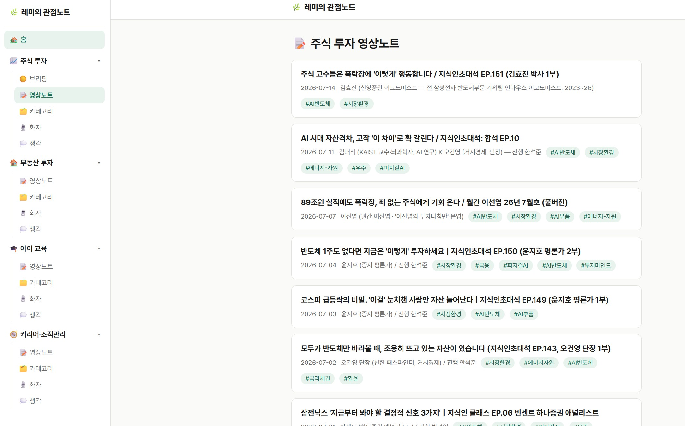
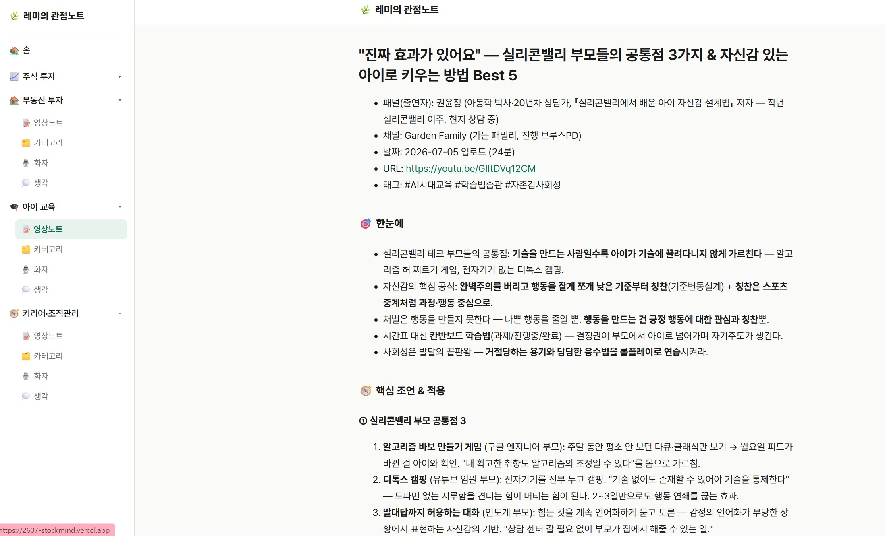
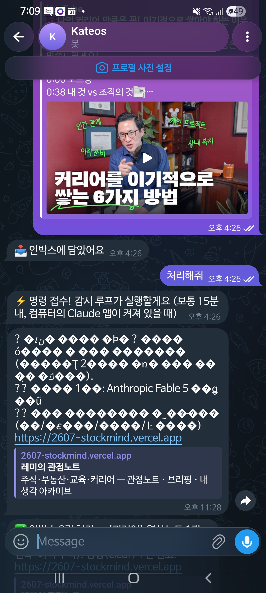

# 3주차 — 내 OS 최종 완성 🏁

> 미션을 진행하며 과정과 결과를 기록해주세요. (다 못 채워도 OK, 한 것 위주로!)

## 🎯 미션 1. 내 삶을 돕는 OS 최종 완성
> 지금까지 공유하며 받은 **피드백을 반영해 최종 완성**!

- **완성한 것 (무엇을):**

  **「레미의 관점노트」** — 2주차의 StockMind(주식 전용)를 **삶 전체를 담는 관점노트 OS**로 확장 완성했다.

  **① 주제 확장 — 1개 가지 → 4개 가지**
  주식만 보던 OS에 **부동산 투자 · 아이 교육 · 커리어/조직관리**를 더했다. 4가지 모두 **똑같은 골격**을 쓴다:
  > `영상노트(재료)` → `카테고리(주제 누적)` → `화자(사람 누적)` → `생각(내 관점)`

  주식에서 검증된 구조(섹터→카테고리, 패널→화자)를 그대로 일반화해서, 새 가지를 추가해도 새로 배울 게 없다.

  **② 텔레그램 단일 입구 — 드디어 성공** 🎉
  1주차·2주차에 두 번 실패했던 텔레그램 연동을 **Vercel 서버리스 webhook**으로 해결했다.

  ```
  [폰: 텔레그램에 던짐] ─즉시─▶ [Vercel webhook] ─▶ [content/0_인박스/ 즉시 커밋]
                                       │ "📥 인박스에 담았어요" 즉시 회신
                                       ⋮ (매일 밤 23:30)
                           [예약 세션이 요약·도메인 분류·편입] ─▶ [텔레그램 "✅ 영상노트 2건, 생각 1건"]
  ```

  - **도메인 자동 분류**: 내용을 보고 4가지 중 어디로 갈지 스스로 판단. **애매하면 버리지 않고 인박스에 보류(hold) + 텔레그램으로 되물어봄.**
  - **자연어 명령**: "비우기", "브리핑" 같은 말을 텔레그램에 던지면 알아듣고 실행 (+15분 감시 루프)
  - **보안**: `secret_token` 헤더 검증 + 내 `chat_id`만 허용 (스팸·인젝션 차단)

  **③ 사이드바 하이어라키 네비** — 4가지가 생기니 탐색이 필요해져서, 가지별 자동 펼침 + 모바일 드로어를 새로 만들었다.

  **④ `inbox-clear` 스킬 신규 제작** — 밤에 인박스를 어떻게 처리할지(요약·분류·편입·회신) 규칙을 스킬로 못박았다.

- **피드백 반영한 점:**

  이번 주 완성의 **설계 자체가 스폰지클럽 크루들을 벤치마킹한 결과**다. 설계 문서에도 출처를 명시해뒀다.

  | 누구에게서 | 무엇을 가져왔나 | 어떻게 반영했나 |
  |---|---|---|
  | **6조 웃는돌 「흔적 OS」** | 텔레그램 → **Vercel 서버리스 webhook** → 저장소 커밋 패턴 | 두 번 실패했던 텔레그램 연동을 이 방식으로 해결. **지킬 데몬이 없으니 죽을 일이 없다** |
  | **2조 딜런 「dylan-os」** | **"파이프와 두뇌 분리"** + 규칙 기반 라우팅 | webhook은 **적재만** 하는 멍청한 파이프로, 요약·분류는 밤 세션(두뇌)이 담당 |
  | 웃는돌 | "애매하면 **버리지 말고 보류**" | 도메인 판단이 애매하면 hold 후 텔레그램으로 되물어보게 |
  | 딜런 | "수집보다 **출구**가 어렵다" | 밤 처리 후 **텔레그램 회신**을 출구로 고정 — 넣기만 하고 안 보는 걸 방지 |

  **특히 "파이프는 멍청해야 한다"가 결정적이었다.** webhook 안에서 요약까지 해버리면 서버리스에서 `yt-dlp`를 못 써 **자막 없이 제목만으로 요약**하게 된다. 1주차에 "제목만 보면 금인 줄 알았는데 자막을 보니 에너지·자원이었다"를 직접 겪은 터라 자막 품질을 포기할 수 없었다. 그래서 **적재는 즉시(항상 켜짐), 요약은 밤에 풀품질로** 나눴다.

- **결과물 (링크·스크린샷 — 이미지는 `이미지첨부/` 폴더에):**

  🔗 **라이브:** https://2607-stockmind.vercel.app

  **실제로 쌓인 노트 (껍데기 아님):**

  | 가지 | 노트 수 | 첫 노트 예시 |
  |---|---|---|
  | 주식 | 29건 | 오건영·윤지호·이선엽·빈센트·손주부 |
  | 교육 | 8건 | 나민애 (AI시대 교육) |
  | 부동산 | 6건 | 훨훨 박성혜 (무주택자 30억 집으로 가는 법) |
  | 커리어 | 5건 | Anthropic Fable 5 발표 |

  **작동 검증:** 7/18 하루 동안 텔레그램으로 유튜브 링크·명령을 실제로 던져 → 인박스 자동 적재 → 밤 처리로 **교육·부동산·커리어 가지에 첫 노트가 생성되는 것까지 확인 완료.**

  **작동 화면**

  **① 4-가지 네비게이션** — 주식 투자 / 부동산 투자 / 아이 교육 / 커리어·조직관리가 동일한 골격(영상노트·카테고리·화자·생각)으로 펼쳐진다
  

  **② 교육 가지 영상노트** — 주식이 아닌 콘텐츠도 같은 품질로 정리된다 (권윤정 『실리콘밸리에서 배운 아이 자신감 설계법』)
  

  **③ 텔레그램 실제 동작** — 유튜브 링크 던짐 → `📥 인박스에 담았어요` 즉시 회신 → "처리해줘" 자연어 명령 → `⚡ 명령 접수! 감시 루프가 실행할게요` → 처리 결과 회신
  

  > ⚠️ **남은 버그(정직하게):** 위 캡처에서 보이듯 텔레그램 **처리 결과 회신에서 한글이 깨져서** 온다(인코딩 이슈). 적재·분류·편입은 정상 작동하고 회신 텍스트만 깨지는 것이라 기능엔 지장이 없지만, 다음 수정 대상으로 남겨둔다.

- **알게 된 인사이트:**

  - **막힌 곳은 정면으로 뚫는 게 아니라 우회하는 것이었다.** 텔레그램을 두 번 실패한 뒤에야 "세션이 켜져 있어야 한다"가 문제의 뿌리인 걸 알았는데, 크루의 서버리스 패턴을 보고 나서야 **문제 자체를 없애는 길**이 보였다. 혼자 붙잡고 있었으면 세 번째도 실패했을 것이다.

  - **좋은 구조는 확장할 때 티가 난다.** 주식에서 만든 골격(영상노트→카테고리→화자→생각)이 부동산·교육·커리어에 **하나도 안 고치고** 그대로 들어갔다. 1주차에 섹터·패널로 나눠둔 게 사실은 도메인과 무관한 구조였던 것.

  - **자동화의 경계를 어디에 긋느냐가 품질을 정한다.** "다 자동으로"가 아니라 **"항상 켜져야 하는 것(적재)"과 "품질이 생명인 것(요약)"을 분리**하니 둘 다 살았다. 욕심내서 합쳤으면 자막 품질을 잃었을 것이다.

  - **주식 OS였을 땐 몰랐던 것** — 아이 교육 영상을 던지고 부동산 영상을 던지다 보니, 내가 흘려보내던 관심사가 생각보다 넓었다는 걸 알게 됐다. 이제 흘러가지 않고 쌓인다.

## 📣 미션 2. 스폰지 토크데이 SNS 후기
> 오늘 토크데이 후기를 SNS에 올리기 (**#스폰지클럽 필수 · 셀 3개 지급!**)

- **후기 내용:** 인스타그램에 토크데이 후기 게시 완료 (#스폰지클럽)
- **SNS 인증 링크:** https://www.instagram.com/p/Da4DDKiD5wL/
