# 3주차 — 내 OS 최종 완성 🏁

> 2주차의 "구현 중"에서 → **실기기 검증 + 교회 비치용 운영 가이드까지** 끝낸 실전 배포 상태로 최종 완성했습니다.

## 🎯 미션 1. 내 삶을 돕는 OS 최종 완성
> 지금까지 공유하며 받은 **피드백을 반영해 최종 완성**!

- **완성한 것 (무엇을):**

  **온마음(Onmaeum)** — 삼일교회 영덕·울진 선교팀 × 평해감리교회. 어르신 한 분 한 분에게 **"세상에 하나뿐인 노래"와 "말씀이 담긴 사진"**을 선물하는 AI 웹 시스템 2종.

  | 시스템 | 하는 일 | 주소 |
  |---|---|---|
  | 🎵 이야기 노래 스튜디오 | 마사지하며 나눈 어르신의 인생 이야기를 실시간으로 받아 적고, AI가 맞춤 가사를 지어 Suno로 연결 | https://onmaeum-song-studio.vercel.app |
  | 📷 말씀 사진관 | 태블릿으로 사진을 찍으면 성경 말씀과 합성해 감열 프린터로 즉석 인쇄 | https://onmaeum-song-studio.vercel.app/print.html |

  - **노래 스튜디오 흐름:** 성함·곡 분위기(찬양/신나는 트로트/잔잔한 트로트/발라드)·보컬(여성/남성/아이/가족) 선택 → 실시간 받아쓰기(봉사자용 질문 가이드 6종 순환) → Claude가 요약·가사·Suno 스타일 프롬프트 생성 → Suno 붙여넣기 → 완성곡 QR 생성(포토카드용)
  - **말씀 사진관 흐름:** 성함 입력 → 페이지 내 카메라(전면/후면·3초 타이머) → 사진+말씀 카드 자동 합성 → 다른 말씀 뽑기(**말씀 풀 100개**) → 블루투스 인쇄 또는 PNG 저장
  - **스택:** 단일 HTML + Vanilla JS(빌드 없음) · GitHub → Vercel 자동 배포 · Claude API(Opus 4.8) · Web Speech API · Web Bluetooth API · Suno(수동 입력) · 감열 프린터 SC05/GB/GT/MX 계열

- **피드백 반영한 점:**

  2주차엔 프린터가 배송 중이라 **"미리보기까지만 검증"** 상태였습니다. 3주차에 실물이 도착하면서 **실기기·실사용 환경에서 나온 문제 12건**을 잡아 최종 완성했습니다.

  | 반영 | 내용 |
  |---|---|
  | 역광에서 얼굴이 검게 인쇄 | 전역 평균 → 중앙 가중 → **지역 적응 명암 보정(조명 맵)** 3차 개선 |
  | 사진이 흐릿함 | **언샤프 마스크 선명화** 단계 추가 (⚙ 슬라이더로 조절) |
  | 찢을 때 하단 문구 잘림 | 상단 여백을 하단으로 이전 + 인쇄 후 배출 96→**128줄** |
  | 태블릿 전면 카메라 전환 불가 | `capture` 속성 대신 **getUserMedia 기반 페이지 내 카메라**(전면/후면·타이머·폴백) |
  | 말씀 글자 일부 깨짐 | 캔버스는 웹폰트를 자동 로드하지 않음 → **실제 인쇄 문장을 `fonts.load()`에 전달** |
  | 미지원 우려 모델(SC05) | 동일 서비스(0xAE30) 확인 → **표준 방식 A로 정상 작동 검증** |
  | 말씀이 금방 반복됨 | 말씀 풀 **24개 → 100개**로 확장 |
  | "팀이 떠나면 끝" 우려 | **교회 비치용 운영 가이드 6단계** 작성 — 평소 관리는 *충전 + 감열지 롤 교체* 두 가지가 전부가 되도록 단순화 |
  | 인쇄 문제 자가진단 필요 | ⚙ **진단 도구**(테스트 인쇄 / 용지 이송 / 방식 B / 로그 토글) 내장 |

- **결과물 (링크·스크린샷 — 이미지는 `이미지첨부/` 폴더에):**
  - 🎵 이야기 노래 스튜디오 → https://onmaeum-song-studio.vercel.app
  - 📷 말씀 사진관 → https://onmaeum-song-studio.vercel.app/print.html
  - 실기기(감열 프린터 SC05) 인쇄 검증 완료 · 안드로이드 태블릿 크롬 키오스크(홈 화면에 추가)로 **교회 비치 준비 완료**
  - <!-- 인쇄 결과물·키오스크 화면 스크린샷 첨부 예정 -->

  **🎁 현장 적용 사례 — 실제로 만들어드린 어르신의 노래**

  데모가 아니라, 실제 선교 현장에서 어르신 한 분 한 분께 만들어 드린 결과물입니다.

  - **이의복 어르신 (올해 아흔)** — 고향 평해에서 아내 황고분 어머님과 한평생 천생연분으로 살아오신 이야기. 아내의 회복을 간절히 기도하는 마음을 담은 노래.
    🎵 https://suno.com/s/5mAsCRjn3O8oSdGE
  - **송분선 어머님** — 울진 평해 학곡리로 시집와 네 남매를 키워 온 팔십 평생을 담은 노래. 두 가지 버전으로 제작.
    🎵 트로트 버전 → https://suno.com/s/MqyRwwYUlvM2Mpyg
    🎵 CCM 버전 → https://suno.com/s/vUCCIyUrbA4mO58t

  > **AI가 지어낸 '송분선 어머님' 맞춤 가사** — 설계 의도(어르신 성함이 후렴에 반복)가 그대로 실현됨:
  >
  > *[Verse 1]* 울진 평해 꽃피던 고향 마을 / 학곡리로 시집와 살았다네 / 호미 들고 땀 흘린 팔십 평생 / 정직하게 걸어온 고운 그 길
  > *[Chorus]* **송분선 송분선 우리 어머니** / 아들 둘 딸 둘 잘도 키웠네 / **송분선 송분선 꽃 같은 인생** / 얼씨구 좋다 복이 넘치네
  > *[Verse 2]* 논밭에 뿌린 씨앗 열매 되고 / 네 남매 웃음소리 보물이라 / 주름진 그 손등이 훈장이네 / 주님 사랑 그 품에 안기었네

  **📷 말씀 사진관 — 현장에서 인쇄한 카드 (어르신 18분 · 19장)**

  평해감리교회 118주년 기념예배 초대 카드로, 어르신 한 분 한 분의 사진을 현장에서 찍어 성함·말씀과 합성해 감열 프린터로 즉석 인쇄했습니다. 디더링·역광 보정·한글 폰트 합성이 실물에서 정상 작동함을 확인.

<table>
  <tr>
    <td align="center" width="33%">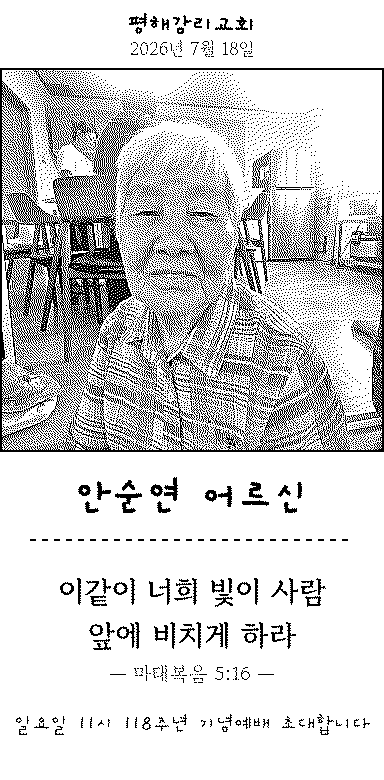 <b>안순연 어르신</b> 마태복음 5:16</td>
    <td align="center" width="33%">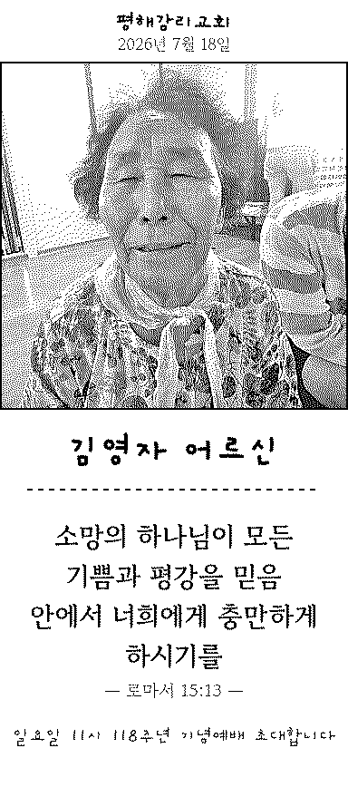 <b>김영자 어르신</b> 로마서 15:13</td>
    <td align="center" width="33%">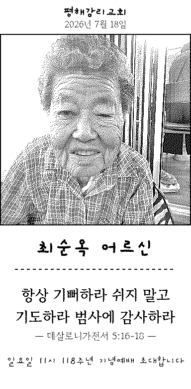 <b>최순옥 어르신</b> 데살로니가전서 5:16-18</td>
  </tr>
  <tr>
    <td align="center" width="33%">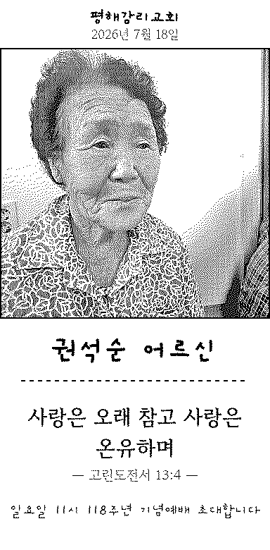 <b>권석순 어르신</b> 고린도전서 13:4</td>
    <td align="center" width="33%">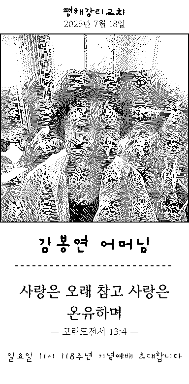 <b>김봉연 어머님</b> 고린도전서 13:4</td>
    <td align="center" width="33%">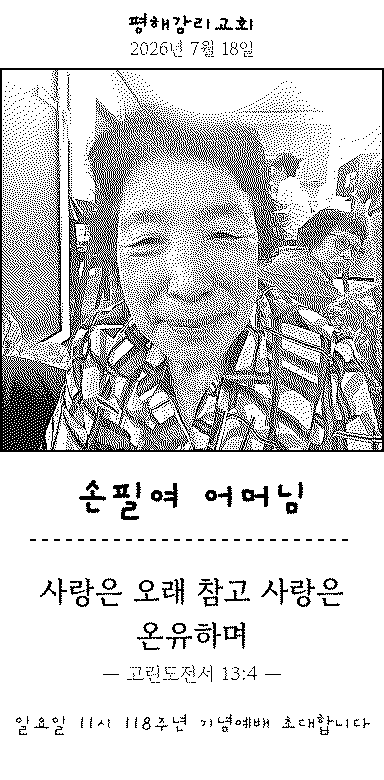 <b>손필여 어머님</b> 고린도전서 13:4</td>
  </tr>
  <tr>
    <td align="center" width="33%">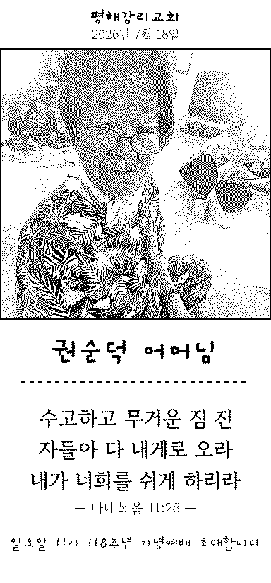 <b>권순덕 어머님</b> 마태복음 11:28</td>
    <td align="center" width="33%">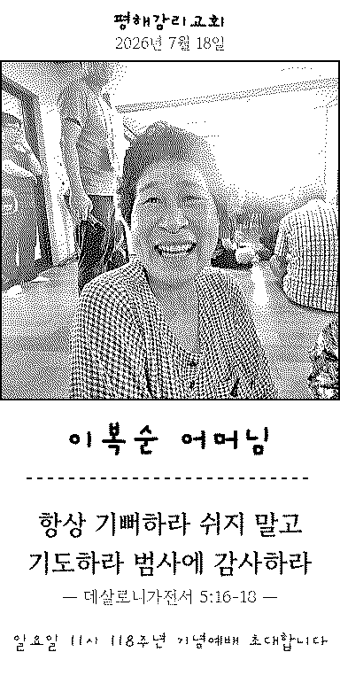 <b>이복순 어머님</b> 데살로니가전서 5:16-18</td>
    <td align="center" width="33%">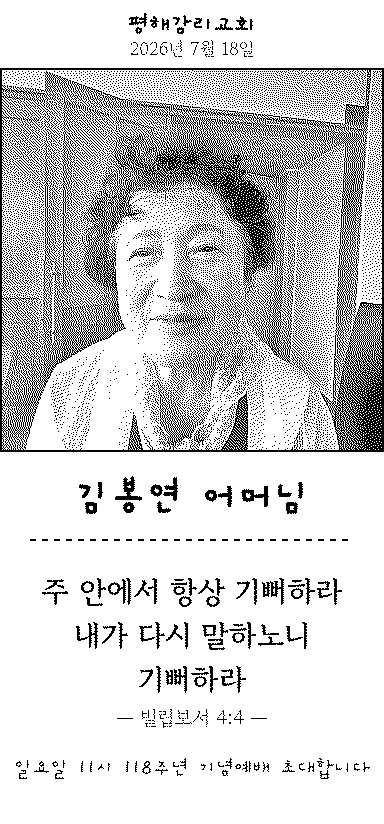 <b>김봉연 어머님</b> 빌립보서 4:4</td>
  </tr>
  <tr>
    <td align="center" width="33%">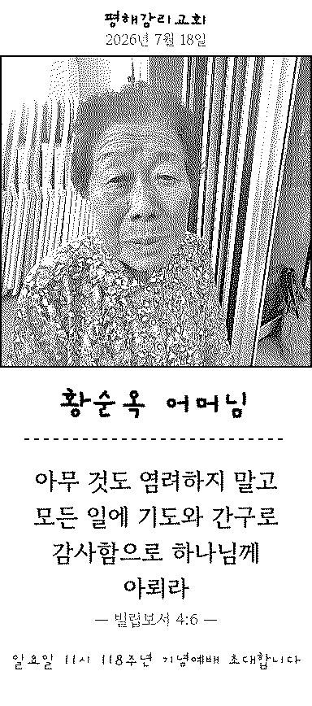 <b>황순옥 어머님</b> 빌립보서 4:6</td>
    <td align="center" width="33%">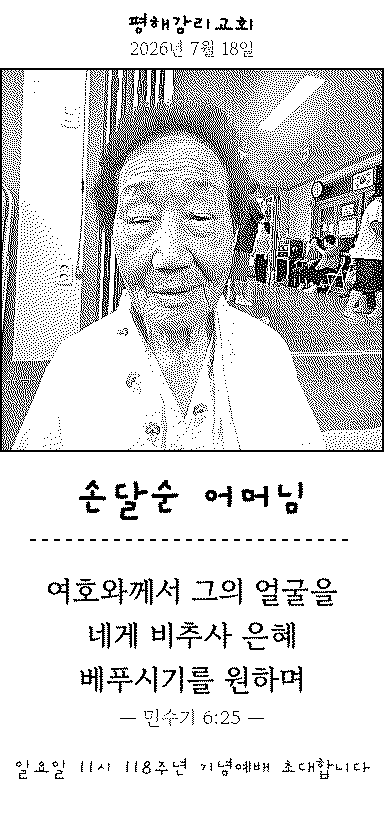 <b>손달순 어머님</b> 민수기 6:25</td>
    <td align="center" width="33%">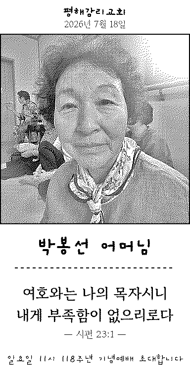 <b>박봉선 어머님</b> 시편 23:1</td>
  </tr>
  <tr>
    <td align="center" width="33%">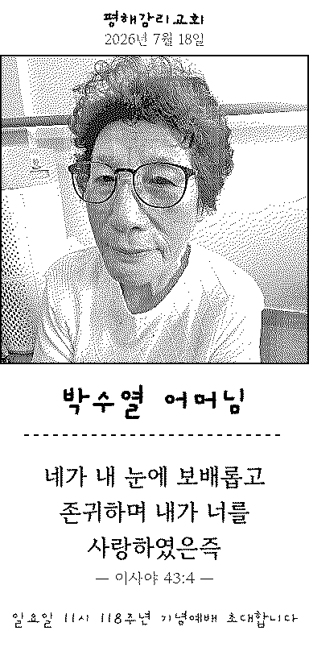 <b>박수열 어머님</b> 이사야 43:4</td>
    <td align="center" width="33%">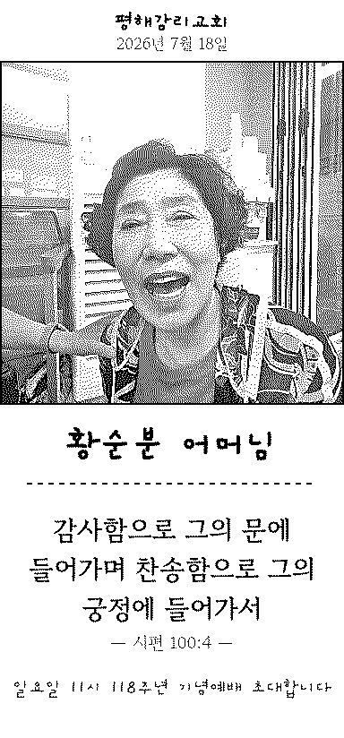 <b>황순분 어머님</b> 시편 100:4</td>
    <td align="center" width="33%">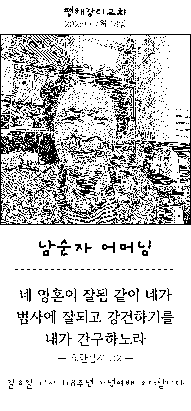 <b>남순자 어머님</b> 요한삼서 1:2</td>
  </tr>
  <tr>
    <td align="center" width="33%">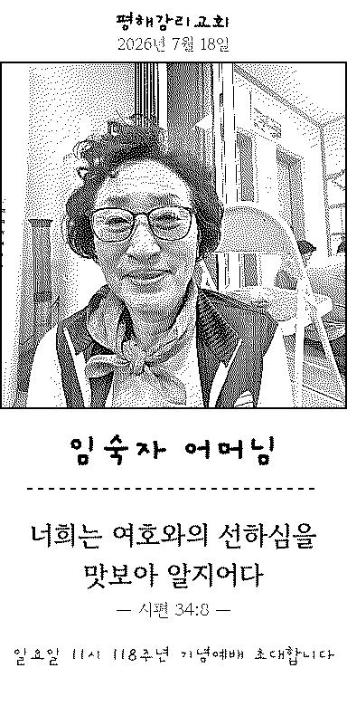 <b>임숙자 어머님</b> 시편 34:8</td>
    <td align="center" width="33%">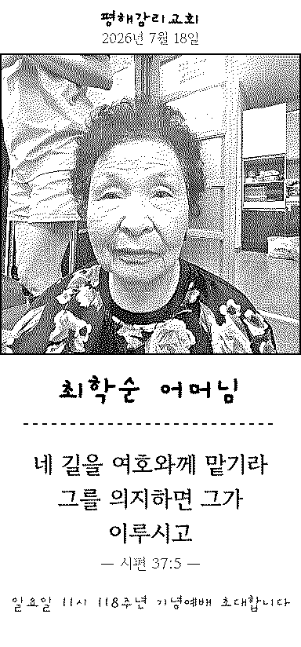 <b>최학순 어머님</b> 시편 37:5</td>
    <td align="center" width="33%">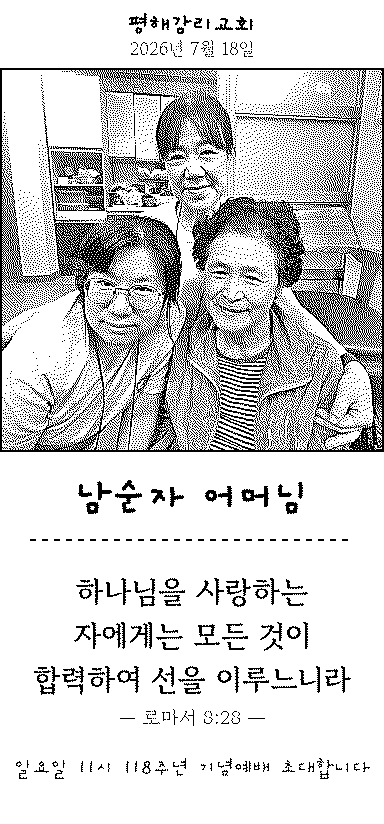 <b>남순자 어머님</b> 로마서 8:28</td>
  </tr>
  <tr>
    <td align="center" width="33%">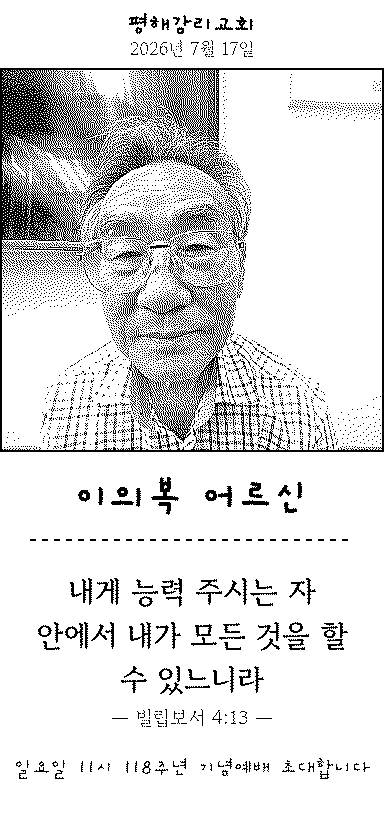 <b>이의복 어르신</b> 빌립보서 4:13</td>
  </tr>
</table>

- **알게 된 인사이트:**

  1. **"연결됐는데 출력이 안 된다"의 범인은 프로토콜이 아니라 감열지 방향이었다.** 소프트웨어 하던 사람은 소프트웨어를 의심한다 — 물리적인 것부터 봤어야 했다. 그리고 그 삽질 덕분에 진단 기능(급지 테스트·로그)이 태어났다. **삽질은 기능이 된다.**
  2. **하드웨어는 겉모양이 아니라 칩셋이다.** 브랜드 제품(PeriPage·Paperang)이 오히려 독자 프로토콜로 비호환, 영수증형은 블루투스 클래식이라 Web Bluetooth 연결 자체가 불가. **"구매 전 판매자에게 블루투스 기기 이름 묻기"** 한 줄이 시스템 성립 조건이었다. 공급망 조사도 개발이다.
  3. **품질은 한 번에 안 나온다.** 명암 보정은 전역 → 중앙 가중 → 지역 적응까지 3차를 갔다. **현장의 조건(역광)은 책상에서 안 보인다.**
  4. **시스템의 끝은 배포가 아니라 운영 가이드다.** 사모님이 충전하고 용지를 갈 수 있으면 시스템이고, 아니면 데모다. "팀이 떠난 뒤에도 돌아가는 것"까지가 시스템이었다.
  5. **AI에게 맡길 것과 코드로 확정할 것의 경계가 품질을 만든다.** 스타일 프롬프트를 AI 재량에 뒀더니 찬양에 "Korean trot"이 섞였다 → 분위기×보컬 확정 템플릿(`MOODS`)으로 코드에 이관하니 사라졌다.
  6. **복구 불가능한 의존성은 현장에 두지 않는다.** Suno는 공식 API가 없어 자동화 범위를 "가사·스타일 생성"까지로 긋고 입력 30초만 수동으로 남겼다. 그 30초가 오히려 품질 검수 지점이 됐다.

  > *"여호와는 네게 복을 주시고 너를 지키시기를 원하며" — 민수기 6:24*

## 📣 미션 2. 스폰지 토크데이 SNS 후기
> 오늘 토크데이 후기를 SNS에 올리기 (**#스폰지클럽 필수 · 셀 3개 지급!**)

- **후기 내용:** <!-- 직접 작성 -->
- **SNS 인증 링크:** <!-- 직접 작성 -->
