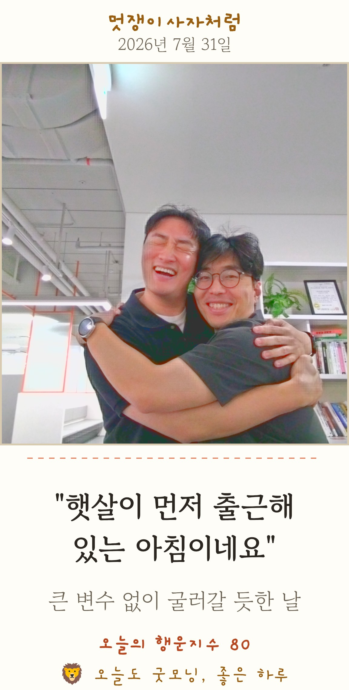

# 5주차 — 마지막 과제 🏁

## 🎯 과제 1. 구현, 그 다음의 것

- **지금 걸려 있는 고민 하나:**
  **"만든 사람이 없어도 돌아가는가."** 온마음 사진관이 평해감리교회(운영 중) → 회사 로비(이번 주 설치·운영 중) → **부모님이 다니시는 교회(설치 완료)** → 전의무학교회(설치 예정) → 일본 선교(검토)로 퍼지고 있고, 회사 설치 첫날부터 "우리 교회에도 설치되나요?" 문의가 들어왔다. 기쁜 일인데 — 퍼질수록 한 가지 질문이 커진다. 4주차 가상 패널의 1위 거절 사유가 정확히 이거였다: *"결국 나한테 다 몰린다."* 이제 그 "나"가 진짜 내가 됐다.

- **그게 왜 고민인지 (무엇이 걸리는지):**
  설치처가 늘 때마다 프린터 페어링·감열지 교체·설정을 아는 사람이 현장에 한 명은 있어야 한다. 지금은 그게 전부 나다. 사이드 프로젝트가 "서비스"가 되는 순간, 유지보수·지원 부담이 만든 기쁨을 넘어설 수 있다.

- **어떻게 풀어볼 생각인지:**
  ① **구조로 풀기** — 서버 없는 단일 HTML + 설정·갤러리 기기별 저장 구조라, 같은 주소를 여러 곳이 써도 서로 안 섞인다. 새 설치처는 "주소 열고 ⚙에서 이름만 변경"이 전부가 되도록 이미 설계됨.
  ② **문서로 풀기** — 레포 README에 **"우리 교회/모임에도 설치하기 (5분)"** 가이드를 추가했다 (방법 1: 주소 그대로 쓰기 / 방법 2: 포크 / 준비물 2~3만원). 문의가 오면 링크 하나로 답한다.
  ③ **사람으로 풀기** — 각 설치처에 "관리 담당 1명"을 세우고 1장짜리 인수인계 매뉴얼로 넘기는 것이 다음 단계. (4주차 전도사 페르소나의 말이 기준: *"매뉴얼만 있으면 내가 돌리겠다"*)

- **필요한 게 있다면 무엇인지:**
  실제 인수인계 테스트 1회 — 나 없이 다른 사람이 매뉴얼만 보고 설치·운영을 해내는지. 전의무학교회 설치가 그 첫 실험이 될 예정.

## 🏁 과제 2. 구현 마무리 + 실제 유저 피드백 받기

- **최종 완성한 것 (지금 어디까지):**

  4주차 검증(실제 유저 + 가상 패널 + 조별 공유회)에서 나온 것을 **전부 코드로 반영**하고, 두 번째 현장(회사 로비)에 실배포까지 완료했다.

  | 반영 | 내용 | 출처 |
  |---|---|---|
  | 🖼 기기내 갤러리 | 인쇄·공유 시 컬러 원본 자동 보관 (장소별 분리·서버 없음·비용 0) | 실제 가족 + 가상 패널 "감열지 옅어짐" |
  | 🙏 기도제목 직접 입력 | 랜덤 말씀 ↔ 직접 적기 전환 (회사판은 💌 응원 메시지) | 실사용 의견 "심방·비치용엔 기도제목" |
  | ✍️ 사진 없이 카드 | 촬영 부담스러운 분용 말씀+성함 카드 | 가상 패널 거절사유 3위 |
  | 🌤 실시간 날씨 연동 | 서울 날씨 조회 → 날씨에 맞는 응원 문구만 (풀 36→75종) | 회사 설치 첫날 "더운데 안개 문구가 나와요" |
  | 🍀 행운지수 상향 | floor 70 (평균 ~90점) + 100점 커피쿠폰 잭팟 | 원본 슬랙봇 최신 로직 동기화 |
  | 📦 공유 가이드 | README "우리 교회에도 설치하기(5분)" | 사내 문의 대응 |

  구조적으로는 **"1 엔진, N 콘텐츠"**를 완성 — 온마음(말씀·기도제목)과 굿모닝라이언(행운·응원)은 같은 엔진이고, 원본 한 곳만 고치면 변환 스크립트(`tools/build_lion.py`)가 회사판을 재생성한다.

- **🚀 실제 배포 URL:**
  - ⛪ 온마음 말씀사진관: https://onmaeum-song-studio.vercel.app/print.html
  - 🦁 굿모닝라이언 행운사진관 (회사 로비): https://baezzanglion.github.io/sponge-intro/lion.html
  - 📦 오픈 레포 (설치 가이드 포함): https://github.com/baezzanglion/onmaeum-song-studio

- **결과물 (링크·스크린샷 — 이미지는 `이미지첨부/` 폴더에):** 위 URL에서 바로 체험 가능 (설치·로그인 없음).

  로비에서 실제로 뽑힌 컬러 카드 (게재 동의받은 컷):

  
  

- **받은 유저 피드백:**
  - **회사 로비 설치 첫날 (실사용자):** **하루 만에 35건 촬영**(기기내 갤러리 집계). 사내 공지에 **이모지 리액션 110+ · 댓글 7** — "이제 운세 보러 카페 안 가도 되겠네요 🍀" 같은 반응과 함께, 그 자리에서 **"교회 버전은 어떻게 설치하나요" 문의**를 받았다 → README 공유 가이드로 즉시 대응. "더운 날인데 안개·쌀쌀 문구가 나온다"는 지적 → **당일 날씨 연동으로 수정 배포.** 설치 첫 주에 **100점 잭팟 실제 당첨자 등장** — 인증샷과 함께 "저 당첨인가요??"가 올라오며 카드 한 장이 사내 이벤트가 됐다.
  - **첫 번째 확산 사례:** 동료 한 분이 **"우리 교회에 쓰고 싶다"며 레포를 받아 갔고, 주말 선교 박람회용으로 프린터·감열지 대여까지 요청** — 계획했던 "인수인계 실험"이 예정(전의무학교회)보다 먼저, 자발적 수요로 시작됐다. 내가 없는 현장에서 README 가이드만으로 돌아가는지 확인하는 진짜 테스트가 된다.
  - **세 번째 설치 — 부모님이 다니시는 교회:** 누나와 부모님이 다니시는 교회에도 설치했다. 어르신 70~80%가 "재밌다, 신기하다"는 반응이었고 — 무엇보다, **요즘 교회에 발걸음이 뜸하시던 아버지가 사진관 앞에 서서 나와 다정한 한 컷을 찍으셨다.** 온마음이 처음 하고 싶었던 일이 가장 가까운 곳에서 일어났다.
  - **현장이 내준 다음 숙제 2가지:** ① **전도사님의 핸드폰이 아이폰이었다** — iOS는 Web Bluetooth 미지원이라 인쇄가 불가(저장·공유는 가능). 아이폰에서도 되도록 우회로 검토가 필요하다. ② 70대 남자 어르신이 **"나 사진이 너무 안 나와… 못생겼어"라며 자책** — '사진 부담' 문제의 세 번째 확인(가상 패널 → 공유회 '회춘 모드' 제안 → 실제 어르신). 사진 없는 카드만으로는 부족하고, **캐릭터 일러스트풍 변환**을 검토하기로 했다.
  - **조별 공유회 (2조):** "피드백을 바로바로 적용해주신 게 너무 좋아요"(조원), "현장 리얼 피드백이라니. 그래서, 그날 바로 고쳤다 👍"(조원) — 개선 제안으로는 프레임 디자인·꾸미기 옵션·**젊은 시절 사진(회춘) 모드**·어르신용 폰트 확대·운영 인력 문제가 나왔고, 이 중 운영 인력은 위 과제 1의 고민으로, 나머지는 백로그로 정리했다.

## 📣 과제 3. SNS에 남기기

- **구현했던 것들 (무엇을 / 어떻게 굴러가는지 / 뭐가 달라졌는지):**
  6주 전엔 "어르신께 사진 한 장 인쇄해 드리고 싶다"로 시작한 것이, 지금은 — 교회에서 운영 중이고, 회사 로비에 서 있고, 다른 교회에서 설치 문의가 오는 **오픈소스 키오스크 시스템**이 됐다. 바뀐 건 기능만이 아니다: "만들었다"(3주차) → "검증하고 고쳤다"(4주차) → **"내가 없어도 돌아가게 만든다"(5주차)**로 질문 자체가 자랐다.

- **다음 단계 생각 (뭘 더 하고 싶은지 / 남은 것 / 어디로):**
  ① 전의무학교회 설치 = 첫 인수인계 실험 (매뉴얼 1장만 들고) ② 고보존 감열지로 교체 ③ **아이폰(iOS) 대응 우회로 검토** — 전도사님들의 폰에서도 되도록 ④ **사진 부담 어르신용 캐릭터 일러스트풍 변환 검토** ⑤ 회춘 모드·프레임 등 공유회 백로그 ⑥ 일본 선교 버전 검토. 그리고 이 모든 걸 계속 **한 엔진**에서.

- **SNS 인증 링크:** (게시 후 추가 예정)
