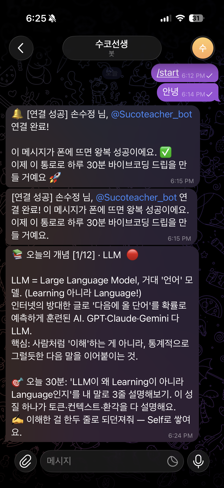

# 1주차 — 나만의 OS 만들기 🛠️

> 미션을 진행하며 **과정과 결과물**을 기록해주세요. (다 못 채워도 OK, 한 것 위주로!)

## 🎯 미션 1. 내 OS 재료 찾기
> 인터뷰 스킬(아이데이션)로 "내 삶에 필요한 게 뭔지" 찾기
- **과정 (어떻게 찾았나):**
  - 인터뷰 스킬로 하루를 되짚음. 처음엔 "이미 영상편집(롱폼→숏폼) 자동화 OS를 만들고 있다"에서 출발 → 근데 그건 이미 진행 중.
  - 일 밖으로 방향을 틀자 ① 운동·수면 ② 하루 기록 ③ 바이브코딩 배움 세 개가 나왔고, "쉽게 들어갈 수 있는" 3번(바이브코딩)으로 디깅.
  - 여기서 진짜 동기가 나옴 — **곧 다른 지방으로 이사 가서 바이브코딩 강사를 해보고 싶어서, 기반부터 탄탄하게** 알고 싶다는 것.
  - 이미 만들어둔 노트(`00-바이브코딩-기초-용어지도`, `01-원리와-도구층-심화`)를 보니, "개념을 하나씩 깊게 파서 쌓으면 곧 교육 커리큘럼"이라는 방향이 이미 박혀 있었음.
- **결과 (내 OS 재료 카드):**
  - **영역**: 배움 + 기록 (미래 '바이브코딩 강사' 준비)
  - **걸리는 지점**: 원리도 모른 채 AI(클로드)만 믿고 씀. 가르치려면 내 말로 설명 가능해야 하는데, 개념을 깊게 파서 쌓는 게 일 때문에 자꾸 놓침.
  - **지금은**: 클로징 스킬로 하루 기록은 함(세세하진 않게) + 용어 정리는 파편적(노트는 있으나 흩어짐), 커리큘럼 편입은 손수 링크.
  - **OS가 된다면**: 클로징으로 하루를 마무리하면, 그날 판 바이브코딩 디깅이 알아서 '교육 커리큘럼' 진도에 반영·연결됨.
  - **한 문장**: "매일 판 조각이, 다른 사람들을 위한 지식 교재가 된다"
- **느낀 점:**
  - "딱히 불편한 게 없다"에서 시작했는데, 일 밖으로 한 번 나가니 진짜 하고 싶은 것(강사)이 튀어나왔다.
  - 이미 하고 있던 것(클로징 기록 + 용어 노트)이 사실은 OS의 씨앗이었다는 걸 알게 됨. 새로 만들 게 아니라 **잇는 것**이 핵심.

## 🧩 미션 2. 내 OS 기획
> 인터뷰 결과 + 세션 내용(흐민·배짱·키노) 활용해 기획

### 흐민 세션과의 연결 (이 기획의 뼈대)
흐민 세션의 "나만의 OS"는 **3층 구조**(1층 사고 → 2층 지식 → 3층 자산화)로 쌓이고, **던지면 도는 5단계 루프**로 돈다. 이 구조를 내 목표(**바이브코딩 강사 되기**)에 그대로 얹었다.

**① 3층 구조에 내 OS 얹기**

| 흐민 세션 (3층 구조) | 내 OS = "배움이 강사 교재가 되는 시스템" |
|---|---|
| **1층 · 사고** (던지면 정리·저장, 무게중심) | 매일 봇이 개념 1개를 던져줌 → 30분 공부 → 이해한 걸 되던져 Self로 저장. 이게 전부의 출발 |
| **2층 · 지식** (자정 자동 연결 · LLM Wiki, 안드레 카파시) | 흩어진 개념 노트가 **커리큘럼 주제(챕터)로 자동 연결**. 폴더·목차를 미리 안 짬 — 쌓인 뒤 구조가 드러남 |
| **3층 · 자산화** (익으면 "글 될 만해요" 신호 → Editor) | 익은 개념이 **"이제 가르칠 만해요"** 신호로 뜸 → '가르치는 눈'으로 교안화 → **내 손으로** 강의자료 발행 |

**② 5단계 루프에 대입** (p.11) — 방향만 뒤집음(봇→나)
①봇이 던진다(오늘의 개념) → ②내가 30분 공부하고 되던진다(Self) → ③엮인다(커리큘럼 챕터로 자동 연결) → ④복습·공개된다(주간 복습 루프 / 가르칠 만한 후보 초안, **발행 결정은 나**) → ⑤돌아온다(가르치며 또 배운다). *내가 하는 건 하루 30분 하나.*

**③ 세션에서 가져온 두 개의 설계 원칙 (내 걱정을 정확히 푸는 부분)**
- **Self / External 분리** (p.23): 내가 내 말로 이해한 것(Self)과 클로드·레퍼런스가 준 설명(External)을 **섞지 않는다**. 흐민 말대로 "섞이면 이게 내 생각이었나, 어디서 읽은 건가 헷갈린다." → 내 "AI만 믿고 원리는 모른다" 걱정을 그대로 해소. **가르칠 수 있는 건 Self로 쌓인 것뿐.**
- **당부① "0 to 100 하지 마세요 — 내 시스템엔 내가 이해 못 하는 기능이 하나도 없어야 해요"** (p.54): 이건 내가 바이브코딩을 **기초부터 탄탄히** 파려는 이유 그 자체다. 강사가 되려면 블랙박스가 있으면 안 되니까. 그래서 OS도 한 칸씩 직접 만든다.

### 기획 내용 — "하루 30분, 봇이 던져주는 바이브코딩 드립"
방향을 하나 뒤집었다. 흐민은 *내가* 생각을 던졌지만, 내 버전은 **봇이 먼저 개념 하나를 던져주고 → 나는 30분 공부하고 → 이해한 걸 되던지는** 가벼운 드립(drip) + 복습 루프. "시간 없어서 자꾸 놓친다"는 원래 문제에 정확히 맞춘 크기다. **무겁게 만들지 않는 게 핵심.**

전체를 3층/3단계로 두고, **이번 주는 1층(매일 드립)만** 만든다. (흐민의 "0 to 100 하지 말고 첫 칸부터")

- **1단계 (이번 주 · 매일 드립)**: 텔레그램 봇이 매일 **"오늘의 개념 1개"**를 던져준다 (기존 `00-용어지도`/커리큘럼에서 하나씩 순서대로). 나는 딱 **30분**만 공부하고, 이해한 걸 **내 말로 한두 줄**만 되던진다 → `learning/바이브코딩-기초/`에 Self로 저장. 목표는 완벽한 정리가 아니라 **하루 30분이라도 굴러가게** 하는 것.
- **2단계 (2층 지식 · 복습 루프)**: 주간(예: 일요일)에 그 주에 받은 개념을 봇이 다시 꺼내 **복습**시켜준다. 안 붙은 건 다음 주에 또. 쌓인 개념들은 커리큘럼 챕터로 **자동 연결**(LLM Wiki 방식).
- **3단계 (3층 자산화)**: 충분히 익은 챕터를 "처음 배우는 사람한테 어떻게 쉽게 설명할까" 관점의 비유·예시로 교안화 → **내 손으로** 강의자료 발행. = 매일 30분의 조각이, 다른 사람들을 위한 지식 교재가 됨.

> 매일 = **봇이 던짐 → 내가 30분 → 되던짐(Self)** · 주간 = **복습 루프** · 결국 = **강사 교재로 누적**

### 막혔던 점 / 어떻게 풀었나
- 막힌 점: "이미 영상 자동화 OS를 만들고 있어서 새로 뭘 정할지" 모호했고, 배움(바이브코딩)은 '매일 굴러가는 OS'라기보다 일회성 공부처럼 느껴졌음. 또 "AI만 믿고 원리는 모른다"는 찜찜함이 계속 걸렸음.
- 어떻게 풀었나: ① 인터뷰로 "왜 배우려는가(=강사)"를 끌어내자 배움이 명확한 목표를 얻음. ② 이미 쓰는 **클로징에 얹는** 방식(=흐민의 '첫 칸부터')으로 좁히니 '매일 켜지는 OS'가 됨. ③ 흐민의 **Self/External 분리 + 당부①("이해 못 하는 기능이 하나도 없어야")**이 "AI만 믿는" 찜찜함을 정확히 풀어줌 — 이 구조 자체가 원리를 내 것으로 만들게 강제한다.

## ⚙️ 미션 3. 내 OS 구현
> 실제로 만들어본 것 (클로드코드 '채널' 기능 활용 OK)
- **결과물: "하루 30분 바이브코딩 드립" 봇 (무료·로컬 MVP)**
  - 텔레그램 봇(@Sucoteacher_bot)이 **바이브코딩 개념 하나를 던져주면 → 30분 공부 → 이해한 걸 되던지는** 가벼운 드립 + 주간 복습 루프. (1층 = 던지는 환경의 첫 칸)
  - **재료**: 기존 `learning/바이브코딩-기초/00-용어지도`의 12개 용어를 학습 순서대로 12일치 드립으로 변환.
  - **동작**: 순수 파이썬 스크립트가 텔레그램 무료 봇 API로 발송 → `state.json`에 진행상태 기록(하루 한 개 제한, 히스토리 누적). **AI 토큰 안 씀 = 추가 비용 0원.**
  - **구성**: `curriculum.json`(12일 커리큘럼) · `send_drip.py`(오늘 개념 발송) · `send_review.py`(주간 복습) · `.bat`(더블클릭 실행) — 별도 개인 프로젝트 폴더에 보관(`0.videcoding-teacher/vibe-drip/`, 공유 저장소와 분리)
  - **검증**: Day 1 · LLM 실제 발송 성공 ✅ / 하루 한 개 제한 작동 ✅ / 주간 복습 미리보기 작동 ✅
  - **흐민 세션 적용점**: "0 to 100 하지 말고 첫 칸부터"(p.54) — 커리큘럼 자동화까지 안 가고 **던지는 통로 + 매일 쌓기**부터. "봇이 던짐→내가 30분→되던짐" 드립으로 "시간 없어 놓친다" 문제를 30분 크기로 해결.
  - **한계(정직하게)**: 로컬 방식이라 컴퓨터가 켜져 있을 때만 발송됨(무료를 위해 클라우드 대신 로컬 선택). 되던진 내용을 폴더에 자동 저장(Self)하는 건 다음 확장.
- **링크 / 스크린샷:** 폰에 도착한 Day 1 드립 메시지 캡처 예정 (이미지는 `이미지첨부/` 폴더에)

## 📱 미션 4. SNS 1주차 소감
> AI 도움 없이 직접 작성! (인증하면 셀 지급)
- **인증 링크:**
