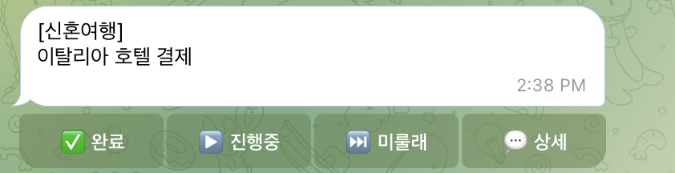

---
member: 이보미
조: 2
week: 3
type: weekly
title: 
date: 
---

# 3주차 — 내 OS 최종 완성 🏁

> 미션을 진행하며 과정과 결과를 기록해주세요. (다 못 채워도 OK, 한 것 위주로!)

## 🎯 미션 1. 내 삶을 돕는 OS 최종 완성
> 지금까지 공유하며 받은 **피드백을 반영해 최종 완성**!
- **완성한 것 (무엇을):** 일정뽀개기OS(텔레그램 기반 개인 비서)를 이번 주 내내 실제로 써보면서 다듬었다. 완료/진행중/미룰래/상세 4버튼 UI, 음성 메시지로 대일정·하위할일 입력, 우선순위 관리, 리마인드 날짜 배치 원칙, 대일정→하위할일 분해 로직, 옵시디언 연동까지 — 복잡한 스콥의 OS는 아니지만 기본 뼈대와 사용성은 어느 정도 갖춘 것 같다. 현재 결혼·신혼여행(이탈리아)·친구들 방문·부산여행 등 대일정 5건이 실제로 돌아가는 중.
- **피드백 반영한 점:**
  - 가장 많은 시간과 노력을 들인 건 텔레그램 "상세보기" UI였다. 일정은 간단히 보여주고 상세 내용은 필요할 때만 펼쳐보고 싶어서, 텔레그램 자체 기능(블록쿼트 접기, 스포일러)을 이것저것 시도했는데 접힌 상태에서도 내용이 일부 미리 보여서 원하는 방식이 아니었다. 결국 메시지에 "💬 상세" 버튼을 따로 붙이고, 누르면 새 메시지를 보내는 대신 그 자리에서 원래 메시지에 상세 내용을 이어붙여 길어지게 만드는 방식(`edit_message`)으로 완성했다 — 평소엔 짧게, 필요할 때만 그 메시지 안에서 펼쳐지는 UI.
  - 화면에 노출되던 "1-1", "2-1" 같은 번호도 없앴다. 번호는 버튼 콜백·`오늘번호.md` 역참조용 내부 식별자로만 쓰고, 사용자에게 보이는 텍스트에는 대일정명 + 할일명만 남겨서 더 깔끔하게 정리했다.
  - 음성 메시지를 텍스트처럼 알아듣고 반영하는 기능도 추가했다 — 텔레그램으로 음성 메모를 보내면 타이핑한 것과 동일하게 대일정 등록/하위할일 응답으로 처리된다.
  - 예상보다 수정이 많았던 부분은 텔레그램 봇 연결이 자꾸 끊기는 문제였다. 자동화 스크립트(launchd)와 실시간 대화가 같은 봇 토큰을 같이 쓰다 보니 폴링 연결이 서로 충돌한다는 걸 뒤늦게 알아채서 고쳤다.
  - 실사용 흔적 기반 개선: 액션 문장이 너무 길어서 짧은 라벨로 재작성, "여행자 보험 가입"처럼 우선순위 낮게 계속 밀리던 항목을 발견해 마감 임박 시 우선순위를 자동 승격하는 기능 추가.
- **결과물 (링크·스크린샷 — 이미지는 `이미지첨부/` 폴더에):** `일정뽀개기OS/` 폴더 — CLAUDE.md(동작 규칙), events/*.md(대일정 5건), 대시보드.md(옵시디언 뷰).
  
    
  
- **알게 된 인사이트:** 제가 OS를 실제 사용한 기록을 기반으로, 어떤 기능이 추가로 필요할지 클로드한테 알려달라 해서 새로운 기능을 붙인게 도움이 되었습니다. 머리로 상상해서 기능을 만드는 것보다, 일단 써보고 흔적을 다시 들여다보는 쪽이 저한테 더 잘 맞는 쪽으로 OS를 개선하는 데 도움이 되었습니다.
  - 다음 주 고민: 지금은 업무 외 개인 생활을 관리해주는 정도인데, 더 큰 규모의 개인 업무까지 처리하는 방향으로 확장할지 고민 중. 니즈가 크지는 않아서 억지로 확장해야 하나 싶으면서도, 확장 안 하면 스콥이 단순해서 더 개발할 게 없어 보이는 것도 사실이라 고민.

## 📣 미션 2. 스폰지 토크데이 SNS 후기
> 오늘 토크데이 후기를 SNS에 올리기 (**#스폰지클럽 필수 · 셀 3개 지급!**)
- **후기 내용:**
- **SNS 인증 링크:**
