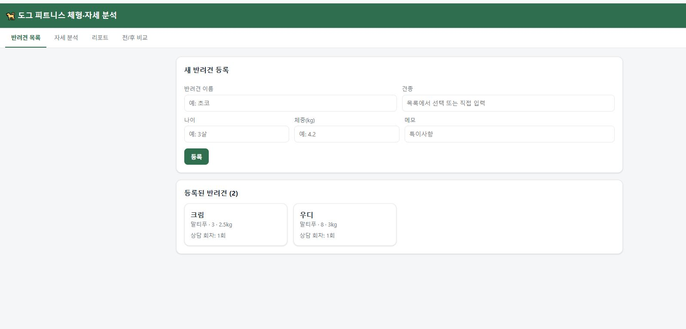
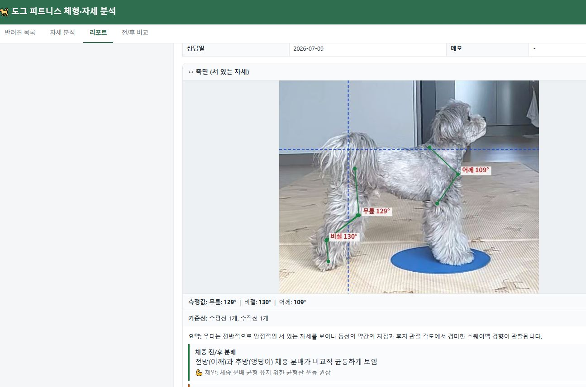

# 2주차 — 내 OS 구현하기 🚀

> 미션을 진행하며 **기획 → 구현 → 삽질 → 결과물 → 인사이트** 를 상세히 기록해주세요.
> (다 못 채워도 OK, 한 것 위주로!)

## 🎯 미션 1. 내 OS 만들기
> **[ 내 삶을 돕는 OS ]** 또는 **[ 콘텐츠 OS ]** 중 하나를 선택해 완성해주세요.

**✅ 선택:** 내 삶을 돕는 OS — 도그 피트니스 첫 상담을 돕는 **체형·자세 분석 도구**

### 📐 기획
> 무엇을, 왜, 어떻게 만들지

- **무엇을:** 반려견 사진을 넣으면 자세·체형을 분석해서, 슬개골·고관절·디스크 같은 정형외과적으로 신경 쓸 부분을 짚어주고, 운동계획을 세울 때 도움이 되고, 피트니스 전/후를 비교해주는 도구.
- **왜:** 첫 상담에 오는 보호자에게 "지금 이 아이는 이런 자세라 여기가 걱정돼요"를 말로만 설명하면 잘 와닿지 않는다. 사진 위에 소견과 기준선을 보여주고, 나중에 전/후를 나란히 비교하면 피트니스 효과를 눈으로 보여줄 수 있다.
- **어떻게:** 개 해부학·수의학 관점의 체크리스트를 도구 안에 넣고, 뷰(측면·후면·정면·위·앉은자세)별로 무엇을 보고 무엇을 의심하는지를 구조화. 여기에 견종별 호발 질환 가중치(닥스훈트=디스크, 소형견=슬개골, 대형견=고관절 등)를 얹어 "이 아이는 특히 여기를 보세요"를 자동으로 강조.
- **중요한 선:** 이건 수의학적 '진단'이 아니라 피트니스 목적의 '자세 스크리닝'. 모든 리포트에 "이상 소견은 수의사 검진 권장" 면책 문구를 자동으로 넣어 안전선을 지켰다.

### ⚙️ 구현
> 실제로 만든 것 (링크·스크린샷 — 이미지는 `이미지첨부/` 폴더에)

**도그 체형·자세 분석 앱** (브라우저에서 열리는 단일 프로그램)

- **5뷰 사진 분석:** 측면·후면·정면·위(토프다운)·앉은 자세. 앉은 자세는 흐트러진 앉기(sloppy sit)로 고관절·슬개골을 보기 위해 후면 촬영 권장.
- **두 가지 분석 모드 (사진마다 선택):**
  - **AI 자동 소견** — 사진을 Claude에 보내 개 해부학 기반으로 관찰→우려→피트니스 제안을 구조화해 받음
  - **수동 각도 측정** — 관절 3점을 클릭하면 무릎 각·비절 각 등을 자동 계산 (인터넷 없이도 동작)
- **기준선 그리기:** 사진 위에 수평·수직·자유선을 그어 골반 기울기·체중 정렬을 시각화
- **견종 가중치:** 견종을 고르면 그 견종 호발 질환을 리포트 상단 '중점 확인 항목'으로 끌어올림
- **리포트 + PDF 출력, 전/후 비교, 기록 보관(내보내기/불러오기)**
- **측정 학습용 PDF 가이드**도 따로 제작(관절별 3점 클릭 지점을 그림으로 정리)

### 🧗 과정에서의 삽질
> 막혔던 지점, 시도한 방법, 어떻게 풀었는지 솔직하게

- **보행 분석 욕심 → 범위 조정:** 걸음걸이까지 보고 싶었지만, 정지 사진으로는 보행 분석이 불가능하고 영상 없이는 오진 위험이 컸다. 첫 상담엔 재현성 높은 **정지 자세 5뷰**로 범위를 좁히고, 보행은 다음 단계로 남겨둠.
- **선 그리기가 어긋남:** 사진 위에 그은 기준선이 화면에선 왼쪽으로 밀리고, 리포트에선 사진 밖으로 벗어났다. 원인은 사진은 가운데 정렬되는데 선을 그리는 캔버스는 좌상단에 고정돼 있던 것 → 캔버스를 사진의 실제 위치에 맞춰 해결.
- **데이터가 사라짐 (가장 큰 삽질):** 처음엔 파일을 더블클릭해서 여는 방식으로 만들었는데, 브라우저가 저장소를 지워버려 입력한 기록이 통째로 날아갔다. → 노트북의 **실제 파일(F: 드라이브)에 저장**하도록 구조를 바꾸고, 더블클릭 실행 파일(런처)로 여는 방식으로 전환해서 브라우저를 지워도 데이터가 남게 했다.
- **실행 파일 한글 깨짐:** 런처(.bat) 안의 한글이 깨져 실행이 안 됐다 → 안내 문구를 영문으로 바꿔 해결.

### ✅ 결과물
> 완성한 것 / 작동 화면

- 실제로 반려견을 등록하고, 창을 닫았다 다시 열어도 기록이 유지되는 것까지 확인 완료.
- AI 키를 넣으면 AI 자동 소견, 안 넣어도 수동 측정·기준선·리포트·PDF는 모두 사용 가능.
- 데이터는 `F:\체형분석\data` 폴더의 실제 파일로 안전하게 저장됨.

**① 반려견 등록 화면**

**② 실제 분석 리포트 (측면 — 기준선·측정각·AI 소견)**

> 실제 상담견 '우디' 측면 분석: 기준선(수평·수직)으로 정렬을 보고, 무릎 129°·비절 130°·어깨 109°를 측정, AI 소견으로 경미한 스웨이백(IVDD 부담 가능성)을 짚음.

### 💡 알게 된 인사이트 & 공유하고 싶은 내용
> 하면서 깨달은 것, 크루들과 나누고 싶은 것

- **완전 자동화보다 '내가 정확히'가 상담엔 더 신뢰된다.** AI가 관절 위치까지 자동으로 찍게 하면 강아지 털·각도 때문에 엉뚱하게 잡혔다. 선·측정 위치는 내가 클릭해서 정하고 앱이 정확히 그려주는 방식이 상담에서 훨씬 믿음직했다.
- **'진단'이 아니라 '스크리닝'으로 포지셔닝**하니 도구를 만드는 기준이 명확해졌다(면책 문구, 수의사 권장). 전문성과 안전선을 동시에 잡는 법.
- **전/후 비교가 핵심 가치.** 같은 뷰·같은 측정을 반복해 쌓으면 "비절 각 128°→134°"처럼 변화를 수치로 보여줄 수 있어, 보호자에게 피트니스 효과를 설득하는 무기가 된다.
- 만들면서 계속 "이건 진짜 상담에서 쓸 수 있나?"를 기준으로 덜어내니 오히려 단단해졌다.

과제와 별개로 과제중에 API키를 받고 크레딧을 구매하는 단계에서 자동채움 기능의 작동으로 불필요한 금액이 지출 되었지만, 서비스센터와 소통 후 전액 환불 받음. 

## 📣 미션 2. 유닛 활동 참여 & SNS 공유
> 유닛 활동에 적극 참여(유닛원으로서 or 참가자로서)한 뒤, 그 경험을 SNS에 올리기

- **참여한 유닛 / 활동:** 까스활명수
- **무엇을 했나 (경험):** 함께 모여 궁금한 것도 물어보고, 함께라는 생각에 더 집중해서 할 수 있었어요. 
- **SNS 인증 링크:**
