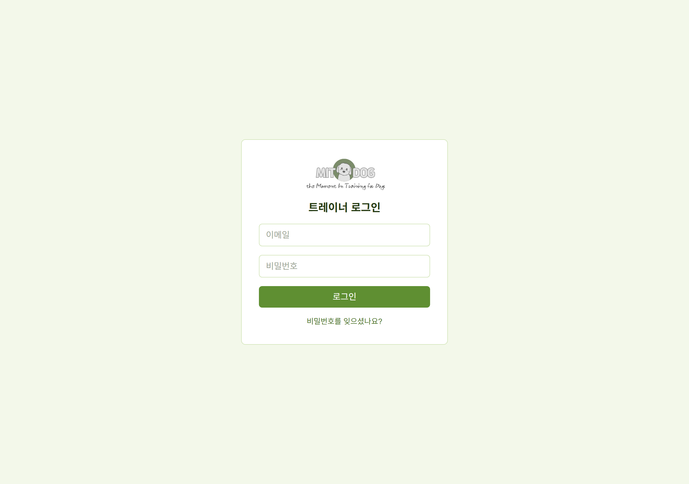
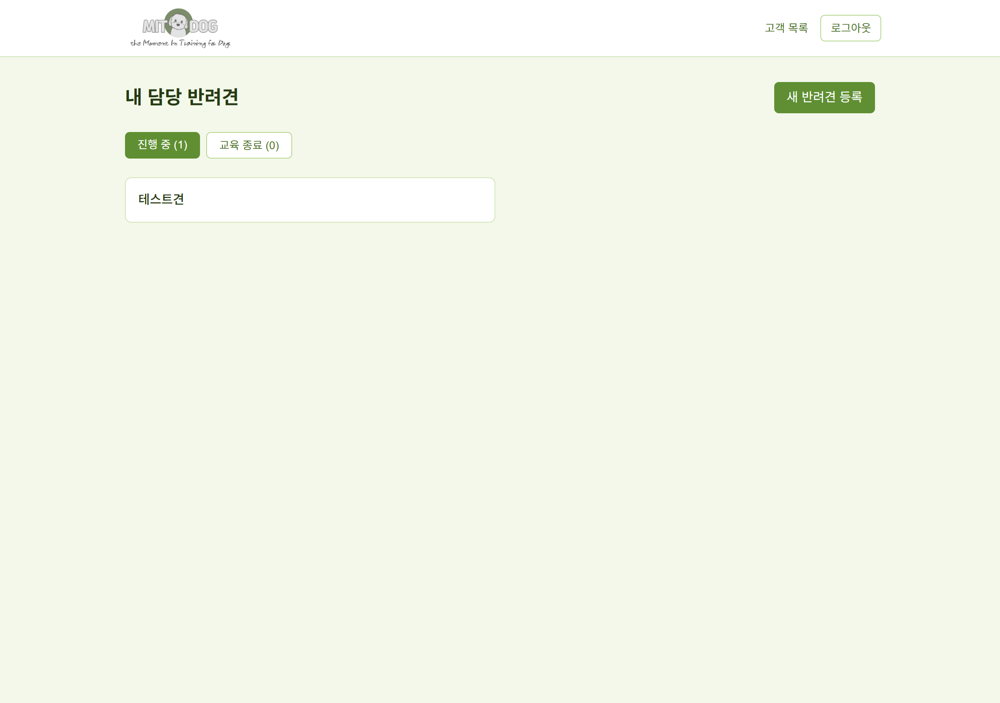
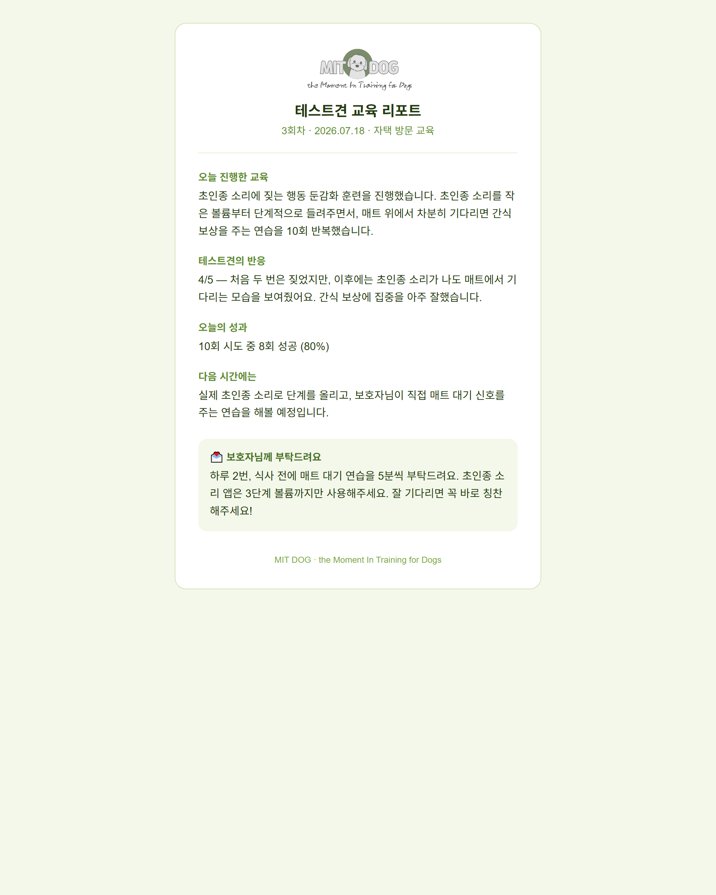

# 3주차 — 내 OS 최종 완성 🏁

> 미션을 진행하며 과정과 결과를 기록해주세요. (다 못 채워도 OK, 한 것 위주로!)

## 🎯 미션 1. 내 삶을 돕는 OS 최종 완성
> 지금까지 공유하며 받은 **피드백을 반영해 최종 완성**!

**✅ 완성한 OS:** 반려견 트레이너를 위한 **MIT DOG 반려견 트레이닝 관리 앱** — 상담부터 교육계획·세션 기록·보호자 리포트까지 한 곳에서 굴리는 트레이너용 도구.
2주차의 '체형·자세 분석 도구'가 **첫 상담**을 돕는 조각이었다면, 3주차에는 그 앞뒤(상담 → 교육 → 보고)를 하나로 잇는 **실무 운영 OS**로 최종 완성하고 **실제 인터넷 주소로 배포**했다.

- **완성한 것 (무엇을):**
  - **반려견 관리** — 담당 반려견 등록, 진행 중 / 교육 종료 상태 구분, 교육 종료견 아카이브
  - **상담 · 교육계획** — 첫 상담 내용과 교육 목표를 반려견별로 기록하고, 상세 화면에 카드로 노출
  - **세션 기록** — 회차별로 진행한 교육·반려견 반응·성과를 기록, 교육계획 목표를 세션 화면에서 함께 확인
  - **보호자 리포트 (핵심 기능)** — 세션마다 보호자용 리포트를 만들고 **로그인 없이 열리는 공유 링크**를 발급 → 카카오톡·문자로 보내면 보호자가 휴대폰에서 바로 열람
  - **트레이너 계정 · 비밀번호 재설정 · 파스텔(세이지) 리디자인 · MIT DOG 브랜딩**
  - **실제 배포 완료** — 인터넷 주소에서 누구나(트레이너는 로그인, 보호자는 링크로) 접속 가능

- **피드백 반영한 점:**
  - **"트레이너 혼자 쓰는 앱이 아니라 보호자에게도 보여야 한다"** → 보호자가 앱 설치·로그인 없이 링크만으로 리포트를 보는 구조로 완성. 실제로 로그아웃 상태에서 리포트 링크가 열리는 것까지 확인.
  - **"화면이 딱딱하다"** → 세이지·파스텔 톤으로 전체 리디자인하고 MIT DOG 로고를 입혀 보호자에게 보내도 부담 없는 인상으로 정리.
  - **"교육이 얼마나 좋아졌는지 한눈에 안 보인다"** → 회차별 성공률을 선 그래프로 보여주는 **진도 그래프**를 다음 단계로 설계(성공률을 정확히 그리려면 세션에 숫자 전용 입력칸을 추가하는 방향으로 결론).

- **결과물 (링크·스크린샷 — 이미지는 `이미지첨부/` 폴더에):**
  - **라이브 주소:** https://dog-training-app-eight.vercel.app  (트레이너 로그인)
  - **작동 확인(실제 인터넷에서 검증 완료):**
    - 로그인 → 대시보드에 담당 반려견 표시 (데이터 연결 정상)
    - 세션 → 보호자 리포트 공유 링크가 **로그인 없이** 열림 (보호자 열람 화면 확인)

  **① 트레이너 로그인 화면 (MIT DOG 브랜딩·세이지 톤)**

  

  **② 로그인 후 대시보드 — 담당 반려견 / 진행 중·교육 종료 구분**

  

  **③ 보호자 리포트 (로그인 없이 링크로 열리는 실제 화면)**

  

- **알게 된 인사이트:**
  - **배포를 막은 건 코드가 아니라 사소한 설정이었다.** 커밋 작성자 이메일이 가짜 값으로 되어 있어 배포 서버가 계속 차단했는데, 올바른 이메일로 바꾸고 다시 서명하니 한 번에 통과했다. "코드는 멀쩡한데 왜 안 되지"의 답이 코드 바깥에 있을 수 있다는 걸 배웠다.
  - **'만들었다'와 '남이 실제로 쓸 수 있다'는 다르다.** 내 노트북에서 되는 것과, 인터넷 주소에서 남이 로그인하고 보호자가 링크로 여는 것은 완전히 다른 단계였다. 배포하고 로그인·리포트까지 직접 눌러 확인하고 나서야 '완성'이라 부를 수 있었다.
  - **보호자 경험이 제품의 방향을 잡아줬다.** "보호자가 로그인 없이 본다"는 한 문장이 리포트 공유 방식, 디자인 톤, 브랜딩까지 결정했다. 누가 이 화면을 보느냐를 먼저 정하니 만들 것과 덜어낼 것이 분명해졌다.

## 📣 미션 2. 스폰지 토크데이 SNS 후기
> 오늘 토크데이 후기를 SNS에 올리기 (**#스폰지클럽 필수 · 셀 3개 지급!**)
- **후기 내용:** 비행기 결항으로 참석 못해서 아쉬웠어요.
- **SNS 인증 링크:** https://www.instagram.com/p/DarExu_hZ6g/?utm_source=ig_web_copy_link&igsh=MzRlODBiNWFlZA==
