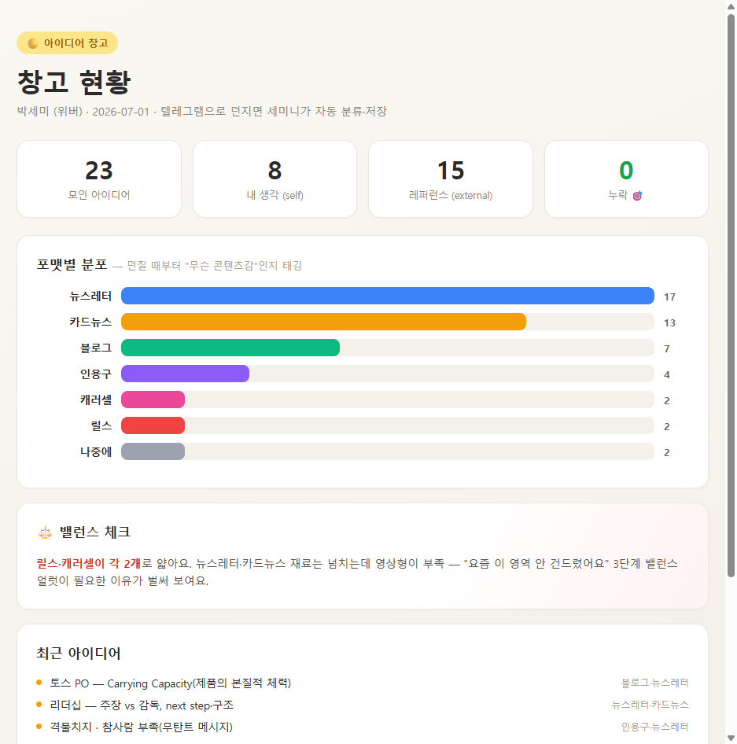
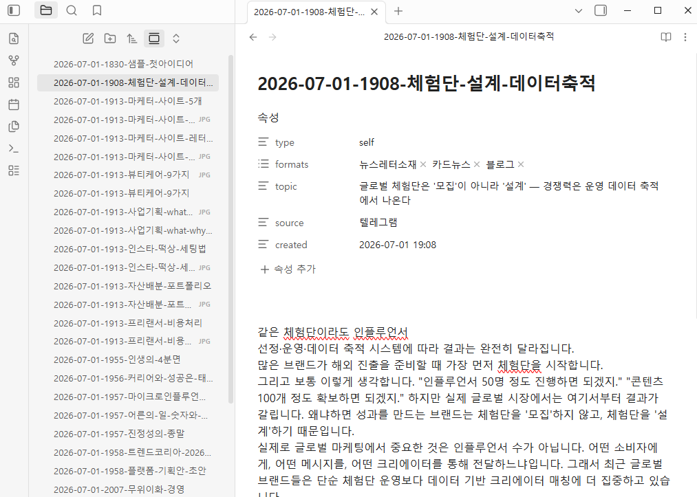
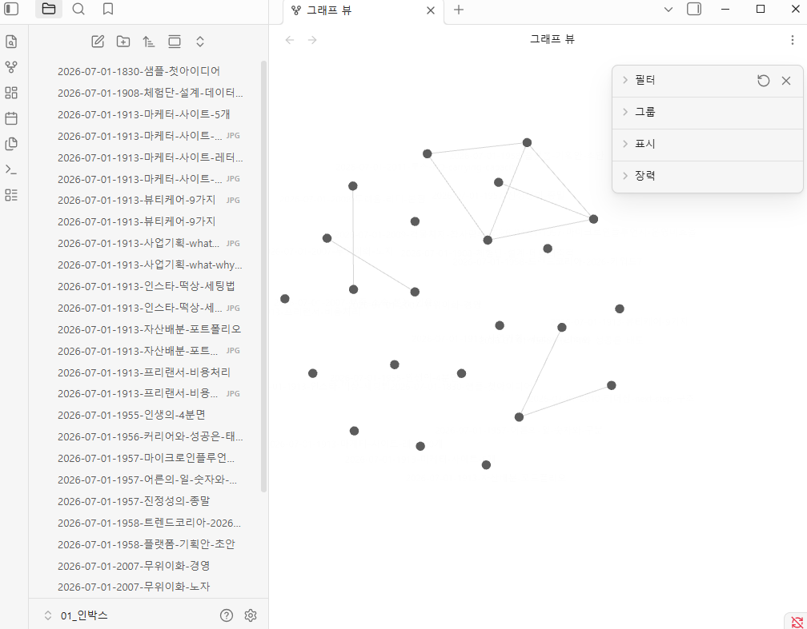
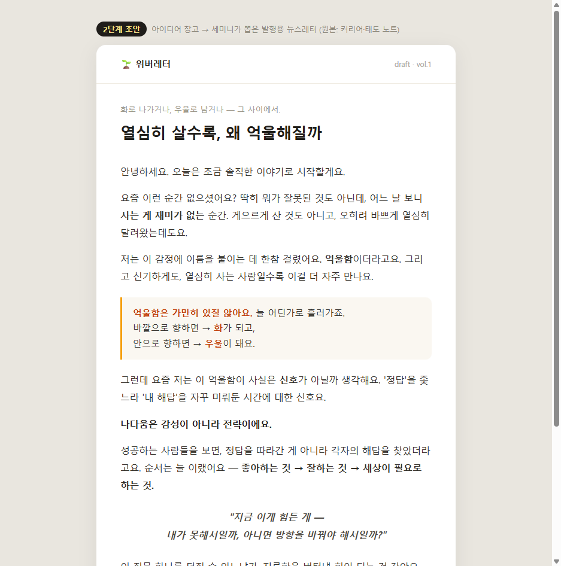
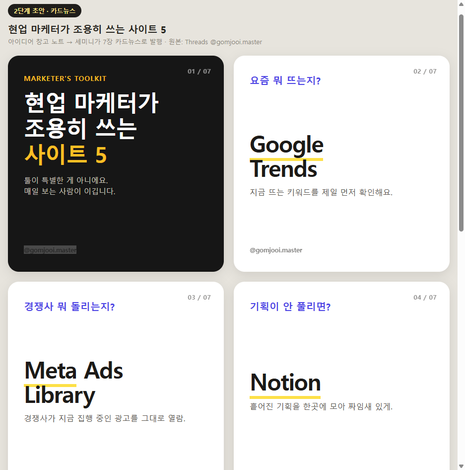

# 1주차 — 나만의 OS 만들기 🛠️

> 미션을 진행하며 **과정과 결과물**을 기록해주세요. (다 못 채워도 OK, 한 것 위주로!)

## 🎯 미션 1. 내 OS 재료 찾기
> 인터뷰 스킬(아이데이션)로 "내 삶에 필요한 게 뭔지" 찾기
- **과정 (어떻게 찾았나):** 인터뷰 스킬로 5스텝을 따라가며 하루의 마찰점을 찾음. 일 쪽(같은 포맷 메일을 클라이언트만 바꿔 보내기)과 삶/창작 쪽(흩어진 아이디어를 정리하는 담당자) 두 재료가 나왔고, 둘의 무게를 재서 창작 쪽을 OS가 도울 영역으로 정함.
- **결과:**

```
🟡 내 삶을 돕는 OS · 재료 카드

· 영역      : 삶 / 창작  (산만한 나를 위한 정리 담당자 → 창작 파트너)

· 걸리는 지점 : 떠오른 아이디어·문구·글귀가 메모앱 / 카톡 나에게 / 노션에
              흩어져, 정작 만들 때 어디 있는지 몰라 누락됨.
              포맷(카드뉴스·캐러셀·릴스·뉴스레터·블로그)별 기본 틀이
              없어 매번 0부터 다시 짬.

· 지금은    : ① 생각나면 여기저기 던져둠 → ② 만들 때 흩어진 걸
              다시 긁어모음(누락 多) → ③ 포맷에 맞게 맨바닥부터 정리

· OS가 된다면 : ① 어디에 던지든 한 창고로 모여 누락 제로
              ② "이건 카드뉴스로" 하면 포맷 틀에 얹어 초안 도출,
                 같은 아이디어도 여러 방향으로 변주

· 한 문장   : "흩어진 아이디어를 적합한 콘텐츠 툴로 생성하고,
              같은 아이디어도 여러 방향으로 생산해 아이데이션의
              퀄리티를 높인다"

· 첫 한 걸음 : 클로드 코드로 '아이디어 창고' 한 곳부터 —
              던져 넣으면 태그로 정리되는 채널 하나
```

- **느낀 점:** 두 재료(일 / 창작) 중 뭘 고를지 막막했는데, '가장 아픈 지점'을 기준으로 재니 창작 쪽 '누락'이 선명하게 남았다. 거창한 걸 새로 만들기보다, 이미 매일 겪는 마찰 하나를 없애는 게 진짜 내 OS의 시작이라는 걸 느꼈다.

## 🧩 미션 2. 내 OS 기획
> 인터뷰 결과 + 세션 내용(흐민·배짱·키노) 활용해 기획
- **기획 내용:**

```
3단계 로드맵

1단계 (지금)     : 아이디어 창고 하나 — 던지면 태그로 정리돼 안 새는 곳
                  (문구·글귀·링크·짧은 생각을 형식 무관하게 투척 →
                   자동 태깅: #카드뉴스감 #뉴스레터소재 #인용구 #나중에)

2단계            : 창고에서 꺼내 포맷 틀에 얹어 초안 뽑기
                  (카드뉴스·캐러셀·릴스·뉴스레터·블로그)

3단계 (전체 OS)  : 같은 아이디어를 여러 방향으로 변주 +
                  "이 영역 요즘 안 건드렸어요" 밸런스 얼럿
```

**1단계 목표 한 줄:** "생성"이 아니라 하나도 안 새게 모으는 것 — 제일 아픈 ②(누락)부터 없앤다.

- **막혔던 점 / 어떻게 풀었나:** 처음엔 '초안 생성'부터 만들고 싶었지만, 재료 카드를 다시 보니 제일 아픈 건 '누락'이라 1단계를 '생성'이 아니라 '하나도 안 새게 모으기'로 좁혔다. 구현 중엔 세션이 엉뚱한 폴더에서 돌아 저장 위치·권한이 꼬였는데, '창고 폴더에서 세션 켜기'로 규칙을 잡아 해결했다. (폴더 = 그 OS의 두뇌라는 걸 체감)

## ⚙️ 미션 3. 내 OS 구현
> 실제로 만들어본 것 (클로드코드 '채널' 기능 활용 OK)
- **결과물:** 클로드 코드 '채널' 기능으로 텔레그램 봇(Seminibot)과 로컬 세션을 연결해, **던지면 자동 분류·저장되는 아이디어 창고**를 실제로 만들었다.
  - **흐름:** 폰에서 텔레그램으로 투척 → 사고 파트너 '세미니'가 type(내생각/레퍼런스) + 포맷 태그(#카드뉴스·#릴스·#뉴스레터 등)로 분류 → 날짜별 MD로 저장 → Obsidian으로 열람.
  - 하루 만에 아이디어 20여 개가 자동 태깅되어 저장됨 (계속 늘어 현재 콘텐츠 25개 + 요리 레시피 5개) — **누락 제로** (1단계 목표 달성).
  - **조용한 파트너 모드:** 노트를 던지면 한 줄로 저장 확인, 말을 걸면 파트너로 대화.
  - **보안:** 봇 페어링 + 나만 쓰도록 잠금(allowlist) + 토큰 안전 저장.
  - **2단계 맛보기:** 저장된 노트를 꺼내 ① '커리어·태도 노트' → 발행용 **뉴스레터 초안**, ② '마케터 사이트 5' 노트 → **카드뉴스 7장**으로 발행.
  - → 1단계(안 새게 모으기) 완성. 2·3단계(포맷 초안 대량화, 밸런스 얼럿)는 다음 주.
- **링크 / 스크린샷:**






## 📱 미션 4. SNS 1주차 소감
> AI 도움 없이 직접 작성! (인증하면 셀 지급)
- **인증 링크:**
