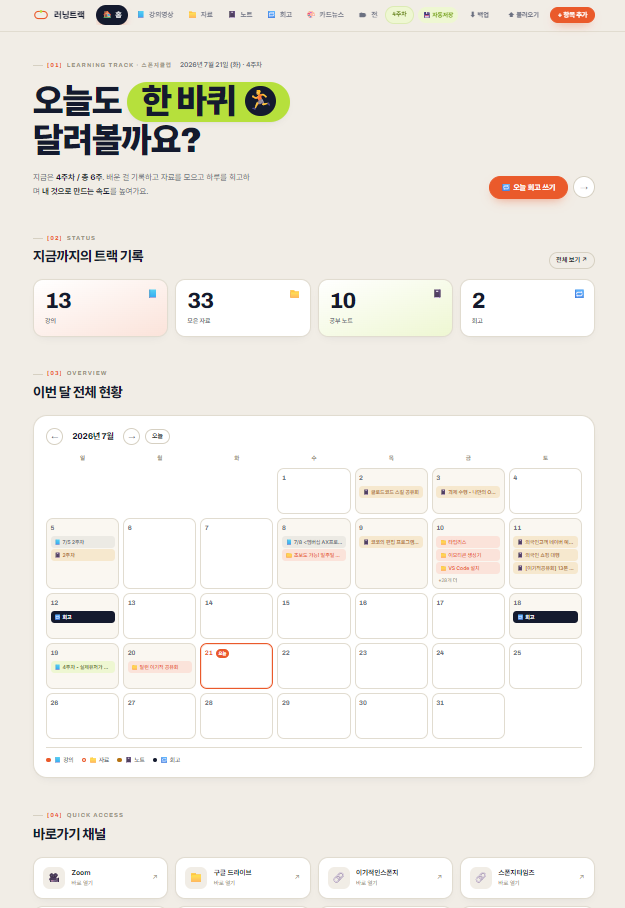
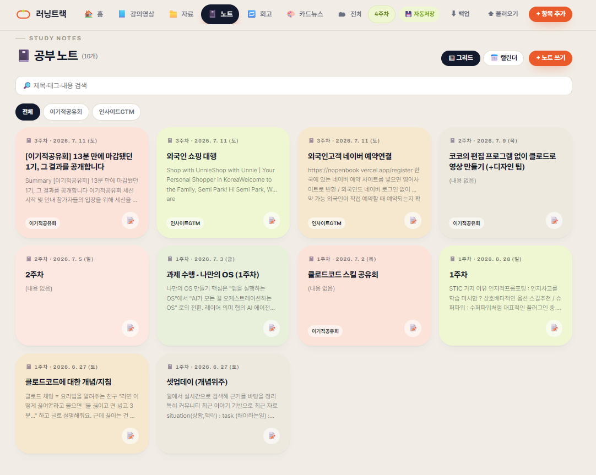
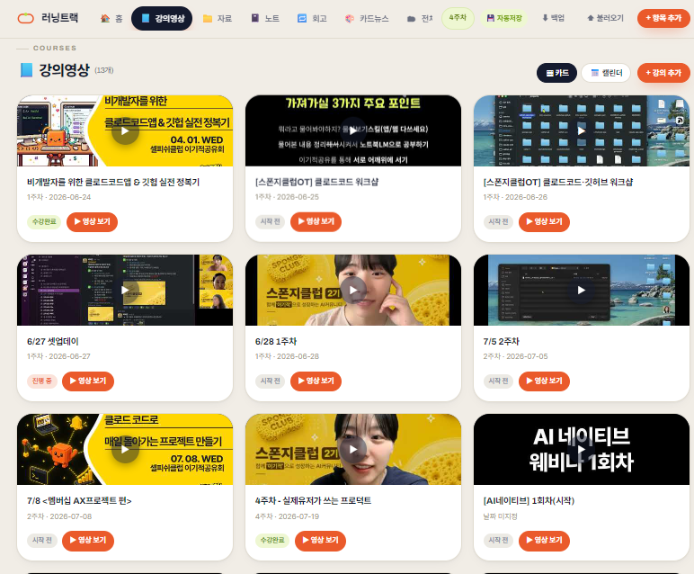
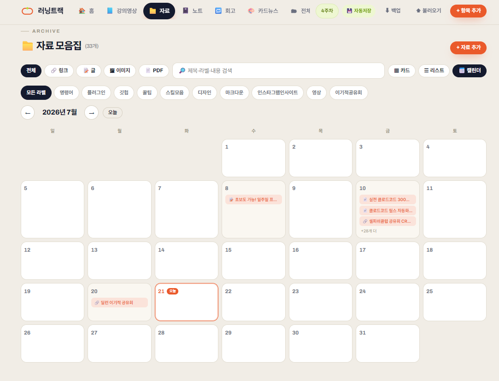
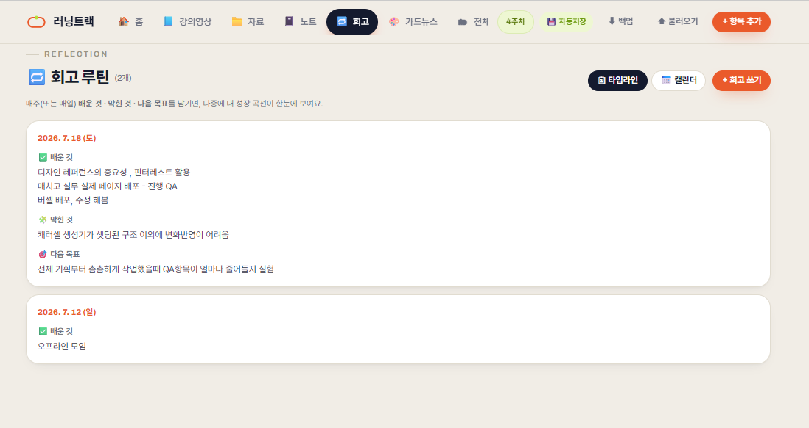
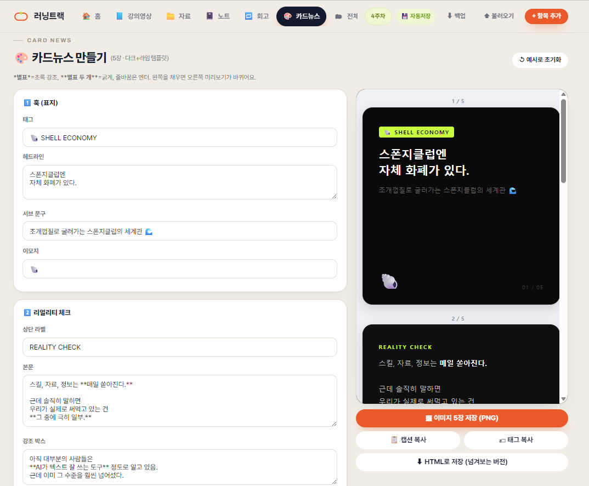

# 3주차 — 내 OS 최종 완성 🏁

> 미션을 진행하며 과정과 결과를 기록해주세요. (다 못 채워도 OK, 한 것 위주로!)

## 🎯 미션 1. 내 삶을 돕는 OS 최종 완성
> 지금까지 공유하며 받은 **피드백을 반영해 최종 완성**!

### 🧭 이 OS는 뭘 위한 것인가 (목표 · 페르소나)

**목표 — "6주 몰입 기간 동안, 툴을 옮겨다니느라 새는 힘을 없애기."**
출발점 자체가 *구글시트·노션·슬랙·트렐로·줌을 왔다갔다 하는 게 진짜 페인*이었다. 그래서 이건 단순 노트앱이 아니라, 강의·자료·기록·회고를 한 곳에 모아 **"어디에 뭘 넣을지 고민하는 시간 자체를 없애는" 본진(base camp)**이다. 노션에 이미 있는 자료를 굳이 옮기지 않고 링크로 열게 한 것도 같은 이유 — "다 여기 있어야 한다"가 아니라 **"결정 피로를 줄이는 게" 목표**였다.

**페르소나 — "매일 한 바퀴씩 도는 러너".**
이름을 **러닝트랙(Learning Track)**으로 바꾸며 콘셉트가 뚜렷해졌다. 완벽한 완주가 아니라 **꾸준한 페이스를 응원하는 러닝메이트**에 가깝다.
- "오늘도 한 바퀴 달려볼까요 🏃" 히어로 문구
- 주차(週) 단위로 진행률을 세는 구조
- 회고를 "배운 것·막힌 것·다음 목표" 3줄로 가볍게 (완벽한 리포트가 아니라 짧은 체크인)
- 색도 오렌지(액션)·라임(GO·진도)로 "지금 움직이고 있다"는 느낌

→ 냉정한 관리도구라기보다, **옆에서 페이스 맞춰주는 러닝메이트** 같은 OS다.

- **완성한 것 (무엇을):**

  2주차의 통합 학습 대시보드(**AI 공부 본진**)를 **러닝트랙**으로 이름부터 새로 잡고, "매일 열고 싶은 학습 OS"로 완성했다. 스폰지클럽 6주 캠프의 흩어진 강의·자료·노트·회고를 한 곳에 모아 매일 여는 개인 학습 관리 도구다. 홈에서는 강의·자료·노트·회고 4개 영역을 **한 달력에 색으로 구분해 한눈에** 볼 수 있다. (단일 `AI공부본진.html` + 로컬 저장 서버 `study-hub-server.js`로 동작, 오프라인 사용 가능.)

  **6개 탭:** 🏠 홈 · 📹 강의영상 · 📁 자료 · 📝 노트 · 📓 회고 · 🎨 카드뉴스
  **실제 누적(4주째 매일 사용 중):** 강의 13 · 모은 자료 33 · 공부 노트 10 · 회고 2

  **이번 주(토크데이 7/12 이후)에 새로 하거나 바꾼 것:**
  - **① 공부 노트 — 일지형 + 이미지 자동 저장.** 날짜순으로 쌓이는 일지형 노트로 정리하고, 노션 화면 등을 캡처해 붙여넣으면 **이미지를 실제로 내려받아 저장**하게 했다. (원본 링크가 나중에 만료돼도 안 깨진다.)
  - **② 회고 탭 + 오늘의 한마디.** 하루 마무리로 `✅ 배운 것 / 🧩 잘한 것 / 🎯 다음 목표` 3칸을 남기는 회고 탭을 신설하고, 홈에 매일 바뀌는 문구 배너를 추가했다.
  - **③ "읽기 먼저, 수정은 버튼으로" 뷰어.** 이미 입력한 항목·자료·노트를 클릭하면 **편집창이 아니라 읽기 화면(뷰어)이 먼저** 뜨고, ✏️수정을 눌러야 편집창이 열린다. (실수로 내용이 바뀌는 걸 막았다.) 강의는 썸네일 카드형으로, 자료는 카드 ↔ 리스트 **보기 전환 버튼**을 붙였다.
  - **④ 카드뉴스 생성기.** 내가 쓰는 다크+라임 톤 5장 카드뉴스 디자인을 도구에 내장. 내용만 넣으면 **훅 → 리얼리티 → 목록 → 인용 → CTA** 5장(1080×1080 정사각형)이 오른쪽에서 실시간 미리보기로 뜨고, 버튼 한 번에 **PNG 5장 저장 · HTML 저장 · 캡션/해시태그 복사**까지 된다.
  - **⑤ 러닝트랙 전면 리디자인.** 대시보드 느낌에서 **실제 서비스 사이트 느낌**으로. 콘셉트는 learning(배움)·running(달리기)·ML을 엮은 *"오늘도 한 바퀴, 배움을 달린다"* — 브랜드 색(오렌지 #EA5A2B·라임 #B6E03C·인디고 #141A2E), 로고·파비콘(트랙 + 라임 러닝 점), 상단 브랜드 헤더 배너, 사이드바 → 상단 가로 메뉴.

- **피드백 반영한 점:**

  이번 주 피드백은 대부분 **직접 4주째 매일 쓰다가 걸린 것**에서 나왔다 — 안 썼으면 안 보였을 것들이라, 실사용이 곧 피드백이었다.
  - **"글씨가 다 네모로 깨져 보인다"** → 이 PC에 폰트가 없어서였다. **웹폰트(Pretendard 본문 + Archivo 영문·숫자)로 교체**해 해결.
  - **"저장 서버 꺼진 줄 모르고 입력하다 데이터가 사라졌다"** → 화면에 **빨간 경고 배너 + 자동 재연결**을 붙여, 저장 안 되는 상태를 바로 알 수 있게 했다.
  - **"localStorage 5MB 한계로 데이터가 커지면 위험하다"** → 저장을 **로컬 서버 + 파일(JSON)** 방식으로 전환해 용량 걱정을 없앴다.
  - **"붙여넣은 웹 이미지가 나중에 깨진다"** → 붙여넣은 이미지를 **자동으로 다운로드해 저장**하도록 고쳤다.
  - 그 외 모달이 실수로 닫히는 버그·백업 복원 실패 등 여러 건 수정.

- **결과물 (링크·스크린샷 — 이미지는 `이미지첨부/` 폴더에):**

  로컬 단일 페이지 대시보드(`AI공부본진.html` + `study-hub-server.js` + `AI공부본진-데이터.json`). *지금은 로컬 전용이라 공개 링크는 없음 — 웹 배포는 다음 할일.*

  **① 홈 — 학습 현황 + 통합 캘린더** (강의 13·자료 33·노트 10·회고 2, 6/24부터의 학습 발자취를 색으로 구분)
  

  **② 공부 노트** — 날짜순 일지형, 컬러 카드 그리드 + 태그·검색
  

  **③ 강의영상** — 유튜브 썸네일 자동, 카드/캘린더 보기
  

  **④ 자료 모음집** — 링크·글·이미지·PDF를 라벨·주차·생성일로 정리, 카드↔리스트 전환
  

  **⑤ 회고 모음집** — "배운 것·잘한 것·다음 목표" 3줄 루틴
  

  **⑥ 카드뉴스 생성기** — 내용만 채우면 5장 카드뉴스 → PNG/HTML/캡션 내보내기
  

- **🔜 다음 할일 (아직 안 된 것 — 정직하게):**
  - **텔레그램 → 노트 연동**: 폰에서 `노트: …` 한 줄이면 자동 저장되게 서버(`/api/note`)를 **만들고 테스트까지 마쳤다.** 다만 실제로 쓰려면 저장 서버 외에 텔레그램 채널 세션을 따로 띄워야 해서, **실사용 검증만 남았다.**
  - **웹 배포(Vercel 등)** — 지금은 로컬 전용. 어디서나 열리게 배포.
  - **PDF·원본 파일 저장** — 지금은 링크 형태로만 저장(서버 인프라는 이미 있어 어렵진 않음).
  - **출구 하나** — 쌓인 공부·자료가 **실무(운영/PM) 인사이트 한 줄로 나오는 통로**. 지금은 입력·정리에 강한데, 출력이 약하다.
  - (여유되면) 카드뉴스 여러 개 저장·세로형(1080×1350) 옵션, 6주 진행률 바, 복습 리마인드.

- **알게 된 인사이트:**
  - **"기능"보다 "매일 열고 싶은 이유"가 OS를 살린다.** 흩어진 걸 **한 화면(통합 현황판·캘린더)**으로 모으니 비로소 매일 열게 됐다. 아무리 기능이 많아도 열 이유가 없으면 안 쓴다.
  - **매일 쓰니 진짜 할 일이 보였다 — 실사용이 곧 로드맵.** 폰트 깨짐도, 데이터 유실도 안 썼으면 안 보였다. 안 쓰는 앱엔 개선 목록조차 안 생긴다.
  - **화려한 기능보다 "안 깨지고 안 잃는" 게 먼저였다.** 데이터 유실 경고·자동 재연결·백업 복구 같은 안정성 작업이, 새 기능 하나보다 훨씬 값졌다.

## 📣 미션 2. 스폰지 토크데이 SNS 후기
> 오늘 토크데이 후기를 SNS에 올리기 (**#스폰지클럽 필수 · 셀 3개 지급!**)
- **후기 내용:** 토크데이 후기를 인스타그램에 게시 (#스폰지클럽) — 아래 링크
- **SNS 인증 링크:** https://www.instagram.com/p/Da4hSo9kxJr/
