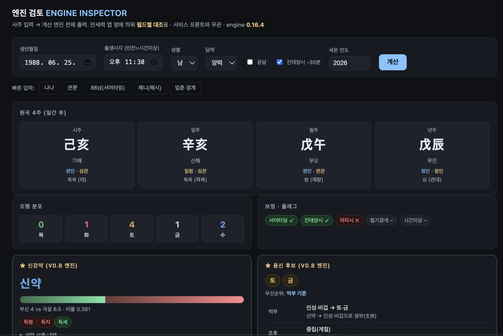
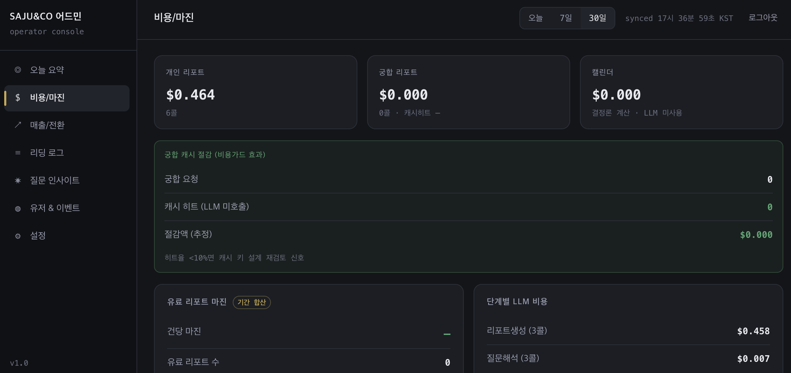

## 결과물

> 이번 주에 실제로 만든 것·완성한 것을 적어주세요. (링크, 스크린샷, 데모 등)
1.사주 엔진 강화

2.도메인 변경 
사주+미스터킴은 상표등록이 어렵다. 
사주앤코로 변경. 
www.saju.kim -> www.sajunco.com

3.어드민 구축 

4. 캐릭터 정교화 디밸롭

## 삽질 과정

캐릭터를 디벨롭 해도 제자리. 
지피티의 캐릭터 만들기는 되돌이표인가? 
젠스파크 결제 고민 시점. 
과한 3D 모델링은 오히려 캐릭터를 죽이는 것.
신나게 디벨롭했으나, 다시 되돌이표 
과한건 좋지 않다. 

사주엔진 정교화를 위해 달리고 달렸다. 
하지만......
이게 맞는가?
내가 판매하고 싶은게, 아주 정교한 사주리딩인가? 

> 막혔던 지점, 시도한 방법, 해결 과정을 솔직하게 적어주세요.

## 인사이트

> 이번 주에 배운 것·깨달은 것을 한 줄로 정리해주세요.

이 비즈니스의 최종 목적은 사주 리딩이 아닌 캐릭터 판매다. 
목표를 분명하게 생각하자. 
내가 사주리딩을 완벽하게 만들 수는 없다. 
포장을 잘해서 판매하는 방향이 맞다. 
