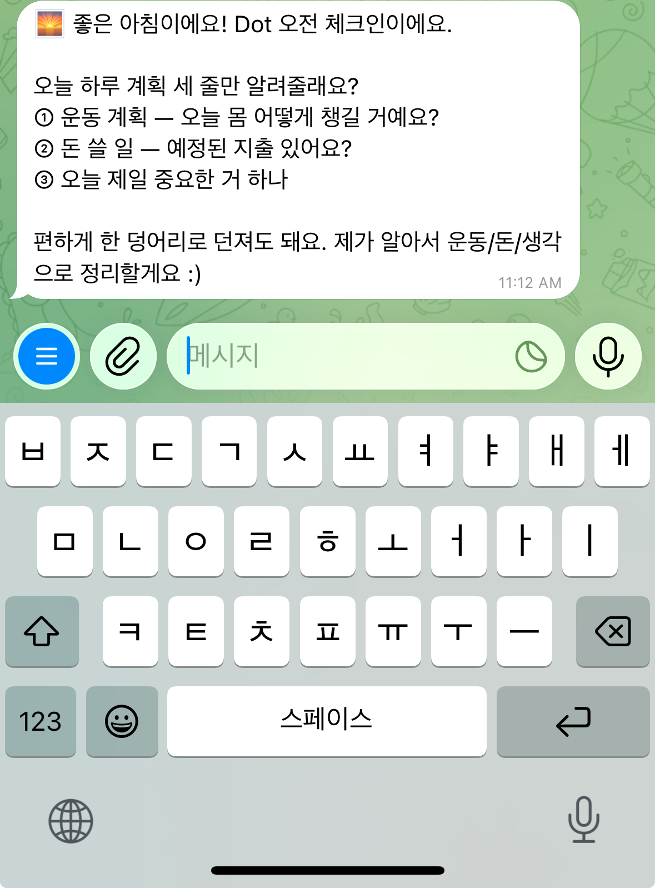

# 1주차 — 나만의 OS 만들기 🛠️

> 미션을 진행하며 **과정과 결과물**을 기록해주세요. (다 못 채워도 OK, 한 것 위주로!)

## 1주차 — 나만의 OS 만들기 🛠️

> 미션을 진행하며 **과정과 결과물**을 기록해주세요. (다 못 채워도 OK, 한 것 위주로!)

 

## 🎯 미션 1. 내 OS 재료 찾기

> 인터뷰 스킬(아이데이션)로 "내 삶에 필요한 게 뭔지" 찾기

**과정 — 인터뷰 스킬 5단계로 진행**

1. **오늘 하루** · 시간 제일 많이 쓴 일 → 강의 커리큘럼 · 워크샵 운영 · 유닛 사이트
2. **짜증 포인트** · 매번 손 가는 것 → 워크샵 안내·리마인드
3. **일 밖의 나** · 챙기고 싶은데 놓치는 것 → 운동·수면 · 생각 정리 · 돈 관리
4. **무게 재기** · 일 vs 삶 → **'삶' 선택**. 지금은 셋 다 기록이 안 남음 (운동=감 · 생각=머릿속 · 돈=그냥 씀)
5. **OS가 된다면** · 하루 한 번 묻고 월마다 정리

> 💡 한 문장: **"운동·생각·돈이 알아서 기록되는 삶"**

**결과 — 내 OS 재료 카드**

- **영역** · 삶 (몸·생각·돈을 챙기는 데일리 OS)
- **걸리는 지점** · 운동·생각·돈 셋 다 그때그때 잊어버린다 — 남길 자리가 없다
- **지금은** · 운동은 PT 하고 나면 끝 / 생각은 정리할 시간조차 없음 / 돈은 그냥 씀
- **OS가 된다면** · 하루 한 번 툭 물어봐주고 → 답하면 → 월마다 한 장으로 정리
- **첫 한 걸음** · 텔레그램 채널로 '데일리 체크인' 하나 만들기

**느낀 점**

혼자 빈칸을 채우려니 막막했는데, 보기를 펼쳐주니 안 떠오르던 게 골라졌다. 내가 못 떠올린 선택지까지 보여주는 것 - 인터뷰 스킬을 통해 다시 한 번 생각하지 못한 부분까지 생각하게 됨

 

## 🧩 미션 2. 내 OS 기획

> 인터뷰 결과 + 세션 내용(흐민·배짱·키노) 활용해 기획

**기획 내용** — 이름은 **Dot**, 매일의 점(dot)을 찍어 나중에 선으로 잇는 기록 파트너

- **하루 2번 체크인** · 🌅 오전(하루 계획) → 🌙 저녁(실제로 했는지 + 오늘 생각). '계획→실행' 루프로 단순 일기가 아니라 약속 지킴 체크가 된다.
- **3카테고리 자동 분류** · 운동·건강 / 돈 / 생각. 한 덩어리로 던지면 Dot이 알아서 쪼개 저장, 빈 칸만 한 번 되묻는다.
- **3단계 로드맵** · ①담는다 → ②아무 때나 툭 던지면 분류 → ③월말 자동 요약
- **흐민 세션 각색** · 흐민의 5단계 루프(인풋→저장→연결→제안→발행)를 내 버전으로. "생각을 자산으로"(흐민) → **"하루를 나에 대한 데이터로"**(나)

**막혔던 점 / 어떻게 풀었나**

텔레그램 발신(봇→나)은 되는데 수신(나→봇→세션)이 안 됐다. 원인은 흐민 세션에도 나온 그 조건 — 수신 전용 `claude --channels` 세션이 안 떠 있었던 것. 터미널에서 daily-os 폴더로 이동해 채널 모드로 실행하니 **"Listening for channel messages"**가 뜨며 수신이 시작됐다. "봇 = 특정 세션에만 연결된 전용 통로"라는 개념을 몸으로 이해했다.

 

## ⚙️ 미션 3. 내 OS 구현

> 실제로 만들어본 것 (클로드코드 '채널' 기능 활용 OK)

**결과물** — `daily-os/` 폴더로 실제 작동하는 데일리 OS

- `README.md` · OS 전체 설명 (Dot · 2번 체크인 · 3단계 로드맵)
- `AGENT.md` · Dot의 분류·저장 규칙
- `운동-건강.md` / `돈.md` / `생각.md` · 날짜별 기록 아카이브

**작동 확인** · 폰에서 danibot에 하루 얘기를 자연어로 던지면 → Dot이 운동/돈/생각으로 자동 분류 → 파일에 오늘 날짜로 기록. 실제로 쌓이는 것까지 확인 완료.

- 터미널 "Listening for channel messages" 화면
- 텔레그램에서 던진 메시지가 파일에 쌓인 화면

## 📱 미션 4. SNS 1주차 소감
> AI 도움 없이 직접 작성! (인증하면 셀 지급)
- **인증 링크:**
