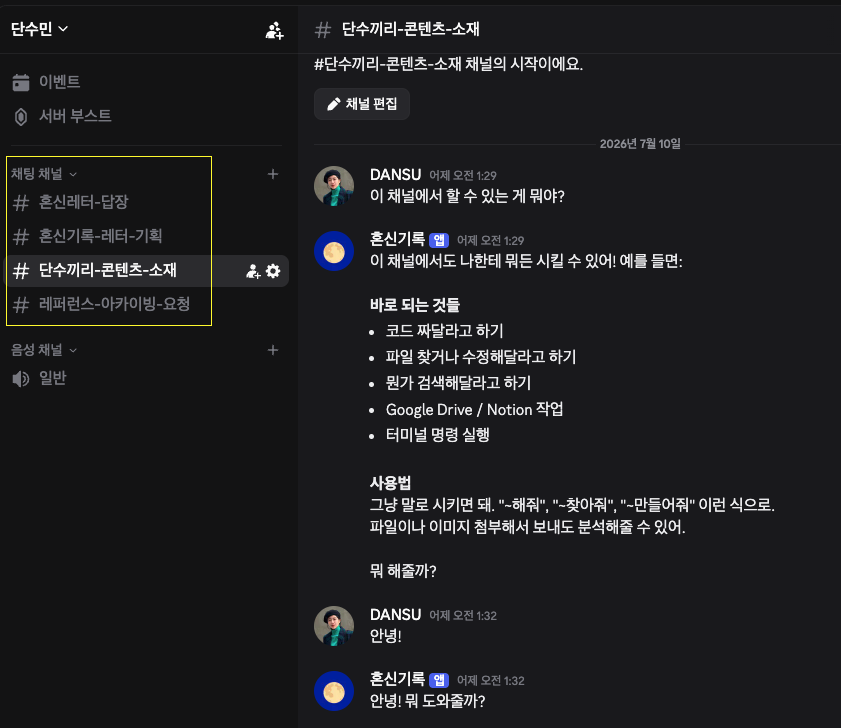

# 2주차 — 내 OS 구현하기 🚀

> 미션을 진행하며 **기획 → 구현 → 삽질 → 결과물 → 인사이트** 를 상세히 기록해주세요.
> (다 못 채워도 OK, 한 것 위주로!)

## 🎯 미션 1. 내 OS 만들기
> **[ 내 삶을 돕는 OS ]** 또는 **[ 콘텐츠 OS ]** 중 하나를 선택해 완성해주세요.

**✅ 선택:** 콘텐츠 OS

### 📐 기획

OS의 토대가 될 소통 창구, **'채널' 세팅**부터 시작함. 텔레그램 → 디스코드로 일원화하고, 용도별로 채널 3개를 구성 중.

| 채널 | 역할 | 플로우 |
|---|---|---|
| ① 혼신기록 레터 기획 채널 | 레터 소재 → 초안 → OSMU 확장 | 레터 주제 입력 → 노션의 혼신기록 글 소재 DB와 연결해 참고 → **레터 작성 스킬**로 기획 개요 PRD 문서 작성 → 컨펌받으면 롱폼 레터 작성 → 브런치용 / 인스타 피드용 / 스레드용으로 채널별 스타일에 맞게 베리에이션 |
| ② 단수끼리 콘텐츠 소재 채널 | 숏폼 애니메이션·공감짤 아이디어 아카이빙 | 아이디어를 말하면 원문과 함께 스토리보드(컷 장면·시나리오)로 커버업해서 노션에 저장 (※ LLM 위키로 관리할지는 아직 미정, 참고 단계) |
| ③ 레퍼런스 아카이빙 요청 채널 | 링크·자료·이미지 분류 저장 | 자료를 입력하면 내용에 맞게 분류해 노션에 정리 (※ 마찬가지로 LLM 위키 여부 미정, 참고 단계) |

### ⚙️ 구현

- 텔레그램 → 디스코드로 채널 전환 완료 (설치 과정은 비슷하지만 세부는 다름)

### 🧗 과정에서의 삽질

**1. 막혔던 지점 — "어떤 OS를 만들어야 할지 모르겠다"**

혼신기록 콘텐츠 제작 전 과정에 고정값을 세팅해서 일관성 있게 뽑아내는 OS를 만들고 싶은데, 범위 자체가 안 잡혔음.
- 내 콘텐츠 제작용 OS인지, 구독자용 OS인지조차 불확실
- 노션 vs 옵시디언(MD 파일), LLM 위키가 필요한 구조인지 판단이 안 섬
- 디스코드 기반 시스템 / 자체 웹·앱 SaaS / 어드민 체계화 중 어떤 구조로 가야 할지 감이 안 옴
- 비히브가 콘텐츠 '쓰기' 권한까지 지원하는 MCP 기능을 준비 중인데, 유료 전환 시 1,000명 기준 $49, 2,500명 이하 $69(약 8만원)라 부담됨 → 차라리 클로드코드로 A-Z 자체 개발(GA·히트맵·상세페이지·커뮤니티 확장까지)하는 게 나을지 고민

**2. 어떻게 풀었나 — 레이어를 나눠서 정리**

고민을 정리해보니 "하나의 OS"가 아니라 이미 4개 레이어가 자연스럽게 나뉘어 있었음.

| 레이어 | 범위 | 지금 상태 |
|---|---|---|
| ① 소재 저장 | 노션 아이디어 DB | 이미 구축됨, 문제없음 |
| ② 제작 파이프라인 | 레터 → 대본 → 피드 변환 (클로드 스킬) | 레터 스킬만 진행 중, 나머지 미착수 |
| ③ 발행·배포 | 비히브 / 유튜브 / 인스타 업로드 | 수동, 미러링만 자동화 대상 |
| ④ 구독자 마케팅 | 미끼자료 DM 자동화 | 아직 손대지 않음 (지금 단계엔 맞는 판단) |

지금 가장 막혀 있던 곳은 ①(소재 저장)이 아니라 **②(제작 파이프라인)**이었음. 노션 아이디어 DB는 이미 브랜드별로 잘 쌓이고 있어서, 여기에 LLM 위키 같은 인프라를 새로 얹는 건 문제 없는 곳에 힘을 쏟는 셈이었음.

- **노션 vs MD, LLM 위키 필요한가 →** 필요 없음. 이미 브랜드별 폴더로 저장 중이라 분류 문제 자체가 없고, 플랫폼 전환은 "한 번 세팅하면 안 바꾸고 싶다"는 원칙과도 안 맞음. 대신 노션 API/MCP를 클로드 프로젝트에 연결해서, 레터 초안 쓸 때마다 복붙하지 않고 클로드가 노션 DB를 직접 조회하게 하는 정도면 충분.
- **텔레그램/디스코드/웹앱/어드민, 어떤 구조로 가야 하나 →** 지금 단계에서 새로 만들 필요 없음. 수익화는 500 opens + 100 순수 응답을 넘기기 전까지 보류하기로 이미 정해뒀고, 웹앱·어드민은 그 이후 단계(상품 판매 인프라)에 가까움. 지금 필요한 건 "구독자용 서비스"가 아니라 "제작자용 파이프라인"이고, 이건 웹앱이 아니라 클로드 프로젝트 + 스킬 몇 개로 충분.
- **클로드코드로 A-Z 자체 개발이 나을까 →** 자체 SaaS는 만드는 것보다 유지보수 비용(결제·보안·버그 대응)이 훨씬 큼. 이미 아임웹+비히브(letter.honsin.com CNAME) 구조가 계획돼 있어서, "검증 후 확장" 원칙에 맞는 선택은 지금은 그쪽. 자체 개발의 장점(상세페이지 AI 작성, 커뮤니티 확장)은 실재하지만 상품 런칭 이후, 수익 구조가 자리잡은 다음에 재검토할 영역으로 남겨둠.

**3. 아직 진행 중인 부분**
- 텔레그램에서 디스코드로 전환 완료 (설치 과정은 비슷하나 세부는 다름)
- SNS뚝딱 유닛 활동을 시작해서 LLM 위키·헤르메스를 학습하며, 그 과정에서 자연스럽게 다음 판단 기준이 잡힐 것으로 기대 중

### ✅ 결과물

고민을 정리한 결과, 이번에 만들 "OS"의 범위를 확정함.

**혼신기록 제작 파이프라인 = 클로드 프로젝트 스킬 세트 (3개)**
1. 레터 스킬 (진행 중) — 초안 → PRD → 작성
2. 유튜브 대본화 스킬 (끼리PD 문답 방식) — 레터 골격 → 대본
3. 인스타 피드화 스킬 — 레터 내용 → 캐러셀 (디자인 시스템 MD 필요)

이 세 개가 순차적으로 완성되면 레터 발행 전후의 반복 수작업이 상당 부분 줄어듦. 컷백/캡컷 영상 편집이나 매니챗 마케팅 자동화는 우선순위표상 3순위("조심스럽게")라 이번 단계에서는 손대지 않기로 함.

### 💡 알게 된 인사이트 & 공유하고 싶은 내용
- "OS를 만들고 싶다"는 마음만으로는 범위가 안 잡힌다. 내가 하고 있는 일을 레이어(소재 저장 / 제작 파이프라인 / 발행·배포 / 마케팅)로 쪼개봐야 "지금 진짜 막힌 곳"이 어딘지 보임.
- 이미 잘 작동하고 있는 부분(노션 아이디어 DB)에 새 인프라를 얹으려는 유혹이 있었는데, "문제 없는 곳에 힘 쏟지 않기"가 판단 기준이 됨.
- 지금 만들어야 할 건 "구독자용 서비스"가 아니라 "제작자용 파이프라인" — 이 구분을 하고 나니 웹앱/SaaS/어드민 같은 큰 구조 고민을 다 내려놓을 수 있었음.

## 📣 미션 2. 유닛 활동 참여 & SNS 공유
> 유닛 활동에 적극 참여(유닛원으로서 or 참가자로서)한 뒤, 그 경험을 SNS에 올리기

- **참여한 유닛 / 활동:** SNS뚝딱 유닛
- **무엇을 했나 (경험):** 아직 OT만 참여함
- **SNS 인증 링크:** (해당 없음)
