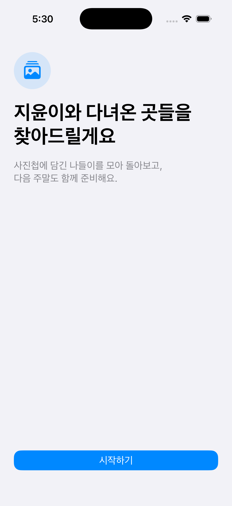
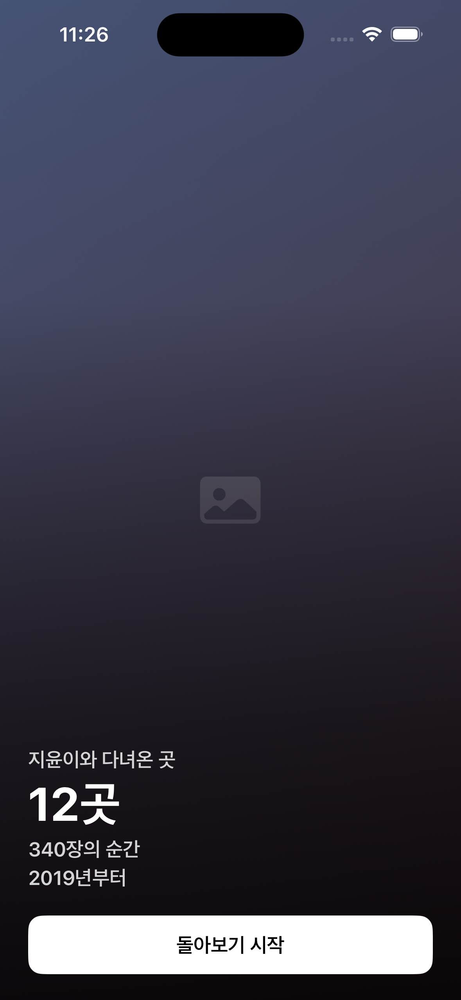
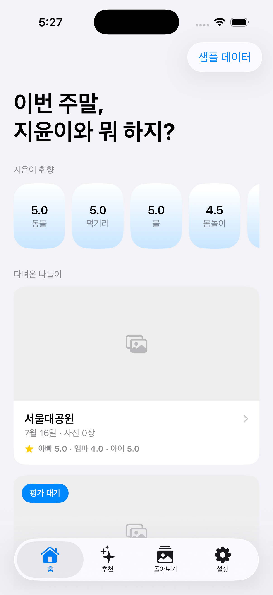
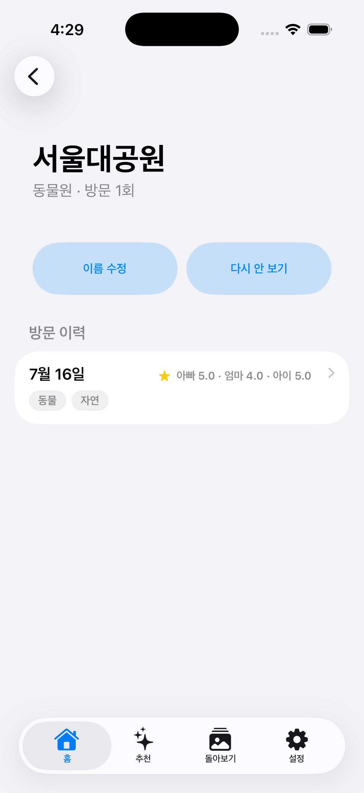

# 4주차 — 기획·구현 → 검증 → 기록 🧪

> 이번 주 나의 OS는 **Savior**. 웹앱만 만들다 처음으로 **네이티브 SwiftUI 앱**을 만들어 **내 아이폰에 실제로 설치**했다.

## 🎯 과제 1. PRD 기획 및 구현

- **주요 가치:** 8살 딸(지윤)과의 주말을 못 챙기던 문제를 푼다. 멀티태스킹이 약해 늘 급하게 고민하고 제대로 된 추억을 못 쌓는 게 문제였는데, **이미 사진첩에 답이 있었다** — 즐거웠던 나들이는 다 사진으로 남아 있으니까. 사진첩 GPS·촬영일로 과거 나들이를 자동 발굴 → 아빠·엄마·아이 별점으로 취향을 쌓고 → 그걸 근거로 주말 나들이를 추천. **사진은 기기 밖으로 절대 안 나간다(메타데이터만 읽음).**
- **페르소나:** 나 자신. 아이와 주말을 보내고 싶지만 뭘 할지 매번 백지에서 고민하는 아빠. 사진은 아이폰 사진첩 + 구글 포토에 다 있고, 계획은 늘 즉흥이라 후회가 남는다.
- **소구 방식:** "새로 계획하지 말고, 잘 놀았던 걸 다시." 이미 찍어둔 사진이 곧 데이터 → 등록·입력 부담 0. 첫 실행의 **"발굴 리빌"**(찾은 나들이 사진들이 흐르며 "지윤이와 다녀온 곳 · 12곳 · 340장의 순간 · 2019년부터")로 감동을 먼저 주고 시작.
- **구현한 것:** 증분 4단계로 쪼개 굴렸다.
  - **① 브라우저 목업으로 감각 먼저 확정** — 코드 전에 조작 가능한 목업 6화면을 아이폰에서 눌러봄. 디자인을 웜톤 → TVING 다크 → stayfolio → **최종 애플 네이티브 HIG**까지 여러 번 갈아엎음(코드보다 목업에서 싸게).
    - 목업(아이폰에서 조작 가능): [발굴 온보딩 목업](https://claude.ai/code/artifact/da9de3bb-a16a-499c-9cc1-62352181f17b)
  - **② 네이티브 앱(증분 1)** — PhotoKit 메타데이터 스캔(픽셀 미접근), 나들이 클러스터링(순수 로직 + 단위 테스트: *주말·공휴일 + 집 반경 1km 밖 + 같은 장소 3장↑*), SwiftData 저장 + 10초 평가(아빠·엄마·아이 별점) → 취향·근거 자동 계산. **내 아이폰 진짜 사진첩으로 나들이 186개 발굴됨.**
  - **③ 온보딩 리디자인(증분 1.1)** — 진행바로 끝나던 스캔을 "발굴 리빌" 히어로로. 집 위치는 지도 핀 대신 장소 검색.
  - **④ 카카오 로컬 API로 장소명(증분 1.2)** — "보라동"(행정동) 대신 "한국민속촌" 같은 실제 장소명을 붙이는 중.

  | 온보딩 환영 | 발굴 리빌 | 홈(취향·나들이) | 장소 상세 |
  |---|---|---|---|
  |  |  |  |  |

  *(스크린샷은 시뮬레이터 + 샘플 데이터 — 지윤이 실제 사진 대신 그라데이션 placeholder라 개인정보 걱정 없음)*

## 🗣 과제 2. 유저 피드백 받기

- **실제 유저 피드백:** 아직 개인용(사용자=나 1인)이라 외부 테스터 대신 **내가 직접 실기기 도그푸딩**으로 검증했다. 실사진으로 굴려보니 시뮬레이터에선 안 보이던 피드백이 쏟아졌다 — ①돌아보기·장소 사진 그리드가 깨짐(제각각 비율의 실사진) ②발굴 리빌 사진이 세로로 늘어남 ③리빌 텍스트가 내 폰(좁은 화면)에서 왼쪽 잘림 ④장소명이 관광지가 아니라 동 이름. 전부 고쳤거나 고치는 중. *(정식 사용자 2명 이상 인터뷰는 다음 주 과제로 — 지금은 가족 n=1 단계라 솔직히 미완.)*
- **가상 페르소나 피드백:** 같은 처지의 워킹대디 페르소나에게 물어본다면 — "계획 세우는 게 제일 귀찮은데 이미 찍은 사진으로 알아서 찾아주는 게 좋다. 다만 **장소가 '보라동'이면 어딘지 모르겠고 '한국민속촌'이라고 떠야 와닿는다**"(→ 실제로 이게 카카오 API 도입의 계기). "평가가 10초 안에 끝나야 계속 쓸 듯."
- **피드백에서 알게 된 것:** **"된다"와 "내 폰에서 된다"는 완전히 다른 말.** 진짜 데이터로 굴려봐야 진짜 문제가 보인다.

## 📣 과제 3. SNS 기록 남기기

- **기록 내용 (소회):** 이번 주 제일 큰 배움은 **실기기 도그푸딩의 위력**이었다. 시뮬레이터에선 4단계 리뷰를 다 통과했는데, 아이폰에 처음 깔자마자 실사진·실좌표·실화면 크기에서만 나오는 버그가 우수수 나왔다. 그리고 **코드 전에 목업으로 감각을 먼저 확정**한 게, 디자인을 네 번 갈아엎으면서도 헛구현 없이 넘어가게 해줬다. 막히면(구글 포토 API·애플 지도 POI) 붙잡지 말고 도구를 바꾸는 게 빨랐다(→ 아이폰 PhotoKit, → 카카오 로컬 API).
- **SNS 인증 링크:** _(발행 후 추가 예정)_
