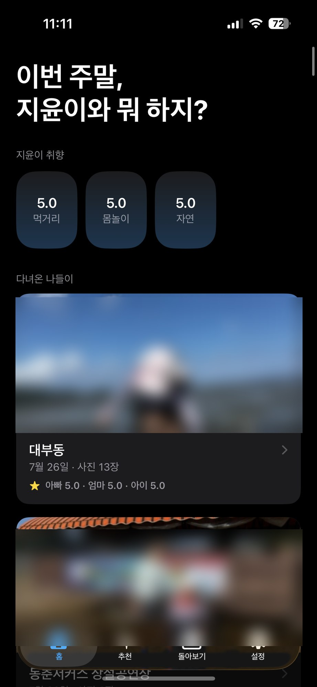
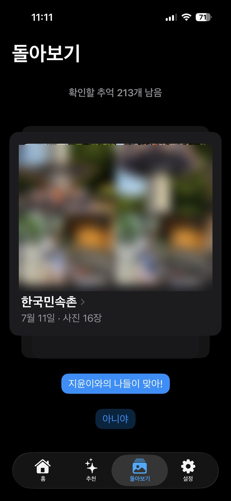
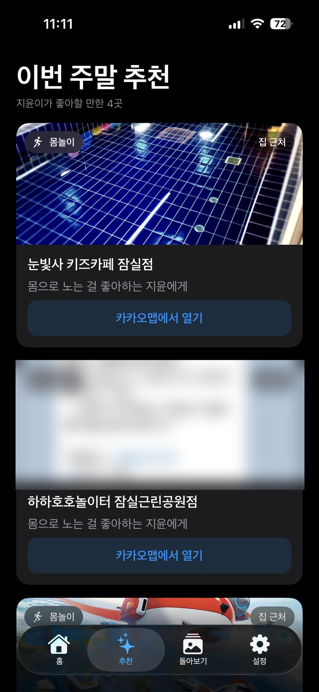

# 5주차 — 마지막 과제 🏁

> 이번 기수의 마지막 과제예요. 과정과 소회를 기록해주세요. (다 못 채워도 OK!)

## 🎯 과제 1. 구현, 그 다음의 것

> 만드는 건 끝났는데 — 그 다음이 진짜 시작이에요 (답이 안 나와 있어도 OK, 고민을 꺼내놓는 것 자체가 과제)

- **지금 걸려 있는 고민 하나:** 추천 품질을 "진짜 지윤이에게 맞게" 한 단계 더 끌어올리는 것. 이번 주에 '아이 기준' 필터(카테고리 화이트리스트 + 키즈 키워드)로 크게 좋아졌고, 실제로 "눈빛사 키즈카페"·"하하호호놀이터"가 뜬다. 하지만 키워드·카테고리 목록이 아직 **초안**이라 가끔 어긋난다.
- **그게 왜 고민인지 (무엇이 걸리는지):** 이 앱의 존재 이유가 "추천 품질" 그 자체라서. 평가 데이터가 쌓일수록 취향은 정교해지는데, 정작 **후보를 뽑는 키워드/카테고리/Vision 임계값이 실데이터로 검증이 안 됐다.** 예를 들어 키즈 신호 토큰 "아이"가 "아이스크림"에 걸리는 식의 부분매칭 오검출이 아직 남아 있다.
- **어떻게 풀어볼 생각인지:** 며칠 실제로 써보며 추천 결과를 로그로 남기고, **실데이터로 키워드·카테고리·임계값을 튜닝**한다. n=1이라도 내 취향에 수렴하는지부터 확인.
- **필요한 게 있다면 무엇인지:** 더 많은 평가 데이터(다양한 나들이 패턴)와, "이건 좋은/나쁜 추천"을 빠르게 라벨링해 튜닝에 먹일 방법.

## 🏁 과제 2. 구현 마무리 + 실제 유저 피드백 받기

> 시작할 때 "이번엔 이건 꼭 만들겠다" 했던 것 — 지금 어디까지 왔나요?

- **최종 완성한 것 (지금 어디까지):** 지난 주까지 나는 이 앱(Savior — 사진첩으로 딸 지윤이와의 나들이를 발굴·평가·추천)에 대해 **5가지를 고민**하고 있었다 — ①홈 사진이 늦게 뜬다 ②모든 사진이 대상이라 노이즈가 크다 ③장소명이 관광지가 아니다 ④**추천이 아예 없다** ⑤**추천 품질이 지윤이에게 맞아야 한다.** 이번 주에 이걸 거의 다 해결했다.
  - **④ 추천 완성 (이번 주 메인):** 온디바이스 규칙기반 추천 엔진 + 추천 탭. 지윤이 별점(취향)으로 집 근처 후보를 카카오에서 찾아 "취향 + 거리 + 계절/공휴일"로 순위 매겨 **"이번 주말 추천 4곳"**을 띄운다. 서버·LLM 없이 폰 안에서 즉석 계산.
  - **⑤ 품질을 '아이 기준'으로:** 무관한 장소(플라워샵·호텔)가 뜨던 걸 **카테고리 화이트리스트 + 키즈 키워드**로 걸러 아이가 놀 만한 곳이 뜨게.
  - **② 노이즈 제거:** 쇼핑·제품 라벨 사진이 나들이로 잡히던 걸, **온디바이스 Vision**으로 "사람 얼굴 있는 사진 클러스터만" 인정 + 문서/라벨 제외. (사진은 기기 밖으로 절대 안 나감)
  - **③ 장소명:** 카카오 POI로 "한국민속촌"처럼, 해외에서 무조건 "아그네스파크"로 나오던 버그도 수정.
- **🚀 실제 배포 URL:** 없음 — 개인용 iOS 앱이라 **내 아이폰에 직접 사이드로드**(무료 Apple ID, 7일마다 재서명). App Store 배포는 아직 아님.
- **결과물 (실기기 스크린샷 — 얼굴·전화번호 등 개인정보는 블러 처리):**

  | 홈 — 취향 + 다녀온 나들이 | 돌아보기 — 평가(맞아/아니야) | 추천 — 이번 주말 4곳 |
  |---|---|---|
  |  |  |  |

- **받은 유저 피드백:** 아직 사용자=나 1인이라 외부 테스터 대신 **실기기 도그푸딩 2라운드**로 검증했다. 실사진으로 굴려보니 시뮬레이터에선 안 보이던 게 쏟아졌다 — 돌아보기 빈 화면(평가 자체가 막힘), 리빌 텍스트 잘림, 무관한 장소 추천, 해외 장소명 오류. 전부 반영. *(가족 n=1 단계라 정식 유저 인터뷰는 솔직히 미완.)*

## 📣 과제 3. SNS에 남기기

> 구현했던 것들 + 그 다음 단계에 대한 생각 (아끼면 아무 일도 안 일어나요)

- **구현했던 것들 (무엇을 / 어떻게 굴러가는지 / 뭐가 달라졌는지):** 사진첩 GPS·촬영일로 지윤이와의 나들이를 자동 발굴 → 별점으로 취향을 쌓고 → **그 취향으로 주말 나들이를 추천**하는 앱. 이번 주에 마지막 조각인 '추천'을 완성했다. 특히 배운 것: **"된다"와 "내 폰에서 된다"는 여전히 다른 말**(시뮬 통과 ≠ 실기기), **소스 필터 ≠ 추천 타깃**(주말을 추천해도 취향 소스에서 평일을 버리면 안 됨), **OS가 막은 건 우회 말고 근사**(특정 인물 식별이 안 되니 "얼굴 존재"로 대신).
- **다음 단계 생각 (뭘 더 하고 싶은지 / 남은 것 / 어디로):** 실데이터로 추천 품질 튜닝(키워드·카테고리·Vision 임계값), 그리고 주말 전에 슬쩍 알려주는 리마인더. 궁극적으로 "새로 계획하지 말고, 잘 놀았던 걸 다시"를 진짜로 돌려주는 것.
- **SNS 인증 링크:** _(발행 후 추가 예정)_
