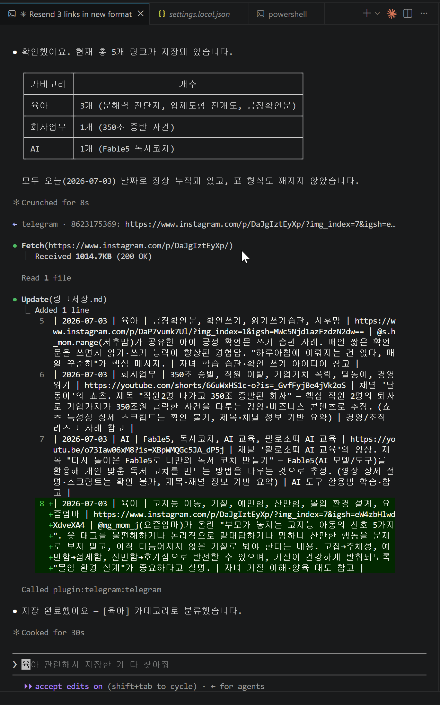
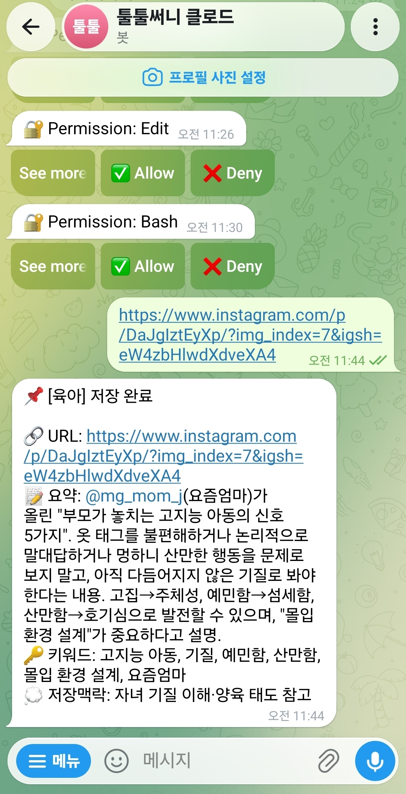

# 1주차 — 나만의 OS 만들기 🛠️

> 미션을 진행하며 **과정과 결과물**을 기록해주세요. (다 못 채워도 OK, 한 것 위주로!)

## 🎯 미션 1. 내 OS 재료 찾기
> 인터뷰 스킬(아이데이션)로 "내 삶에 필요한 게 뭔지" 찾기
- **과정 (어떻게 찾았나):** 인터뷰 스킬로 5개 질문에 답하다 보니, 정보를 계속 저장만 하고 다시 안 보는 패턴이 반복된다는 걸 발견했다.
- **결과:** 저장은 쉬운데 저장된 정보끼리 연결이 안 돼서 시간이 지나면 죽은 데이터가 된다는 게 진짜 문제였다.
- **느낀 점:** Picknic처럼 저장이 간편한 도구를 써봤는데도 여전히 아쉬웠던 이유가 '연결'이 없었기 때문이라는 게 명확해졌다.

## 🧩 미션 2. 내 OS 기획
> 인터뷰 결과 + 세션 내용(흐민·배짱·키노) 활용해 기획
- **기획 내용:** 원래는 'Tooltool Save'라는 이름으로, 링크를 던지면 AI가 요약·분류해서 Notion과 Google Sheets에 쌓아주고, 나아가 저장된 정보끼리 서로 연결되는 개인 지식 저장소로 키우는 걸 기획하고 있었다(Picknic을 참고하되 추천 피드는 빼고, 저장물끼리 연결되는 기능을 더하는 방향). 그런데 흐민 세션을 듣고 나서 생각이 조금 바뀌었다. 결국 내가 진짜 원했던 건 거창한 앱이 아니라 "쉽게 던지기만 하면 알아서 데이터가 쌓이는 것"이었고, 흐민이 강조한 "인풋이 가장 중요하다, 시스템보다 습관이 먼저다"라는 말이 딱 맞았다. 그래서 이번 주는 Notion·Sheets·PWA 같은 인프라는 다 미뤄두고, 텔레그램으로 클로드와 연결해서 핵심 루프(던지면 → 요약·분류되어 → 쌓인다)만 먼저 써보는 쪽으로 규모를 작게 잡았다.
- **막혔던 점 / 어떻게 풀었나:** 처음 기획이 옵시디언 변환, LLM 검색까지 한 번에 담으려다 보니 너무 복잡해졌다. "지금은 너무 복잡해, 3단계로 나눠서 1단계만 가져와줘"처럼 단순화했고, 그 1단계마저 이번 주엔 텔레그램 + Claude Code 채널이라는 가장 가벼운 방식으로 더 좁혀서 실제로 돌아가는지부터 확인하기로 했다.

## ⚙️ 미션 3. 내 OS 구현
> 실제로 만들어본 것 (클로드코드 '채널' 기능 활용 OK)
- **결과물:** 텔레그램 봇 ↔ Claude Code 채널 연동 완료(BotFather로 봇 생성 → 페어링 → allowlist로 나만 쓰게 잠금까지). 텔레그램에 링크를 보내면 의심스러운 링크인지 먼저 판단해서 이상하면 확인부터 받고, 일반 링크면 바로 내용을 읽고 요약·카테고리 분류·검색용 키워드 추출·저장 이유(맥락) 추정까지 자동으로 처리한다. 결과는 로컬 `링크저장.md` 파일 한 곳에 표 형식(날짜/카테고리/키워드/URL/요약/저장맥락)으로 계속 누적되고, 텔레그램으로는 링크마다 정리된 메시지로 답장이 온다. 나중에 키워드로 물어보면 관련 저장 항목을 찾아주는 것까지 확인했다. 인스타그램 릴스·포스트, 유튜브 영상 등 실제 여러 링크로 테스트해서 정상 동작을 검증했다.
- **막혔던 점 / 어떻게 풀었나:**
  - Bun 설치가 네트워크 오류로 계속 실패 → winget으로 우회 설치해서 해결
  - VS Code 터미널이 갑자기 입력을 안 받는 현상 → 터미널 새로 열어서 해결
  - 봇 토큰을 실수로 채팅에 그대로 붙여넣어서 노출 → 바로 BotFather에서 폐기하고 재발급
  - 컴퓨터를 재부팅하니 세션이 끊겨서 텔레그램 연동도 같이 끊김 → 세션 재시작해서 복구
  - 링크마다 권한 확인 팝업이 계속 떠서 번거로움 → 무조건 허용하기보다 의심스러운 링크(단축 URL, 사칭 도메인, 개인정보 요구 등)만 확인받고 나머지는 자동 처리하도록 절충
- **링크 / 스크린샷:**

  
  

## 📱 미션 4. SNS 1주차 소감
> AI 도움 없이 직접 작성! (인증하면 셀 지급)
- **인증 링크:** https://www.instagram.com/reel/DaVtdqBxiyZ/?igsh=MWxqaTJnd3I3am56bw==