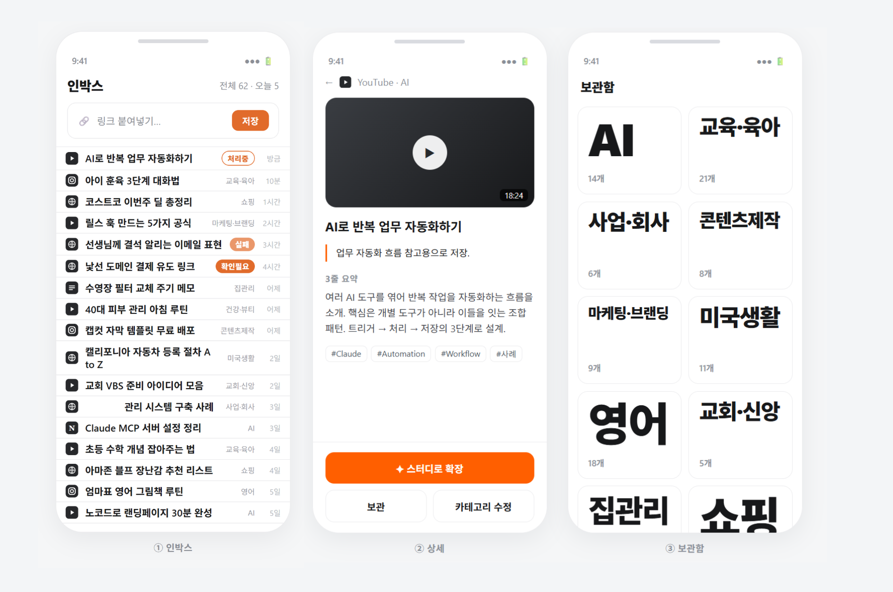

# 2주차 — 내 OS 구현하기 🚀

## 🎯 미션 1. 내 OS 만들기
> **[ 내 삶을 돕는 OS ]** 또는 **[ 콘텐츠 OS ]** 중 하나를 선택해 완성해주세요.

**✅ 선택:** 내 삶을 돕는 OS

### 📐 기획
> Tooltool Save는 SNS·유튜브·아티클 링크를 던지면 자동으로 요약·분류해서 저장해주는 개인용 도구입니다. 1주차엔 텔레그램으로, 2주차엔 PWA로 구현 방식을 바꿔가며 만들고 있어요.

텔레그램 연동은 PC를 계속 켜둬야 한다는 부담이 있어서, 그럴 필요 없이 바로바로 저장하고 처리 가능한 방식이 더 편해서 PWA로 전환하기로 했다.

### ⚙️ 구현
1주차에는 텔레그램 방식으로 구현이 되는지만 테스트해봤고, 2주차에는 PWA로 호출해서 바로바로 저장·처리할 수 있는 시스템으로 구현했다.

### 🧗 과정에서의 삽질
기능을 한 번에 다 넣으려다 보니 처리해야 할 게 너무 많았다. 지금은 계속 써보면서 그 과정에서 생기는 문제들을 하나씩 줄여나가고 있다.

### ✅ 결과물

### 💡 알게 된 인사이트 & 공유하고 싶은 내용
기능을 다 갖추고 시작하려다 시간을 너무 많이 썼다 — 굳이 그럴 필요 없이 일단 냅다 만들고 하나씩 추가하는 게 더 쉬운 방법이었다.

## 📣 미션 2. 유닛 활동 참여 & SNS 공유
> 유닛 활동에 적극 참여(유닛원으로서 or 참가자로서)한 뒤, 그 경험을 SNS에 올리기

- **참여한 유닛 / 활동:**
  - 스킬러스(Skillless): 스킬 등록 후, 기획 단계별로 필요한 스킬을 찾는 중
  - 가스활명수: '모각공(모두 각자 모여서 공부하기)'에 참여
  - 나만의 OS: 이번 주 첫 모임 참여
- **무엇을 했나 (경험):**
  가스활명수 모각공에 참여해서 다른 크루원들과 과제를 하며 서로 질문도 주고받고 이야기도 나눴다. 덕분에 이번 주 과제를 빠르게 제출할 수 있었다. 나만의 OS 유닛은 이번 주 첫 모임이 있었고 잘 따라가고 있어서 기대된다. 스킬러스는 스킬을 등록한 뒤 계획 단계에 맞는 스킬을 찾는 중이다.
- **SNS 인증 링크:** https://www.instagram.com/p/DamdxJRO1mG/?igsh=Y2M2c3VoaWsyNHRn
