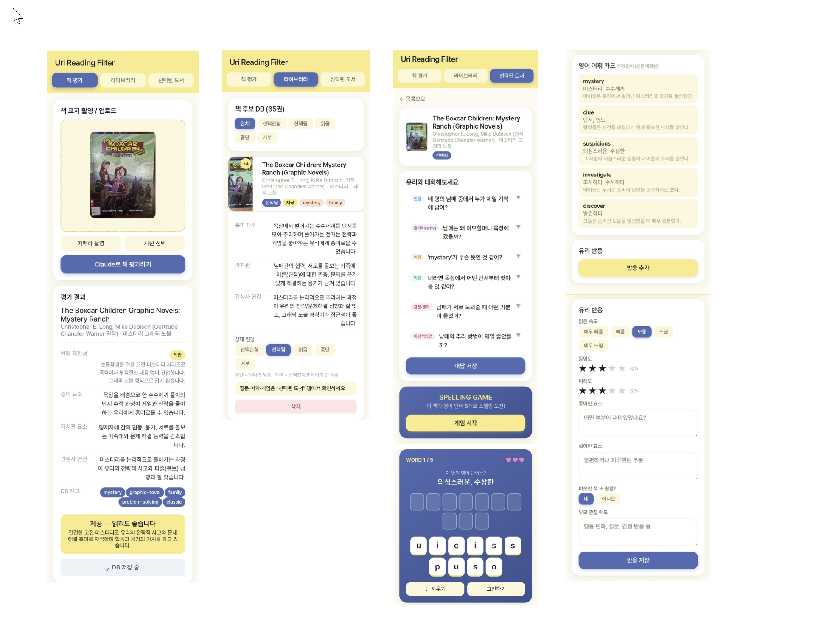

## 미션 1. 내 삶을 돕는 OS 최종 완성

> 지금까지 공유하며 받은 피드백을 반영해 최종 완성!

**완성한 것 (무엇을):**
"나만의 OS — 기록 자산화형" 컨셉으로 잡았다. 아이 독서 필터와 툴툴세이브, 두 시스템을 실사용하며 매번 얻는 데이터로 계속 업데이트하는 구조가 핵심이다. 이번 주는 그중 Uri Reading Filter를 최종 완성해 공개한다 — 아이 눈높이에 맞는 책을 AI로 골라주는 부모용 독서 관리 앱으로, 책 표지 촬영 → AI 판정 → 독후 대화 질문·단어 게임까지 자동 생성되도록 오늘 업그레이드했다. 툴툴세이브(흩어진 링크·정보를 AI가 자동 요약/분류해 노션에 자산으로 쌓는 시스템)는 한 차례 더 업그레이드를 앞두고 있어, 이번 주는 독서 필터 위주로 최종본을 낸다. (디테일은 발표 때 공유 예정)

**피드백 반영한 점:** 오늘 특별히 받은 피드백은 없음.

**결과물 (링크·스크린샷):** "아래 스크린샷 참고" — 책 평가, 라이브러리, 선택된 도서(대화·스펠링 게임), 유리 반응 기록

**알게 된 인사이트:** 두 시스템 모두 실사용 중이며, 매번 쌓이는 데이터로 계속 업데이트하는 루프가 핵심이라는 걸 확인했다.

## 미션 2. 스폰지 토크데이 SNS 후기

**후기 내용:**
AI가 더 잘할수록, 우리는 더 사람답게 — 감정을 움직이고, 감성을 지키고, 필요를 따져보고, 마지막 판단은 직접 하기.

일본의 실버돌 꿈나무 @2기_제프(이재필), 생각 깊은 아날로그 감성지킴이 @2기_솔라(손수정), 빠르고 정확한 인간 클로드이자 진행자 @2기_케이(김보람), 호주에서 깊은 이야기를 꺼내준 공감요정 @2기_애월(이연정), 그리고 일하면서 라디오 모드로 함께한 @2기_엘레나(최은경)까지 😊

인간성이 살아 있는 이야기 덕분에 긴 시간이 순식간에 지나갔어요. 다들 조금 더 인간적으로 알게 된 것 같아 즐거웠습니다. 함께해주셔서 감사해요🤗

#스폰지클럽

**SNS 인증 링크:** https://www.instagram.com/p/Da6wUs6thqK/?igsh=MTZtbDJseTNoaTB0Zw==
