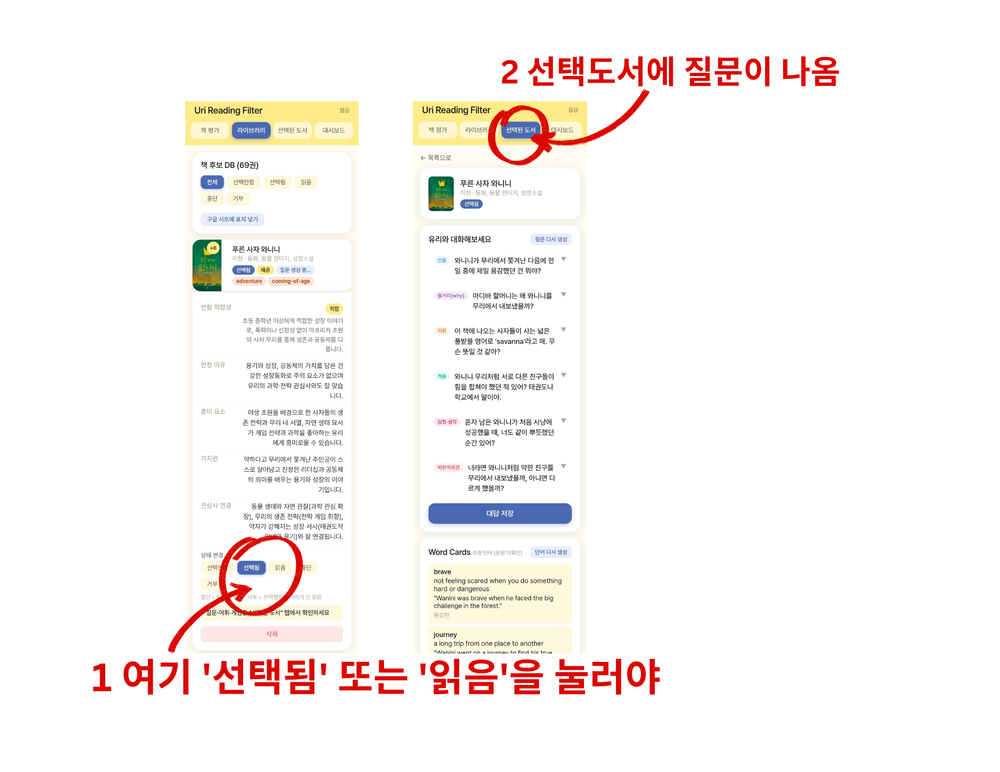
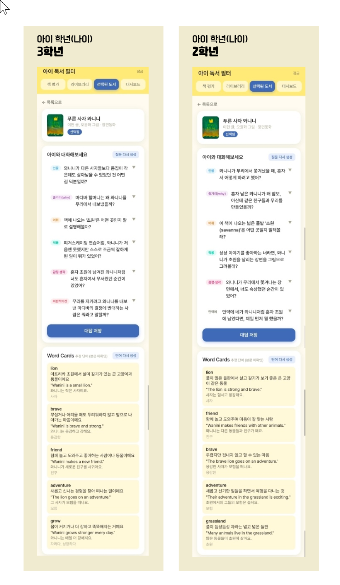

# 4주차 — 기획·구현 → 검증 → 기록 🧪

> 과제를 진행하며 과정과 결과를 기록해주세요. (다 못 채워도 OK, 한 것 위주로!)

3주차에 공개한 **Uri Reading Filter**를 이번 주엔 실제 사용자에게 돌려봤다. 원래 미국에 사는 내 상황에 맞춰 만든 걸, 환경이 전혀 다른 한국 분들께 베타로 드리고 피드백을 받아 고쳤다.

## 🎯 과제 1. PRD 기획 및 구현

- **주요 가치:**

  **아이에게 무엇을 언제 보여줄지의 기준은 집집마다 다르다. 그 기준을 부모가 정하고, 앱은 그 기준으로 책을 걸러준다.**

  이건 원래 내 문제였다. 미국은 책에 담기는 가치관의 폭이 정말 넓어서, 어떤 주제를 **몇 살부터 어떻게 접하게 할지** 늘 예민하게 판단해왔다. 그래서 도서관에 갈 때마다 아이가 고른 책을 일일이 넘겨보고 나서야 읽혔다. 그 시간이 너무 길어서 만든 게 이 앱이다.

  중요한 건 내 기준을 남에게 강요하는 게 아니라는 점이다. 집집마다 연령관도 사는 문화권도 다 다르다. 그래서 **필터 기준 자체를 부모가 정하게** 만들었다. 앱은 옳고 그름을 판단하지 않고 부모의 기준을 대신 실행할 뿐이다.

- **페르소나:**

  처음엔 **나 자신**이었다. 도서관에서 책을 일일이 검토하는 미국 거주 한인 학부모. 영어책을 읽히는데 부모가 전부 읽어볼 수는 없고, 걸러야 할 주제는 분명하고, 영어 어휘도 같이 챙기고 싶은 사람.

  그게 이번 주에 하나 더 생겼다. 스폰지클럽에 공개했더니 **나와 사는 환경이 전혀 다른 한국 분들**이 써보고 싶다고 하셔서 급하게 베타를 만들어 돌렸는데, 문제의 결이 달랐다.

  | | 미국 (원래) | 한국 (이번에 알게 됨) |
  |---|---|---|
  | 거르고 싶은 것 | 가치관·성 정체성 주제의 **노출 시점** | 귀신·공포·폭력·저속한 표현 |
  | 언어 | 영어책 위주, 어휘 학습 병행 | 한국어책 위주 |
  | 관심 맥락 | 학교·교회 커뮤니티 | **학교 교과 연계** |
  | 근본 불안 | "우리 집 기준과 다른 걸 접하면 어쩌지" | "우리 애 수준에 맞나, 남는 게 있나" |

  공통점은 하나였다 — **"표지만 보고는 이 책이 우리 애한테 맞는지 알 수 없다."** 이게 진짜 코어라는 걸 다른 환경의 사용자를 만나고서야 확인했다.

- **소구 방식:**

  가치는 그대로인데 **앞세울 말은 시장마다 번역해야 했다.** 이번 주 제일 크게 배운 지점이다.

  - 미국 → *"도서관에서 한 권씩 넘겨보지 않아도, 우리 집 기준에 맞는지 먼저 알려드려요."*
  - 한국 → *"표지만 보고 고르지 마세요. 이 책에 진짜 뭐가 나오는지 찾아서 알려드릴게요."*

  같은 기능인데 미국에선 "검토 시간을 줄여준다"가, 한국에선 "표지로는 모른다"가 먼저 와야 했다.

  **핵심 기능은 이 문장을 지탱하는 것만 남겼다** — 표지 촬영 후 웹검색으로 실제 내용 확인 → 판정 / 집집마다 다른 필터 / 아이 관심사 연결 / 대화 질문 6개 / 영어 단어카드·게임 / (한국용) 교과 연계.
  **뺀 것** — 적합도 점수 숫자(부모에겐 무의미하고 오해만 부름), 영어 태그 노출, 앱 안 설정 화면.
  **안 만들 것** — 책 추천·판매, 아이 계정, 독후감 첨삭, 그리고 **앱이 스스로 옳고 그름을 정하는 것**.

  성공 기준은 "좋아요" 말고 행동으로 봤다 — **두 번째 책을 찍는가**, 대화 질문을 열어보는가, 아이 반응을 기록하는가.

- **구현한 것 (링크·스크린샷 — 이미지는 `이미지첨부/` 폴더에):**

  **같은 코드에 집집마다 다른 기준을 주입하는 구조**로 만들었다. 학년·관심사·필터 항목·어휘 언어·교과 연계 여부를 전부 설정값으로 빼서, 새 가정이 오면 설정만 바꿔 10분이면 그 집 전용 앱이 나간다. 이 구조 덕분에 미국용으로 만든 걸 한국에 이식하는 데 **코드를 거의 안 고쳤다.** 필터를 귀신·공포로 바꾸고, 교과 연계를 켜고, 어휘 설명을 한국어로 돌린 게 전부다.

  이번 주 피드백 받고 고친 2가지:
  - AI가 모르는 한국 책에서 제목으로 추측하던 걸 → **웹 검색으로 실제 줄거리 확인 후 판정** (원래 의도한 내용 기반을 한국 책에서도 지키게)
  - 대화 질문을 특정 버튼 눌러야 생성되던 걸 → **평가 직후 자동 생성**

  

  **"같은 코드, 다른 설정"이 실제로 다른 결과를 낸다** — 똑같은 책 『푸른 사자 와니니』를 두 아이 앱에서 돌린 결과다.

  

  | | 초3 아이 | 초2 아이 |
  |---|---|---|
  | 마지막 대화 질문 | **비판적 의견** — "마디바의 결정에 반대하는 사람은 뭐라고 말할까?" | **상상(만약에)** — "네가 와니니처럼 혼자 남았다면 뭘 먼저 했을까?" |
  | 단어 카드 | lion·brave·friend·adventure·**grow** | lion·friend·brave·adventure·**grassland** |

  초3에게는 메타적으로 판단하는 비판 질문을, 아직 그런 질문에 답하기 어려운 초2에게는 대답할 수 있는 상상형 질문을 주도록 코드가 학년별로 갈라져 있다. 같은 책인데 아이에 맞춰 실제로 다르게 나왔다. 표지 이미지 하나로 시작해서 여기까지 자동으로 만들어진다.

  **막혔던 점 / 어떻게 풀었나:**
  - 웹 검색을 붙였더니 응답이 **137초**까지 늘어났다. 5권 올리면 11분을 기다려야 하는 상황 → 검색 도구를 최신형에서 기본형으로 바꾸고 검색 횟수를 제한해서 **17초**로 줄였다.
  - 검색을 켜니 AI가 JSON 앞에 "검색해보니~" 설명을 붙여서 파싱이 깨졌다 → 응답의 마지막 덩어리에서 `{`부터 `}`까지만 잘라내도록 수정.
  - 테스터 4명이 Supabase 프로젝트 하나를 공유하는데, 저장해둔 설치 SQL에 계정별 격리가 빠져 있는 걸 뒤늦게 발견 → 실제 DB는 정상이었고(확인함) 문서만 옛 버전이었다. 다음 테스터 받을 때 사고 날 뻔해서 파일을 실제 구조에 맞게 고쳐뒀다.

## 🗣 과제 2. 유저 피드백 받기

- **실제 유저 피드백 (2명 이상):**

  **레미님**이 정말 값진 피드백을 주셨다. 같은 커뮤니티에서 함께 공부하는 분이라 편하게 솔직히 말씀해주셨는데, **두 건 모두 내 가정을 정확히 깨는 것**이었다. 솔직히 이 두 마디가 이번 주 작업의 전부였다.

  **① "도깨비 식당은 도깨비가 나오지도 않는데 도깨비가 나온다고 나와서 의아했어요. 앱이 책 내용을 보고 말하는 건지, 표지를 보고 말하는 건지 헷갈렸어요."**

  이건 파고들수록 흥미로운 문제였다. 이 앱은 **처음부터 책 내용을 반영해 판단하도록** 만들었다. 실제로 미국에서 쓸 땐 아이가 읽는 영어책들이 AI가 이미 잘 아는 책이라, 표지·제목만 줘도 **실제 줄거리 그대로** 평가가 나왔다. 내가 아이와 대화하고 문제를 만들 때 유용했던 것도 전부 그 내용 기반 판단 덕이었다.

  그런데 한국 사용자에게 이식하면서 구멍이 드러났다. AI가 잘 모르는 한국 책(도깨비 식당 같은)을 만나자 **기댈 내용이 없어 제목으로 추측**해버린 거다. 제목에 '도깨비'가 있으니 도깨비 이야기라고. **같은 설계가 미국에선 멀쩡히 돌다가 한국에선 추측으로 떨어졌다.** 시장을 옮기고 나서야 보이는 구멍이었다.

  → 평가 단계에 웹 검색을 붙여, AI가 모르는 책이면 실제 줄거리를 찾아본 뒤 판단하게 했다. 원래 의도했던 '내용 기반'을 한국 책에서도 지키도록 되돌린 셈이다.

  **② "대화 질문 파트를 가장 기대했는데, 그 영역을 찾을 수 없었어요."**

  질문이 '선택됨' 버튼을 눌러야만 만들어지게 돼 있었는데, 레미님은 **이미 읽은 책**을 올렸으니 '읽음'을 누르셨다. 그래서 질문이 한 번도 안 만들어졌다.

  ```
  내가 상상한 사용자 : 앞으로 읽을 책을 고르는 부모  → '선택됨'
  실제 사용자        : 이미 읽은 책을 기록하는 부모  → '읽음'
  ```

  둘 다 자연스러운 행동인데 나는 하나만 상상했다. 레미님이 아니었으면 이 기능이 **작동조차 안 하고 있다는 걸 몰랐을 거다.** 정말 감사합니다 🙏

  *(다른 테스터분들께도 배포해드렸고 지금 답변을 기다리는 중이다. 회신 오는 대로 업데이트하겠다.)*

- **가상 페르소나 피드백:**

  답변을 기다리는 동안 가상 페르소나 패널로 나머지 가정을 미리 깨봤다. **익숙한 2명 + 낯선 3명**으로 구성.

  | | 페르소나 | 나온 말 | 깨진 가정 |
  |---|---|---|---|
  | 익숙 1 | 가치관 주제에 민감한 미국 거주 학부모 | "필터에 넣은 주제가 **'조금 나오는'** 책은 어떻게 판정되나요?" | 필터가 **이분법**이면 충분하다 |
  | 익숙 2 | 영어·한국어 섞어 읽히는 부모 | "영어책인데 설명이 다 한국어예요. **아이에게 보여주려면** 영어가 필요한데요." | 화면 보는 건 **부모뿐**이다 |
  | 낯섦 1 | 손주 책 고르는 **조부모** | "**'선택됨'**이 무슨 뜻이에요? 내가 고른 건가요, 앱이 골라준 건가요?" | 버튼 용어가 **직관적**이다 |
  | 낯섦 2 | **아이가 직접** 열어본 경우 | "질문 밑에 **부모용 가이드가 같이 보여서** 답을 알아버렸어요." | 사용자는 **부모다** |
  | 낯섦 3 | 도서관에서 급히 여러 권 고르는 부모 | "10권 쌓아두고 찍는데 **한 권씩 기다려야** 하네요." | 한 권씩 **여유롭게** 찍는다 |

  레미님이 깬 가정과 겹치지 않는 새 가정 5개가 나왔다. 특히 **익숙 1(정도의 문제)** 은 내 원래 문제의식과 정확히 닿아 있다. 나는 "이 주제가 나오나 안 나오나"가 아니라 **"어느 정도로, 어떤 맥락에서 나오나"**가 궁금해서 책을 넘겨봤던 건데, 지금 앱은 있다/없다로만 답한다. **다음 개선 1순위**로 올렸다.

- **피드백에서 알게 된 것:**

  **1. 내가 만족하는 것과, 남에게 써보게 해서 그 사람을 만족시키는 건 완전히 다른 영역이었다.**
  나는 내 문제를 풀려고 만들었고 나한텐 잘 맞았다. 그런데 남에게 쥐여주니 **내가 한 번도 상상하지 않은 방식으로** 쓰더라. 다른 버튼을 눌렀고, 다른 걸 기대했고, 내가 자랑스러워한 부분이 아니라 전혀 다른 데를 봤다. 이런 포괄적인 앱으로 수많은 사람의 마음을 사로잡고 사업화까지 성공한 창업가들이 **새삼 정말 대단하게** 느껴졌다. 한 명 만족시키기도 이렇게 어려운데.

  **2. 만족도 숫자만 봤으면 완전히 틀리게 결론 낼 뻔했다.**
  "없어도 아쉽지 않다"는 평가를 받았는데, 알고 보니 그 기능을 **보지도 못한 상태**였다. 점수만 봤으면 "이 기능은 가치가 없구나" 하고 지웠을 거다. **못 찾았다는 사실 자체가 정보**였다.

  **3. 같은 설계도 시장을 옮기면 다르게 작동한다.**
  "표지만 보고는 알 수 없다"는 **문제 자체는 두 시장에 똑같이** 있었다. 그런데 그걸 푸는 방식은 달랐다 — 미국 책은 AI가 알아서 그냥 통했고, 한국 책은 검색으로 받쳐줘야 했다. 거를 주제도, 앞세울 말도 전부 달랐다. 덕분에 **이 제품의 진짜 코어가 뭐고 어디가 시장 따라 갈리는지**가 훨씬 선명해졌다. 혼자 만들었으면 영영 몰랐을 거다.

  **4. 아낄 것과 아끼면 안 되는 것이 있다.**
  질문을 버튼에 걸어둔 건 비용 때문이었는데, 계산해보니 **아끼는 돈이 350원**이었다. 그 350원 때문에 사용자가 제일 기대한 기능을 못 보게 만들었다.

## 📣 과제 3. SNS 기록 남기기

- **기록 내용 (소회):**

  > 4주차. 내가 나 좋으라고 만든 걸 처음으로 남에게 쥐여줬다.
  >
  > 원래 이건 내 문제였다.
  > 미국은 책에 담기는 가치관의 폭이 넓어서,
  > 어떤 주제를 몇 살부터 접하게 할지 늘 예민하게 판단해왔다.
  > 그래서 도서관에 갈 때마다 아이가 고른 책을 일일이 넘겨보고서야 읽혔다.
  > 그 시간을 줄이려고 만든 앱이었다.
  >
  > 그런데 스터디에 공개했더니
  > 나와 사는 환경이 전혀 다른 한국 분들이 써보고 싶다고 하셨다.
  > 급하게 베타를 만들어 돌렸다.
  >
  > 레미님이 이런 말을 남겨주셨다.
  >
  > "도깨비 식당인데 도깨비가 안 나오는데 나온다고 뜨네요.
  > 이거 표지를 보고 말하는 건가요, 내용을 보고 말하는 건가요?"
  >
  > 파고들수록 흥미로운 문제였다.
  > 이 앱은 처음부터 책 내용을 반영해 판단하도록 만들었고,
  > 미국에서 쓸 땐 아이가 읽는 영어책을 AI가 이미 잘 알아서
  > 표지만 줘도 실제 내용대로 잘 나왔다.
  > 그런데 AI가 모르는 한국 책을 만나니
  > 기댈 내용이 없어 제목으로 추측해버린 거였다.
  > 같은 설계가 미국에선 멀쩡히 돌다가 한국에선 무너졌다.
  > 시장을 옮기고 나서야 보이는 구멍이었다.
  >
  > 같은 분이 하나 더 짚어주셨다.
  > "제일 기대한 게 대화 질문이었는데 못 찾겠어요."
  >
  > 질문이 만들어지려면 특정 버튼을 눌러야 했는데,
  > 그분은 '이미 읽은 책'을 올렸으니 다른 버튼을 누르셨다.
  > 둘 다 자연스러운 행동인데 나는 하나만 상상했다.
  >
  > 이번 주에 배운 것.
  >
  > 하나. 내가 만족하는 것과 남을 만족시키는 건 완전히 다른 영역이었다.
  > 나한테 잘 맞던 앱이 남의 손에 가니 내가 상상도 못 한 방식으로 쓰였다.
  > 이런 앱으로 수많은 사람의 마음을 얻고 사업까지 일군 분들이
  > 새삼 대단하게 느껴졌다. 한 명 만족시키기도 이렇게 어려운데.
  >
  > 둘. 같은 설계도 시장을 옮기면 다르게 작동한다.
  > "표지만 보고는 알 수 없다"는 문제는 두 나라에 똑같이 있었지만,
  > 그걸 푸는 방식은 달랐다.
  > 거르고 싶은 주제도, 앞세울 말도 전부 달랐다.
  >
  > 셋. "없어도 아쉽지 않다"는 평가를 받았는데,
  > 알고 보니 그 기능을 보지도 못한 상태였다.
  > 숫자만 봤으면 완전히 틀리게 결론 낼 뻔했다.
  >
  > 돌아간다와 쓸 만하다는 다르다.
  > 그걸 알려주는 건 결국 써본 사람뿐이었다.
  > 레미님, 정말 감사합니다.
  >
  > #스폰지클럽

- **SNS 인증 링크:**

  > 업로드 후 첨부 예정
