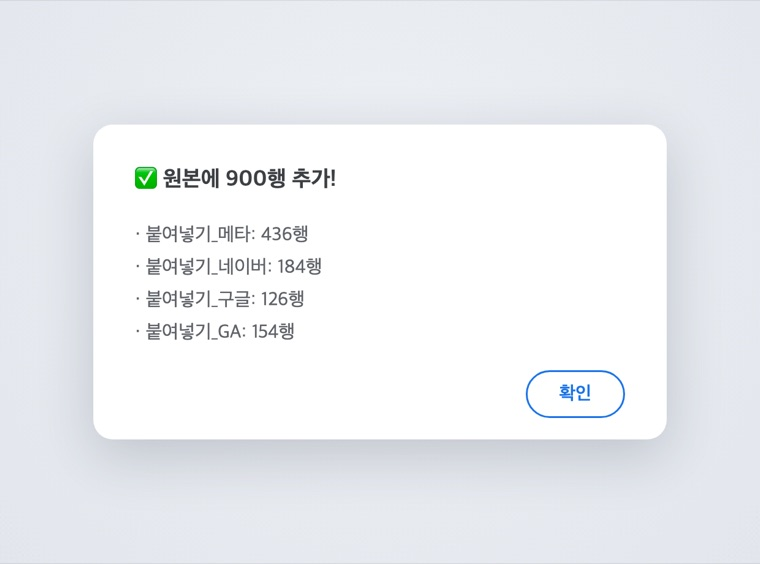
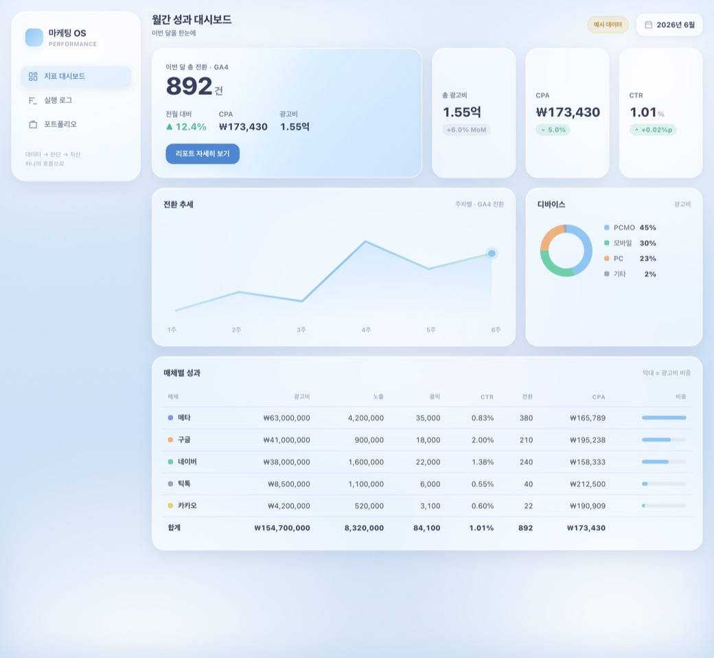
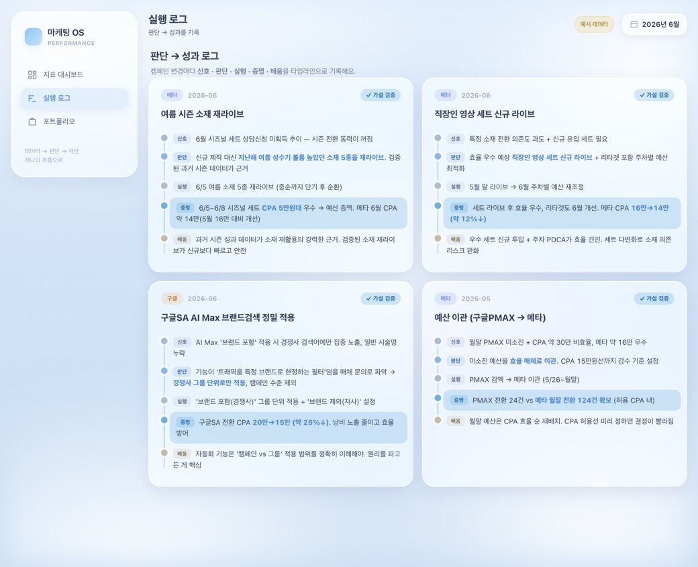
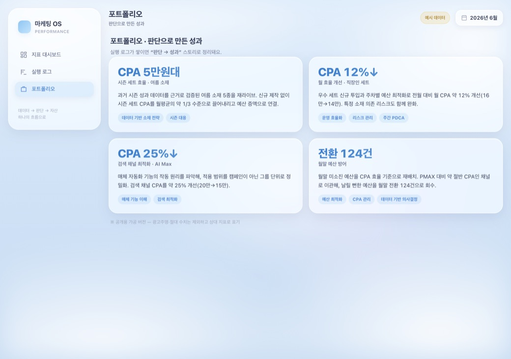

## 결과물

> 단순 리포트 자동화를 넘어, **데이터 → 대시보드 → 인사이트 → 자산(포트폴리오)** 을 하나의 흐름으로 잇는 마케팅 OS를 만들었습니다.

**① 데이터층 — 자동화 파이프라인 (구글시트 + Apps Script)**
- 매체별 raw + GA 데이터를 붙여넣고 **‘정리 버튼’ 한 번**이면, 하나의 원본 테이블에 자동 정규화·누적 (날짜·디바이스·광고상품·매체·GA캠페인 매핑까지 자동)
- 매체별로 흩어져 매달 재취합하던 작업 → **월말 취합이 사라짐 (매일 1분)**

**② 실행 로그 — 판단 서사**
- 캠페인 변경마다 **신호 · 판단 · 실행 · 증명 · 배움** 5조각으로 기록
- 실제 운영 판단에 데이터로 성과를 증명 → 나중에 포트폴리오 원료로

**③ 표현층 — 대시보드 프로토타입 (3탭 흐름)**

| 지표 대시보드 | 실행 로그 | 포트폴리오 |
|---|---|---|
|  |  |  |

*(데이터는 예시·가공 버전 — 실데이터는 로컬 비공개)*

**④ 재사용 자산** — 새 브랜드도 빠르게 세팅하도록 온보딩 플레이북 + 재사용 스킬까지 정리

## 삽질 과정

솔직히 여기서 시간을 제일 많이 썼지만, 막힐 때마다 원인을 파고들며 오히려 시스템이 단단해졌습니다.

- **숨어있던 데이터 구멍**: 가장 큰 매체 데이터가 날짜가 ‘텍스트’로 저장돼 월간 집계에서 통째로 누락 → 날짜 인식 로직을 고쳐 복구. *수기로 봤으면 놓쳤을 걸 시스템에 태우니 잡혔습니다.*
- **여러 계정 → 자동화 승인 벽**: 구글 계정이 여러 개라 Apps Script 승인이 계속 막힘 → OAuth 동의 화면에 테스트 사용자 등록 + 시트 메뉴에서 실행으로 우회.
- **‘보이는 것과 다른’ 탭 이름**: 매핑표 탭 이름에 눈에 안 보이는 문자가 붙어 스크립트가 못 찾음 → 진단 후 탭 이름 재입력으로 해결.
- **GA만 계속 0건**: 날짜 형식·헤더 매칭 문제 → 진단 함수로 어디서 걸리는지 규명 후 해결.

## 인사이트

> 자동화 자체가 목적이 아니라, **매일의 데이터·판단·성과를 하나로 이어 그 자체가 포트폴리오가 되게** 하는 것이 진짜 핵심이었다.
