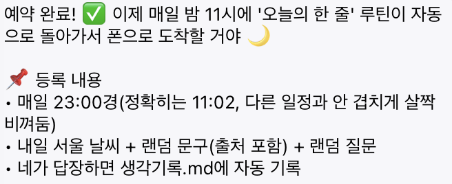

# 1주차 — 나만의 OS 만들기 🛠️

> 미션을 진행하며 **과정과 결과물**을 기록해주세요. (다 못 채워도 OK, 한 것 위주로!)

## 🎯 미션 1. 내 OS 재료 찾기
> 인터뷰 스킬(아이데이션)로 "내 삶에 필요한 게 뭔지" 찾기

- **과정 (어떻게 찾았나):**
  인터뷰 스킬로 5스텝을 따라갔다. 처음엔 일 얘기(자료 찾고 정리하기 → 출처·링크 정리가 어렵다)가 나왔는데,
  스텝 3에서 일 밖으로 나가 보니 진짜 걸리는 건 **'기록'** 이었다. 일 쪽(출처 정리)과 삶 쪽(기록) 둘을
  나란히 놓고 무게를 재 보니, 기록 쪽이 더 가볍고 더 중요하다는 게 분명해졌다.

- **결과:** 🟡 내 OS 재료 카드
  - **영역:** 삶 (매일의 나를 돌아보는 기록)
  - **걸리는 지점:** 일기·생각 정리를 사실상 거의 못 함 — 떠오를 때 적긴 하는데 끌어내는 순간을 놓침
  - **지금은:** 카톡 '나에게 보내기', 메모장, 아이폰 메모앱에 그때그때 던져둠 → 흩어져서 안 쌓이고, 다시 안 봄
  - **OS가 된다면:** 하루 한 번 "오늘 뭐 떠올렸어?" 하고 **먼저 물어봐줌** → 까먹기 전에 한 줄이라도 끌어내 줌
  - **한 문장:** *"기록하려고 마음먹지 않아도, 매일 한 번은 나를 돌아본다"*

- **느낀 점:**
  "딱히 불편한 게 없다"고 생각했는데, 막상 하루를 들여다보니 매일 놓치고 있던 게 있었다.
  특히 일 얘기에만 머물지 않고 삶 쪽으로 넘어간 순간 진짜 내 문제가 보였다. 흩어진 메모를 '모으는' 게
  아니라 애초에 '끌어내 주는' 게 핵심이라는 걸, 선택지를 하나씩 좁혀 가며 스스로 깨달은 게 좋았다.

## 🧩 미션 2. 내 OS 기획
> 인터뷰 결과 + 세션 내용(흐민·배짱·키노) 활용해 기획

- **기획 내용:** '오늘의 한 줄' 봇 (1단계)
  - **언제:** 매일 밤 23:00 (하루 회고 타이밍)
  - **무엇을 보냄 (세 겹):**
    1. 내일 서울 날씨 (실시간 조회)
    2. **출처가 검증된** 인문·명언 문구 1개 (인물 + 저작·장까지)
    3. 8가지 결(감정/감각/사람/배움/작은성취/호기심/몸/자유)에서 뽑은 랜덤 질문 1개
  - **나:** 텔레그램에 떠오르는 만큼 답장 → `생각기록.md`에 날짜와 함께 자동 저장
  - **세션 내용 활용:**
    - **흐민** 사례의 3층 구조 중 **1층(사고: 자연어 입력 → 자동 저장)** 만 가져왔다.
      "인풋이 가장 중요하다, 시스템보다 습관이 먼저다"는 말에 기대어 위키·자산화는 과감히 다음으로 미뤘다.
    - **배짱** '온맘'이 매일 오전 7:30에 자동 발송한 구조를 빌려, 봇이 **먼저** 말 거는 형태로 설계했다.
  - **3단계 로드맵:** 1단계(한 줄 끌어내기) → 2단계(주제별 묶기·연결) → 3단계(글감 제안). 이번 주는 1단계만.

- **막혔던 점 / 어떻게 풀었나:**
  - **명언 신뢰 문제:** 출처 불명 인터넷 명언은 오히려 혼란을 준다. → 봇이 매번 즉석 생성하지 않고,
    **출처(저작·장)가 박힌 문구만 모은 `문구.md`에서 뽑기만** 하도록 설계해 가짜·오기를 원천 차단했다.
  - **질문이 매일 똑같아지는 문제:** 8가지 결 × 여러 문항의 질문 통을 만들어, 같은 결이라도 매번 다른
    질문이 오게 했다. ("삶을 다양한 각도에서 경험하고 싶다"는 바람을 반영)

## ⚙️ 미션 3. 내 OS 구현
> 실제로 만들어본 것 (클로드코드 '채널' 기능 활용 OK)

- **결과물:**
  - **텔레그램 봇 ↔ Claude Code 채널 연동 완료** (BotFather 봇 생성 → 페어링 → allowlist 잠금 → 폰 왕복 검증까지)
  - **OS 파일 4종 제작** (개인 데이터라 제출 저장소가 아닌 로컬 `~/projects/os jisoo/`에 보관):
    - `루틴.md` — 매일 밤 11시에 실행할 레시피 (날씨 조회 → 문구 랜덤 → 질문 랜덤 → 폰 발송 → 답 저장)
    - `문구.md` — 출처 검증된 인문·명언 29편 (철학·동양사상·문학·시)
    - `질문.md` — 8가지 결 × 4문항, 총 32개 랜덤 질문
    - `생각기록.md` — 답이 날짜별로 쌓이는 노트
  - **자동 발송:** 텔레그램 받는 창 세션에서 durable 예약으로 매일 23:00 `루틴.md`를 실행하도록 구성
- **링크 / 스크린샷:** 봇이 매일 밤 11시 발송 예약을 등록 완료한 화면 (폰으로 도착)

  

## 📱 미션 4. SNS 1주차 소감
> AI 도움 없이 직접 작성! (인증하면 셀 지급)
- **인증 링크:** https://www.instagram.com/p/DaNv8j1mWsw/
