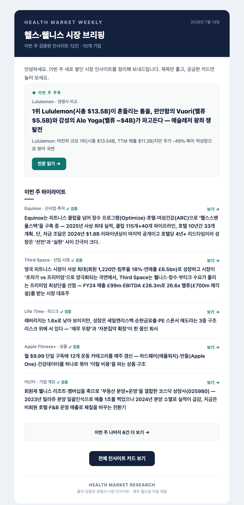
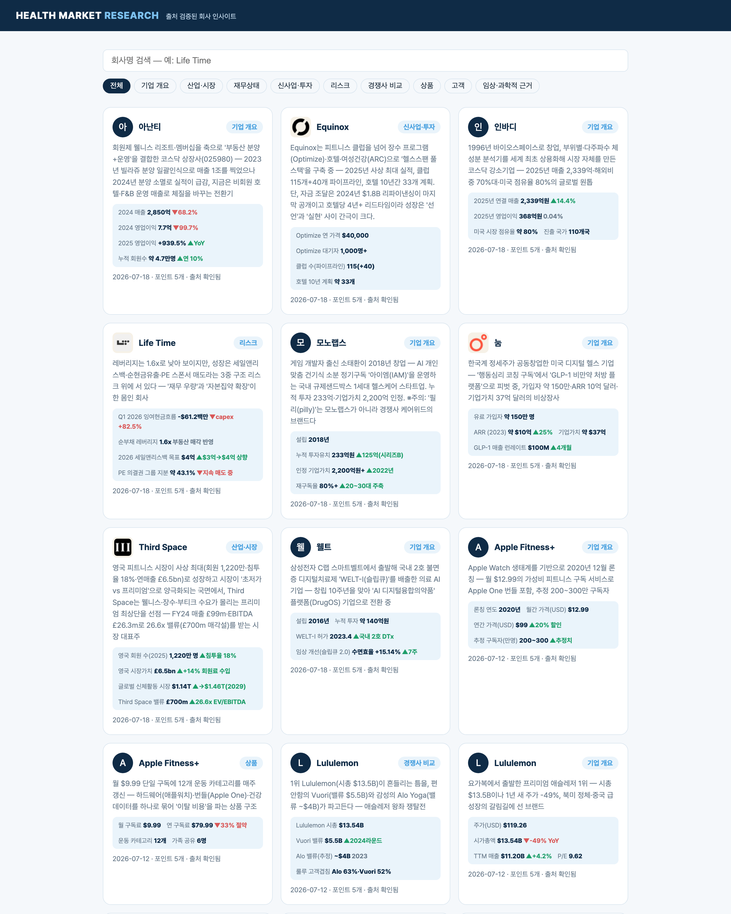
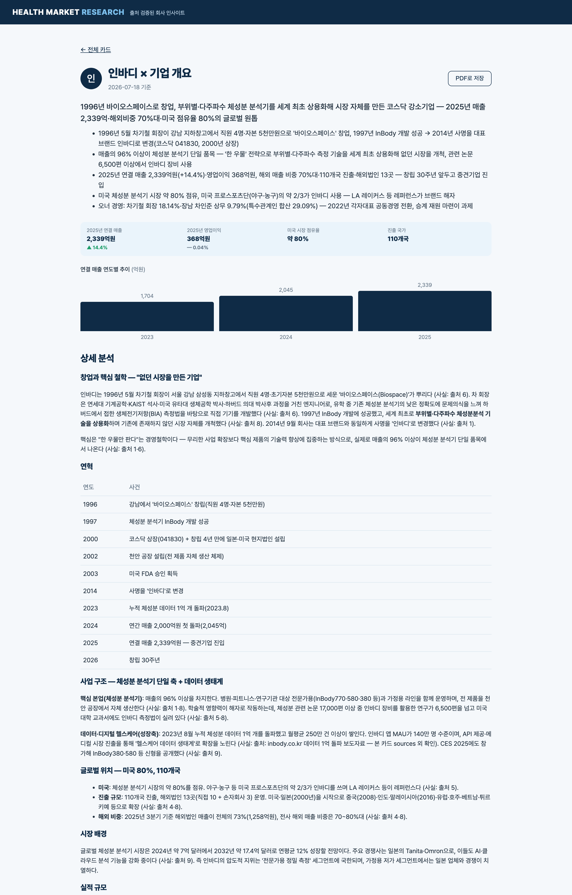

# 3주차 — 내 OS 최종 완성 🏁

> 미션을 진행하며 과정과 결과를 기록해주세요. (다 못 채워도 OK, 한 것 위주로!)

## 🎯 미션 1. 내 삶을 돕는 OS 최종 완성

> 2주차에 만든 **HEALTH MARKET RESEARCH**(출처 검증된 시장 인사이트 카드 사이트)를, 이번 주 받은 피드백을 반영해 '만드는 OS'에서 '쓰이는 OS'로 완성했습니다.

- **완성한 것 (무엇을):**

  두 가지를 더했습니다.

  **① 주간 이메일 다이제스트 (Pull → Push)**
  지금까지는 카드를 아무리 쌓아도 직원이 '사이트에 들어와야만' 볼 수 있었습니다. 그래서 매주 월요일 아침 8시, 그 주에 새로 쌓인 카드를 뉴스레터로 자동 발송하는 기능을 만들었습니다. 이제는 찾아오지 않아도 먼저 찾아갑니다.

  **② 국내 웰니스·피트니스 회사로 확장**
  기존 카드가 전부 해외 기업(Equinox·Life Time 등)이라 우리 시장과 거리감이 있었습니다. 국내 5개사(인바디·눔·웰트·아난티·모노랩스)를 새로 조사해 추가했고, 모두 출처 URL을 실제 접속 검증했습니다.

- **피드백 반영한 점:**

  공유하고 스스로 돌아보며 얻은 피드백은 세 가지였습니다.

  1. **"만들어도 안 쓰인다"** — 생산은 자동화됐지만 소비되는 통로가 없었습니다. → 이메일 푸시로 소비 루프를 닫았습니다.
  2. **"해외 사례뿐이라 와닿지 않는다"** — → 국내 회사 5곳으로 확장했습니다.
  3. **"뉴스레터가 다 보여줘서 벽처럼 읽힌다"** — 첫 버전은 모든 카드를 나열했습니다. → '이번 주 주목 1건 + 하이라이트 5건 + 나머지는 링크'로 큐레이션했습니다. 이메일은 전부 전달하는 곳이 아니라, 궁금하게 만들어 사이트로 데려가는 미끼여야 한다는 걸 배웠습니다.

- **결과물 (링크·스크린샷):**
  - 사이트: https://health-market-research.vercel.app (국내 5개사 신규 반영)
  - 매주 월요일 오전 8시 이메일 다이제스트 자동 발송 (뉴스레터 형식, 큐레이션)

  **① 주간 이메일 뉴스레터 (큐레이션: 주목 1 + 하이라이트 5 + 나머지 링크)**
  

  **② 사이트 — 국내 5개사 확장 반영**
  

  **③ 국내 카드 상세 (인바디) — 지표·차트·출처 검증**
  

- **알게 된 인사이트:**

  2주차의 깨달음이 "기록은 자동화될 때 자산이 된다"였다면, 3주차는 거기서 한 걸음 더 나아갔습니다.

  **생산을 자동화하는 것만으로는 자산이 되지 않습니다. 소비되고 피드백이 돌아올 때 비로소 살아있는 시스템이 됩니다.** 아무리 좋은 카드도 아무도 안 열어보면 없는 것과 같았습니다. 그래서 이번 주의 핵심은 '더 많이 만들기'가 아니라 '만든 것이 쓰이게 하기'였습니다 — 찾아오게(Pull) 하지 말고 가져다주기(Push), 그리고 푸시할 땐 전부가 아니라 큐레이션.

  결국 진짜 OS는 생산·소비·피드백이 하나의 고리로 돌 때 완성된다는 것을, 이번 주에 몸으로 배웠습니다.

## 📣 미션 2. 스폰지 토크데이 SNS 후기
> 오늘 토크데이 후기를 SNS에 올리기 (**#스폰지클럽 필수 · 셀 3개 지급!**)
- **후기 내용:**
  여러 사람을 만나 각자의 이야기를 나눴다. AI 시대에 다들 어떤 고민을 안고 사는지, 그 시간을 함께 나눈 것만으로 참 좋았다.

  무엇보다 좋았던 건, 나 혼자 품고 있던 생각을 비슷한 결의 사람들과 나누는 순간이었다. 같은 고민을 하는 사람들과 이야기하다 보니, 혼자서는 닿지 못했던 인사이트가 자연스럽게 열렸다.

  혼자 하는 고민은 벽이지만, 함께 나누는 고민은 문이 된다는 걸 다시 느낀 하루 💡

  \#스폰지클럽 #토크데이 #AI시대 #함께하는고민 #인사이트
- **SNS 인증 링크:** https://www.instagram.com/p/Da43-DyPqx4/?igsh=dGY3dWZhZTY2NDFn
