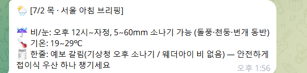

# 1주차 — 나만의 OS 만들기 🛠️

> 미션을 진행하며 **과정과 결과물**을 기록해주세요. (다 못 채워도 OK, 한 것 위주로!)

## 🎯 미션 1. 내 OS 재료 찾기
> 인터뷰 스킬(아이데이션)로 "내 삶에 필요한 게 뭔지" 찾기
- **과정 (어떻게 찾았나):**
  스폰지클럽 인터뷰 스킬로 오늘 하루를 가볍게 되짚는 것부터 시작했다. 처음엔 "시간을 크게 잡아먹는 일"을 찾다가, 시간보다 매일 아침 빠지지 않고 반복하는 루틴에서 재료가 걸렸다. 바로 서울 날씨 확인이다. 네이버 날씨에 연동된 기상청·아큐웨더·웨더채널·웨더뉴스 예보를 매일 아침 하나씩 눈으로 훑고 있었다. "반복 + 여러 곳에 흩어짐" — 이게 OS가 제일 잘 도와줄 조합이라는 걸 대화 중에 알아챘다.

- **결과:**
  '아침 날씨 브리핑 OS'로 방향을 잡았다.

걸리는 지점: 매일 아침, 흩어진 4곳 예보를 손으로 하나씩 확인
OS가 된다면: 4곳 예보를 모아 비 여부 · 오는 시각 · 강수량을 한 줄로 요약. 예보가 엇갈리면 과거 적중률 기준으로 확률 높은 쪽에 무게를 실어 정리
실행 조건: 평일 오전 8시 / 주말·공휴일(한국 달력) 오전 10시
한 문장: "아침에 눈 뜨자마자, 오늘 우산 챙길지 3초 만에 끝난다"

- **느낀 점:**
오랜 시간이 걸리는 것은 아니지만, 4곳의 일기예보가 다를 때는 윈디닷컴이나 기상청 홈페이지에 직접 들어가서까지 날씨 확인을 해야했지만, OS로 오버스럽지 않게 날씨를 찾아보지 않아도 될 것 같았다. 

## 🧩 미션 2. 내 OS 기획
> 인터뷰 결과 + 세션 내용(흐민·배짱·키노) 활용해 기획
- **기획 내용:**
언제: 평일 오전 8:00 / 주말·공휴일(한국 달력) 오전 10:00 — 자동 발송
무엇을 보냄 (한 줄에 세 가지):
오늘 서울에 비 오는지 / 몇 시에 / 강수량 얼마인지 — 오늘 딱 필요한 결론
네이버 날씨에 연동된 서울 예보 네 곳(기상청·아큐웨더·웨더채널·웨더뉴스)을 종합
예보가 엇갈리면 과거 적중률 기준으로 확률 높은 쪽에 무게를 실어 한 줄로 정리
나: 아무것도 안 함. 아침에 눈 뜨면 텔레그램에 브리핑이 이미 와 있음.
세션 내용 활용:
흐민 사례 — 텔레그램 + 클로드 코드 연동, 그리고 "아침 브리핑 = OS가 먼저 보내옴(자동)" 구조를 그대로 가져옴. 흐민 3층 중 지금 내 OS엔 입력(사고)보다 '자동으로 먼저 도착하는' 발송이 핵심이라, 그 부분을 빌림.
배짱 '온맘' — 매일 정해진 시간 자동 발송(launchd) 구조를 빌림. 또 "정보가 애매하면 AI가 후보를 대고 결정을 도움" 패턴을, 나는 **"예보가 엇갈리면 확률로 무게를 실어 한쪽으로 정리"**로 변형해 적용.
3단계 로드맵: 1단계(서울 4곳 모아 비/시각/강수량 한 줄) → 2단계(과거 적중률 반영해 확률 가중) → 3단계(평일·주말·공휴일 시간별 자동 발송). 이번 주는 1단계만.

- **막혔던 점 / 어떻게 풀었나:**

"세션 참고"가 뭔지 막막했던 점: 흐민·배짱 세션을 '참고'하라는 게 뭘 어디까지 가져오라는 건지 감이 안 왔다. → 세션 속기본·슬라이드를 받아 각 세션의 핵심을 한 줄로 요약한 뒤, 내 날씨 OS에 실제로 붙는 포인트(자동 발송 · 애매할 때 처리 방식)만 골라냈다.
예보가 엇갈리는 문제: 네 곳이 서로 다르게 말할 때 뭘 믿을지 고민. → 배짱의 '후보 제시' 아이디어를 변형해, 과거 적중률로 확률을 매겨 한쪽으로 정리하는 방식으로 풀기로 했다.
공휴일 처리: 주말과 공휴일을 다르게 봐야 하나? → 둘 다 10시로 묶되, 한국 달력 기준 공휴일을 판별해야 한다는 요건을 1단계 이후(3단계) 과제로 미뤘다.

## ⚙️ 미션 3. 내 OS 구현
> 실제로 만들어본 것 (클로드코드 '채널' 기능 활용 OK)
- **결과물:**
  매일 아침 여러 곳에 흩어진 서울 날씨 예보를 하나씩 확인하던 걸, 텔레그램으로 알아서 오는 한 장의 브리핑으로 바꿨다. 흐민·배짱처럼 클로드 코드 + 텔레그램을 엮었다.
  - 동작 흐름: 정해진 시간에 클로드 코드가 깨어남 → 기상청·웨더아이에서 서울 예보 수집 → 비/눈 여부·시간대·강수량·기온으로 종합 → 텔레그램으로 발송
  - 자동 발송: 윈도우 작업 스케줄러로 평일 오전 8시 / 주말 오전 10시 자동 실행 ("날씨"라고 안 쳐도 알아서 옴). PC가 꺼져 있었으면 켜질 때 실행.
  - 예보 엇갈릴 때: 두 출처가 다르면 짧게 밝히고 안전하게 비 오는 쪽에 무게를 실어 우산을 권함 (실제로 오늘 7/2에 기상청↔웨더아이가 갈려서 이 기능이 바로 작동함)
  - 읽기 편하게: 줄바꿈으로 항목별 정리, 비/눈 예보 시 시간대 + 강수량(mm) 명시
  - 만든 것: 개인 스킬 아침날씨브리핑 (SKILL.md · prompt.txt · run-briefing.ps1) + 작업 스케줄러 2개

- **링크 / 스크린샷:**
  

## 📱 미션 4. SNS 1주차 소감
> AI 도움 없이 직접 작성! (인증하면 셀 지급)
- **인증 링크:** https://www.instagram.com/p/DaR1hl4Ebir/?utm_source=ig_web_copy_link&igsh=MzRlODBiNWFlZA==