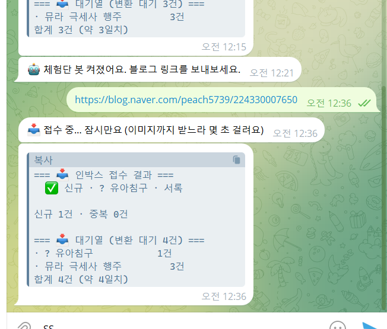
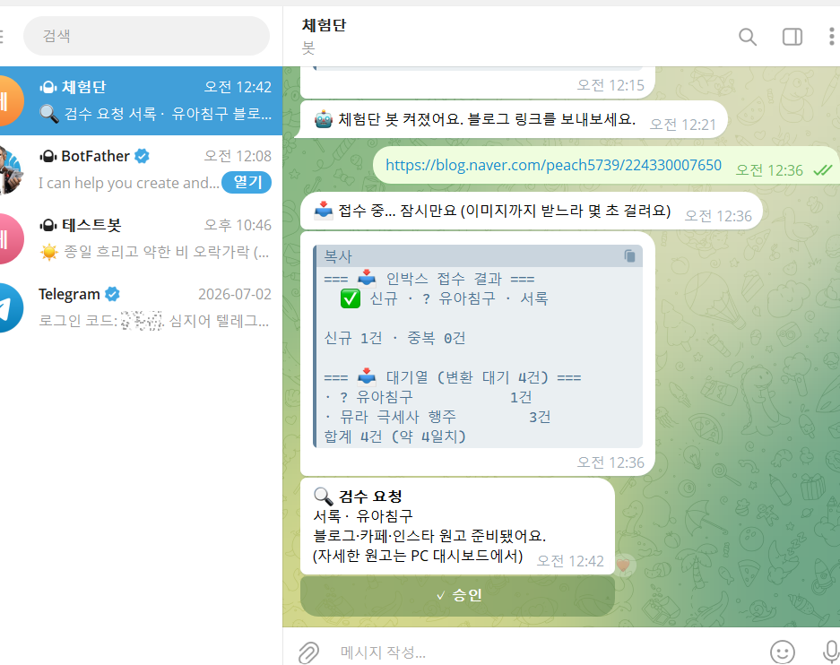

# 2주차 — 내 OS 구현하기 🚀

## 🎯 미션 1. 내 OS 만들기

**✅ 선택:** 내 삶을 돕는 OS (내 **실업무**를 돕는 OS)

> **한 줄 요약** — 체험단 후기 링크 하나를 던지면 → 블로그·카페·인스타 원고 3벌을 만들고 → 폰에서 검수·승인하면 → 발행·기록까지. **하루 1건씩 알아서.**

---

### 📐 기획

1주차엔 「아침 날씨 브리핑 OS」를 만들었다. 그런데 2주차를 준비하며 솔직해졌다 — *"난 아침 리포트가 꼭 필요하진 않은데...이거 미션을 위한 미션 아닌가?"* 그래서 방향을 틀어, **매주 진짜로 10시간씩 잡아먹던 실업무**로 갔다.

| | 지금(Before) | OS가 되면(After) |
|---|---|---|
| 하는 일 | 체험단 후기 1개 → 블로그·카페·인스타 **3벌**을 손수 정리 | 링크만 던지면 원고 자동 생성 |
| 걸리는 시간 | 건당 4단계 × 3채널, 10개 몰아서 **10시간+** | 검수만 하면 끝 |
| 입력 노동 | 책상에 앉아 몰아치기 | 폰에서 툭 던지기 |

**그리고 첫 애기(날씨)를 버리지 않았다.** 날씨 OS의 진짜 자산은 '날씨'가 아니라 `텔레그램 + 작업스케줄러 + headless Claude`라는 **배달 파이프라인**이었다. 그걸 체험단 OS의 밑단(자동 실행·아침 알림)으로 **승격**시켰다. → 그래서 지금도 매일 아침 알림에 **날씨 한 줄이 같이** 온다. 나중에 떼기 쉽게 블록만 분리해뒀다.

---

### ⚙️ 구현

```
[입력]  📱 봇에 링크 던지기  /  🖥️ 대시보드에 붙여넣기
             ↓  (네이버 블로그 → 본문·이미지·제품 자동 분류)
[대기열]  제품별로 쌓임
             ↓  매일 아침 8시 · 자동
[변환]  블로그·카페·인스타 원고 3벌 생성
             ↓
[알림]  ☀️날씨 + 🔄오늘 변환 + 📦잔량  →  텔레그램 한 통
             ↓
[검수]  📱봇 [✓승인] 버튼  /  🖥️대시보드 승인
             ↓
[발행]  블로그·카페=붙여넣기 / 인스타=자동등록(예정)  → 링크 기록 → 발행완료
```

| 부품 | 역할 |
|---|---|
| 📥 인박스 | 링크 접수 (PC 대시보드 입력칸 + 텔레그램 봇) · 같은 링크 2번이면 1건만 + 중복 알림 |
| 🔎 추출기 | 네이버 블로그 URL → 본문·이미지 16컷·제품 자동 (`curl` 파싱) |
| ✍️ 원고 스킬 | 채널별 규칙으로 블로그(SEO)·카페(수다체)·인스타(캡션+캐러셀) |
| ⏰ 하루 1건 변환 | 매일 아침 스케줄러가 대기 1건을 3채널 원고로 (headless Claude) |
| 🔔 아침 알림 | 날씨 + 오늘 변환 + 제품별 잔량, 텔레그램 한 통 |
| ✅ 검수·승인 | 대시보드 버튼 + 텔레그램 인라인 버튼 (양쪽 동기화) |
| 📊 대시보드 | 현황·검수·발행링크를 한 화면에 (PC 로컬 웹, 바탕화면 바로가기) |
| 🤖 전용 봇 | @Cheheomdan_bot — 폰에서 링크·검수, 로그인 시 자동 상시 실행 |

---

### 🧗 과정에서의 삽질

| 벽 | 어떻게 풀었나 |
|---|---|
| **네이버 벽** — 카페·인스타는 로그인/잠김이라 자동 수집 불가 | 블로그만 자동, 카페·인스타는 복붙 폴백으로 **정직하게** 설계. 블로그도 `WebFetch`는 막혀서 `curl`로 뚫음 |
| **스케줄러 한글 경로** — `schtasks`로 만든 작업이 스크립트를 안 띄움 | **XML로 등록**(따옴표 경로 + 꺼져 있으면 켤 때 실행)해 해결 |
| **텔레그램 봇 충돌** — 한 봇은 한 프로그램만 수신 가능 | Claude 대화용 봇과 안 겹치게 **전용 봇을 새로** 만듦 |
| **AI가 멋대로 브랜드 문구 삽입** — 슬로건을 안 물어보고 넣음 | "정해진 브랜드 자산은 **넣기 전 확인**"으로 규칙화 |

---

### ✅ 결과물

**실제로 한 바퀴 돌렸다** — 브랜드 노출 없이 일반 예시(**설빙 컵빙수 후기**)로 테스트:
입력(폰 봇) → 대기열 → 원고 3벌 생성 → 검수(봇 버튼) → 승인(폰 탭) → **발행완료**까지 전 과정 성공.

| 실제 화면 (클릭) | |
|---|---|
| 📊 **대시보드** (발행완료) | https://claude.ai/code/artifact/83e5a860-980d-4e13-8175-1da5cca85da2 |
| 📄 **블로그 원고 미리보기** (16컷) | https://claude.ai/code/artifact/4da28c7a-9e1b-4d42-8c8e-1f249dc0223e |
| 📸 **인스타 캐러셀 미리보기** (6컷) | https://claude.ai/code/artifact/2f375ab6-6fc0-4eb2-94e8-d0dd18345d50 |

**📱 실제 폰 화면 (텔레그램 봇)**

_① 봇에 블로그 링크를 보내면 자동으로 접수·분류_


_② 원고가 준비되면 폰으로 검수 요청 + `✓승인` 버튼_


---

### 💡 알게 된 인사이트 & 공유하고 싶은 내용

- **"미션을 위한 미션"을 경계하니 진짜 쓸 시스템이 나왔다.** 멋져 보이는 것보다 매주 손이 가는 일을 골랐더니 완성도가 달랐다.
- **첫 결과물을 버리지 말 것.** 날씨 OS는 폐기 대상이 아니라 **밑단 인프라**였다. 작게 시작한 게 다음 것의 토대가 된다.
- **'안 되는 것'을 정직하게 인정하는 게 오히려 실용적.** 네이버 벽을 억지로 뚫는 대신 "블로그는 자동, 나머지는 복붙"으로 나누니 시스템이 안 깨졌다.
- **자동화의 핵심은 입력 노동을 0에 가깝게.** "폰에서 툭 던지기"가 되는 순간 실제로 쓰게 됐다.


---

## 📣 미션 2. 유닛 활동 참여 & SNS 공유

> 유닛 활동에 적극 참여(유닛원으로서 or 참가자로서)한 뒤, 그 경험을 SNS에 올리기

- **참여한 유닛 / 활동:**
- **무엇을 했나 (경험):**
- **SNS 인증 링크:** ( @spongeclub.ai #스폰지클럽 필수 )
