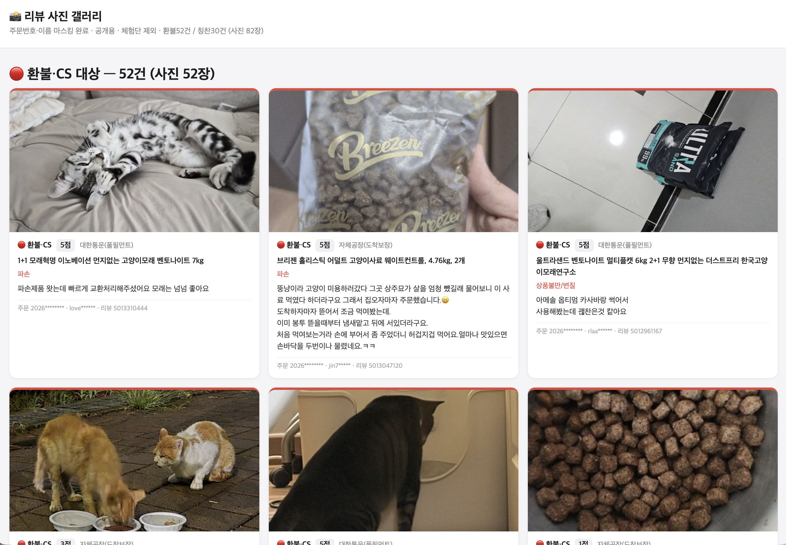
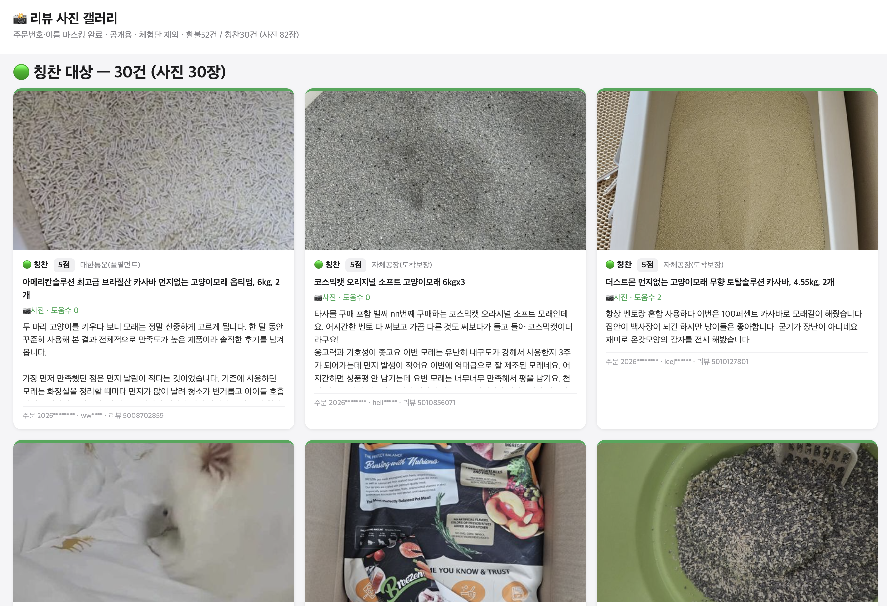

# 1주차 — 나만의 OS 만들기 🛠️

> 미션을 진행하며 **과정과 결과물**을 기록해주세요. (다 못 채워도 OK, 한 것 위주로!)

## 🎯 미션 1. 내 OS 재료 찾기
> 인터뷰 스킬(아이데이션)로 "내 삶에 필요한 게 뭔지" 찾기

- **과정 (어떻게 찾았나):**
  인터뷰 스킬로 하루/업무를 되짚으며 '매번 손이 가는데 시스템이 없는 일'을 찾았다. 처음엔 개인 일정 조율을 떠올렸지만, 진짜 매일 걸리는 건 **스마트스토어에 쏟아지는 고객 리뷰를 분류·전달하는 일**이라는 게 또렷해졌다. 지금은 담당자와 내가 그때그때 수동으로 처리해서 '시스템이 없는' 상태라는 걸 인터뷰 중에 확인했다.

- **결과:**

  ```
  🟡 내 삶을 돕는 OS · 재료 카드

  · 영역      : 일 (스마트스토어 고객 리뷰 기반 CRM 자동화 OS)

  · 걸리는 지점 : 매일 쏟아지는 고객 리뷰를 분류하는 '시스템이 없음'.
                그때그때 내가 들어가서 긁어다 "이분 연락해보세요" 하거나,
                담당자가 알아서 하거나 — 들쭉날쭉

  · 지금은    : ① 내가 수동으로 리뷰 훑기 → ② VIP·칭찬대상·불만/환불대상 눈으로 분류
                → ③ 주문번호·수취인명·리뷰번호 손으로 찾기 → ④ CRM 담당자에게 그때그때 전달(하거나 말거나)

  · OS가 된다면 : 매일 월~금 오전 8:30에 리뷰를 자동 분류 —
                · 상 받을 분(VIP·자주 사는 분·긍정 리뷰) → 칭찬 대상
                · 불만·부정 리뷰 → 고객만족보장제도(빠른 환불) 대상
                각 대상의 [주문번호·수취인명·리뷰번호]를 뽑아 리스트 → 담당자 + 나에게 전달
                + 월 1회: 해결 결과 리포트(환불 고객 수·주문 건수·금액, 칭찬 대상 선물 발송)

  · 한 문장   : "리뷰가 매일 아침 알아서 분류돼 도착하고, 나는 팬을 만드는 일에만 집중한다"

  · 첫 한 걸음 : 리뷰 분류 규칙(칭찬 대상 vs 환불 대상)을 먼저 정의하고,
                하루치 리뷰로 [주문번호·수취인명·리뷰번호] 리스트를 뽑아내는 것부터
  ```

- **느낀 점:**
  '시스템이 없다'는 걸 말로 꺼내놓고 나니, 이게 단발 작업이 아니라 매일 반복되는 일이라 자동화 가치가 크다는 게 분명해졌다. 특히 불만 고객은 빠르게 환불해 드리고, 잘 써주시는 분은 상을 드려서 팬층을 만든다는 두 방향이 하나의 흐름으로 묶인다는 점이 좋았다.

## 🧩 미션 2. 내 OS 기획
> 인터뷰 결과 + 세션 내용(흐민·배짱·키노) 활용해 기획

- **기획 내용:**
  전체를 한 번에 만들지 않고 **3단계**로 나눔.
  - **1단계 (이번 주 목표):** 하루치 리뷰를 넣으면 **분류 규칙**에 따라 두 갈래로 나눠 리스트업.
    - **상 받을 분** = VIP · 자주 사는 분 · 긍정 리뷰를 잘 써주는 분
    - **환불 대상** = 불만 · 부정 리뷰 → 고객만족보장제도 대상
    - 각 대상별로 `[주문번호 · 수취인명 · 리뷰번호]`를 표로 뽑아낸다.
  - **2단계:** 매일 월~금 오전 8:30에 자동 실행 → 분류된 리스트를 CRM 담당자 + 나에게 전달.
  - **3단계:** 월 1회 결과 리포트 — 환불 고객 수 / 주문 건수 / 환불 금액, 그리고 칭찬 대상에게 쿠폰·꽃바구니·선물+손편지 발송으로 '두터운 고객 팬층' 만들기.

- **막혔던 점 / 어떻게 풀었나:**
  가장 큰 고민은 '무엇을 자동화의 첫 조각으로 삼을까'였다. 매일 실행·전달·월간 리포트까지 한 번에 만들려니 막막했음. → **분류 규칙을 정의하고 하루치 리뷰에서 리스트를 뽑아내는 것**만 1단계로 떼어내면서, 나머지(자동 스케줄·전달·리포트)는 그 위에 얹는 구조로 정리했다.

## ⚙️ 미션 3. 내 OS 구현
> 실제로 만들어본 것 (클로드코드 '채널' 기능 활용 OK)
- **결과물:**
  클로드 코드로 **`리뷰분류` 채널**을 만들었다. 스마트스토어 리뷰 엑셀을 넣으면 두 갈래로 자동 분류한다. (채널 코드: 이 폴더의 [`리뷰분류-채널/`](리뷰분류-채널/) — `SKILL.md`, `triage.py`. 고객정보는 저장소에 안 올림)
  - **일간 모드:** 🔴 환불·CS 대상 / 🟢 칭찬 대상 두 표 → 각 행 `[상품주문번호·등록자·리뷰글번호·상품명·평점·배송출발지·리뷰요약]`
  - **월간 모드:** 경영진 CRM 보고용 집계 리포트
  - **사진 갤러리 모드:** 고객이 올린 리뷰 사진을 다운로드해 HTML 갤러리로 (파손·이물질 등 **증거 사진**을 리뷰와 함께 한눈에 — 담당자가 보고 바로 환불 판단)

  **실제 일주일치(3,900건)로 돌린 결과:**
  - 환불·CS 대상 **67건**으로 압축 (처음 헐렁한 필터에선 356건 → 2단계 필터로 정밀화)
  - 이 중 **별점 4~5점인데 내용은 불만(파손·유통기한·하자·썩음)인 리뷰 33건**을 잡아냄 → *평점만 봤으면 전부 놓쳤을 케이스*
  - 부정 사유 자동 분류(상품불만/변질·파손·기타불만) + **배송 출발지별**(대한통운 풀필먼트 25건 / 자체 음성공장 42건)로 책임소재 구분
  - 칭찬 대상은 5점 3,496건 → 정성 리뷰 **188명**으로 좁힘

  **핵심 설계:** 평점만 믿지 않고, 명백한 부정 신호가 있으면 5점이어도 환불 대상으로 끌어올리는 2단계 필터. (긍정 문맥의 '냄새 좋아요/별로 안 무거워요' 같은 오탐은 저평점일 때만 인정하도록 걸러냄)

- **링크 / 스크린샷:** 사진 갤러리 실행 결과 (고객 이름·주문번호 자동 마스킹, 체험단 제외)
  - 🔴 환불·CS 대상 (증거 사진): 
  - 🟢 칭찬 대상 (정성 리뷰 사진): 

## 📱 미션 4. SNS 1주차 소감
> AI 도움 없이 직접 작성! (인증하면 셀 지급)
- **인증 링크:** https://www.instagram.com/p/DaXz8FzJ53c/?igsh=MWg0eDFkM3dsZGNmbA==
