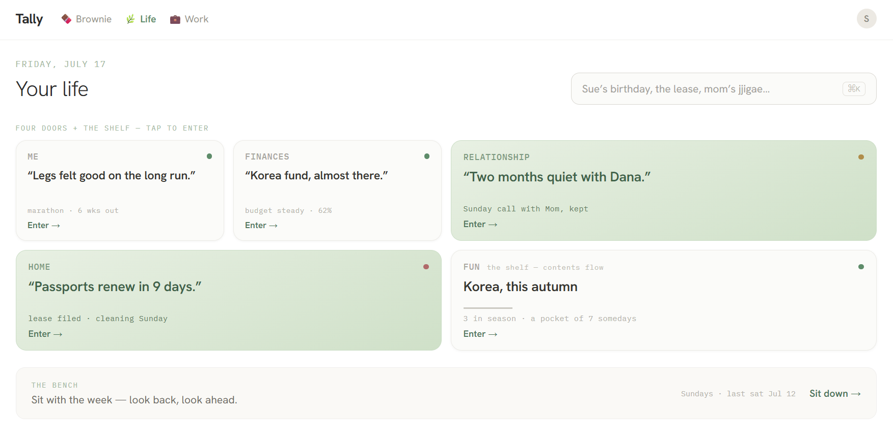

# 3주차 — 내 두뇌를, 내 걸로

이번 주는 세 가지를 했는데, 돌아보니 전부 한 얘기였다 — **소유권.**
남한테 빌려 쓰던 걸 내 걸로 되돌린 주.

## 🎯 미션 1. 내 삶을 돕는 OS 최종 완성

**완성한 것 (무엇을)**

1. **written ↔ parse 연결** — 저널에 그냥 쏟으면(written), 그게 소터로 넘어가(parse) 알아서 정리된다. 저장은 0.1초로 즉시 끝나고, 정리는 뒤에서 조용히 돈다. 진행은 칩으로 보인다 — `정리 중… → 확인 → 정리됨`. "쏟기만 하면 소터가 정리한다"던 비전이 드디어 한 줄로 이어졌다.
2. **파서 두뇌 교체: 유료 API → 내 Claude Code** — 정리를 돌리던 '두뇌'를 매달 돈 내는 남의 API에서, 이미 내가 쓰는 Claude Code로 옮겼다. API 키는 아예 지웠다. 두뇌가 하나, 그것도 내 것. 소터가 죽으면 가짜 정리를 지어내지 않고 정직하게 "지금 오프라인"이라 말한다 — 삶을 담는 OS에서 엉터리 정리는 거짓말이니까.
3. **Life 재정의: 대시보드 → 도서관** — Life를 다시 그렸다. 매일 열어 억지로 채우는 대시보드가 아니라, 질문이 생겼을 때 찾으러 가고 주말에 한 번 거니는 **도서관**으로. 네 개의 문(Me · Finances · Relationship · Home) + 선반(Fun) + 벤치(주말에 앉아 한 주 돌아보기).

> 그 과정에서의 삽질 — ① **가장 큰 삽질은 코드가 아니라 나였다.** Life를 손보다 문득 *"내가, 내가 만든 시스템에 나를 맞추고 있네, 근데 이건 내가 실제로 생각하는 방식과 다르네"* 싶어 멈추고 뿌리부터 다시 물었다. ② 두뇌를 바꾸니 속도의 성격이 바뀌어(2초→15~90초) 어떤 저장이 **85초나 멈췄다** — 빠른 시절 저장 경로에 얹어둔 측정 작업이 발목을 잡아서. 백그라운드로 빼서 해결.

**피드백 반영한 점**

이번 주 변화의 방아쇠는 외부 피드백이 아니라, 내가 직접 쓰면서 느낀 위화감이었다. Life를 열 때마다 어딘가 어긋난 느낌 — 남이 지적해준 게 아니라 내 손이 먼저 알았다. 그 위화감을 무시하지 않고 뿌리부터 다시 물은 것이 이번 주의 방향을 바꿨다.

**결과물 (스크린샷)**

**알게 된 인사이트**

> OS는 나를 시스템에 맞추게 하는 게 아니라, 내가 실제로 생각하는 방식을 드러내야 한다 — 그리고 그 두뇌는 내 것이어야 한다.

## 📣 미션 2. 스폰지 토크데이 SNS 후기

- **후기 내용:** 토크데이 후기는 추후 보강 제출 예정.
- **SNS 인증 링크:** _(추후 추가)_
