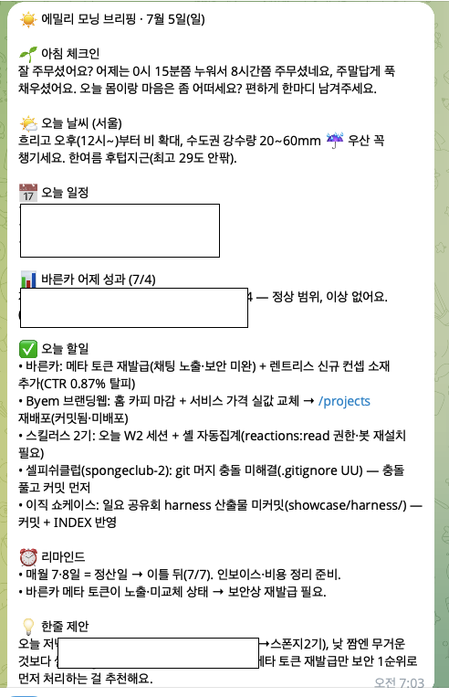

## 개인 OS 결과물 
> **Byem = 에밀리의 광고·AI 에이전시. 이 하네스 = 총괄비서가 전 프로젝트를 꿰고 Byem을 키우는 운영체제.**

텔레그램으로 소통하는 "내 모든 일을 아는 AI 총괄팀"을 만들었어요

▎ 내 개인 스케줄부터 내가 하는 모든 프로젝트까지 다 아는 비서를, 텔레그램 하나로. 24시간 나랑 얘기하고 매일 브리핑해주는 구조. 그 동기·구조·협업 방식 정리.

## 1. 왜 만들었나

- **내 개인 스케줄 + 내가 하는 모든 프로젝트를 통째로 아는 팀**이 필요했어요. 24시간 텔레그램으로 얘기하고, 매일 브리핑해주는.
- 제일 큰 이유는 **"내 프로젝트 전체를 아는 것"**:
  - 저는 **Byem**이라는 웹을 만들었어요. 제 서비스·프리랜서 상품 페이지이자, **포트폴리오 작업물이 쌓이는 공간**이에요.
  - 그 웹은 **"모든 걸 아는 본사팀" + "브랜딩팀"이 협업**해서 상시 업데이트되는 구조
  - 일이 많아 정리가 안 돼서 → **내가 하는 모든 게 자동으로 아카이빙될 공간**이 필요했고요.
  - 개인스케쥴, 프로젝트 현황, 할 일을 정리하고 즉각적으로 보고되는 시스템
  - 노트북 밖에서도 일할 수 있는 환경을 만들고 싶어서
- 그리고 **내가 던지는 레퍼런스·아이디어·감정까지 다 쌓여서**, 나중에 자산이자 포폴이 되는 구조.

## 2. 이게 가능했던 진짜 이유 — 내 일이 다 "AX화"되어 있어서

- 제 일이 이미 전부 **AI로 굴러가게(AX) 세팅**돼 있어요. 프로젝트가 다 폴더(레포)로 있고, 클로드코드로 작업하니까요.
- 그래서 팀이 **그 폴더들만 읽으면 내 일 전체를 알 수 있어요.** 

## 3. 큰 그림 — "본사팀"이 전체를 관장

**핵심: 우리는 "비서팀"이 아니라 "본사팀"이에요.** 비서·총괄·일꾼은 그 **안의 역할**이고, 본사팀 자체가 전체를 정리·관장하는 상위 조직이에요.

```
🏢 본사팀 (emily-os) ── 나(대표)와 텔레그램 단일 창구, 전체를 관장
   │
   ├─ 👔 COO (총괄)       내 톡 받고 판단·라우팅·보고
   │
   ├─ 🧑‍💼 직속팀 (상시·비서 역할)
   │     📅스케줄러 · 🗂기록관리(git담당) · ⚖️세무사 · 🧘상담사 · 🧑‍💼인사
   │
   └─ 🔧 워커풀 (소환·재사용·어디서든)
         📊분석가 · 🔎리서처 · 📋PMO · 📈리포터
         🎨 스튜디오 (매체별 묶음 — 각자 기획+제작 통째로):
            🎬영상 · 🖼소재(단컷·카드·캐러셀·피드) · 📊덱/PPT · ✍️카피
        │
        └─ 아래 프로젝트 팀들을 관장:
           🟩 byem(브랜딩) · 🟥 바른카 · 🟦 스폰지 · 🟫 byem-os(제품) 등
```


- **텔레그램에 툭 → COO가 종류 판단·라우팅 → 담당이 처리 → 나한텐 "정리된 한 덩어리"로.**
- COO는 두 모드로 일해요: ① **오케스트레이터**(위에서 관장) / ② **팀 접속**(특정 팀 폴더 열어서 그 팀 오너가 됨).

## 4. 핵심 원리 ① — 능력은 글로벌, 컨텍스트는 폴더

여기가 제일 중요한 깨달음이에요.

- **능력(에이전트 + 스킬) = 글로벌.** 어느 팀 폴더에서 세션을 열어도 같은 팀이 소환돼요. (분석가·리서처·소재 스튜디오·PPT·카피 스킬… 다 어디서든)
- **컨텍스트·기억·산출물 = 그 팀 폴더.** 그 팀의 브랜드·과거 자산·규칙이 폴더에 있어요.
- **그래서 각 팀 폴더 안엔 에이전트를 거의 안 둬요(보통 0개).** 일꾼은 글로벌이니까요.
  - **예외 = 그 프로젝트에만 특화된 전담.** 예: 바른카(돈 나오는 #1 클라)는 바른카 계정·경보값에 튜닝된 전담 분석가를 폴더에 둬요.
- **"팀 접속"의 실체 = 그 폴더를 여는 것.** 폴더가 일꾼에게 "그 팀 옷"을 입혀줘요. 본사를 안 거쳐도 글로벌 일꾼이 그 폴더에서 바로 돌아요.

→ **"바른카 소재 만들어줘" 한마디** → 바른카 폴더 열림 → 글로벌 소재 스튜디오 소환 → 바른카 브랜드로 제작 → 바른카 폴더에 저장. 재구축 없음.

**🎨 그 "스튜디오"는 매체별 담당 4명이에요 — 각자 기획+제작을 통째로:**

| 담당 | 한 애가 통째로 (스킬 3-4개 묶음) |
|---|---|
| 🎬 **영상** | 스토리보드→스크립트→렌더 (Remotion 등) |
| 🖼 **소재** | 단컷·카드·캐러셀·피드 기획→제작 (canvas·threads 등) |
| 📊 **덱/PPT** | 공유회/발표 기획→카피→슬라이드→영상 (ppt-guide·ppt-warm) |
| ✍️ **카피** | 랜딩·광고·PPT 카피 + 브랜드 보이스 감수 |

- **매체별로 묶은 이유:** 사람은 기획자·제작자가 따로지만, **AI는 한 애가 기획→제작을 한 맥락에** 다 들 수 있어요. "영상 만들어줘" 한 번에 끝. (기획팀/제작팀 나누면 매번 릴레이라 느림)
- **스킬은 고정이 아니라 라이브러리** — 프로젝트 가면 그 팀에 맞는 스킬을 꺼내 써요.
- **물량 많은 팀은 그 담당을 그 팀 폴더에 전담 복제**(인사). 예: 스폰지 매주 공유회 → 스폰지 전담 덱 담당.
- 앞으론 담당마다 스킬 더 붙여 강력하게, 나중엔 슬랙에서도 일하게 할 거예요.

## 5. 핵심 원리 ② — 모든 팀 폴더가 똑같은 모양 (한눈에)

새 팀이 생겨도 항상 같은 골격이라, 어느 폴더를 열어도 0.5초에 파악돼요.

```
<팀>/
  CLAUDE.md         팀 규칙 + 📁폴더 지도 (세션 열면 자동 로드)
  docs/             📄 만든 것 (PRD·기획·리포트·산출물)
  docs/memory/      🧠 아는 것
    MEMORY.md       인덱스 + 담당표 (여기부터 읽음)
  .claude/agents/   전담 에이전트만 (보통 0개)
```

- **`docs`(만든 것) vs `docs/memory`(아는 것)** 딱 둘로 분리.
- **memory 서브폴더 = 담당 에이전트 구역** (성과→분석가, 계약→세무사, 소재→스튜디오…). 각자 자기 구역을 최신 유지 → 폴더가 안 지저분해져요.
  - 예(본사 memory): `finance`💰돈 · `personal`🙂개인 · `life-log`😴감정 · `refs`📎레퍼런스 · `rules`📜원칙 · `system`⚙️인프라 · `project`📊프로젝트 — **종류별로 딱 나눠서** 담당이 최신 유지.
- **새 팀 = 템플릿 복붙**(인사가 온보딩). 그래서 확장해도 끊김 없어요.

## 6. 핵심 원리 ③ — git 레포 = 그 팀의 뇌

- 팀의 기억을 **사람(에이전트)한테 안 맡기고 레포에 둬요.**
- 그래서 **상주 팀장이 필요 없어요** — 폴더를 열면 그 순간 그 팀 오너가 "돼요."
- 어느 맥(집·회사)에서 열든, pull 한 번이면 똑같은 상태. **헤드카운트 최소, 컨텍스트는 전부 git에.**

## 7. 내가 말하는 건 어떻게 저장되나 (자동 아카이빙)

**전부 로컬 MD가 정본. 노션은 눈으로 봐야 하는 것만.**

| 내가 흘리는 말 | 저장처 |
|---|---|
| "퇴사하면 이렇게…" (로드맵) | 🖥 로컬 MD (개인) |
| "이런 서비스 있으면" (아이디어) | 🖥 로컬 MD (인박스) |
| "이 광고 레퍼 좋다" (레퍼런스) | 🖥 로컬 MD (자산고) |
| "제주 여기 가고싶어" (여행) | 📊 노션 (눈으로 봐야) |
| "오늘 지쳐 / 6시간 잤어" (감정·수면) | 🔒 로컬만 |

→ 정리 안 해도 **말하는 순간 알아서 아카이빙.** 민감한 건 로컬만, 회사(이넙트) 계정은 절대 안 건드려요.

## 8. 매일/매주 나한테 해주는 것

- 🌅 **데일리(아침)**: 날씨 · 오늘 일정 · 바른카 어제 성과 · 오늘 움직일 프로젝트 · 리마인드
- 🌙 **밤**: 저녁 체크인(상담사) + 오늘 한 일 마감 + 내일 챙길 것
- 📅 **위클리(월요일)**: 지난주 진척 · 이번주 P0 · 개인 삶 임박(여행 등)
- ⏰ **돈 리마인드**: 매월 정산·받을 돈(예: 바른카 대행비) 자동 체크
  

## 결론

> 내 일이 이미 다 AI로 굴러가니까(AX), **텔레그램 하나로 "내 일 전체를 아는 본사팀"을 붙일 수 있었어요.** 개인 스케줄부터 모든 프로젝트, 포폴 채우기, 감정 케어, 받을 돈, 아카이빙까지 — 한 창구에서. 그리고 **어느 폴더를 열어도 같은 모양이라, 나도 팀도 한눈에** 파악해요.