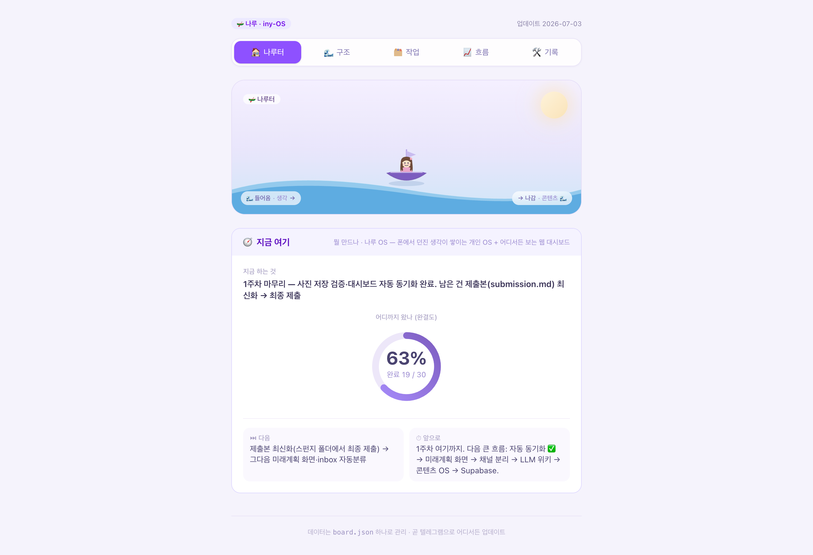
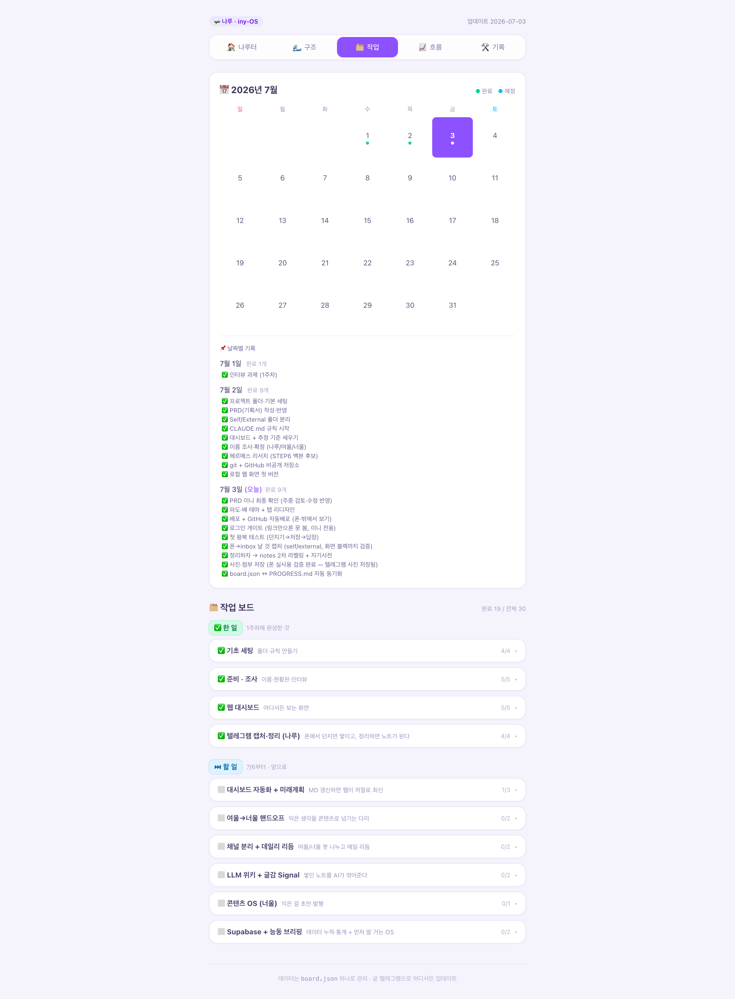

# 1주차 — 나만의 OS 만들기 🛠️

> 배운 걸 콘텐츠로, 콘텐츠를 포트폴리오 자산으로 굴려주는 내 개인 OS "나루"를 만들었어요.
> 나루는 나루터에서 따온 이름이에요. 생각을 던지면 자산으로 건너가는 나루터.

## 🎯 미션 1. 내 OS 재료 찾기
> 인터뷰 스킬(아이데이션)로 "내 삶에 필요한 게 뭔지" 찾기

- 어떻게 찾았나: 인터뷰 스킬로 5스텝을 따라갔어요. 오늘 하루 → 짜증 포인트 → 일 밖의 나 → 무게 재기 → OS가 된다면. 남의 사례(흐민 OS, 크리에이터 OS)는 일단 밀어두고, 내 하루에서 진짜 걸리는 지점부터 시작했어요.
- 내가 찾은 OS 재료:
  - 영역은 일이랑 삶 둘 다예요. 사실 같은 파이프라인이더라고요.
  - 걸리는 지점: 지식이랑 경험은 많은데, 이걸 어떻게 내 자산으로 만들지 방향을 못 잡겠더라고요. 강의·공유회·독서·생각으로 배운 게 그냥 휘발되고, 콘텐츠 재료로 정리하는 단계가 통째로 비어 있었어요.
  - OS가 된다면: 채널에 툭 던지면 뭘 배웠고 어떤 의미인지 정리되고, 콘텐츠 초안까지 자동으로 나왔으면 했어요.
  - 한 문장으로: 머릿속에서 휘발되던 배움이, 던지기만 하면 내 콘텐츠랑 포트폴리오 자산이 되어 돌아온다.
- 느낀 점: "만들 게 없다"가 아니라 "많은데 방향을 못 잡는다"가 내 진짜 문제였어요. 인터뷰하면서 알게 됐어요. 일이랑 삶이 따로가 아니라 같은 자산화 파이프라인이라는 것도요.

## 🧩 미션 2. 내 OS 기획
> 인터뷰 결과 + 세션 내용(흐민·배짱·키노) 활용해 기획

- 나루 파이프라인은 이렇게 잡았어요:
  - 던지기(텔레그램) → 여울(사고: 되묻고 무르익히기) → 너울(콘텐츠: 초안·발행) → 웹사이트 허브 → 재발행 → 링크드인·리멤버로 오퍼랑 퍼스널 브랜딩까지.
  - Self랑 External은 안 섞어요. 내 머리에서 나온 것(생각·회고)이랑 외부 자료(책·강의·속기본)를 따로 저장해요.
  - 흐민 3층에 맞춰봤어요. 1층 사고는 여울, 2층 지식은 정리·연결, 3층 자산화는 너울이랑 웹사이트.
  - 로드맵은 STEP 1~6이에요. 대시보드 → 핸드오프 → 채널 분리 → LLM 위키 → 콘텐츠 OS → 웹 대시보드·상주 백본. 한 번에 다 안 만들고 한 칸씩 가요. (흐민 말대로 0 to 100 하지 말 것.)
- 막혔던 점이랑 푼 방법:
  - 아이디어가 너무 많아서 다 만들려다 "블랙박스" 될 뻔했어요. 그래서 1단계는 대시보드 하나로 좁히고, 나머지는 로드맵에 예약해뒀어요.
  - Self랑 External 구분이 헷갈렸는데, "이 내용이 원래 누구 머리에서 나왔나"를 기준으로 잡으니까 풀렸어요.
  - 채널을 왜 나누는지 궁금했는데, 인지 모드로 이해했어요. 발산은 여울, 실행은 너울. 그렇게 이름까지 확정했어요.

## ⚙️ 미션 3. 내 OS 구현
> 실제로 만들어본 것 (클로드코드 '채널' 기능 활용 OK)

- 프로젝트 폴더 나루(iny-OS) 위에 실제로 도는 걸 3개 만들었어요. (1주차 완결도 19/30, 63%)
  - 🌐 웹 대시보드 — Next.js로 만들어서 Vercel에 배포까지 했어요 → https://iny-naru.vercel.app. 파도랑 배 테마로 리디자인했고, 로그인 게이트를 걸어서(링크만으론 못 봐요, 저만 봐요) 폰으로도 밖에서도 내 진행현황을 봐요.
  - 📱 텔레그램 나루 봇(상주형, @iny_os_bot) — 폰에서 생각을 던지면 inbox/self·external에 날 것 그대로 저장돼요. 사진이랑 첨부까지 폰으로 직접 써보면서 검증했어요. "정리하자" 하면 notes에 2차 라벨링이랑 자기사전까지 자동으로 만들어줘요.
  - ⚙️ 자동 동기화 — board.json 하나만 고치면 커밋할 때 훅이 PROGRESS.md랑 웹 대시보드를 같이 자동으로 갱신해줘요. 대시보드가 낡는 문제를 아예 뿌리부터 없앴어요.
  - 📄 기반 문서도 세 개 만들었어요. PRD.md는 전체 기획, CLAUDE.md는 작동 규칙(불편할 때마다 한 줄씩 늘려요), PROGRESS.md는 자동으로 만들어지는 현황판.
- 이어서 할 것: 미래계획 화면, inbox 자동 분류(성찰·할일·알람), 여울→너울 핸드오프로 첫 콘텐츠 초안 뽑기.
- 링크: 웹 대시보드 https://iny-naru.vercel.app (로그인 필요)
- 스크린샷: 이미지첨부/ 폴더에 넣어놨어요.
  - 
  - 

## 📱 미션 4. SNS 1주차 소감
> AI 도움 없이 직접 작성! (인증하면 셀 지급)

- 인증 링크: https://www.instagram.com/p/DaUypGZEVks/
