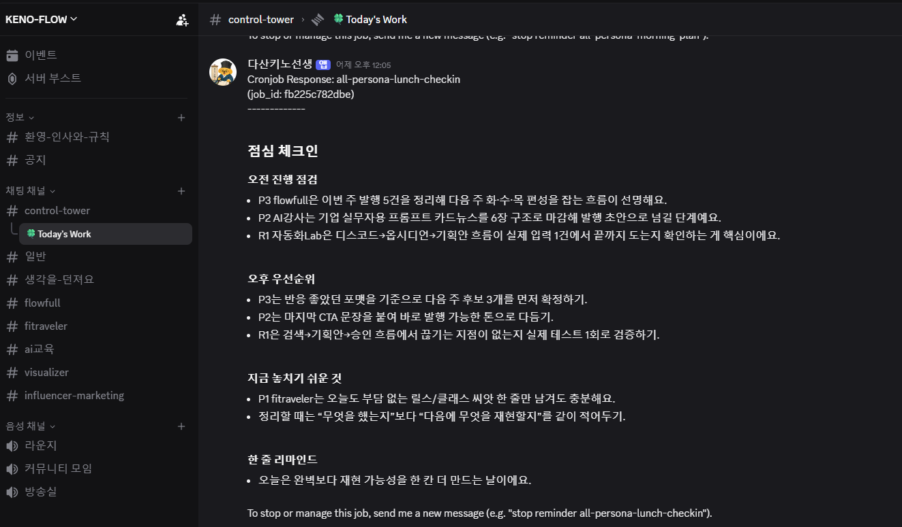

# 3주차 — 내 OS 최종 완성 🏁

> 미션을 진행하며 과정과 결과를 기록해주세요. (다 못 채워도 OK, 한 것 위주로!)

## 🎯 미션 1. 내 삶을 돕는 OS 최종 완성
> 지금까지 공유하며 받은 **피드백을 반영해 최종 완성**!
- **완성한 것 (무엇을):** 수업·콘텐츠 운영을 돕는 **KENO-FLOW** — 디스코드 기반 멀티 페르소나 관리 OS. `control-tower` 채널에서 다산키노선생 봇이 cronjob으로 하루 여러 번 자동 체크인(오전 점검 → 오후 우선순위 → 놓치기 쉬운 것 → 한 줄 리마인드)을 띄워, fitraveler·AI강사·flowfull·자동화Lab 등 여러 페르소나의 진행 상황을 한 눈에 정리해준다.
- **피드백 반영한 점:** 다른 분들이 만들어서 쓰는 걸 보면서, 내 OS도 좀 더 구체화해야겠다는 생각을 했다. 막연하게 "자동화" 하던 걸 페르소나별 채널로 흐름을 쪼개고, 체크인도 "뭘 했나"보다 "다음에 뭘 재현할지"에 초점을 맞추는 쪽으로 구체화했다.
- **결과물 (링크·스크린샷 — 이미지는 `이미지첨부/` 폴더에):** 아래 `image.png` — control-tower 채널에서 다산키노선생 봇이 점심 체크인을 자동으로 실행한 화면
- **알게 된 인사이트:** 아직 기능 사용은 어색하지만, 내가 **원격으로 헤르메스를 조절해서 컴퓨터에 직접 인풋을 넣을 수 있다**는 걸 알게 됐다. 자리에 없어도 내 OS를 굴릴 수 있다는 게 가장 큰 발견이었다.

## 📣 미션 2. 스폰지 토크데이 SNS 후기
> 오늘 토크데이 후기를 SNS에 올리기 (**#스폰지클럽 필수 · 셀 3개 지급!**)
- **후기 내용:**
지난 주 일요일에는 스폰지 클럽 2기에
오프라인 모임 스폰지 토크가 있었습니다

저는 이번에도 모더레이터로 참여하여
많은 스폰지들과 이야기를 나눌 수 있었는데요.
다들 나만의 OS를 만들면서 AI를 활용하고 각자의 방향성을 잡아 가는 모습들을 볼 수 있었습니다.

AI 활용은 점점 더 쉬워 지고 있는 이 상황에서
우리가 앞으로 나아가야 될 방향에 대해서 조금 더 깊게 고민해 볼 수 있는 시간 이었는데요

이렇게 양질의 대화를 나눌 수 있는 커뮤니티에서
만난 좋은 사람들과 고민을 함께 나눌 수 있는 시간이었습니다. 혼자 가면 빨리 함께 가면 멀리 갈 수 있는 것처럼
우리 같이 멀리 갈 수 있도록 남은 시간도 함께해요💚

- **SNS 인증 링크:**
https://www.instagram.com/p/Da8BPNsGJes/?utm_source=ig_web_copy_link&igsh=MzRlODBiNWFlZA==