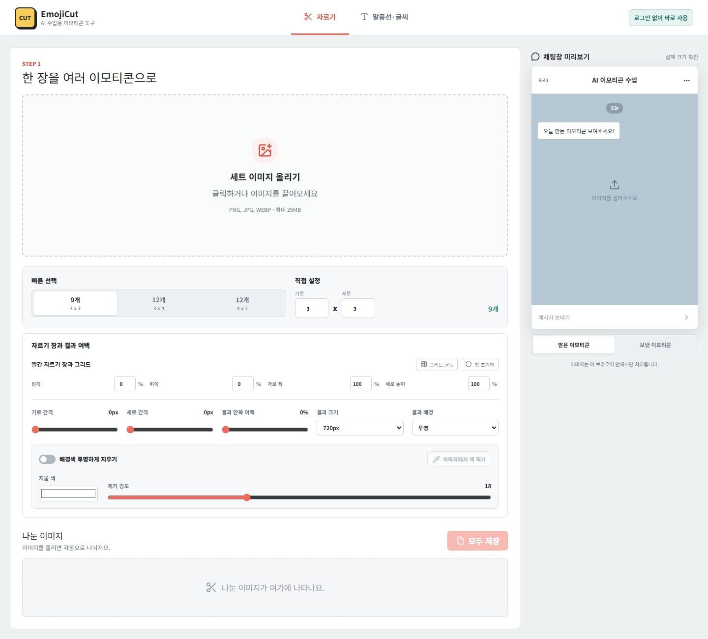

# 5주차 — 마지막 과제 🏁

> 이번 기수의 마지막 과제예요. 과정과 소회를 기록해주세요. (다 못 채워도 OK!)

## 🎯 과제 1. 구현, 그 다음의 것

> 만드는 건 끝났는데 — 그 다음이 진짜 시작이에요 (답이 안 나와 있어도 OK, 고민을 꺼내놓는 것 자체가 과제)
- **지금 걸려 있는 고민 하나:** 유저들이 "배경을 투명으로 빼주면 좋겠다"고 하는데, 정작 카카오톡 이모티콘은 규정상 투명 배경을 그대로 쓰기 어렵다. 사용자가 원하는 편의 ↔ 실제 등록 플랫폼의 규정, 이 사이에서 도구를 어디에 맞춰야 할지가 고민.
- **그게 왜 고민인지 (무엇이 걸리는지):** 도구는 사용자가 원하는 대로 만들어주고 싶은데, 최종 목적지(카톡 이모티콘 등록)의 규격이 그걸 막는다. "예쁘게 자르기"에 맞출지, "바로 등록 가능한 규격"에 맞출지 방향이 갈린다.
- **어떻게 풀어볼 생각인지:** 투명 옵션은 그대로 두되, **"카카오톡 등록용" 프리셋**(흰 배경·규격 준수)을 따로 만들어 목적에 맞게 고르게 하고, 규정 안내 문구도 함께 띄워주는 방향으로 풀어보려 한다.
- **필요한 게 있다면 무엇인지:** 카카오톡·라인 등 플랫폼별 이모티콘 규격(사이즈·배경·개수) 정리 자료.

## 🏁 과제 2. 구현 마무리 + 실제 유저 피드백 받기

> 시작할 때 "이번엔 이건 꼭 만들겠다" 했던 것 — 지금 어디까지 왔나요? (스폰지클럽 내 유저피드백 모집 가능)
- **최종 완성한 것 (지금 어디까지):** **EmojiCut** — 이미지 한 장을 여러 개의 이모티콘으로 자동 분할해주는 **AI 수업용 도구**. 3×3·3×4·4×3 격자 프리셋 + 직접 설정(가로×세로), 간격 조절, 배경 처리(투명/흰색/직접), 결과 크기(360·720·1080px) 선택까지 지원. 로그인 없이 브라우저에서 바로 처리(개인정보 보호), PNG·JPG·WEBP 최대 25MB. 수업 중 만든 이미지를 이모티콘 세트로 뽑아 "오늘 만든 이모티콘 보여주기"까지 바로 이어지게 완성.
- **🚀 실제 배포 URL:** https://emojicut.amuse-ai.chatgpt.site/
- **결과물 (링크·스크린샷 — 이미지는 `이미지첨부/` 폴더에):** 위 URL에서 바로 체험 가능 (로그인·설치 없음). 아래는 EmojiCut 실행 화면.

- **받은 유저 피드백:** "이전에 **캔바로 하나하나 자를 때보다 훨씬 편하다**"는 반응이 가장 컸다. "배경을 투명으로 빼주면 좋겠다"는 요청도 있었지만, 카카오톡 이모티콘 규정상 투명 배경은 그대로 쓰기 어려워서 반영은 보류(→ 위 과제 1의 고민으로 이어짐).

## 📣 과제 3. SNS에 남기기

> 구현했던 것들 + 그 다음 단계에 대한 생각 (아끼면 아무 일도 안 일어나요 — 꺼내놓는 순간 가장 많이 남아요)
- **구현했던 것들 (무엇을 / 어떻게 굴러가는지 / 뭐가 달라졌는지):** 이미지 한 장만 올리면 격자로 자동 분할돼 이모티콘 세트가 뚝딱 나오는 **EmojiCut**을 만들었다. 예전엔 캔바로 하나하나 잘라야 했는데, 이제 한 번에 끝난다. 덕분에 수업에서 "이모티콘 만들기"라는 막연했던 활동이, 학생이 직접 만들고 바로 공유하는 흐름으로 바뀌었다.
- **다음 단계 생각 (뭘 더 하고 싶은지 / 남은 것 / 어디로):** ① 카카오톡 등록용 프리셋(규격 준수) 추가 ② 수업 커리큘럼에 EmojiCut 실습 정식 편입 ③ 그동안 만든 수업 도구들을 KENO-FLOW로 묶어 통합 관리.
- **SNS 인증 링크:** (게시 후 추가 예정)
