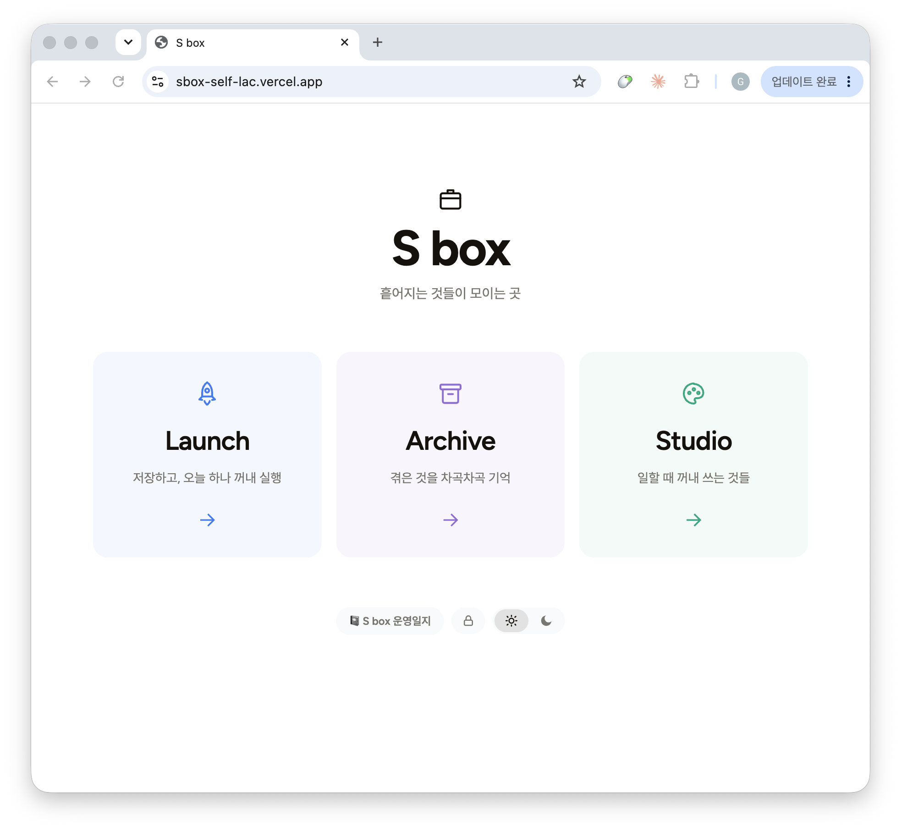
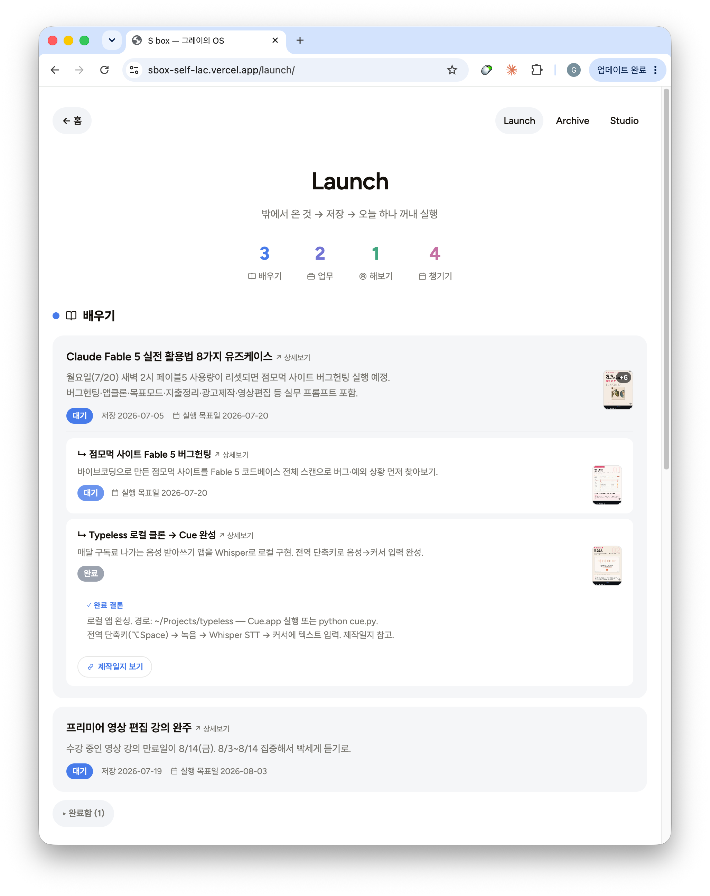
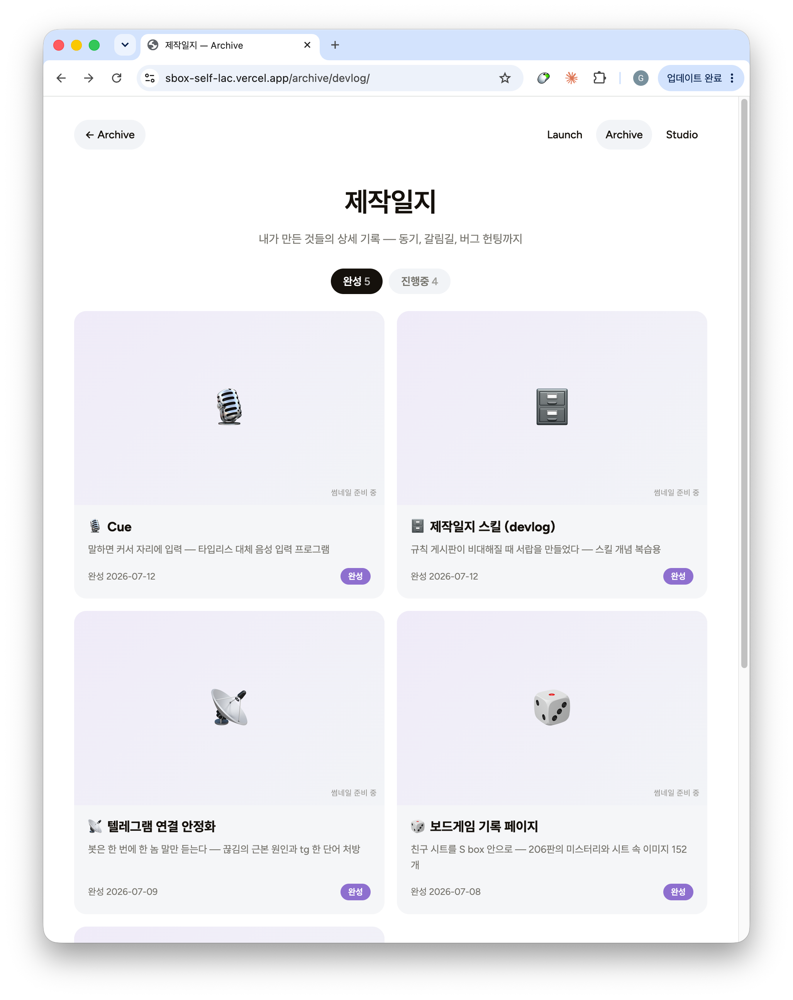
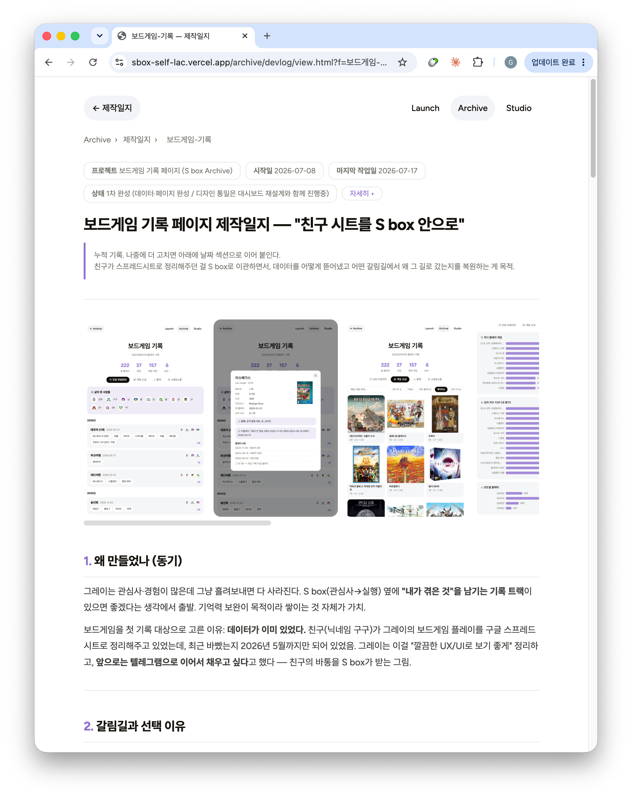
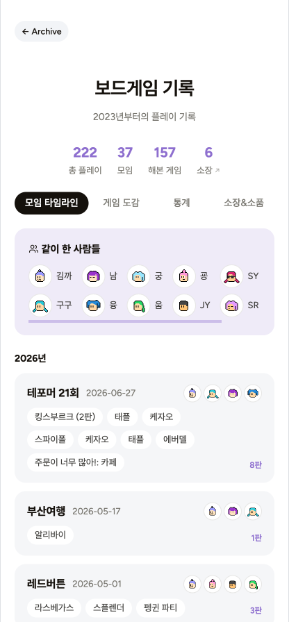
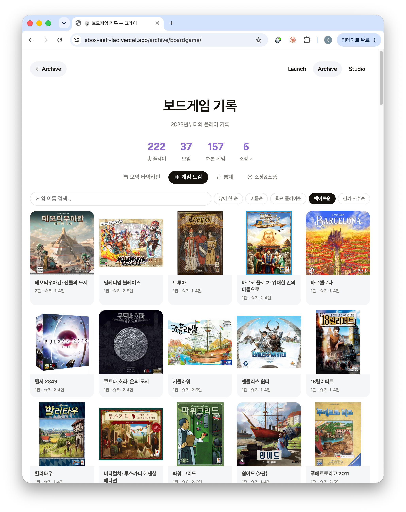
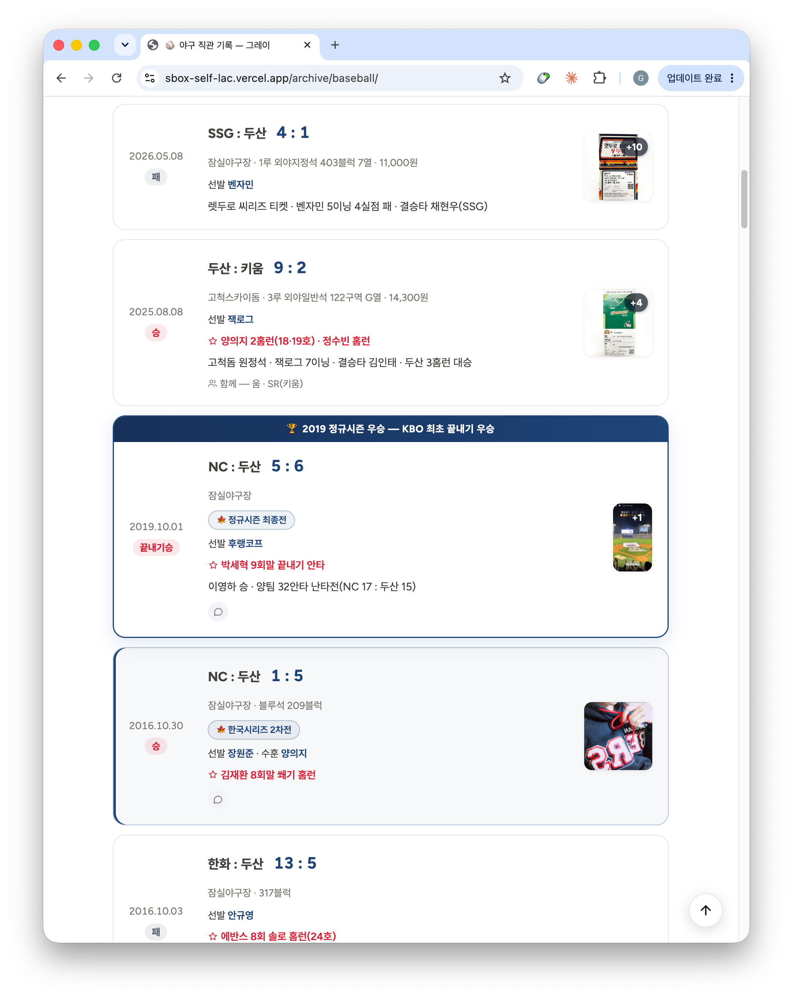
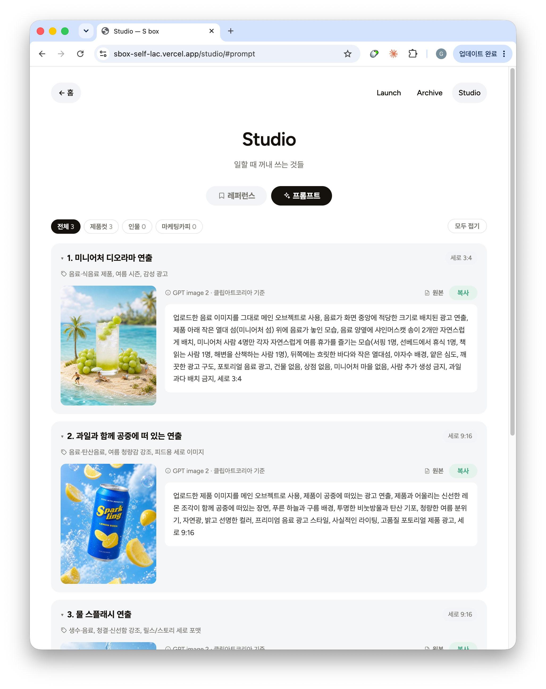
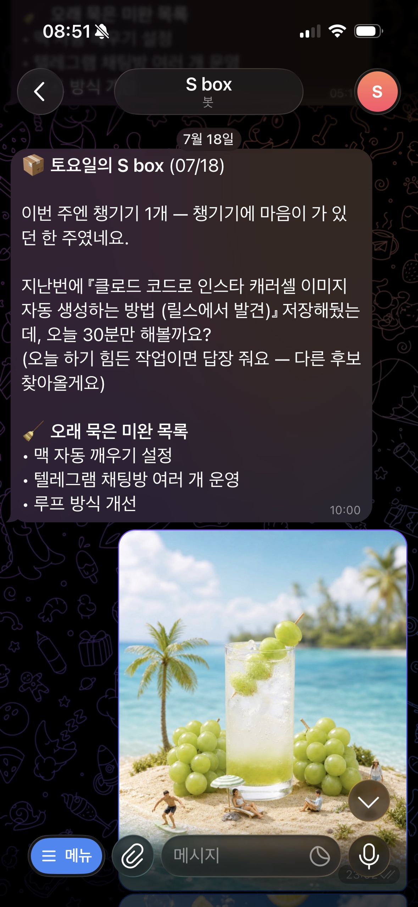
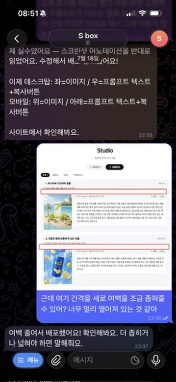

# 3주차 — 내 OS 최종 완성 🏁

> 미션을 진행하며 과정과 결과를 기록해주세요. (다 못 채워도 OK, 한 것 위주로!)

## 🎯 미션 1. 내 삶을 돕는 OS 최종 완성
> 지금까지 공유하며 받은 **피드백을 반영해 최종 완성**!

1주차에 골격을 잡은 **S box**(텔레그램 기반 개인 OS)를, 이번 주에 실제로 쓸 수 있는 형태로 완성했다. 시작은 "저장만 하고 안 꺼내는 게 문제니, 쌓아두지 말고 **꺼내 쓰자(실행)**"였다. 그런데 만들다 보니 방향이 옮겨갔다 — 실행만큼이나, **내가 겪은 것·배운 것을 기록으로 쌓는 것**이 나에게 안도감과 만족감을 주었다. 그래서 상자 하나로 시작한 시스템이 **기억을 쌓는 방(Archive)을 중심으로** 세 개의 방으로 자랐다.

### ✅ 완성한 것 (무엇을)

**① 상자 하나 → 세 개의 방 (홈 재설계)**
만들다 보니 "실행할 것" 말고도 담고 싶은 게 많았다. 그래서 홈을 세 갈래로 나눴다.
- **Launch(실행)** — 밖에서 온 것을 꺼내 실행. 배우기·해보기·챙기기·업무.
- **Archive(기억)** — 내가 겪은 것, 배우고 있는 것을 저장. 보드게임·야구·제작일지·스터디.
- **Studio(작업)** — 일할 때 꺼내 쓰는 재료. 디자인 레퍼런스·이미지/마케팅 프롬프트.

**② Archive — 기억하고 싶은 걸 쌓는 방**
이미 살면서 꾸준히 기록을 쌓아온 것들, 그동안의 데이터를 나만의 OS에 심는다.
- **야구 직관** — 2009년부터 모은 실물 티켓을 웹으로. 80경기 등록. 티켓 이미지는 내가 직접 포토샵으로 가공하고, 데이터 정리는 클로드가 맡는 분업으로 진행했다.
- **보드게임 기록** — 그동안 친구가 스프레드시트로 관리해주던 플레이 기록(200판 이상)을 S box 안으로 들여와 모임 타임라인·게임 도감·통계·내 평점까지 한 화면에서 꺼내볼 수 있게 재구현.

**③ 배움을 기록으로 남긴다 — 제작일지 & 스터디**
이 나만의 OS를 만들어가는 과정을 제작일지에 아주 상세히 남기고 있다. 바이브 코딩을 경험하는 과정 자체의 기록이다. 여기에 배운 개념을 내 언어로 정리하는 **스터디 노트**도 더했다.

**④ 실행 루프 자동화 + 반복 작업을 스킬로**
"토요일 오전 10시 배우기 추천"을 자동 알림으로 연결했고, 매일 아침 날씨와 브리핑은 **텔레그램이 꺼져 있어도 맥북만 켜져 있으면** 온다. 그리고 반복되는 작업은 **직접 '스킬'로 만들었다** — 제작일지 쓰는 절차(devlog 스킬), 세션을 옮길 때 정리하는 절차(sbox-wrap 스킬).

> **한 장 요약**
> ```
>                 📦 S box  (텔레그램이 입구)
>        ┌───────────────┼───────────────┐
>     🚀 Launch       🗂️ Archive        🎨 Studio
>     실행할 것         겪은 것            일할 때 쓰는 것
>     저장→실행→재개     기억 보완           꺼내 쓰는 재료
>        │
>     ⏰ 자동 루프: 아침 브리핑(매일 9시) · 토요일 실행할 것 추천(10시)
> ```

### 🔁 피드백 반영한 점

- **"업무 OS보다 자기가 재미를 느끼는 OS가 개인 OS의 본질"** — 내가 하고 싶은 걸 만들다 보니 흥미가 붙어 집중해서 만들게 됐고, 덕분에 시스템을 **극도로 개인화**할 수 있었다. ("나에게 맞는 나를 위한 OS")
- **"개인 비서 같다 / 오늘의 할 일 알림이 있으면"** — 진짜 개인 비서에 가까워지게, **텔레그램이 꺼져 있어도 맥북만 켜져 있으면 아침 날씨 브리핑 정도는 자동으로 오도록** 만들었다.
- **"바로 웹으로 볼 수 있게 되나요"** — 1주차 땐 텔레그램 연동이 자꾸 끊겨 불안정했다. 지금은 **왜 끊겼는지 원인을 파악하고, 끊겨도 바로 다시 연결되게 대처해뒀다.** 그래서 "오늘은 밖에서 텔레그램으로 일해야지" 싶으면 나가기 전에 확실히 세팅 해두고 나갈 수 있다. (두 글자만 입력하면 완료.)

### 🔗 결과물 (링크·스크린샷)

**작동하는 웹 대시보드 (라이브):** https://sbox-self-lac.vercel.app
*(비밀번호: `그레이`)*

입력은 **텔레그램**으로(폰에서 링크·캡처·메모를 툭 던지면 자동 분류·저장), 보기는 **웹 대시보드**로 역할을 나눴다.


*홈 — Launch(실행)·Archive(기억)·Studio(작업) 세 방으로 갈라지는 허브.*


*Launch — 저장한 것을 카테고리별로 모아두고, 오늘 하나 꺼내 실행한다.*


*Archive › 제작일지 — 만든 것들의 상세 기록 목록.*


*제작일지 상세 — 동기·갈림길·버그 헌팅까지 남긴다.*


*Archive › 보드게임 — 시트에 흩어져 있던 37번의 모임을 한 화면에. (모바일)*


*게임 도감 — 해본 게임을 표지로 모아본다. (PC)*


*Archive › 야구 — 2009년부터 모은 직관 티켓과 기록.*


*Studio — 이미지 생성 프롬프트 등 일할 때 꺼내 쓰는 재료.*


*토요일 오전 10시 — 저장해둔 것 중 하나를 꺼내 자동으로 추천.*


*폰에서 "여백 좀 줄여줘"라고 말하면 웹을 수정·배포까지 — 텔레그램만으로 작업이 실제 웹에 반영된다.*

### 💡 알게 된 인사이트

1. **나는 흥미가 떨어지면 금세 잊는다.** 이 나만의 OS는 한때 내가 흥미로워 한 것들을 멀어지지 않도록 해준다. 겪은 것(Archive)도, 만들며 배운 것(제작일지·스터디)도 마찬가지다. 현재 S box는 내가 **AI를 더 잘 다룰 수 있게 환경을 조성해주고 있다.**

2. **시스템이 시스템을 낳았다.** S box를 만들다 보니 음성입력 도구(Cue)가 필요해서 만들었고, 만든 것을 기록하려다 제작일지 시스템이 생겼고, 규칙이 쌓이자 그걸 스킬로 접는 방법을 배웠다. 도구를 만든 경험이 다음 도구를 만들었다.

3. **코드를 몰라도, 구조를 이해하면 직접 설계할 수 있었다.** 세션을 옮길 때 "첫 메시지 하나에 왜 이렇게 많이 소모되지?"라는 의문에서 출발해, 매번 읽는 파일과 그때만 여는 스킬의 차이를 이해하고 정보 구조를 직접 다시 짰다. 개발자가 아니어도, **뭘 원하는지 정확히 말하는 것**이 내 몫이었다.

---

## 📣 미션 2. 스폰지 토크데이 SNS 후기
> 오늘 토크데이 후기를 SNS에 올리기 (**#스폰지클럽 필수 · 셀 3개 지급!**)
- **후기 내용:**
- **SNS 인증 링크:**
