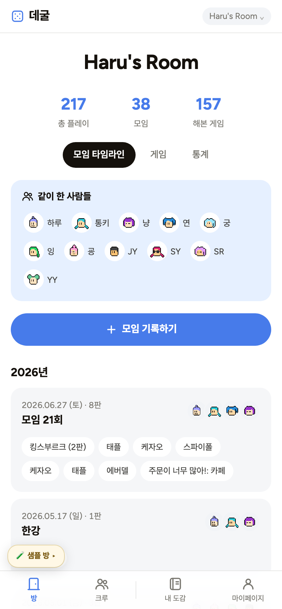
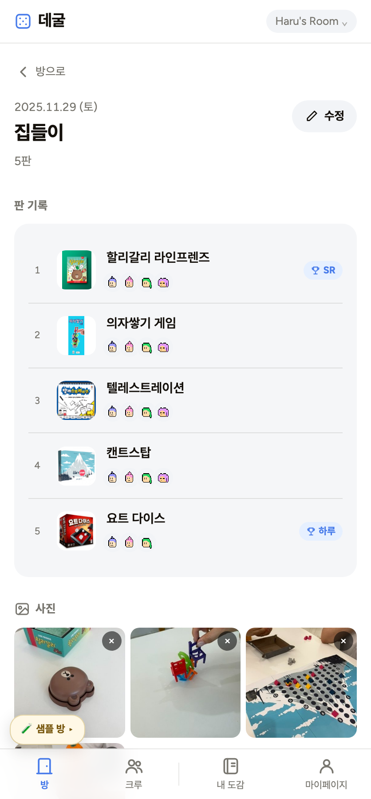
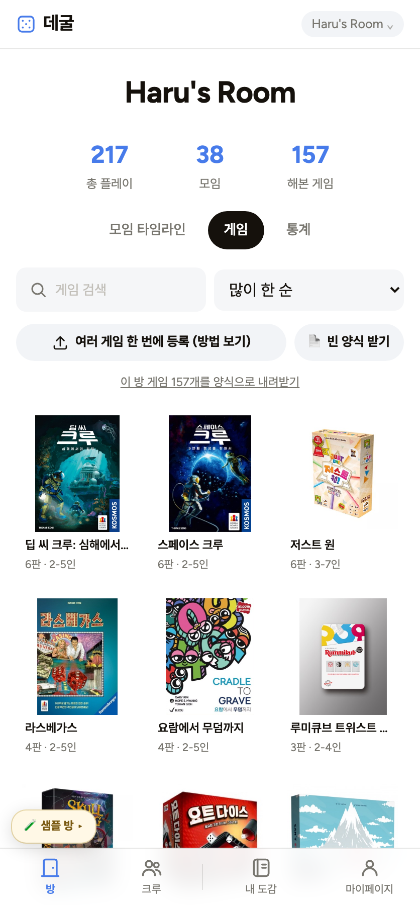
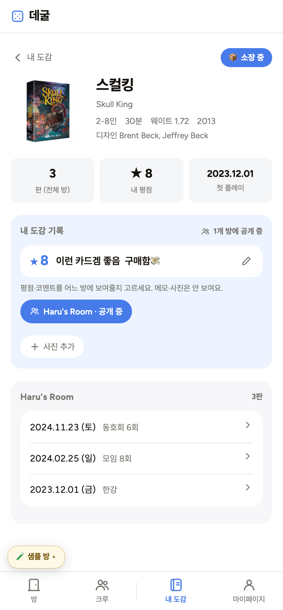
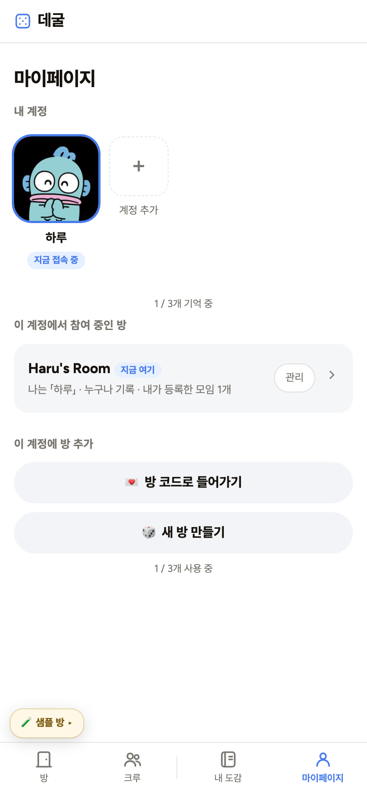

# 4주차 — 기획·구현 → 검증 → 기록 🧪

> 이번 주는 "나만의 OS"에서 한 발 나아가, **친구들이 실제로 함께 쓰는 프로덕트**를 만들어봤다.
> 앱 이름은 **데굴** (주사위가 데굴데굴 굴러가는 느낌).
> **🔗 라이브: https://degul-app.vercel.app**

## 🎯 과제 1. PRD 기획 및 구현
> 주요 가치 · 페르소나 · 소구 방식을 담은 PRD → 구현까지

**한 줄 소개:** 보드게임 모임을 "누구와, 어떤 게임을, 몇 번째로 했는지"까지 남기는 — 초대된 사람만 보는 기록 앱.

- **주요 가치:**
  메인은 **애정** — "우리가 사랑한 판이 그대로 남는다". **사람에 대한 애정**(데이터가 아니라 캐릭터로 사람이 남는다)과 **게임에 대한 애정**(도감에 쌓인다) 둘 다. 받쳐주는 가치는 ① **빈칸을 강요하지 않음**(승자·사진·평은 쓰고 싶을 때만) ② **바깥이 없음**(초대된 사람만, 좋아요·팔로우·랭킹 없음 — SetLog의 "채점받지 않는 소통" 결).
  *근거: 앱을 설명하며 내가 뱉은 두 단어가 "애정"과 "재미"였다. "보드게임 자체가 효율적인 일은 아니야. 그냥 애정과 재미 그 자체지."*

- **페르소나:** 나이·직업이 아니라 **상황**으로 좁혔다. (실제 내 크루 기반, 정체는 역할명으로만)
  - ⭐ **주 페르소나 = 「기록자」**(모임의 기록자) — "기록이 있으면 마음이 편한 사람". 스프레드시트에 206판을 적어온 친구. **이 사람이 입력을 멈추면 앱에 데이터가 0**이라, 가치의 수신자가 아니라 앱을 살리는 사람. → "이 친구가 좋아할 앱은 뭘까"가 모든 결정의 기준이 됐다.
  - 「룰마」(룰마스터 2명, 헤비 플레이어) / 「라이트」(즐기는 참가자, 나 본인 — 기록은 안 하지만 다시 보는 걸 좋아함)

- **소구 방식:** 가치를 그 사람의 언어로 번역했다.
  - 기록자에게 → **"한 판 저장하면 바로 다음 판. 승자는 쓰고 싶을 때만."**
  - 룰마에게 → **"준비해온 룰, 다 같이 볼 수 있게 걸어둬요."** / **"해본 게임이 도감에 쌓여요."**
  - 라이트에게 → **"누구랑 몇 번째로 만났는지가 남아요."**
  - 크루 전체 → **"초대한 사람만 봅니다. 좋아요 없어요."**

- **구현한 것 (링크·스크린샷):**
  **🔗 라이브: https://degul-app.vercel.app** — 실제 **206판·게임 157개·캐릭터 11명** 데이터로 작동 중.
  기술: 정적 HTML/CSS/JS + Supabase(RPC 창구 방식 보안) + Vercel.

  > 📌 아래 스크린샷은 **누구나 들어가볼 수 있는 베타 테스트 샘플 방**이다. 실제 우리 크루의 217판을 복사해 익명화한 실데이터다.
  > **직접 눌러보기** → 개인 코드 `degulsample2` · 방 코드 `degultest2` (지우고 고쳐도 OK — 화면의 🧪 버튼으로 언제든 처음 상태로 되돌아간다)
  > 빈 방을 새로 만들어 처음부터 써봐도 된다.

  가장 큰 배움은, **만들다 보니 구조가 대화로 진화**했다는 것이다. "내가 쓴 평점을 남이 보면 안 되지"라는 한마디에서 출발해 → 개인 도감에 자물쇠가 필요해지고 → **"방 위에 사람"이라는 3층 구조**로 발전했다. 원래 다음 단계로 미뤘던 계정·초대·개인 도감까지 이번에 구현됐다.

  ```
  🔑 사람 (개인 코드 = 유일한 비밀. 이메일·가입 없음)
     └ 내 도감: 여러 방을 가로질러 내 게임·평점·한줄평이 모임 (나만 봄)
  🚪 방 (방 코드 = 초대 열쇠)
     └ 모임·판·참여자(공용) · 게임 · 캐릭터 · 방장
  ```

  **핵심 기능:** 모임·판 기록(판마다 참여자 지정) · 게임 도감·통계 · 개인 도감(나만 보는 평점·한줄평) · 방장 시스템 · 완료 모임 에피소드(댓글) · 넷플릭스식 계정 전환 · 캐릭터(이미지/이모지/사진).


  | 방 — 모임 타임라인 | 모임 상세 | 게임 도감 | 내 도감 게임 상세 | 마이페이지 |
  |---|---|---|---|---|
  |  |  |  |  |  |

  *① 방 — 통계 요약·같이 한 사람들·연도별 타임라인 ② 모임 상세 — 판 기록·승자·사진 ③ 게임 도감 — 해본 게임을 박스아트로, 6가지 정렬·CSV 일괄 등록 ④ 내 도감 게임 상세 — 소장 배지·방마다 골라 공개·방별 판 기록 ⑤ 마이페이지 — 넷플릭스식 계정 전환·방 관리*

## 🗣 과제 2. 유저 피드백 받기

### 실제 유저 피드백 ① — 주 페르소나 「기록자」

전날 이 친구에게 "게임 정보를 기록할 때 어디서 끌어오냐"고 물어봐 둔 참이었다(답: 보드게임긱). 그리고 하루 종일 앱을 수정하다가, 어느 정도 완성돼 간다 싶던 **새벽 1시 35분** — "어제 그거 만들고 있는데 수정할 게 너무 많아"라며 DM으로 URL을 보냈다.

한 시간 뒤 친구가 '구경하러 들어가기' 화면을 캡처해 보내왔다(방 코드를 알려달라는 뜻). 방 코드를 주면서 내가 부탁한 건 하나였다 — **"이상한거 보이거나 수정했으면 좋겠는 부분 말해주세여."** 그러니까 부탁한 건 *봐달라*는 것이었지, *채워달라*는 게 아니었다.

> "오오ㅏ 싱기하고 구엽닼ㅋㅋㅋ" → "너무나 내가 조아하는 기록" → **"장소 내가 넣어도 돼?"**

"갑자기 또 기록시작하냐구ㅋㅋ" 하면서 "넣으세여" 했더니, 새벽 4시 반 — **"장소 다 넣었구."** 비어 있던 모임 장소를 정말 다 채운 것이다. 그 뒤로도 멈추지 않았다 —
게임 이름 뒤에 붙은 메모 때문에 정보가 안 불려오는 걸 발견하고 **직접 정리했고**("뒤에 (12~16) 이렇게 몇번째 임무 적어놔서 게임 정보 안불러와져서"), 내가 기억 안 나서 네댓 개만 넣어뒀던 「먼 옛날」 모임에 자기 스프레드시트를 뒤져 **게임을 10개로 늘려놨다.**

**버그도 유저가 먼저 찾았다:**
- **"저장이 안돼요"** — 도감 평점·코멘트 저장이 전원 고장 나 있던 걸 발견 (DB 함수 실수. 더 나빴던 건 실패해도 화면에 아무 말이 없던 것 → 실패 안내 표시까지 고침)
- 게임 팝업에 출시 연도가 두 번 나오는 것, 페이퍼 사파리 이미지가 확장팩 이미지로 잘못 등록된 것까지 캡처로 제보
- 기능 요청: "댓글 수정 기능은 안되나요" → 그 자리에서 만들어 배포

그리고 새벽 5시 34분, 이 한마디가 왔다.

> **"평점 코멘트 다른 사람이 남긴것도 보고 싶은데 이거슨 비밀인가여"**
> **"나는 다른 사람들이 남긴거 구경하는 재미가 있는데ㅋㅋ"**

### ⭐ 깨진 가정 한 줄

> **"기록은 혼자 하는 일이라고 생각했는데, 이 친구에게 기록은 같이 노는 일이었다."**

두 겹으로 깨졌다.
- **PRD 가정 A3-c** — "의견(평점·한 줄 평)은 본인만 적으니, 도감은 나만 보는 게 맞다"고 설계했다. 반은 맞았다(적는 건 본인만). 하지만 **보여주고 싶어 한다는 건 놓쳤다.** → 그날 밤 **게임마다·방마다 골라서 공개하는 스위치**를 만들어 배포했다. 기본은 여전히 비공개, 메모·사진은 언제나 비공개 — "솔직하게 쓴다"는 원래 가치는 지키면서.
- **더 깊은 가정** — 나는 이 친구가 정말 좋아서 기록하는 건지 가끔 물어볼 만큼 반신반의했다. 내가 부탁한 건 "이상한 곳 알려주기"뿐이었는데, "장소 내가 넣어도 돼?"라고 먼저 묻고는 새벽 내내 남의 앱 데이터를 돌보는 걸 보고 알았다. **진심이었다.**

### 실제 유저 피드백 ② — 베타 테스터 링크 공유

누구나 볼 수 있게 **실데이터를 복사·익명화한 샘플 계정**을 열어뒀다. (개인정보 제거, 망가뜨려도 되는 복사본, 화면의 🧪 버튼으로 언제든 초기화)

> **https://degul-app.vercel.app** · 개인 코드 `degulsample2` · 방 코드 `degultest2`

### 가상 페르소나 피드백 — 패널 인터뷰 (강의 스킬 `virtual-customer-feedback` 사용)

> ⚠️ **가상 피드백은 실제 검증의 전 단계다** — 실제 유저(위 기록자) 피드백을 대체하지 않는다.
> 페르소나 팩 30명 중 "보드게임 모임" 카드는 없어서, 규칙대로 **가장 가까운 분석형 게이머·기록 성향 3명**을 부르고 차이를 명시한다. (룰마와 겹치는 속성: 게임 분석·기록 습관 / 다른 속성: 보드게임 크루 소속 여부는 카드에 없음)

**패널에게 준 설명:** "친구들끼리 보드게임 모임을 기록하는 앱. 방 코드로 초대받고, 개인 코드 12자리가 계정(이메일·가입 없음, 분실 시 복구 불가). 모임·판·참여자를 남기면 게임 도감·통계가 쌓이고, 룰 영상을 걸어둘 수 있다. 평점은 기본 비공개, 원하면 방마다 공개. 좋아요·랭킹 없음, 무료."

**이태훈 (27세, 구직 중, 경기 파주)** — e스포츠 전략을 메모하며 보는 분석형, 변수 싫어함
> 첫 반응: "판마다 참여자를 남긴다는 건 좋네요. 데이터가 쌓이면 조합 분석이 되니까." / 안 쓸 이유: ① "저는 같이할 사람이 없어서요… 이건 제 문제지만" ② "뭘 얼마나 적어야 하는지 기준이 없으면 오히려 불안해요. '쓰고 싶을 때만'은 저 같은 사람한텐 매뉴얼 부재예요" / 그래도 쓴다면: "통계 때문에. 승률 나오면 진짜 열심히 할 듯" / 한 문장: "기록 쌓이면 재밌어지는 타입의 앱."

**원상희 (38세, 재취업 준비, 경기 안양)** — 십 원 단위로 정산하는 꼼꼼함, 모바일 게임 일일 퀘스트
> 첫 반응: "기록 좋아하는 사람은 환장하겠는데요, 저처럼." / 안 쓸 이유: ① "제 모임은 술자리라 적을 게 없어요" ② "일퀘처럼 매일 들어올 이유가 없잖아요. 모임이 한 달에 한 번이면 앱도 한 달에 한 번 열리는 거고" / 그래도 쓴다면: "누가 정산처럼 역할을 맡기면 잘할 자신 있어요" / 한 문장: "모임에 나 같은 사람 있으면 물건이다."

**송순근 (49세, 출판사 정보보안 전문가, 서울 목동)** — 인접 세그먼트
> 첫 반응: "이메일 없이 코드 두 개라… 오히려 공격면이 작아서 나쁘지 않아요." / 안 쓸 이유: ① "방 코드 하나 알면 그 방 기록이 다 보인다는 건데, 코드가 카톡방에서 한 번 새면 끝이죠. 코드 재발급이 있어야 해요" ② "40대 후반 모임에서 이런 걸 깔자고 하면 아무도 안 깔아요" / 그래도 쓴다면: "애들(자녀) 친구 모임 같은 데선 되겠죠" / 한 문장: "보안 구조는 소박해서 좋은데, 코드 유출 시나리오는 준비해라."

**요약**
- **공통 거절 이유:** "기록을 도맡을 사람이 내 모임엔 없다" — 3명 중 2명. 데굴은 **기록자가 있는 크루에서만 사는 앱**이라는 가두리 경계가 재확인됐다. (= 무시해도 되는 거절: 애초에 크루가 없는 사람은 고객이 아님)
- **갈린 반응:** 개인 코드 — "가입 없어 편하다"(원상희) vs "유출되면 끝이니 재발급이 필요하다"(송순근). **타깃도 느낄 수 있는 약점**이라 분실 안내 문구를 이미 강화했고, 방 코드 재발급은 운영자 기능(8월 예정)에 넣기로.
- **다음 액션:** ① 실제 룰마 2명에게 승률·통계 수요 확인 (이태훈의 "승률 나오면 열심히 할 듯"이 진짜인지) ② 코드 유출·재발급 시나리오 문서화.

**🧽 가상 고객 피드백 이기적공유 카드**
- 프로덕트: 데굴 — 초대된 크루만 쓰는 보드게임 모임 기록 앱
- 만난 가상 고객: 이태훈(27·구직) · 원상희(38·재취업 준비) · 송순근(49·정보보안)
- 가장 의외였던 반응: "'쓰고 싶을 때만'은 저 같은 사람한텐 **매뉴얼 부재**예요" (이태훈) — 빈칸을 강요하지 않는 게 자유가 아니라 불안일 수 있다
- 그래서 바꾸기로 한 것: 방 코드 재발급(운영자 기능)을 로드맵에 추가
- 아직 확인 못한 것: 실제 룰마들이 승률·통계를 정말 원하는가 — 실제 인터뷰로만 답이 나온다

### 피드백에서 알게 된 것

1. **자물쇠보다 애정이 먼저였다.** 나는 "내가 쓴 평점을 남이 보면 싫을 수도 있다, 마음 편하게 못 쓸 것 같다"는 생각에 도감에 자물쇠 채우는 작업을 제일 신경 써서 했다. 그런데 이 앱 자체가 **애정과 재미로 지인들과 즐기는 보드게임의 결과물**이다. 그 게임의 연장선인 기록에서도, 자물쇠로 나뉘어진 공간에 홀로 적는 것보다 **친구의 한 줄 평을 보면서 게임했던 당시를 떠올리고 즐거워하는 쪽**을 내 친구는 더 좋아했다. 프라이버시는 기본값으로 지키되, 공개는 선택지여야 했다.
2. **주 페르소나는 피드백을 '말'로만 주지 않는다.** 기록자의 피드백은 절반이 **행동**이었다(장소 채우기·데이터 정리). 물어봐서 얻는 것보다 **쓰게 하고 지켜보는 게** 몇 배 정확하다.
3. **실패는 조용하면 안 된다.** "저장이 안돼요"의 진짜 문제는 버그가 아니라, 실패했는데 **아무 말도 안 한 화면**이었다. 유저는 원인을 모르면 자기 탓을 한다.

## 📣 과제 3. SNS 기록 남기기
> 기획 · 구현 · 피드백의 전 과정과 소회를 기록으로

- **기록 내용 (소회):** 기획 → 구현 → 유저 피드백까지의 과정을 인스타그램 피드로 남겼다.
  > 친구들과의 보드게임 기록 앱 「데굴」을 만들었다.
  > 가입 없이 코드 두 개, 초대한 사람만, 좋아요 없음.
  > 3년 치 217판이 스프레드시트에서 앱으로 옮겨졌다.
  >
  > 자물쇠 채우는 데 제일 공들였던 나는
  > 페르소나의 한마디에 코멘트 공개 버튼을 만들었다 🗝️
- **SNS 인증 링크:** https://www.instagram.com/p/DbPWKMpk3hM/
