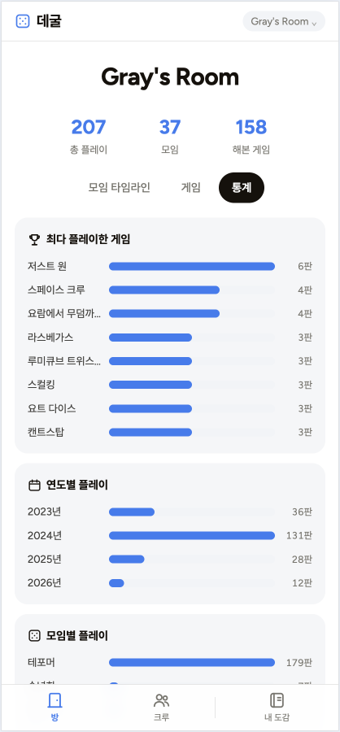
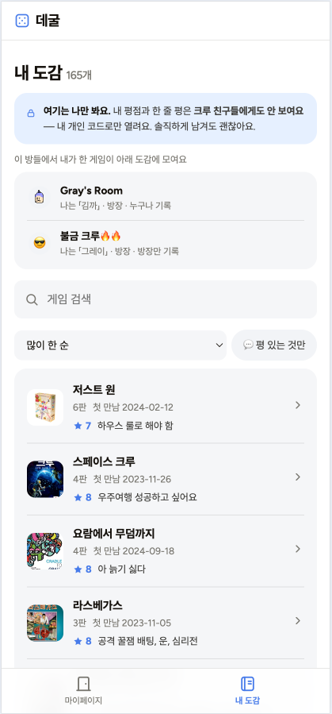

# 4주차 — 기획·구현 → 검증 → 기록 🧪

> 이번 주는 "나만의 OS"에서 한 발 나아가, **친구들이 실제로 함께 쓰는 프로덕트**를 만들어봤다.
> 앱 이름은 **데굴** (주사위가 데굴데굴 굴러가는 느낌).
> **🔗 라이브: https://degul-app.vercel.app**
> *(이 제출은 1차본이다. 미션 1을 먼저 내고, 베타테스터가 볼 수 있는 샘플 계정·유저 피드백은 일요일 최종 제출까지 이어서 진행 중.)*

## 🎯 과제 1. PRD 기획 및 구현
> 주요 가치 · 페르소나 · 소구 방식을 담은 PRD → 구현까지

**한 줄 소개:** 보드게임 모임을 "누구와, 어떤 게임을, 몇 번째로 했는지"까지 남기는 — 초대된 사람만 보는 기록 앱.
*(전체 PRD는 강의 6항목 + 검증할 가정까지 별도로 상세 작성.)*

- **주요 가치:**
  메인은 **애정** — "우리가 사랑한 판이 그대로 남는다". **사람에 대한 애정**(데이터가 아니라 캐릭터로 사람이 남는다)과 **게임에 대한 애정**(도감에 쌓인다) 둘 다. 받쳐주는 가치는 ① **빈칸을 강요하지 않음**(승자·사진·평은 쓰고 싶을 때만) ② **바깥이 없음**(초대된 사람만, 좋아요·팔로우·랭킹 없음 — SetLog의 "채점받지 않는 소통" 결).
  *근거: 앱을 설명하며 내가 뱉은 두 단어가 "애정"과 "재미"였다. "보드게임 자체가 효율적인 일은 아니야. 그냥 애정과 재미 그 자체지."*

- **페르소나:** 나이·직업이 아니라 **상황**으로 좁혔다. (실제 내 크루 기반, 정체는 역할명으로만)
  - ⭐ **주 페르소나 = 「사서」**(모임의 기록자) — "기록이 있으면 마음이 편한 사람". 스프레드시트에 206판을 적어온 친구. **이 사람이 입력을 멈추면 앱에 데이터가 0**이라, 가치의 수신자가 아니라 앱을 살리는 사람. → "이 친구가 좋아할 앱은 뭘까"가 모든 결정의 기준이 됐다.
  - 「룰마」(룰마스터 2명, 헤비 플레이어) / 「라이트」(즐겜 참가자, 나 본인 — 기록은 안 하지만 다시 보는 걸 좋아함)

- **소구 방식:** 가치를 그 사람의 언어로 번역했다.
  - 사서에게 → **"한 판 저장하면 바로 다음 판. 승자는 쓰고 싶을 때만."**
  - 룰마에게 → **"준비해온 룰, 다 같이 볼 수 있게 걸어둬요."** / **"해본 게임이 도감에 쌓여요."**
  - 라이트에게 → **"누구랑 몇 번째로 만났는지가 남아요."**
  - 크루 전체 → **"초대한 사람만 봅니다. 좋아요 없어요."**

- **구현한 것 (링크·스크린샷):**
  **🔗 라이브: https://degul-app.vercel.app** — 실제 **206판·게임 157개·캐릭터 11명** 데이터로 작동 중.
  기술: 정적 HTML/CSS/JS + Supabase(RPC 창구 방식 보안) + Vercel.

  > 📌 위 스크린샷의 데이터는 **내 개인 계정**으로 들어갔을 때 보이는 실제 우리 크루 기록이다.
  > **베타 테스터가 눌러볼 수 있는 샘플 계정을 생성 중** — 완성되면 코드를 공유할 예정.
  > 기다리지 않고 **지금 바로 빈 방을 만들어** 처음부터 써봐도 된다. (테스트 중 앱이 수정돼도 만든 데이터는 안전하게 유지된다.)

  가장 큰 배움은, **만들다 보니 구조가 대화로 진화**했다는 것이다. "내가 쓴 평점을 남이 보면 안 되지"라는 한마디에서 출발해 → 개인 도감에 자물쇠가 필요해지고 → **"방 위에 사람"이라는 3층 구조**로 발전했다. 원래 다음 단계로 미뤘던 계정·초대·개인 도감까지 이번에 구현됐다.

  ```
  🔑 사람 (개인 코드 = 유일한 비밀. 이메일·가입 없음)
     └ 내 도감: 여러 방을 가로질러 내 게임·평점·한줄평이 모임 (나만 봄)
  🚪 방 (방 코드 = 초대 열쇠)
     └ 모임·판·참여자(공용) · 게임 · 캐릭터 · 방장
  ```

  **핵심 기능:** 모임·판 기록(판마다 참여자 지정) · 게임 도감·통계 · 개인 도감(나만 보는 평점·한줄평) · 방장 시스템 · 완료 모임 에피소드(댓글) · 넷플릭스식 계정 전환 · 캐릭터(도트 이미지/이모지/사진).

  > *스크린샷의 캐릭터 닉네임은 임시 — 베타 테스터에게 줄 샘플 계정에서 교체 예정.*

  
  *① 방 — 통계 요약 · 같이 한 사람들 · 연도별 모임 타임라인 · 게임 칩(누르면 게임 정보 팝업).*

  
  *② 게임 — 해본 게임을 박스아트로. 많이 한 순·이름·최근·난이도로 정렬.*

  
  *③ 통계 — 최다 플레이 게임 · 연도별 · 모임별 · 최다 참여 크루 · 처음 함께한 날 · 찰떡 짝꿍.*

  
  *④ 크루 — 함께한 사람들. 캐릭터를 개인 코드로 "잡으면" 그 방의 내 판들이 내 도감에 모인다.*

  
  *⑤ 내 도감 — 여러 방을 가로질러 모이는 나만의 기록. 평점·한 줄 평은 나만 본다(개인 코드로만 열림).*

## 🗣 과제 2. 유저 피드백 받기
> 실제 2명 이상 + 플러스 알파로 가상 페르소나

- **실제 유저 피드백:** 실제 보드게임을 같이 하는 친구에게 유저 피드백을 받을 예정.
- **가상 페르소나 피드백:** NVIDIA Nemotron-Personas-Korea 기반 가상 페르소나 피드백도 진행해 볼 예정.
- **피드백에서 알게 된 것:** *(진행 후 작성)*

## 📣 과제 3. SNS 기록 남기기
> 기획 · 구현 · 피드백의 전 과정과 소회를 기록으로

- **기록 내용 (소회):** *(진행 예정 — 이번 기획·구현의 좌충우돌 과정을 정리. 설계 대화 전 과정은 이미 상세히 기록해둠.)*
- **SNS 인증 링크:** *(진행 후 추가)*
