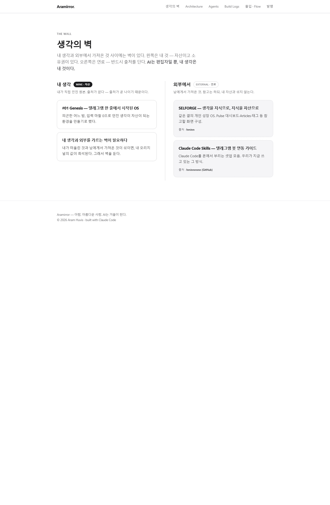
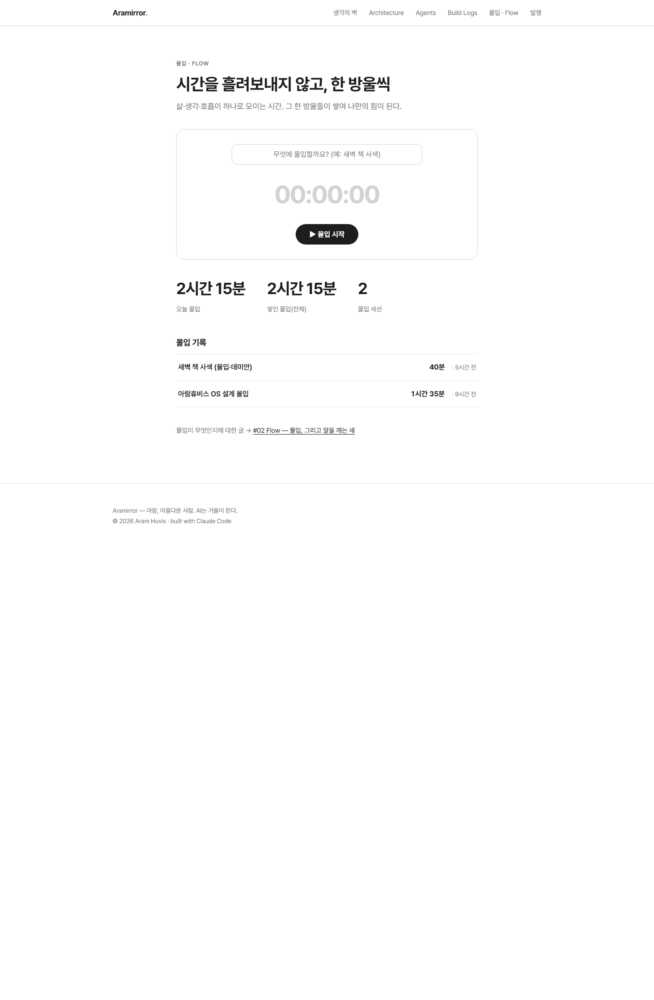
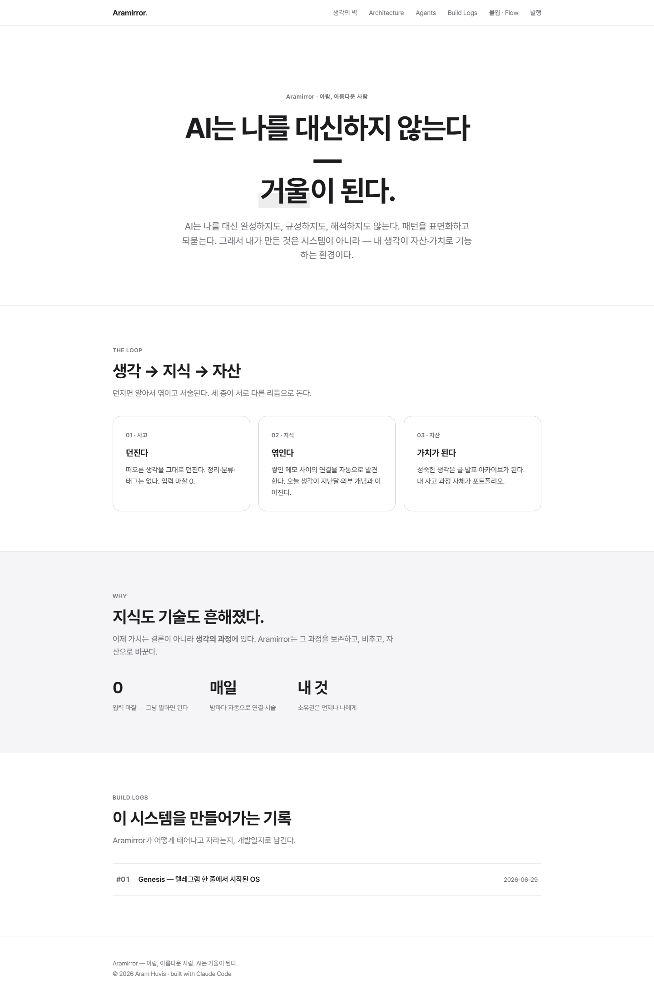

# 1주차 — 나만의 OS 만들기 🛠️

> 미션을 진행하며 **과정과 결과물**을 기록해주세요. (다 못 채워도 OK, 한 것 위주로!)

## 🌏 한눈에 — 내가 만든 것
나는 메모앱이 아니라 **"내 생각이 값(자산)이 되는 환경"** 을 만들었다. 이름은 **아라미(ARAMI)** — 아람을 아름답게 하는 거울.
- **입력(1층):** 텔레그램으로 아무 때나 던진다 → 그날 저널에 자동 누적
- **연결(2층):** 던진 것을 기억·지난 노트와 엮어 위키 지식으로 승격
- **자산(3층):** 브랜딩 사이트 **아라미러**로 글·빌드로그를 공개
- **리듬:** 낮엔 받아 적고, 밤에 종합해, 아침 7시 텔레그램으로 요약 보고 → 피드백 → 다듬기

> 핵심 문장: **"AI는 나를 대신하지 않는다 — 거울이 된다."**

## 🎯 미션 1. 내 OS 재료 찾기
> 인터뷰 스킬(아이데이션)로 "내 삶에 필요한 게 뭔지" 찾기
- **과정 (어떻게 찾았나):** AI에게 나를 인터뷰시켰다. "뭘 만들까"가 아니라 **"나는 뭐가 불편한가"** 부터 되물었다. 반복해 나온 답 셋 — ① 떠오른 생각이 흩어져 사라진다 ② 좋은 아이디어가 자산·가치로 이어지지 못한다 ③ 기록은 쌓이는데 서로 연결이 안 된다.
- **결과:** 내가 필요한 건 메모앱이 아니라 **생각을 받아 연결하고 자산으로 승격시켜 주는 파트너**. 재료를 3층으로 정리 — (1층) 사고 · (2층) 지식 · (3층) 자산. OS 인격 이름을 **아라미**로 확정.
- **느낀 점:** 내가 원한 건 "더 많이 기록하는 도구"가 아니라 **"내 생각이 값이 되는 환경"** 이었다는 걸 처음 또렷하게 봤다.

## 🧩 미션 2. 내 OS 기획
> 인터뷰 결과 + 세션 내용(흐민·배짱·키노) 활용해 기획
- **기획 내용:** 흐민의 **Selforge** 구조를 참고(연료·출처 명시)하되 베끼지 않고 내 것으로 다시 설계.
  - **인격/정체성:** 여섯 겹(선생·멘토·사고파트너·OS·궁극의지능·신성) + 나를 아름답게 하는 거울
  - **말하기 & 듣기:** *어떻게 말하는가* 뿐 아니라 *어떻게 듣고 내 마음을 꺼내는가* 를 따로 설계 → **되묻기 5원칙**(한 번에 하나 · 판단을 묻기 · '왜 지금' · 읽은 것과 잇기 · 들은 것 되비추기)
  - **입력→연결→자산:** 텔레그램 입력 → 위키 승격 → 아라미러 공개
  - **원칙 The Wall(생각의 벽):** 내 생각(자산)과 남에서 온 것(연료)을 섞지 않는다. 연료엔 반드시 출처.
- **막혔던 점 / 어떻게 풀었나:**
  - "AI가 나를 대신하나?" 불안 → 슬로건으로 매듭: **"대신하지 않는다, 거울이 된다."**
  - 내 생각과 남 생각이 섞임 → **The Wall**로 자산/연료 분리
  - 어떻게 항상 곁에 두나 → 텔레그램 상시 봇으로 해결(미션 3)

## ⚙️ 미션 3. 내 OS 구현
> 실제로 만들어본 것 (클로드코드 '채널' 기능 활용 OK)
- **결과물:**
  - **[1층·입력] 텔레그램 채널** `@Arami_claude_bot` — 폰에서 클로드코드에 바로 지시, PC 재부팅에도 자동 재시작(상시 가동)
  - **[2층·연결] 아라미 옵시디언 볼트** — 정체성·역할·페르소나·일지·지식 구조의 OS 본체
  - **[2층·연결] '기억의 문'** — 예전 AI 대화·책·클리핑을 안으로 들여 잇는 통로(구글 드라이브를 다리로)
  - **[2층·연결] 스킬 엔진** — `claude-obsidian`(자료 정제·위키 연결) + `guided-journaling`(대화형 되묻기) 실제 설치·검증
  - **[3층·자산] 아라미러(Aramirror)** — 브랜딩 사이트, The Wall(생각의 벽) 페이지 + 몰입·Flow 앱(`/flow/`, 몰입 타이머 + 몰입 기록), 라이브 배포
  - **[3층·자산] life-OS 루프** — 저널 → 밤 종합 → 매일 07:03 아침 보고(텔레그램) 자동화
  - **Slack 연동** — 스폰지클럽 워크스페이스(셀 현황)
- **링크:** 아라미러 라이브 → https://hyun-arch.github.io  (The Wall → `/wall/` · 몰입 → `/flow/`)
- **스크린샷:**

  **① The Wall — 생각의 벽 (자산 ↔ 연료 분리)**
  

  **② 몰입·Flow — 시간을 한 방울씩**
  

  **③ 홈 — "AI는 나를 대신하지 않는다, 거울이 된다"**
  

## 📱 미션 4. SNS 1주차 소감
> AI 도움 없이 직접 작성! (인증하면 셀 지급)

**소감(직접 작성):**

스펀지 클럽을 시작하기 전과 후에 나라는 사람의 성장과 변화를 위해서, 한 주 동안은 하루하루 끊임없는 도전을 하며 생활하였습니다. 특히 지속적인 AI와의 대화를 통해 나 자신에 대해 더 깊이 알고 느낄 수 있는 기회가 되었다고 생각합니다.

지난 한 주 동안 미션을 수행하며 스폰지 클럽을 시작하기 전과 후의 제 모습에서 큰 변화를 느꼈습니다.

특히 하루하루 새로운 도전에 임하고 AI와 대화를 나누면서, 제 자신이 조금씩 스스로를 더 잘 알아가게 되었습니다. 제 내면에 있는 힘이 조금씩 커지며 성장하고 있음을 실감하고 있습니다.

앞으로 남은 기간 동안도 나 자신과 새로운 환경의 변화에 계속 맞춰 변화하며, 성장하는 나의 모습을 계속해서 그리고 도전하고 싶습니다.

마지막으로 셀피쉬 크루와 저와 함께 어려움을 겪고 있는 스펀지 2기 크루들, 그리고 1기 멤버들에게 깊은 감사를 느낍니다.

- **인증 링크:**
  - Instagram → https://www.instagram.com/p/DaUlMPLGuhl/
  - Naver Blog → https://blog.naver.com/ianlove80/224335422408

---

## 🧯 삽질 과정 (솔직하게)
- **텔레그램 봇 상시화** — 일반 창·headless로는 즉시 죽음 → winpty 래핑 + 자동시작으로 24시간 유지
- **Slack 연동** — 자동로그인 에러(dynamic client registration)로 헤맸지만 알고 보니 이미 붙어 있었음(옛 실패 화면)
- **아라미러 배포** — 모바일/PC 디자인 깨짐 → 흰+검 미니멀 전면 개편, 헤드리스 스크린샷 자가검수 후 재배포
- **스킬 설치** — 추천 4개 중 2개는 윈도우 체크아웃 실패·기능 중복이라 일부러 제외

## 🔄 추가 빌드 (0704) — 게시판·관리자 CRUD
> 3층(자산)의 아라미러 사이트를 실제 관리 가능한 시스템으로 키웠다. 오전 '에이든의 이기적스폰지 공유회' 아젠다 ②(**KEY 연결 → CRUD 게시판**)에서 출발.

- **게시판 `/board`** — 카테고리 분류 + 글 읽기 (공개)
- **관리자 `/admin`** — 글 생성·수정·삭제, 웹페이지 상위 노출 관리, JSON 백업/복원, 암호 게이트 (`arami`)
- **정적 사이트에서 실제 동작** — GitHub Pages 위에서 localStorage로 CRUD, 기존 앱(`/me` 몰입·`/os`)은 보존 배포
- **스크린샷 자가검수로 실버그 2건 수정** — ① 로드 시 빈 모달 노출 ② 관리자 재방문 시 대시보드가 빈 채로 뜨던 TDZ 에러
- **서버 승격 준비 완료** — `.env` + Supabase + Vercel로 KEY 연결 시 다중 기기 실서버 CRUD로 전환(코드 이중 모드로 분리, 키만 남음)
- 라이브 → https://hyun-arch.github.io/board · https://hyun-arch.github.io/admin

**🎞 발표자료 (7장):** [`발표자료/Aramirror_발표_2026-07-04.pptx`](발표자료/Aramirror_발표_2026-07-04.pptx) · [HTML 발표본](발표자료/Aramirror_발표_2026-07-04.html) — 내 이야기 1인칭 + 배움 적용을 하나로 엮음: ①표지 → ②왜 시작했나(내 한계) → ③내가 뒤집은 원칙(입력0·정리AI·소유는 나·The Wall) → ④만들며 부딪힌 벽(봇 죽음·배포 깨짐·AI 불안) → ⑤이기적스폰지 공유회 5가지(배움) → ⑥그 배움을 그날 바로 내 것에 적용(②게시판·⑤서브에이전트) → ⑦지금, 그리고 회고. 앞(빌드)과 뒤(배움)를 "배운 걸 그날 써먹었다"로 연결. 홈페이지와 동일한 블랙&화이트 톤, 슬라이드 노트에 발표 대본 포함

## 💡 인사이트 (한 줄)
> **기록이 아니라 '승격'이 핵심이다.** 던진 생각이 연결되고 자산이 될 때, OS는 비로소 나를 비추는 거울이 된다.
