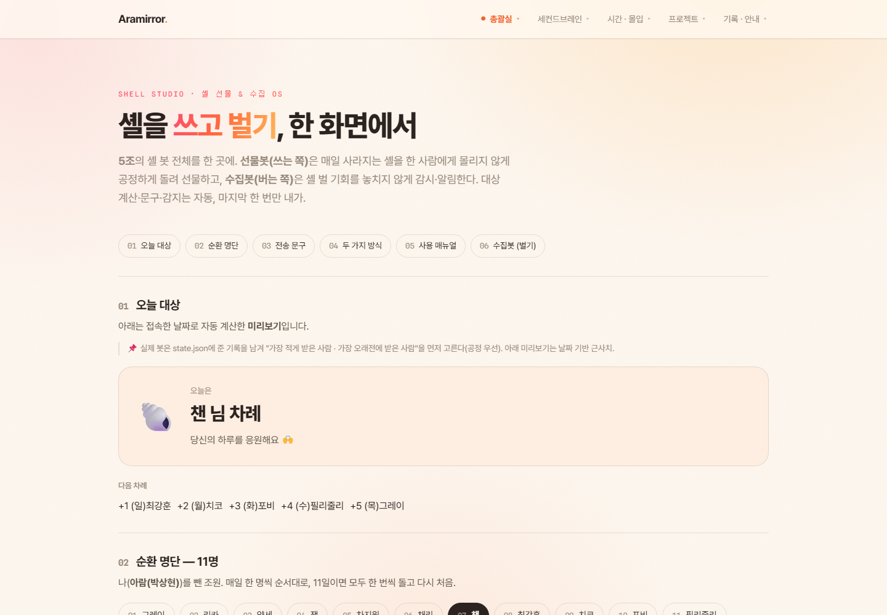
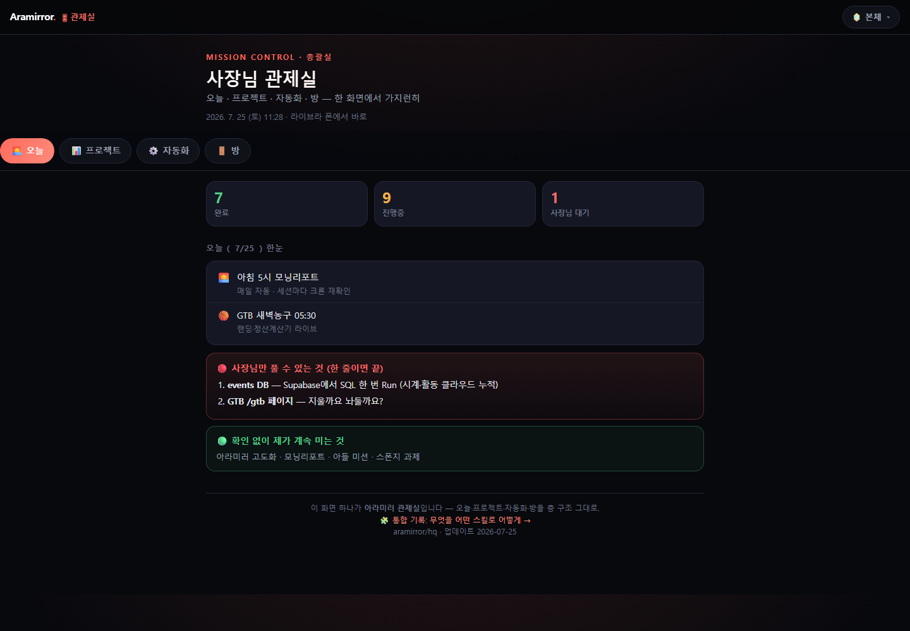

# 4주차 — 기획·구현 → 검증 → 기록 🧪

> 과제를 진행하며 과정과 결과를 기록해주세요. (다 못 채워도 OK, 한 것 위주로!)

## 🎯 과제 1. PRD 기획 및 구현
> 주요 가치 · 페르소나 · 소구 방식을 담은 PRD → 구현까지

**한 줄 정의:** 비개발자도, 흩어진 내 삶·클럽 활동(자료·일정·매일 챙길 것)을 **한 화면(아라미러)에서 자동으로 굴러가게** 만드는 개인 OS. 대표 기능은 **자동 셸 봇**이다.

- **주요 가치:**
  - 매일 하나씩 생겼다가 하루 지나면 사라지는 **셸**을, 잊지도 · 한 사람에게 몰리지도 않게 **조원에게 공정하게 자동 분배**한다. (선물봇)
  - 셸을 **쓰는 쪽**만이 아니라 **버는 쪽**도 자동화 — 공유회·이벤트 같은 셸 벌 기회를 감지해 DM으로 알려준다. (수집봇)
  - 이 모든 걸 아라미러라는 **한 화면**에 모아, 코드를 몰라도 "내 것"으로 굴린다.

- **페르소나:**
  - **주 사용자 (P1) — "매일 셸 챙기다 놓치는 조원":** 스폰지클럽 5조원. 하루 한 개 생기는 셸을 자꾸 까먹고, 챙겨도 친한 몇 명한테만 몰아주게 되는 게 신경 쓰인다. 코드는 못 짜지만 "공정하게, 손 안 가게" 도는 걸 원한다.
  - **서브 사용자 (P2) — "흩어진 내 일을 한 곳에 두고 싶은 나(아람)":** 회사일·클럽 과제·개인 자료가 여기저기 흩어져 매번 까먹는 사람. 남이 만든 앱 여러 개 대신, 내 손에 맞는 한 화면을 원한다.

- **소구 방식:**
  - **"설정 한 번, 명단만 바꾸면 끝"** — `config.json`의 조·명단만 바꾸면 1~6조 누구나 그대로 사용. 코드 수정 없음.
  - **"손가락 하나로 완료"** — 매일 00:01 DM으로 "오늘은 OO 차례" + 보낼 명령어를 통째로 전달. 나는 붙여넣고 한 번만 전송.
  - **"쓰는 봇 + 버는 봇 세트"** — 셸을 쓰기만 하는 게 아니라 벌 기회까지 챙겨줘, 클럽 안에서 실제 이득이 눈에 보인다.
  - **선택권** — PC가 꺼져 있어도 되는 **클라우드(방식 A)**와, 전송까지 완전 자동인 **PC 앱(방식 B)** 중 골라 쓴다.

- **구현한 것 (링크·스크린샷 — 이미지는 `이미지첨부/` 폴더에):**
  - **아라미러 개인 OS 방들:** `/hq` 관제실 · `/shell-studio` 셸 스튜디오 · `/vault` 🔴금고(재무는 배포 제외, 로컬 전용) · `/play` 놀이터 · `/archive` 자료실
  - **자동 셸 봇 실제 코드:** [`자동-셸-선물-봇/`](../자동-셸-선물-봇) — 선물봇 2방식(`reminder.py` 클라우드 / `auto_send.py` PC 완전자동) + 수집봇(`collector.py` 기회 감지 · `sns_verify.py` 인증 도우미) + 공정 순환 엔진(`rotation.py`) + 매뉴얼(README)
  - **검증:** `npm run build` 초록 · 배포 산출물 grep으로 재무 문자열 0건 확인 · `python rotation.py`로 순번 미리보기 동작 확인
  - **스크린샷 (라이브 화면 캡처):**

    
    *▲ 셸 스튜디오: "셸을 쓰고 벌기, 한 화면에서" — 선물봇(쓰는 쪽)+수집봇(버는 쪽), 오늘 대상·순환 명단 11명·전송 문구·두 가지 방식·매뉴얼*

    
    *▲ 관제실(/hq): 아라미러 개인 OS를 한 화면에 — 오늘·프로젝트·자동화·방 (완료 7·진행중 9·대기 1 자동 집계)*

---

## 🗣 과제 2. 유저 피드백 받기
> 실제 2명 이상 + 플러스 알파로 가상 페르소나

> ℹ️ 가상 페르소나 피드백은 **실제 검증의 전 단계**입니다. 진짜 유저 피드백을 대체하지 않습니다.

### 실제 유저 피드백 (2명 이상)

> 5조 슬랙 채널(#2기-5조-치코)에 봇을 공유하고 3가지를 물었습니다.
> ① 설명 보고 바로 이해됐나요? ② 실제로 쓰실 것 같아요? ③ 안 쓸 것 같다면 뭐가 걸리나요?

- **유저 1 · 필리줄리(안지현) / 5조** _(실제 슬랙 피드백)_
  - 이해도: **바로 이해함.** 수집봇의 '셸 벌 기회 감지'까지 파악 — *"수집봇 — 셸 벌 기회 놓치지 않기, 이런 꿀기능까지! 아람 대단해요!!"*
  - 사용 의향: **있음** — *"잘쓸게요!!🫶"* / *"쓰고 싶은데…"*
  - 걸리는 점: **마지막 전송 단계에서 막힘** — *"그 마지막 단계에서 걸려서 못 쓰고 있어요… 자동"* (`/셸보내기`가 슬랙 슬래시 명령이라 봇이 대신 못 눌러, 실사용 진입에서 멈춤)
- **유저 2 · 조원 다수 / 5조** _(반응 기반 신호)_
  - 봇 공유글에 👍 3명 · 🔥 2명 · 긍정 이모지, 피드백 요청글에 👍 3명 → **사용 의향 긍정 신호**
  - 단, 3질문에 정성 답변을 남긴 조원은 현재 필리줄리 1명 → **2번째 심층 인터뷰는 수집 진행 중** (있는 그대로 표기)

### 가상 페르소나 피드백

> NVIDIA Nemotron-Personas-Korea(한국 인구통계 기반) 팩에서, 조원과 눈높이가 맞는 2030 직장인 3명 + 인접 세그먼트(테크 회의론자) 1명 선정. 아첨 없이 "안 쓸 이유"부터 들었습니다.

**① 황혜란 · 33세 · 가구사 경리 · 인천 (꼼꼼·효율·루틴형)**
- 첫 반응: "매일 챙겨야 할 걸 자동으로 돌려준다는 건 솔직히 끌려요. 저도 전표를 루틴으로 미리 쳐두는 편이라."
- 안 쓸 이유: (1) "'코드 몰라도 된다'는데, 명단 JSON 파일 여는 순간부터 이미 코드 같아요. 저 같은 사람은 거기서 멈춰요." (2) "우리 회사엔 '셸' 같은 게 없어서, 이게 내 일상 어디에 붙는지 바로 안 와요."
- 그럼에도 쓴다면: "팀 간식 당번, 회비 순번처럼 '공정하게 돌아가는 것'에 쓸 수 있다면 당장."
- 지인 설명: "당번·순번을 공정하게 자동으로 정해주고 까먹지 말라고 알려주는 봇."

**② 최동현 · 33세 · 수사 경찰 · 세종 (논리·분석·전자기기 리뷰 매니아)**
- 첫 반응: "구조는 깔끔해요. 자동화 대상이 명확하고. 근데 클라우드·PC 두 방식 준 건 좀 과한데."
- 안 쓸 이유: (1) "슬랙 슬래시 명령을 봇이 못 눌러서 결국 마지막 한 번은 내가 눌러야 한다면, 이건 자동화라기보단 '알림'이죠. 기대치를 정확히 써줘야." (2) "PC 완전자동은 화면 바뀌면 깨진다는데, 그럼 어느 날 조용히 안 돌고 나는 모르고 지나가요. **실패했을 때 알려주는 장치**가 있나요?"
- 그럼에도 쓴다면: "안 돌면 나한테 경고 주는 실패 알림만 있으면 방식 A는 신뢰하고 씀."
- 지인 설명: "반복작업 대상만 자동 계산해 알려주는 리마인더. 마지막 클릭은 내가."

**③ 원상희 · 38세 · 재취업 준비 · 경기 안양 (꼼꼼·게임 일일퀘스트 매일 도는 사람)**
- 첫 반응: "게임 일일퀘 매일 도는 입장에선 '매일 생겼다 사라지는 거 안 놓치게'가 뭔지 바로 알아요. 놓치면 아깝잖아요."
- 안 쓸 이유: (1) "핵심이 '남한테 공정하게 나눠주기'라는데, 나는 내가 안 놓치는 게 더 급해요. **'버는 기회 알림(수집봇)'이 나한텐 메인**인데 설명에선 곁다리 같아요." (2) "혼자가 아니라 '조'가 있어야 의미 있는 것 같은데, 팀 없는 사람은 반쪽만 쓰는 거네요."
- 그럼에도 쓴다면: "수집봇만 따로 떼서 개인용으로 주면 팀 없이도 매일 씀."
- 지인 설명: "혜택 생기면 놓치지 말라고 콕 찍어 알려주는 알림봇."

**④ 김남희 · 53세 · 네트워크 전문가 · 대전 (인접 세그먼트 · 테크 회의론자)**
- 첫 반응: "이게 왜 필요한데요? 하루에 하나 주는 거, 손으로 보내면 10초잖아요."
- 안 쓸 이유: (1) "까먹어도 그만인 걸 위해 봇 깔고 토큰 발급하고 스케줄러 걸어요? **도입 비용이 문제 크기보다 커요.**" (2) "슬랙 봇 토큰을 발급해 시크릿에 넣는다는데, **그 토큰 권한 범위랑 폐기 방법**을 설명 안 하면 보안상 안 깔아요."
- 그럼에도 쓴다면: "조원이 10명 넘고 매일 챙길 게 셸 말고도 여러 개로 늘어나면, 그때 도입 비용이 정당화됨."
- 지인 설명: "부지런한 사람한텐 필요 없고, 매일 팀 챙길 게 많은 총무한테 맞는 도구."

### 피드백에서 알게 된 것

1. **"코드 몰라도 된다"의 첫 관문이 JSON 편집이라는 모순.** 진짜 비개발자는 명단 파일을 여는 순간 멈춘다. → 설정을 예시로 미리 채워두거나, 대화형으로 바꿔야 진짜 문턱이 낮아진다.
2. **가치가 '스폰지클럽 셸'에 묶여 있어 클럽 밖·팀 없는 사람에겐 안 와닿는다.** → "당번·순번·혜택 안 놓치기" 같은 **보편 언어**로 한 번 더 포장하면 소구 범위가 넓어진다.
3. **'버는 봇(수집봇)'이 나에겐 곁다리지만, 개인 사용자에겐 오히려 메인 매력이었다.** → 수집봇을 독립 기능으로 떼어 부각할 가치가 있다.
4. **신뢰의 조건은 "잘 될 때"가 아니라 "안 될 때"였다.** 실패 시 경고 알림과 토큰 권한·폐기 안내가 있어야 회의론자도 설득된다. → README에 '실패 알림'·'보안' 섹션 추가가 다음 과제.
5. **가상의 예측이 실제로 적중했다.** 가상 페르소나 최동현이 짚은 *"마지막 한 번은 결국 내가 눌러야 한다"*는 마찰을, 실제 유저(필리줄리)가 똑같이 겪었다 — *"마지막 단계에서 걸려서 못 쓴다."* `/셸보내기`가 슬랙 슬래시 명령이라 봇이 못 누르는 이 지점이 **실사용 1번 진입장벽**임이 확인됨. → 그 마지막 1탭을 어떻게 하는지 **온보딩 안내를 더 쉽게** 만드는 게 최우선 개선. (가상 피드백이 실제 검증의 전 단계로 실제 작동한 사례)

---

## 📣 과제 3. SNS 기록 남기기
> 기획 · 구현 · 피드백의 전 과정과 소회를 기록으로

- **기록 내용 (소회):**

  > 이번 주는 새로 만드는 대신, 이미 만든 걸 **"왜, 누구를 위해"** 다시 세우는 주였습니다. 제 개인 OS(아라미러)와 자동 셸 봇을 PRD로 — 주요 가치·페르소나·소구 방식으로 — 다시 적어봤어요.
  >
  > 재밌던 건 **유저에게 부딪힌 순간**입니다. 저는 "코드 몰라도 된다"고 자신 있게 썼는데, 가상 페르소나 중 한 분이 *"명단 JSON 파일 여는 순간부터 이미 코드 같아요, 저는 거기서 멈춰요"*라고 하더라고요. 만든 사람 눈엔 안 보이던 진짜 문턱이었습니다. 또 다른 분은 *"잘 될 때 말고, 안 될 때 알려주는 장치가 있냐"*고 물었어요. 신뢰는 성공이 아니라 실패를 다루는 방식에서 온다는 걸 배웠습니다.
  >
  > 가장 뜻밖은, 제가 곁다리로 둔 **'셸 버는 봇(수집봇)'이 누군가에겐 메인 매력**이었다는 점. 만든 사람의 우선순위와 쓰는 사람의 우선순위는 다르더라고요.
  >
  > 기획은 내가 하는 상상이고, PRD는 그 상상을 남이 검증할 수 있게 꺼내놓는 일이었습니다. 꺼내놓으니 비로소 고칠 게 보였어요.
  >
  > @spongeclub.ai #스폰지클럽 #스폰지클럽2기 #ClaudeCode #AI자동화 #PRD #비개발자도AI

- **SNS 인증 링크:** _(업로드 후 링크 첨부)_
