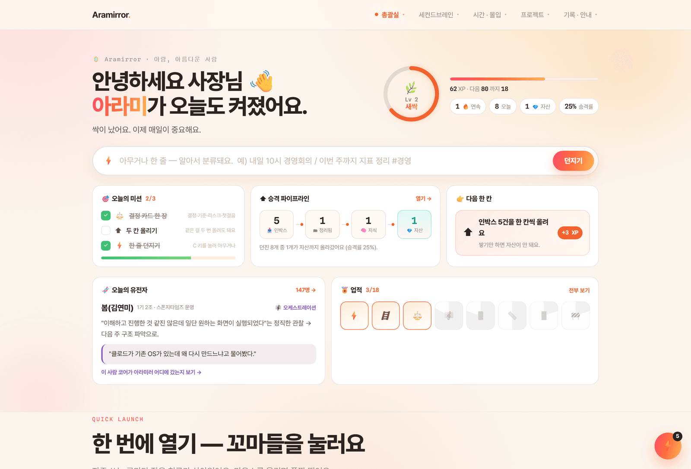
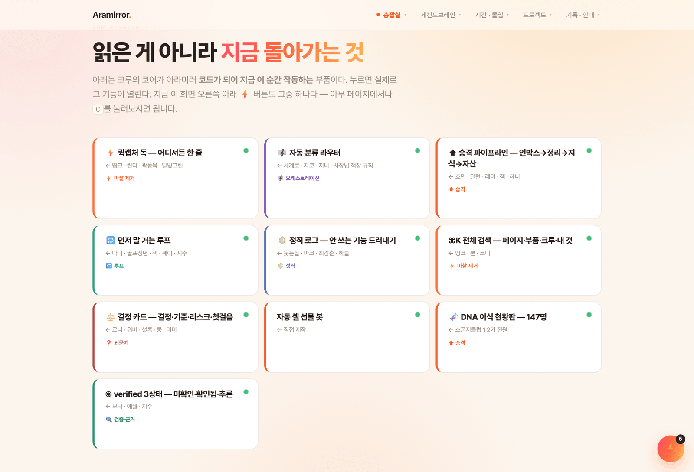
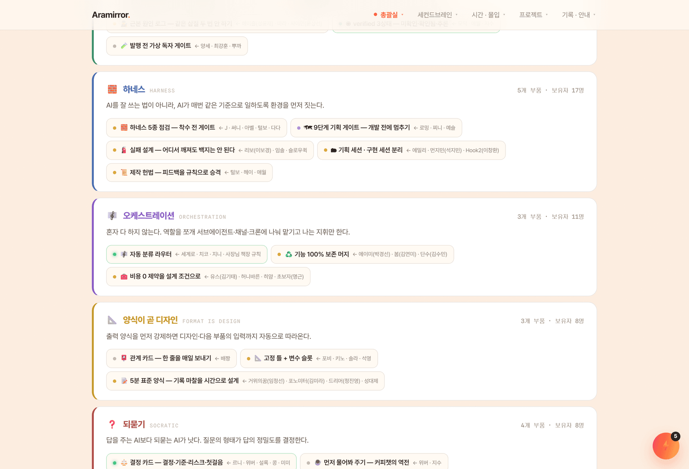
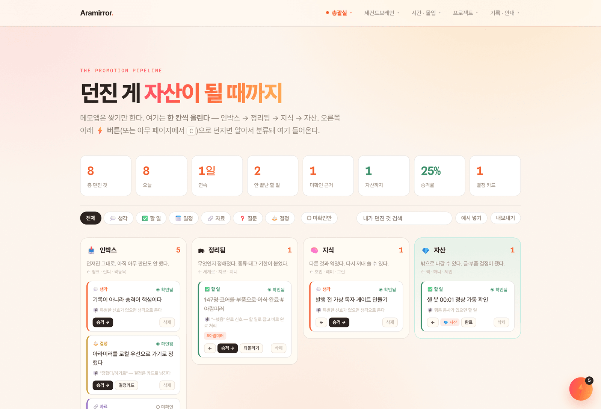
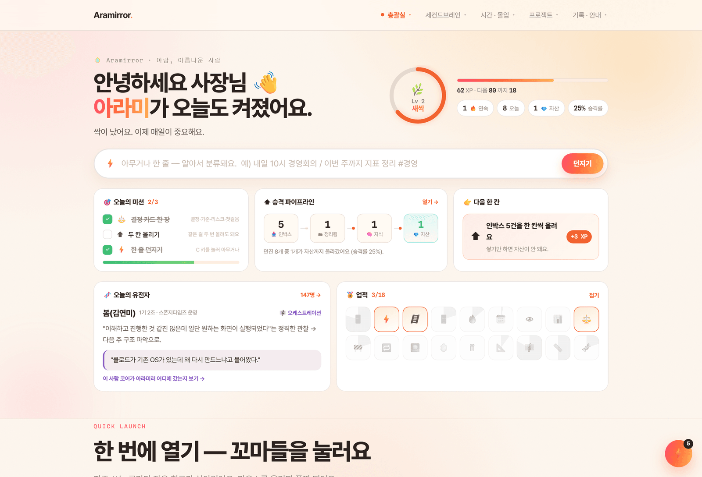

# 5주차 — 마지막 과제 🏁

> 이번 기수의 마지막 과제예요. 과정과 소회를 기록해주세요. (다 못 채워도 OK!)

## 🎯 과제 1. 구현, 그 다음의 것

> 만드는 건 끝났는데 — 그 다음이 진짜 시작이에요 (답이 안 나와 있어도 OK, 고민을 꺼내놓는 것 자체가 과제)

- **지금 걸려 있는 고민 하나:**

  **봇은 매일 돌고 있는데, 그걸 쓰는 사람은 아직 나 혼자다.**

  자동 셸 선물 봇은 7월 20일부터 오늘까지 **하루도 안 거르고 매일 00:01에** 돌았습니다.
  슬랙 타임스탬프가 그대로 증거입니다 — `00:01:22` `00:01:25` `00:01:38` `00:01:40` `00:02:30`.
  기술적으로는 성공했습니다.

  그런데 4주차에 필리줄리님이 남긴 한 줄이 계속 걸립니다.

  > **"그 마지막 단계에서 걸려서 못 쓰고 있어요… 자동"** — 필리줄리(안지현) / 5조

  봇이 "오늘은 OO 차례"까지 알려줘도 마지막 `/셸보내기`는 사람이 직접 눌러야 합니다.
  슬랙 슬래시 명령은 봇이 대신 못 누르기 때문입니다. 저는 그 한 칸을 손으로 메우며 써왔고,
  그래서 결국 **저한테만 작동하는 도구**였습니다.
  제가 7월 23일 채널에 남긴 말이 그대로였습니다 — *"자동봇이 채리님만 좋아하나보네요. 물어 봐야겠네요."*

  그리고 이번 주에 **같은 병을 더 크게** 앓았습니다. 아라미러 지도 부품을 76개 → **120개**로,
  페이지를 113 → **156개**로 늘렸습니다. 만드는 내내 이 질문이 따라왔습니다 —
  **"이 중에 내가 진짜로 여는 건 몇 개지?"**

- **그게 왜 고민인지 (무엇이 걸리는지):**

  - **기능을 늘릴수록 쓰는 사람은 줄었다.** 부품이 120개가 돼도 매일 여는 건 3~4개다. 나머지는 만든 순간이 마지막 사용이었다.
  - **"완성"의 정의를 잘못 잡고 있었다.** 배포하면 끝인 줄 알았는데 배포는 시작선이었다.
  - **막힌 게 기술이 아니라 경계였다.** 슬랙 슬래시 명령은 코드로 못 넘는다. 더 잘 짜서 풀 문제가 아니라 권한·설치·동의 같은 **사람 쪽 문제**였다.
  - 6주를 하고 나서야 클럽에서 제일 많이 반복된 말이 무슨 뜻인지 알았다.
    웃는돌님은 배포까지 끝낸 자기 서비스를 **자기가 안 쓰게 됐다**고 썼고,
    최강훈님은 다 만들고 **일곱 명에게 물어봤는데 전부 안 됐다**고 썼다.
    읽을 땐 남 얘긴 줄 알았다. 아니었다.

- **어떻게 풀어볼 생각인지:**

  1. **안 쓰는 걸 먼저 드러낸다.** 기능을 더 붙이는 대신 어느 화면을 며칠째 안 열었는지 보여주는 **정직 로그**를 넣었습니다(`/inbox` 하단). 2주 넘게 안 연 페이지는 점선으로 표시됩니다. 숫자가 0인 칸은 더 만들라는 신호가 아니라 **접으라는 신호**로 읽기로 했습니다.
  2. **기능 추가를 멈추고 남의 첫 클릭 하나를 확보한다.** 다음 목표는 새 기능이 아니라 **나 아닌 사람 1명이 봇을 끝까지 쓰는 것**입니다.
  3. **막힌 한 칸을 우회한다.** ①슬랙 앱 정식 설치로 권한 확보 ②워크플로 버튼으로 대체 ③클립보드 복사만 해주고 사람은 붙여넣기 한 번 — 셋 중 실제로 되는 걸 고릅니다.
  4. **내 앱에도 같은 기준을 적용한다.** 화면마다 "이 페이지는 무엇인가" 한 줄을 고정하고, 안 쓰는 방은 정리합니다.

- **필요한 게 있다면 무엇인지:**

  - **조원 1명의 30분.** 옆에서 처음부터 끝까지 써보는 걸 보고 싶습니다. 어디서 손이 멈추는지는 화면 밖에서만 보입니다.
  - **슬랙 워크스페이스 앱 설치 권한** (운영진 확인 필요) — 이게 열리면 마지막 한 칸이 자동으로 넘어갑니다.
  - 그리고 솔직히 — **끝나고도 이어서 물어볼 사람.**
    > *"마지막까지 조원들을 위해 수고해주시는 아람!! 끝나도 같이 함께 할 수 있는 기회가 올 수 있으면 좋겠어요❤️"* — 카라(최강훈), 7/31

---

## 🏁 과제 2. 구현 마무리 + 실제 유저 피드백 받기

> 시작할 때 "이번엔 이건 꼭 만들겠다" 했던 것 — 지금 어디까지 왔나요?

- **최종 완성한 것 (지금 어디까지):**

  1주차에 *"메모앱이 아니라 생각이 자산이 되는 환경"*이라고 썼습니다. **6주차에 그게 실제로 도는 코드가 됐습니다.**

  **① 아라미 데크 — 한 화면으로 응축**
  페이지가 40개인데 매번 뭘 눌러야 할지 골라야 했습니다. 홈을 통째로 뜯어 한 화면에 넣었습니다.
  큰 입력창(주인공) + 레벨/XP + 오늘의 미션 3 + 승격 파이프라인 + 다음 한 칸 + 오늘의 유전자 + 업적.
  아무 페이지에서나 `C`를 누르면 입력창이 뜨고, `⌘K`로 전체를 검색합니다.

  **② 커널(os-core) — 아라미러 전체가 공유하는 심장**
  - **자동 분류 라우터** — 한 줄 던지면 생각·할일·일정·자료·질문·결정 중 무엇인지 판정하고 **왜 그렇게 분류했는지까지** 보여줍니다
  - **승격 4단계** — 인박스 → 정리됨 → 지식 → **자산**. 되돌리기 가능, **승격률**이 지표입니다
  - **근거 3상태** — 링크로 들어온 자료는 기본값이 "미확인"입니다. 제가 아직 안 읽었으니까요
  - **결정 카드** — 결정·기준·리스크·첫걸음 네 칸. 쌓인 결정이 다음 결정의 재료가 됩니다
  - **먼저 말 거는 루프** — 기한 지난 할 일이 있으면 시스템이 먼저 말을 겁니다. 무시하면 4시간 뒤 다시 옵니다
  - **정직 로그** — 내가 안 여는 페이지를 드러냅니다

  **③ 스폰지클럽 1·2기 147명을 전부 읽고 코드로 이식했습니다** ← 이번 주 최대 작업
  - 1기 저장소(`spongeclub/spongeclub_1`)는 로컬에 없어서 **슬랙 옛 메시지에서 주소를 찾아** 클론했습니다
  - **1기 76명 + 2기 71명 = 147명**, 과제 원문 **마크다운 1,468개 · 17.3MB 전량 정독**
  - 반복 검출된 **12개 유전자** 추출 — 마찰 제거 / 승격 / 검증·근거 / 하네스 / 오케스트레이션 / 양식이 곧 디자인 / 되묻기 / 루프 / 경계·보안 / 정직 / 확장 / 세계관
  - 아라미러 지도에 **53개 부품**으로 이식, **그중 10개는 지금 실제로 작동**
  - **제출자 128명 전원**이 최소 1개 부품에 연결됩니다 (미연결 0명)

  **④ 업적 18개를 크루의 이름으로**
  147명을 *읽는* 게 아니라 **쓰면서 한 명씩 획득**하게 했습니다. 이게 제 방식의 "압축"입니다.
  > 🚪띵크의 문 · ⚡곽동욱의 순간 · 🪜흐민의 계단 · 🚪딜런의 출구 · 🔥하니의 연속 · 📆거위의꿈의 반년
  > 👁모닥의 눈 · 📊애월의 커버리지 · ⚖️르니의 카드 · 🚧콩의 허들 · 🔁잭의 재호출 · 🌅다니의 아침
  > 🪞웃는돌의 정직 · 🗑마크의 폐기 · 📐포비의 틀 · 🎼세계로의 분류 · 📏최강훈의 실측 · 🧬147의 거울

  처음 자산까지 올리면 컨페티가 터지고 이렇게 뜹니다 —
  **"흐민의 계단 · 사고 → 지식 → 자산 3레이어를 처음 설계한 사람"**

  **⑤ 자동 셸 선물 봇 — 12일 무중단 가동** (7/20~8/1, 매일 00:01, 5조 11명 공정 순환)

- **🚀 실제 배포 URL:**

  - **아라미러 (홈 · 데크)** — https://hyun-arch.github.io
  - **인박스 (승격 파이프라인)** — https://hyun-arch.github.io/inbox/
  - **DNA 이식 현황판 (147명)** — https://hyun-arch.github.io/dna/
  - 자동 셸 봇 코드 — [`자동-셸-선물-봇/`](../자동-셸-선물-봇)

- **결과물 (링크·스크린샷 — 이미지는 `이미지첨부/` 폴더에):**

  
  *▲ **아라미 데크** — 한 화면에 다 있습니다. 입력창이 주인공이고 레벨(Lv2 새싹) · 오늘의 미션 2/3 · 승격 파이프라인(인박스5→정리1→지식1→자산1) · 다음 한 칸 · 오늘의 유전자(봄 김연미) · 업적 3/18. XP는 페이지 열람이 아니라 **행동**에서만 나옵니다.*

  
  *▲ **읽은 게 아니라 지금 돌아가는 것** — 크루 코어가 코드가 되어 작동 중인 부품 10개. 누르면 실제로 그 기능이 열립니다.*

  
  *▲ **이식 현황판** — 어느 유전자가 어느 부품이 됐고 작동 중(초록)·만드는 중(노랑)·다음 칸(회색)인지를 있는 그대로 폈습니다. 출처 크루 이름도 지우지 않았습니다.*

  
  *▲ **인박스** — 메모앱은 쌓기만 합니다. 여기는 한 칸씩 올립니다. 카드마다 "왜 이렇게 분류됐는지"와 근거 상태가 붙습니다.*

  
  *▲ **업적 18개 — 전부 크루의 이름.** 잠긴 건 흑백, 딴 건 컬러. 마우스를 올리면 "누구에게서 왔고 무엇을 해야 열리는지"가 나옵니다.*

- **받은 유저 피드백:**

  > ℹ️ 아첨이 아니라 **실제로 썼는가**를 기준으로 골랐습니다.

  **① 챈(이채은) / 5조 — 실사용 확인** _(7/20, 슬랙)_
  > **"아람님 봇 사용해서 순서 배정 받았습니다. ㅎㅎㅎ 첫빠! 좋은 하루 보내세요!"**

  → 나 아닌 사람이 봇 결과를 받아 실제로 셸을 보낸 **첫 사례**. 이 한 줄이 이번 기수에서 제일 값졌습니다.

  **② 필리줄리(안지현) / 5조 — 못 쓴 이유** _(4주차 슬랙)_
  > *"수집봇 — 셸 벌 기회 놓치지 않기, 이런 꿀기능까지! 아람 대단해요!!"*
  > **"그 마지막 단계에서 걸려서 못 쓰고 있어요… 자동"**

  → **이해는 100%, 사용은 0%.** 칭찬보다 두 번째 문장이 이번 주 과제 1 전체를 만들었습니다.
  "좋다"와 "쓴다" 사이에 한 칸이 있고, 그 칸은 코드 밖에 있었습니다.

  **③ 카라(최강훈) / 5조** _(7/29 · 7/31)_
  > *"조원들을 위해 항상 최선을 다해주셔서 감사!!👍"* / *"끝나도 같이 함께 할 수 있는 기회가 올 수 있으면 좋겠어요❤️"*

  **④ 나 자신 — 가장 냉정한 유저**
  6주 동안 만든 페이지 중 매일 여는 건 3~4개였습니다. 그래서 정직 로그를 넣었습니다.

  **⑤ 기계 검수 — 사람 대신 부딪혀 준 것**
  Playwright 자가검수 스크립트 3종을 만들어 매 배포마다 돌렸고 **버그 6건을 스스로 찾아 고쳤습니다.**
  숨긴 시트가 화면 절반의 클릭을 삼킴 / 컨페티가 축하 버튼을 가로막음 / 모바일에서 넛지가 ⚡와 겹침 /
  넛지 미갱신 / 업적 3개가 계측 누락으로 영원히 안 열림 / 인박스 필터바 가로 스크롤.
  → **눈으로 안 보고 "다 됐다"고 말하지 않기.** 최강훈님의 *"추정하지 말고 측정할 것"*을 그대로 가져왔습니다.

  **피드백에서 알게 된 것**
  - **이해도와 사용률은 다른 지표다.** 필리줄리님은 100% 이해했지만 0% 썼습니다. 설명을 더 잘 쓴다고 안 풀립니다.
  - **첫 사용자 1명이 통계 100명보다 정확하다.** 챈님의 "첫빠!" 한 줄이 봇이 살아있다는 유일한 증거였습니다.
  - **내가 안 쓰는 기능은 남도 안 쓴다.** 정직 로그를 넣고 나서야 이 당연한 걸 숫자로 봤습니다.

---

## 📣 과제 3. SNS에 남기기

> 구현했던 것들 + 그 다음 단계에 대한 생각

- **구현했던 것들 (무엇을 / 어떻게 굴러가는지 / 뭐가 달라졌는지):**

  | 주차 | 만든 것 | 남은 한 문장 |
  |---|---|---|
  | 1주차 | 아라미(ARAMI) 3층 — 사고·지식·자산 | *"기록이 아니라 승격이 핵심"* |
  | 2주차 | ARAM OS + 아라미러 배포 | *"예쁜 문서 말고 도는 시스템"* |
  | 3주차 | 보안 3계층 + 자동 셸 봇 편입 | *"데이터가 물리적으로 어디 사는가"* |
  | 4주차 | PRD로 다시 세우고 실유저에 부딪힘 | *"이해는 됐는데 안 쓴다"* |
  | 5주차 | 147명 이식 + 커널 + 데크 | ***"만드는 건 됐다. 남이 쓰게 하는 게 남았다"*** |

  **어떻게 굴러가나** — 폰에서 한 줄 던진다 → 라우터가 분류한다 → 인박스에 쌓인다 →
  한 칸씩 올린다 → 자산이 된다 → 안 쓰면 정직 로그가 드러낸다 → 시스템이 먼저 말을 건다.

  **뭐가 달라졌나**
  - "어디 뒀지"가 사라졌습니다. 구조가 생기니 던지기만 해도 제자리에 쌓입니다.
  - **혼자 만든 게 아니게 됐습니다.** 부품 120개 중 53개에 크루 이름이 붙어 있고, 기능을 쓸 때마다 누구에게서 왔는지가 화면에 뜹니다.
  - 제일 크게 바뀐 지점 — **"다 만들었다"를 더 이상 완성이라고 부르지 않게 됐습니다.**

- **다음 단계 생각 (뭘 더 하고 싶은지 / 남은 것 / 어디로):**

  1. **남의 첫 클릭 1개.** 기능 추가는 여기서 멈춥니다. 조원 1명이 봇을 끝까지 쓰는 걸 보는 게 다음 목표입니다.
  2. **폰 ↔ PC 연결.** 지금 데이터는 이 브라우저에만 삽니다(의도한 경계). 폰에서 던진 게 PC에 뜨려면 텔레그램 봇 ↔ 인박스 연결이 필요합니다.
  3. **안 쓰는 방 정리.** 정직 로그가 0을 가리키는 페이지부터 접습니다. 늘리는 것보다 어렵습니다.
  4. **회사로.** 아라미러에서 검증한 승격 구조를 아람휴비스 경영 대시보드로 옮기고 있습니다. 개인 OS → 조직 OS가 다음 칸입니다.

- **SNS 인증 링크:**

  - (발행 예정 — 게시 후 URL 삽입)
  - **정직하게** : 이번 주 SNS는 아직 못 올렸습니다. 안 한 걸 한 것처럼 적지 않겠습니다.
    올릴 글의 제목은 정해뒀습니다 — **「기능을 120개로 늘렸더니, 쓰는 사람은 여전히 나 혼자였다」**

---

## 🪞 6주 소회

시작할 때 저는 **"AI는 나를 대신하지 않는다, 거울이 된다"**고 썼습니다.
그땐 멋있는 문장이라고 생각했고, 지금은 그게 무슨 뜻인지 조금 압니다.

거울은 잘 보이게 해주는 물건이 아니라 **안 보고 싶은 걸 보여주는 물건**이었습니다.
정직 로그를 만들고 제일 먼저 본 건 제가 안 여는 페이지 목록이었습니다.
147명을 읽고 제일 크게 남은 건 잘한 사람들의 비법이 아니라,
**웃는돌님의 "안 쓰게 됐다"와 최강훈님의 "일곱 명한테 물어봤고 전부 안 됐다"** 였습니다.

6주 전이라면 이 두 문장을 실패담으로 읽었을 겁니다.
지금은 이게 이 클럽에서 가장 값진 두 문장이라고 생각합니다.

혼자였으면 여기까지 못 왔습니다. 5조와 147명 크루 모두 감사합니다.
아라미러 부품마다 여러분 이름을 남겨뒀습니다. 그건 인용이 아니라 **출처**입니다.
