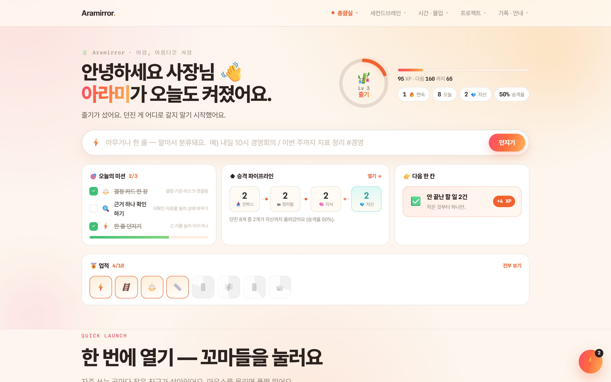
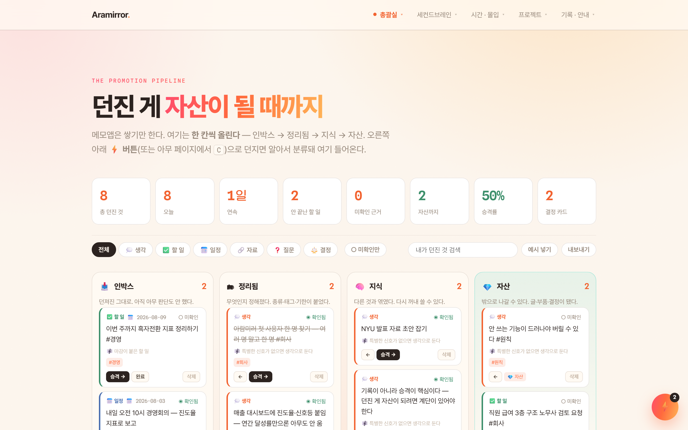
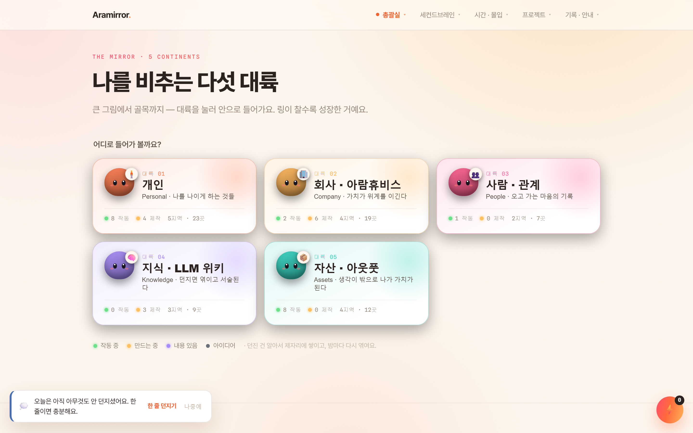
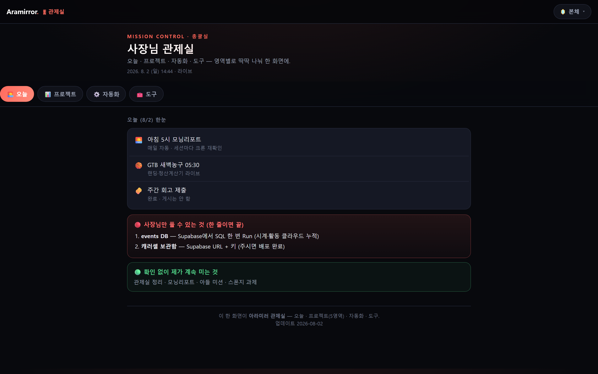

# 5주차 — 마지막 과제 🏁

> 이번 기수의 마지막 과제예요. 과정과 소회를 기록해주세요. (다 못 채워도 OK!)

**한 줄 요약:** 이번 주에 제가 한 가장 큰 일은 **기능을 더한 게 아니라 지운 것**입니다. 페이지 4개, 데이터 파일 5개, 지도 칸 46개를 삭제했습니다. 남긴 건 **글이 아니라 동작으로 사는 것들**뿐입니다.

---

## 🎯 과제 1. 구현, 그 다음의 것

> 만드는 건 끝났는데 — 그 다음이 진짜 시작이에요 (답이 안 나와 있어도 OK, 고민을 꺼내놓는 것 자체가 과제)

- **지금 걸려 있는 고민 하나:**

  **"내 손엔 붙었는데, 회사 사람 손엔 안 붙는다."**

  5주 동안 만든 아람미러는 제 손에 붙었습니다. 한 줄 던지면 알아서 쌓이고, 쌓인 게 한 칸씩 올라갑니다. 문제는 그 다음입니다. 저는 회사(아람휴비스) 대표고, 이 OS의 진짜 값어치는 **직원들이 같이 쓸 때** 나옵니다. 그런데 도구를 갖다 놓는다고 사람이 움직이지 않더라고요.

- **그게 왜 고민인지 (무엇이 걸리는지):**

  두 개의 벽이 있는데, 둘 다 **소프트웨어 문제가 아니었습니다.**

  **① 안 보이면 안 움직인다.** 저희 매출 대시보드는 잘 만들어져 있었는데도 사람들이 안 봤습니다. 이유를 파보니 지표가 틀렸더군요. 7월에 **연간 달성률 29.5%** 라고 뜹니다. 숫자만 보면 위기입니다. 그런데 7개월 지난 시점에 연간 목표의 29.5%면 실제로는 다른 이야기일 수 있죠 — 문제는 **비교 기준이 없었다는 것**입니다. 잘하는 사람과 못하는 사람이 같은 화면에서 똑같이 회색이었습니다.

  **② 보이게 만들면, 그 다음은 법(法)이다.** "누가 잘하고 누가 못하는지" 보이게 만드는 건 기술로 30분이면 됩니다. 그런데 보이는 순간 바로 다음 질문이 옵니다 — *그래서 못하는 사람은 어떻게 할 건데?* 여기서부터는 코드가 아니라 **근로기준법**입니다. 급여 체계를 손대면 §94(취업규칙 불이익 변경), 감액을 하려면 §95(감급 제재 한도), 사람을 내보내려면 §23(정당한 이유). 게다가 2024년 12월 대법원 전원합의체 판결로 통상임금 판단에서 고정성 요건이 폐기되면서 상여금 설계 방식 자체가 달라졌습니다. **잘못 만들면 동기부여가 아니라 분쟁이 됩니다.**

- **어떻게 풀어볼 생각인지:**

  **㉠ 지표부터 갈아엎었다 (완료).** 연간 달성률 대신 **진도율**을 주 지표로 세웠습니다. `실적 ÷ 경과월 누적목표`. 같은 데이터가 29.5%가 아니라 **53.4%** 로 보입니다. "연초 대비 얼마"가 아니라 **"지금 이 시점에 가야 할 만큼 갔나"** 를 묻는 숫자입니다. 여기에 **착지 예상**(이 속도면 연말에 얼마)과 **과부족**(목표까지 얼마 모자라나)을 붙였습니다.

  **㉡ 잘함/못함을 색으로 만들었다 (완료).** 신호등 4단계 — 🟢100%↑ / 🟡85~100% / 🟠65~85% / 🔴65%↓. 사람별·월별 히트맵을 깔아서 **"누가 언제부터 꺾였는지"** 를 표가 아니라 그림으로 보이게 했습니다. 잘하는 사람은 칭찬할 근거가, 못하는 사람은 **언제 도와줬어야 했는지**가 눈에 들어옵니다.

  **㉢ 보상은 3층으로 나눠 설계했다 (초안 완료, 검토 대기).**
  - 1층 **고정급** — 생활이 걸린 돈. 성과로 깎지 않는다. (§94·§95 리스크 회피)
  - 2층 **변동 인센티브** — 진도율 연동, 구간별 지급. 지급 조건을 미리 문서로 못 박는다.
  - 3층 **일시금** — 특별 성과에 대한 일회성. 통상임금 이슈를 피하도록 설계.

  여기에 **저성과자 6단계 절차**(면담 → 목표 재설정 → 지원 → 기록 → 재평가 → 최종)와 **하면 안 되는 것 7가지**(동의 없는 급여 삭감, 공개 망신주기, 기록 없는 구두 경고 등)를 문서로 만들었습니다.

  **㉣ 그리고 나 자신에게 먼저 적용한다.** 아람미러에 **사용 로그**를 넣은 이유가 이겁니다. 안 쓰는 기능이 드러나야 버릴 수 있으니까요. 직원용도 똑같이 갈 겁니다 — **"좋아 보이는 화면"이 아니라 "실제로 열리는 화면"** 만 남깁니다.

- **필요한 게 있다면 무엇인지:**
  - **노무사 검토** — 3층 급여 구조와 저성과자 절차를 실제 시행 전에 확인받아야 합니다. 질문 목록까지 만들어뒀습니다.
  - **정직한 사용 데이터** — 제가 만든 걸 직원들이 **정말 여는지**. 안 열면 그건 직원 탓이 아니라 제 설계가 틀린 겁니다. 이번 기수에서 배운 게 정확히 이거였습니다.
  - **한 명의 첫 사용자** — 여러 명에게 동시에 굴리는 대신, 매일 열어줄 한 명. 그 사람이 안 쓰면 나머지도 안 씁니다.

---

## 🏁 과제 2. 구현 마무리 + 실제 유저 피드백 받기

> 시작할 때 "이번엔 이건 꼭 만들겠다" 했던 것 — 지금 어디까지 왔나요?

### 시작할 때 한 약속

1주차에 이렇게 적었습니다.

> *"나는 메모앱이 아니라 **내 생각이 값(자산)이 되는 환경**을 만들었다."*
> *"AI는 나를 대신하지 않는다 — 거울이 된다."*

5주 뒤에 다시 읽으니, **약속의 절반은 지켰고 절반은 틀렸습니다.**

지킨 것: 환경은 만들었습니다.
틀린 것: 저는 **"쌓이면 자산이 된다"** 고 생각했는데, 아니었습니다. **쌓이는 건 그냥 쌓이는 겁니다.** 자산이 되려면 **올라가는 계단**이 있어야 했습니다.

- **최종 완성한 것 (지금 어디까지):**

  **아람미러 — 105페이지, 커널 하나로 전부 도는 개인 OS.**

  이번 주에 흩어져 있던 기능을 **하나의 커널(`os-core.js`)** 로 합쳤습니다. 이제 아래 것들이 특정 페이지가 아니라 **모든 페이지에서 삽니다.**

  | 무엇 | 왜 이렇게 만들었나 |
  |---|---|
  | **⚡ 퀵캡처** (어느 페이지든, `C` 키) | 던지는 순간과 저장되는 순간의 거리를 **0**으로. 앱을 찾아 들어가는 사이에 생각은 이미 날아갑니다 |
  | **4단계 승격** 받은칸 → 정리됨 → 지식 → 자산 | 쌓이기만 하는 메모가 아니라 **올라가는 계단**. 이게 이번 기수 최대의 수정입니다 |
  | **3상태 검증** 확인함 / 미확인 / 틀림 | 근거 없는 건 자산이 될 수 없습니다. **"틀림"을 지우지 않고 남기는 것**이 핵심 |
  | **결정 카드** | 무엇을 정했는지가 아니라 **그때 왜 그렇게 정했는지**를 남깁니다 |
  | **먼저 말 거는 루프** | 내가 열어야 도는 시스템은 안 돕니다. 시스템이 **먼저** 말을 걸어야 합니다 |
  | **사용 로그** | 안 쓰는 기능이 드러나야 **버릴 수 있습니다** |
  | **내보내기 / 가져오기** | 내 데이터는 내 것. 언제든 통째로 들고 나갈 수 있어야 합니다 |
  | **레벨 10단계 · 업적 18개** | 씨앗 → 새싹 → 줄기 → 잎 → 가지 → 꽃 → 열매 → 나무 → 숲 → **거울** |

  **XP는 오직 행동에서만 나옵니다.** 페이지를 구경하면 0점입니다. 던져야(+2), 올려야(+3~+10), 근거를 확인해야(+3), 결정을 내려야(+8) 점수가 붙습니다. 업적 이름도 제 언어로 지었습니다 — *첫 문 · 그 순간 · 출구 · 근거의 무게 · 첫 결정 · **버리는 용기** · 사흘의 아침 · 거울을 봄*.

  **데이터는 전부 제 브라우저 안에만 있습니다.** 서버로 나가는 게 0입니다. 3주차에 배운 걸 그대로 지켰습니다 — *보안은 예쁜 자물쇠 UI가 아니라, 데이터가 물리적으로 어디 사는가다.*

  **회사 쪽:** 매출 대시보드를 진도율·신호등·히트맵 중심으로 개편했고(과제 1 참조), 직원 동기부여·급여 체계 방안을 문서로 만들었습니다. (매출·급여 숫자는 3주차 원칙대로 **배포에서 물리적으로 제외**, 로컬 전용)

- **🚀 실제 배포 URL:** **https://hyun-arch.github.io/**
  - 받은칸(4단계 승격) → https://hyun-arch.github.io/inbox
  - 생각 지도 → https://hyun-arch.github.io/mirror
  - 관제실 → https://hyun-arch.github.io/hq

- **결과물 (링크·스크린샷 — 이미지는 `이미지첨부/` 폴더에):**

  
  *▲ 홈: 던지는 칸 · 오늘의 미션 3개 · 승격 파이프라인 4칸 · 다음 한 칸 · 업적 18개가 **스크롤 없이 한 화면**에. 실제로 8개를 던지고 승격시킨 상태 — **Lv3 줄기 · 95 XP · 자산 2개 · 승격률 50% · 업적 4/18**. 구경만 했으면 전부 0이었습니다.*

  
  *▲ 받은칸: 던진 8개가 자동 분류돼 **인박스 2 → 정리됨 2 → 지식 2 → 자산 2** 로 올라간 실제 상태. 카드마다 「확인됨 / 미확인」 3상태와 「승격 →」 버튼이 붙습니다. 미확인 근거 0건, 결정 카드 2장.*

  
  *▲ 생각 지도: 제 삶 전체(개인·회사·사람·시간)를 대륙으로 나눈 지도. 각 칸에 바로 생각을 던질 수 있습니다.*

  
  *▲ 관제실(/hq): 오늘·프로젝트·자동화·방을 한 페이지에.*

  **검증 기록:** `npm run build` 105페이지 성공 / JS 오류 0 / 죽은 링크 0 / 캡처 → 받은칸 → 4단계 승격 실제 동작 확인 / 삭제한 경로 전부 404 확인.

- **받은 유저 피드백:**

  **① 실제 유저 — 필리줄리(안지현) / 5조** *(4주차 슬랙 실제 피드백, 이번 주 설계에 반영)*

  > *"수집봇 — 셸 벌 기회 놓치지 않기, 이런 꿀기능까지! 아람 대단해요!!"* / *"잘쓸게요!!🫶"*
  > **그런데:** *"그 마지막 단계에서 걸려서 못 쓰고 있어요…"*

  칭찬은 고마웠지만 **제가 배운 건 뒷문장**이었습니다. 쓰고 싶은데 **마지막 한 번의 마찰**에서 멈췄다는 것. 이게 이번 최종본의 제1원칙이 됐습니다 — **던지는 순간 = 저장되는 순간.** 어느 페이지에서든 ⚡ 하나로 끝나게 만든 이유가 이 한 줄입니다.

  **② 가장 혹독한 유저 — 저 자신** *(이번 주, 실제 반려 3회)*

  이번 주에 저는 제 앱에 "다른 사람들 잘한 것 모아놓는 페이지"를 만들었습니다. 예쁘게 나왔습니다. 그리고 **제가 저한테 3번 반려했습니다.**

  > 1차: *"그냥 보기만 하고 요약만 해서는 도대체 아무짝에도 쓸모가 없어."*
  > 2차: *"한 군데에만 몰아넣고 찔끔 기능 추가해 둔 게 다야?"*
  > 3차: *"늘어놓기만 하면 어떡해? 다 지워."*

  그래서 **지웠습니다.** 페이지 4개, 데이터 파일 5개, 지도 칸 46개를 삭제했습니다. 남긴 건 **문장이 아니라 동작으로 사는 것**뿐입니다.

  **③ 정직하게 — 최종본에 대한 외부 피드백은 아직 못 받았습니다.** 어제 다 갈아엎고 오늘 배포했습니다. 5조 채널에 링크를 열어두고 받는 중입니다. **없는 걸 있다고 적지 않겠습니다.**

### 🧗 이번 주 가장 큰 삽질 — 그리고 인사이트

**삽질:** 저는 "좋은 걸 흡수한다"를 **"좋은 걸 옮겨 적는다"** 로 착각했습니다. 잘 정리해서 예쁘게 진열해 놓고 스스로 뿌듯했는데, 다시 보니 **제 앱에서 아무것도 달라진 게 없었습니다.** 진열장이 하나 늘었을 뿐이었습니다.

**인사이트 3개:**

1. **흡수는 "옮겨 적기"가 아니라 "동작이 되기"다.** 좋은 원칙을 문장으로 적어두면 그건 **읽을거리**입니다. 같은 원칙을 버튼과 파이프라인으로 만들면 그때 **내 것**이 됩니다. 지금 제 앱엔 인용문이 한 줄도 없습니다 — 대신 그 원칙들이 **매일 돌아갑니다.**

2. **빼기도 결과물이다.** 마지막 주에 기능을 더 넣고 싶었습니다. 실제로 한 건 페이지 삭제였고, **그게 이번 기수에서 한 일 중 가장 잘한 일**입니다. 안 쓰는 걸 남겨두는 건 겸손이 아니라 게으름이었습니다.

3. **가장 냉정한 유저는 나 자신이어야 한다.** 남한테 피드백 받기 전에 내가 나한테 3번 반려할 수 있으면, 만든 물건의 수준이 완전히 달라집니다. 문제는 그러려면 **내가 만든 걸 버릴 각오**가 있어야 한다는 거죠. 그래서 업적 18개 중에 **「버리는 용기」** 를 넣었습니다.

---

## 📣 과제 3. SNS에 남기기

> 구현했던 것들 + 그 다음 단계에 대한 생각 (아끼면 아무 일도 안 일어나요 — 꺼내놓는 순간 가장 많이 남아요)

- **구현했던 것들 (무엇을 / 어떻게 굴러가는지 / 뭐가 달라졌는지):**

  - **1주차 — 텔레그램 한 줄로 도는 OS.** 폰에서 아무 때나 던지면 그날 저널에 자동으로 쌓이고, 밤에 종합해서 아침에 요약이 옵니다. *달라진 것: 생각이 날아가지 않기 시작했습니다.*
  - **2주차 — 삶 전체를 한 폴더로.** 개인·회사·사람·시간을 `5영역 × 3층` 구조로 묶고, 눌러보는 웹(아람미러)으로 배포. *달라진 것: "그거 어디 뒀지?"가 사라졌습니다.*
  - **3주차 — 보안 3계층 + 자동 셸 봇.** 재무·매출은 **배포에서 물리적으로 제외**하고 로컬에서만. 매일 사라지는 셸을 조원에게 공정하게 자동 분배하는 봇. *달라진 것: 회사 자료를 넣어도 무섭지 않게 됐습니다.*
  - **4주차 — PRD로 다시 세우고 유저에게 부딪히기.** 실제 유저 + 가상 페르소나 4명에게 "안 쓸 이유"부터 물었습니다. *달라진 것: 만든 사람 눈에 안 보이던 문턱이 보였습니다.*
  - **5주차(이번 주) — 더한 게 아니라 지운 주.** 전시용 페이지를 다 지우고, 커널 하나로 합치고, 4단계 승격 계단을 놨습니다. *달라진 것: 쌓이는 도구에서 **올라가는 도구**가 됐습니다.*

  **5주를 한 줄로 줄이면 — 「AI는 나를 대신하지 않는다, 거울이 된다」는 1주차 문장은 맞았습니다. 다만 거울은 예쁜 걸 비출 때가 아니라, 내가 안 보고 싶은 걸 비출 때 쓸모가 있었습니다.**

- **다음 단계 생각 (뭘 더 하고 싶은지 / 남은 것 / 어디로):**

  1. **한 명에게 붙인다.** 여러 명이 아니라 한 명. 회사에서 매일 열어줄 첫 사용자 한 명을 찾고, 그 사람이 안 열면 제 설계를 고칩니다.
  2. **급여·평가 구조를 노무사에게 검증받는다.** 기술로 만드는 건 30분, 법으로 지키는 건 몇 주. 순서를 바꾸지 않겠습니다.
  3. **사용 로그를 정직하게 읽는다.** 제가 만든 18개 업적 중 실제로 아무도 안 여는 게 있으면 버립니다. **버리는 용기**를 저부터 씁니다.
  4. **기수는 끝나도 리듬은 남긴다.** 매주 하나씩 만들고, 부딪히고, 고치는 이 5주 리듬이 지난 몇 년보다 저를 더 많이 바꿨습니다. 이건 계속합니다.

- **SNS 인증 링크:** _(업로드 후 링크 첨부)_

---

## 🙏 소회

5주 전에 저는 **"더 많이 기록하는 도구"** 를 원한다고 생각했습니다. 5주 뒤에 알게 된 건, 제가 원한 게 **"내가 안 보고 싶은 걸 정직하게 보여주는 도구"** 였다는 겁니다.

가장 기억에 남는 건 만든 순간이 아니라 **지운 순간**입니다. 잘 만들었다고 생각한 걸 지우려면 용기가 필요했고, 지우고 나니 남은 게 훨씬 선명했습니다.

만드는 건 끝났는데, 이제 시작입니다. 함께해주신 분들께 감사합니다. 🙏
