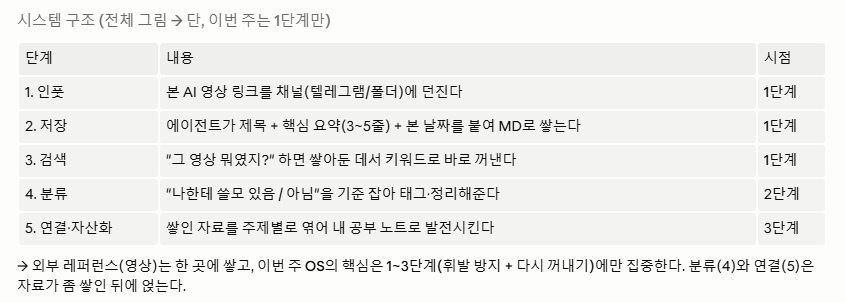
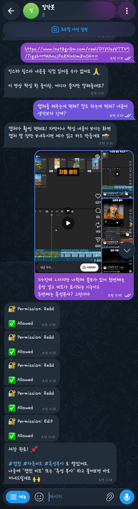
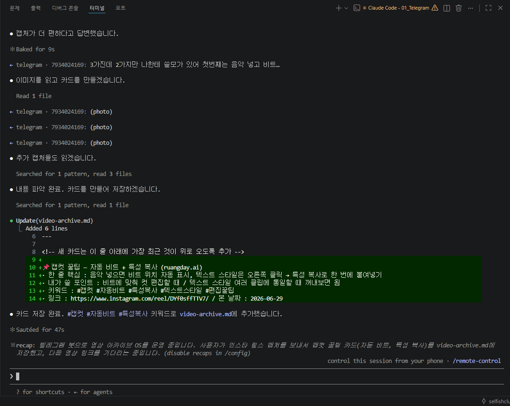
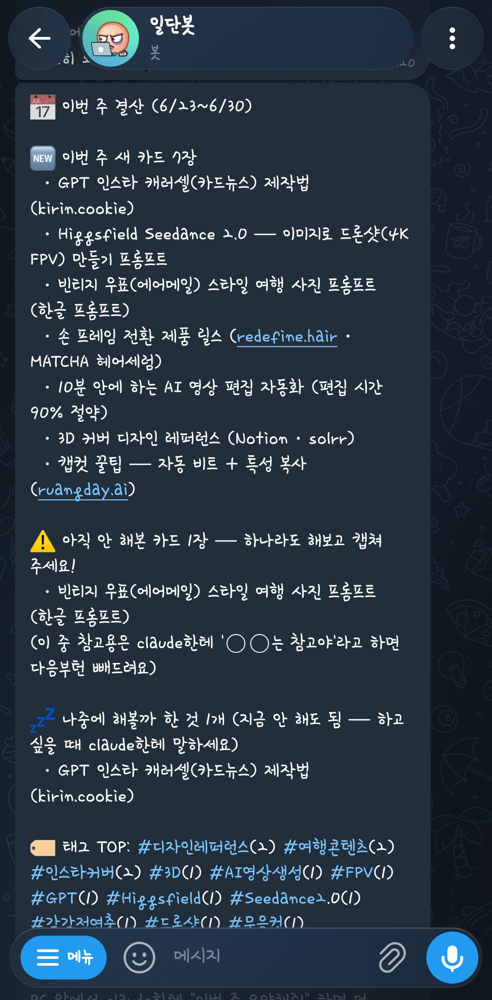

# 1주차 — 나만의 OS 만들기 🛠️

> 미션을 진행하며 **과정과 결과물**을 기록해주세요. (다 못 채워도 OK, 한 것 위주로!)

## 🎯 미션 1. 내 OS 재료 찾기
> 인터뷰 스킬(아이데이션)로 "내 삶에 필요한 게 뭔지" 찾기
- **과정 (어떻게 찾았나):** 인터뷰를 하다보니 요새 제일 많이 찾아본 영상생성, 편집에 관련된 얘기를 많이 하게 되고 자료의 저장을 매번 카톡 나에게 보내기 pc에서 열어보기 이러다보니 정보가 저장되거나 어디 기록되지 않고 자꾸 찾은걸 또 찾아보게 된다는 느낌이였는데 그런 휘발되는 정보를 저장하고 키워드로 꺼내볼수 있게 해준다고 함
- **결과:** 상당히 만족스러움 매번 자료 찾을때마다 아 이거 저번에도 한번 본것 같은데? 아니면 저번에도 찾은것 같은데? 라고 생각할때가 있었는데 그걸 키워드로 찾을수 있는 서랍같은걸 만들어 준다고 해서 만족스럽다.
- **느낀 점:** 인터뷰 스킬때문인지 몰라도 나한테 부족한걸 찾아서 보완할수 있는 방법까지 찾을수 있다는건 너무 좋다.

## 🧩 미션 2. 내 OS 기획
> 인터뷰 결과 + 세션 내용(흐민·배짱·키노) 활용해 기획
- **기획 내용:**
  - 무엇을 : 본 영상·자료가 휘발되지 않고 쌓이는 **"AI영상 아카이브 OS"**
  - 왜 : 모으기만 하고 안 쓰는(= 카톡 나에게 보내기 무덤) 문제를 해결하려고
  - 기획 3축 : ① **쌓기**(링크를 카드로 자동 정리, 키워드로 꺼내기) ② **거르기**("이거 눈속임 아냐?"를 냉정하게 평가) ③ **써먹기**(모으고 끝이 아니라 실제로 써봤는지 추적)
  - 설계 원칙 : 평가는 깐깐하게 하되 버릴지는 내가 결정 / 집에선 그냥·밖에선 텔레그램 / 자동 알림은 스크립트, 판단·정리는 claude

- **막혔던 점 / 어떻게 풀었나:** 어제 일단 텔레그래봇을 완성한걸 얘기하고 내가 해야되는 부분들이 어떤게 있는지 물어보고 필요한 부분이 있으면 추가 함 (자동으로 4줄을 써주는거에서 유튭을 제외한 다른 링크들은 자막이 없는 영상은 내용을 못읽어서 되물을수 있다고 얘기하길래 요새는 릴스에서 정보를 많이 얻는것 같아서 그 부분을 추가요청 함 )

## ⚙️ 미션 3. 내 OS 구현
> 실제로 만들어본 것 (클로드코드 '채널' 기능 활용 OK)
- **결과물:** 클로드코드 '채널'(텔레그램) + 스크립트로 **"AI영상 아카이브 OS"**를 만들었다. 폰으로 영상 링크를 던지면 클로드가 내용을 읽어 `한 줄 핵심 / 내가 쓸 포인트 / 키워드 / 링크·날짜` 4줄 카드로 정리해 `video-archive.md`에 자동으로 쌓아준다. (유튜브 등 자막 있는 건 자동, 인스타 릴스처럼 못 읽는 건 "핵심 한 줄·어디 쓸지" 되물어봄. 실제로 인스타 캡컷 꿀팁 영상을 보냈더니 키워드까지 붙여 잘 저장됨.)

  여기에 더해 구현한 기능:
  1. **주제별 자동 분류** — "○○ 관련만 모아줘" / "주제별로 묶어줘"로 키워드별로 묶어서 꺼내기
  2. **냉정 평가** — 저장할 때 별점 진단 + 쓸 곳을 자동으로 달아 눈속임·식상한 자료 거르기
  3. **학습 점검** — 해볼것 / 참고 / 보류 분류 + "써봤어"(캡처 증거) 추적으로 모으고 안 쓰는 것 방지
  4. **주간 결산 자동 발송** — 매주 일요일 자정 텔레그램으로 "아직 안 한 것"을 짚어줌 (평일엔 매일 정리 알림)
  5. **외출모드** — "외출할거야 / 다녀왔어" 한마디로 봇을 켜고 끔. 켜지면 화면도 1분 뒤 꺼지게 설정해, 터미널 명령(`claude --channels ...`) 없이 앱에서 바로 작동
  6. **프롬프트 창고** — 복붙용 프롬프트(한글+영문)와 수업·정리 문서를 따로 보관

- **막혔던 점 / 어떻게 풀었나:**
  - 봇이 메시지를 받아도 "입력중"만 뜨고 답을 안 함 → 그냥 `claude`로 켜서 그랬고, `--channels` 플래그로 채널 모드로 켜야 함을 알게 됨. 세션을 여러 개 켜면 봇을 서로 뺏어 먹통 → 한 곳에서만 켜기.
  - 자동 알림에서 한글이 깨짐 → 한글 스크립트를 UTF-8(BOM)으로 다시 저장해 해결.
  - 주간 결산에서 항목이 1개일 때 통째로 안 뜸 → 파워셸의 '단일 결과' 버그라, 결과를 배열로 강제해 해결.
  - 노션·네이버·인스타가 자동으로 안 읽힘 → 크롬 확장으로 공개 웹/노션은 직접 읽고, 네이버·인스타는 화면 캡처/복붙으로 우회.

- **링크 / 스크린샷:** (이미지는 `이미지첨부/` 폴더에)

## 📱 미션 4. SNS 1주차 소감
> AI 도움 없이 직접 작성! (인증하면 셀 지급)
- **인증 링크:** https://www.instagram.com/p/DaKAuJVgZzp/?igsh=dmxteng0b3g0bGZs&img_index=2
