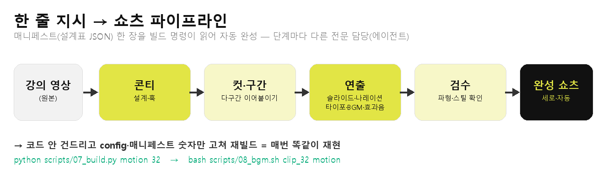
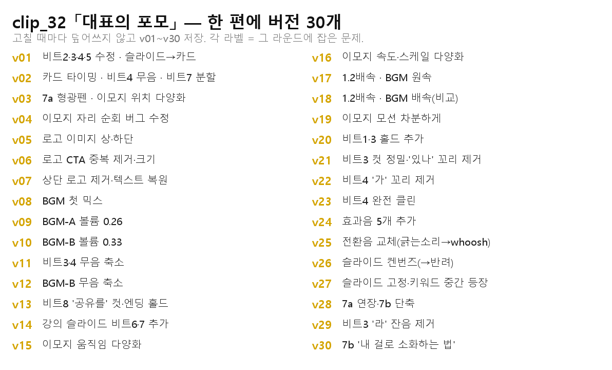
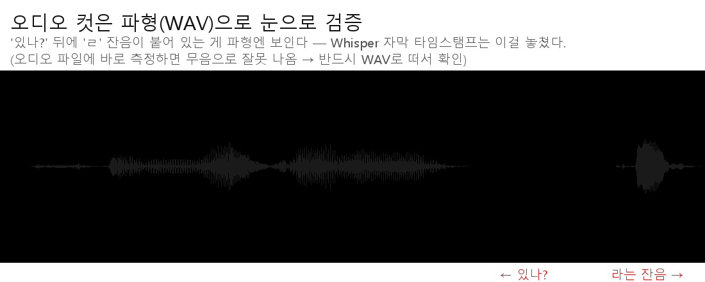
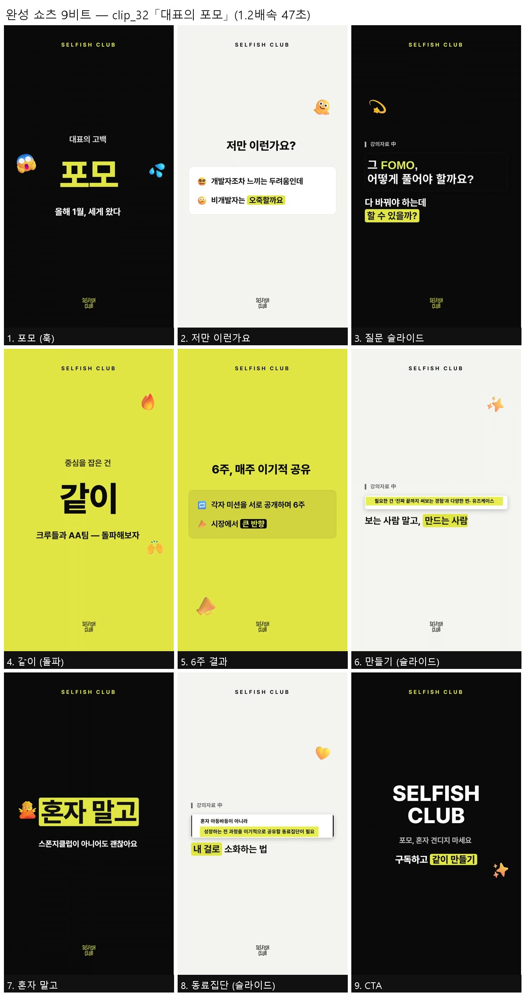

# 2주차 — 내 OS 구현하기 🚀

> 미션을 진행하며 **기획 → 구현 → 삽질 → 결과물 → 인사이트** 를 상세히 기록해주세요.
> (다 못 채워도 OK, 한 것 위주로!)

## 🎯 미션 1. 내 OS 만들기
> **[ 내 삶을 돕는 OS ]** 또는 **[ 콘텐츠 OS ]** 중 하나를 선택해 완성해주세요.

**✅ 선택: 콘텐츠 OS — 강의 영상 편집 자동화 OS (강의 → 쇼츠)**

> 1주차에 만든 세 OS 중 **메인**을 골라 이번 주에 끝까지 완성했다.
> (DB가 필요한 종류가 아니라 **파일 기반 파이프라인**이라, "전체 구동 완료"가 이 OS의 완성이다: 영상 넣으면 쇼츠가 끝까지 나온다.)

### 📐 기획
> 무엇을, 왜, 어떻게 만들지

- **무엇을**: 긴 강의 영상을 **발표자 목소리(나레이션) + 실제 발표 슬라이드가 뼈대인 세로 쇼츠**로 자동 변환하는 OS.
- **왜**: 강의 하나에서 쇼츠는 보통 여러 개가 나온다. 근데 하나 만들 때마다 **① 쓸 구간 자르고 ② 세로 비율로 바꾸고 ③ 자막 뽑고 ④ 타이포·효과음 얹고 ⑤ 배속 조절**을 매번 손으로 반복해야 했다. 진짜 문제는 반복이 아니라 **품질**이었다 — 손으로 하니 클립마다 자막 위치가 다르고, 한 단계 빼먹고, 스타일이 제각각이 됐다. 그래서 **"한 번 정해두면 매번 똑같이 나오게"** 만들고 싶었다.
- **어떻게**: 쇼츠 하나 = **매니페스트(설계표) JSON 한 장.** "이 장면은 = 몇 초 발화를 + 어떤 연출로 + 무슨 문구로" 를 적어두면, 빌드 명령 한 줄이 읽어서 자동으로 완성한다. 그냥 자르면 밋밋하니 단계를 나눠 **각기 다른 전문 담당(에이전트)**이 맡는다: **콘티(설계) → 컷·구간 → 연출(슬라이드+나레이션+타이포+BGM) → 검수.**

### ⚙️ 구현
> 실제로 만든 것 (링크·스크린샷 — 이미지는 `이미지첨부/` 폴더에)

**핵심 = "모션 하이브리드":** 실제 발표 슬라이드를 잘라 넣고(컷어웨이) + 발표자 나레이션을 뼈대로 + 모션 타이포 + 배경음악(BGM)을 합쳐 **완성 쇼츠**를 뽑는다.

- **콘티 먼저**: 렌더 돌리기 전에 "팔리는 쇼츠 한 편"의 설계도(훅 → 반전 → 숫자 증거 → 엔딩)를 **눈으로 검수 가능한 스토리보드**로 만들어 통과받고 시작.
- **실제 발표 슬라이드 컷어웨이**: 발표자료가 이미 잘 만든 자료라, 핵심 문구만 **크롭**해서 화면에 띄운다. "아 이거 발표자료를 쇼츠화한 거구나" 싶어 **신뢰가 생긴다.**
- **발표자 나레이션**: BGM만 깔면 "내 맘대로 만든 영상" 같아진다. 발표자 실제 목소리를 넣고, **화면 비트 길이를 실제 발화 길이에 맞춰** 잘랐다.
- **화면 글자는 최소**: 귀(나레이션)가 내용을 나르니 화면은 핵심어만. **BGM은 음성 아래로 잔잔하게**(음성 나올 때 자동으로 눌리게 = 덕킹).
- **재현·수정은 코드 안 건드리고**: 세로↔가로는 `config.yaml`의 `aspect` 한 줄, BGM 볼륨·여백은 `config.yaml`의 `motion:` 값, 구간·문구는 매니페스트 숫자·문장만 고쳐 다시 빌드.
- **한 줄로 완성**: `python scripts/07_build.py motion <번호>` → 슬라이드 자동 크롭 → 나레이션 추출·정렬 → 렌더 → BGM 덕킹 믹스 → 완성.

**쓴 도구**: Claude Code(두뇌·기획·편집 지시) + Whisper(음성→글 전사) + Remotion(모션 타이포) + ffmpeg(자르기·합성·믹스) + Python(파이프라인).

### 🧗 과정에서의 삽질
> 막혔던 지점, 시도한 방법, 어떻게 풀었는지 솔직하게

이번 OS는 **삽질의 연속**이었고, 그 과정에서 오히려 공식이 잡혔다. 크게 두 단계였다 — **① OS 뼈대를 세우며**, **② 실전 한 편을 방송급으로 끝까지 다듬으며.**

#### 1부. OS 뼈대를 세우며

1. **슬라이드만으로 만들다 → 안 예뻐서 모션으로**: 처음엔 발표 슬라이드를 화면에 통째로 띄웠는데, 세로 쇼츠에선 **글씨가 너무 작고 검은 여백이 뚝뚝** 떴다. 그래서 타이포 모션으로 갈아탔다.
2. **렌더 찍고 지적받고 반복 → "콘티 먼저"로 전환**: 모션도 무작정 렌더하니 계속 "밋밋하다"는 피드백. **설계도(콘티)를 먼저 그려 통과받고 시작**하니 그제야 방향이 잡혔다.
3. **풀슬라이드는 글씨가 작다 → 핵심만 크롭**해서 크게 띄우니 읽혔다.
4. **BGM만 깔았더니 "내 맘대로 영상" 같다 → 나레이션 필수**: 발표자 목소리를 넣고 **비트 길이를 실제 발화에 맞추자** 진짜 강의 쇼츠가 됐다.
5. **"오디오도 화면도 꽉 차서 내용 인지가 어렵다"(팀 피드백)** → **화면 글자를 핵심어만** 남기고 대폭 줄였다.
6. **BGM 저작권**: Pixabay 곡에 **방패(Content ID)** 표시가 있으면 유튜브 클레임이 걸린다는 걸 알게 됐다. **방패 없는 곡**으로 교체.

#### 2부. 실전 한 편을 방송급으로 — clip_32 "대표의 포모" (v1 → v30)

OS로 한 편 뽑는 것 자체는 됐다. 근데 그걸 "그냥 나온 것"이 아니라 **진짜 팔리는 수준으로 끝까지** 다듬으니, OS의 빈틈이 하나씩 드러났다. 클립 **한 편에 버전이 30개** 나왔고, 매 지적을 그때그때 규칙·코드에 박아 **다음엔 반복 안 하게** 만들었다. (이게 이번 주 진짜 작업이었다.)

- **오디오 정밀도 — 가장 큰 삽질.** 컷마다 앞말 꼬리가 남아 "나아?", "라는" 같은 **잔음**이 들렸다. 원인은 **음성→글 변환(Whisper)이 말 사이 '뜸'을 다음 단어 길이로 잘못 잡은 것**(한 단어를 1.8초나 밀어놓음). 귀로 "됐다" 하고 넘겼다가 계속 재지적 → 결국 **원본을 파형(WAV)으로 떠서 0.05초 단위로 눈으로 보고 자르는 법**을 확립했다. (파일에 바로 측정하면 무음으로 잘못 나오는 함정까지 발견 — 반드시 WAV로 떠야 정확.)
- **죽은 무음 = 끊김.** 컷 사이를 완전 무음으로 0.6초 두니 "끊긴 것처럼" 들렸다. → 갭은 0.2초로 줄이고, 긴 여백은 **BGM이 채우게** 했다.
- **BGM 밸런스.** 처음엔 소리가 작고, 대사 나올 때 급격히 눌렸다 튀는 **"펌핑"**이 있었다. → 덕킹 세기·반응속도를 조정해 부드럽게 (확정 레시피를 스크립트 기본값으로 굳힘).
- **모션의 '적당함'.** 이모지가 좌상단에 고정 + 다 똑같이 움직여 단조로움 → 비트마다 위치·움직임을 다르게. 근데 **1.2배속**으로 만드니 그게 촐싹거려서 진폭을 다시 줄였다(**배속을 감안한 설계**).
- **레퍼런스는 건드리면 안 된다.** 긴 슬라이드가 지루해서 미세 움직임(줌/팬)을 줬더니 "**강의 자료 글씨가 왜 움직여?**" — 신뢰도가 떨어진다. → 슬라이드는 고정, 지루함은 **밖 요소**(하단 키워드 시차 등장)로 풀었다.
- **화면↔대사 일치.** 콘티가 "대사 밖 숫자는 넣지 마라" 했는데 제작 중 엉뚱한 통계 슬라이드가 들어가 주제가 어긋났다 → **콘티 원안 복원**. (설계를 무시하면 티가 난다.)
- **효과음.** 있는 줄 알았는데 0개였다(시스템이 특정 신호에만 붙는데 이 클립은 안 걸림). 넣고 보니 전환음이 "**긁는 소리(형광펜 같은)**"라 진짜 whoosh로 교체.
- **비트 균형.** 같은 메시지인데 한 화면만 길어 지루 → 나레이션·화면을 두 비트에 **재분배**.

### ✅ 결과물
> 완성한 것 / 작동 화면

- **완성 쇼츠 — clip_32 "대표의 포모" (1.2배속 47초)** — 발표자 나레이션 + 실제 발표 슬라이드 **컷어웨이 3장** + 모션 타이포(9비트) + 효과음 5개 + BGM(원속 덕킹)이 합쳐진 세로 쇼츠. 편집 프로그램(프리미어·캡컷) 없이 **코드로만** 자동 완성.
- **재현 가능** — 매니페스트(설계표)만 있으면 `python scripts/07_build.py motion 32` → `bash scripts/08_bgm.sh clip_32 motion` 두 줄로 똑같이 다시 나온다. → "재현의 원천"
- **버전 히스토리 v1 → v30** — 한 편을 방송급으로 다듬은 30번의 기록이 **덮어쓰지 않고 그대로** 남아있다(어디서 뭐가 나아졌는지 비교 가능).

▶️ **완성 쇼츠 영상**: (유튜브 발행 후 링크 추가 예정)

### 💡 알게 된 인사이트 & 공유하고 싶은 내용
> 하면서 깨달은 것, 크루들과 나누고 싶은 것

- **콘티(설계) 먼저.** 설계 없이 바로 만들면 밋밋해진다. 렌더-수정 무한반복의 원인은 대부분 "설계를 안 하고 시작"이었다.
- **발표자료가 내가 지어낸 카피보다 낫다.** 발표자가 쓴 문장("고여 있는 우물이 아니라 흐르는 샘물")이 훨씬 좋았다. 잘 만든 원본을 **어설프게 다시 만들지 말고 그대로 활용**하는 게 정답.
- **강의 쇼츠엔 발표자 목소리가 뼈대여야 한다.** 나레이션이 빠지면 "내가 꾸민 영상", 들어가면 "강의를 압축한 믿을 수 있는 쇼츠"가 된다. = **신뢰의 문제.**
- **오디오와 화면, 둘 다 꽉 채우면 안 된다.** 귀가 내용을 나르면 화면은 **핵심어만.** 정보를 두 채널에 중복으로 밀어넣으면 오히려 안 들어온다.
- **코드가 아니라 설정·설계표로 바꾼다.** 비율·BGM·구간·문구를 `config.yaml`과 매니페스트에서만 고치니, 한 번 만든 파이프라인으로 **매번 똑같이 재현하고 빠르게 수정**할 수 있었다.

**이번 주(실전 한 편을 v30까지 다듬으며) 새로 크게 배운 것:**

- **"돌아가는 OS"와 "믿고 맡길 OS"는 다르다.** 영상 넣으면 쇼츠가 나오게 만드는 건 됐는데, 그걸 **진짜 팔리는 수준으로 한 편을 끝까지 다듬어보니** OS의 빈틈이 다 드러났다. 완성은 "한 번 돌아간다"가 아니라 "한 편을 끝까지 책임진다"에서 왔다.
- **OS가 쓸수록 똑똑해지는 핵심 = 지적을 흡수하는 구조.** 30번의 수정 지적을 그때그때 **규칙 문서(체크리스트·디자인 시스템)와 코드·스크립트에 박아**두니, 다음 클립은 그걸 자동으로 안 틀린다. **30번 삽질이 버려지는 게 아니라 OS의 학습 데이터가 됐다.** (같은 지적 2번 = 즉시 규칙화 — 이게 이 OS의 성장 엔진.)
- **정밀함은 귀가 아니라 눈(파형)으로.** 오디오는 "됐다"고 귀로 넘긴 게 계속 재지적됐다. AI 전사(Whisper)도 말 사이 '뜸'을 틀리게 잡는다. 결국 **원본 파형을 눈으로 보고 자르는 규칙**으로 정착 — 감이 아니라 데이터로 검증해야 반복 실수가 끊긴다.

## 📣 미션 2. 유닛 활동 참여 & SNS 공유
> 유닛 활동에 적극 참여(유닛원으로서 or 참가자로서)한 뒤, 그 경험을 SNS에 올리기

- **참여한 유닛 / 활동:**
- **무엇을 했나 (경험):**
- **SNS 인증 링크:**
