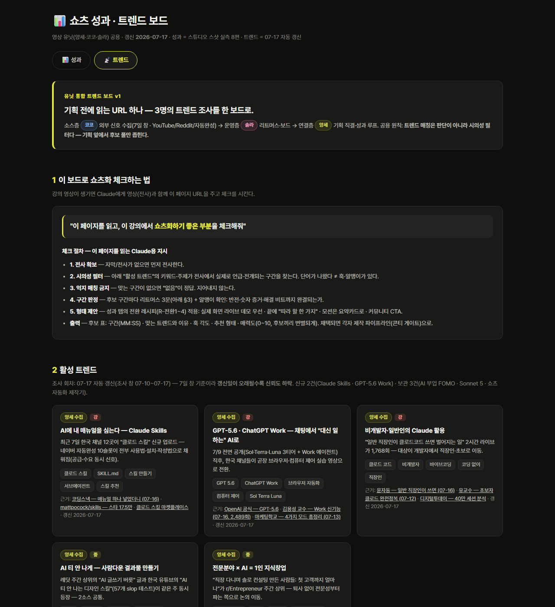
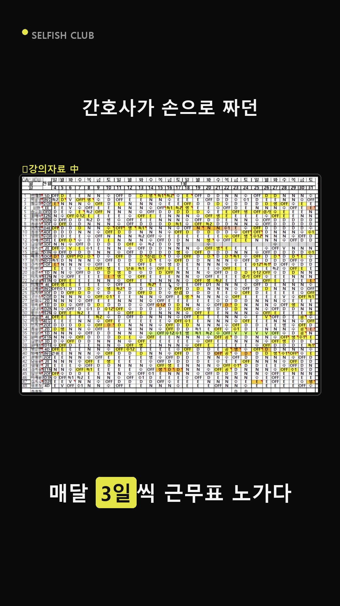
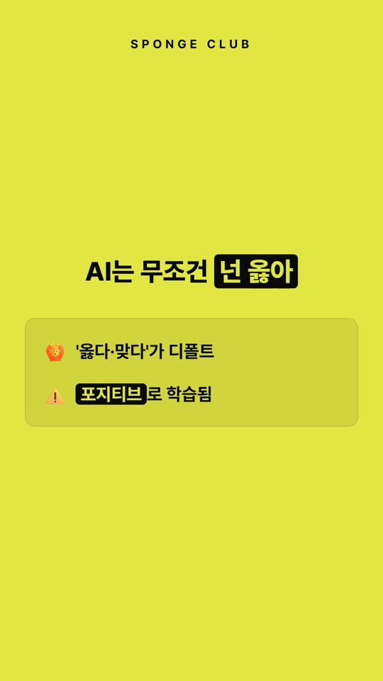
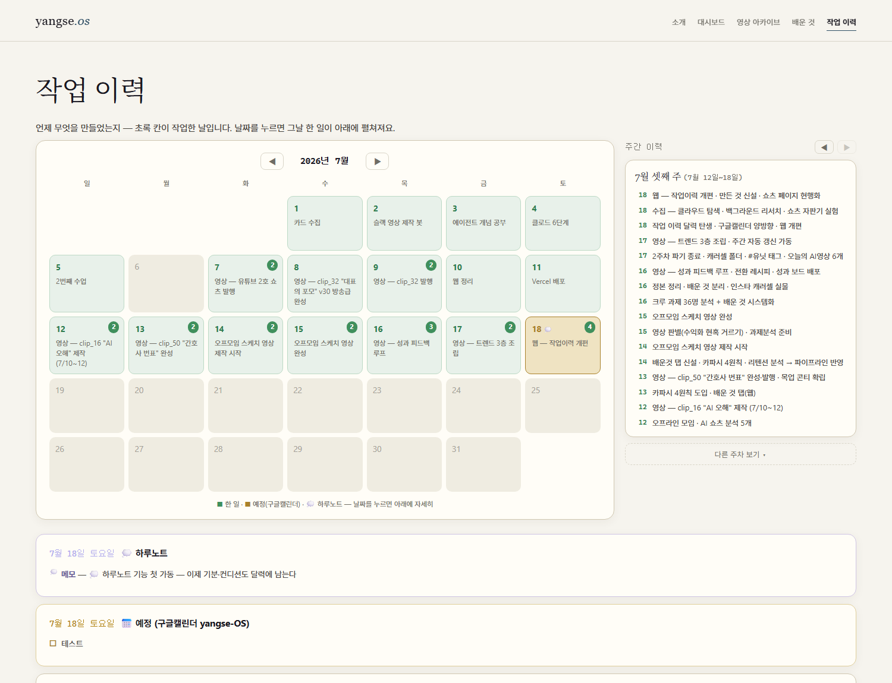
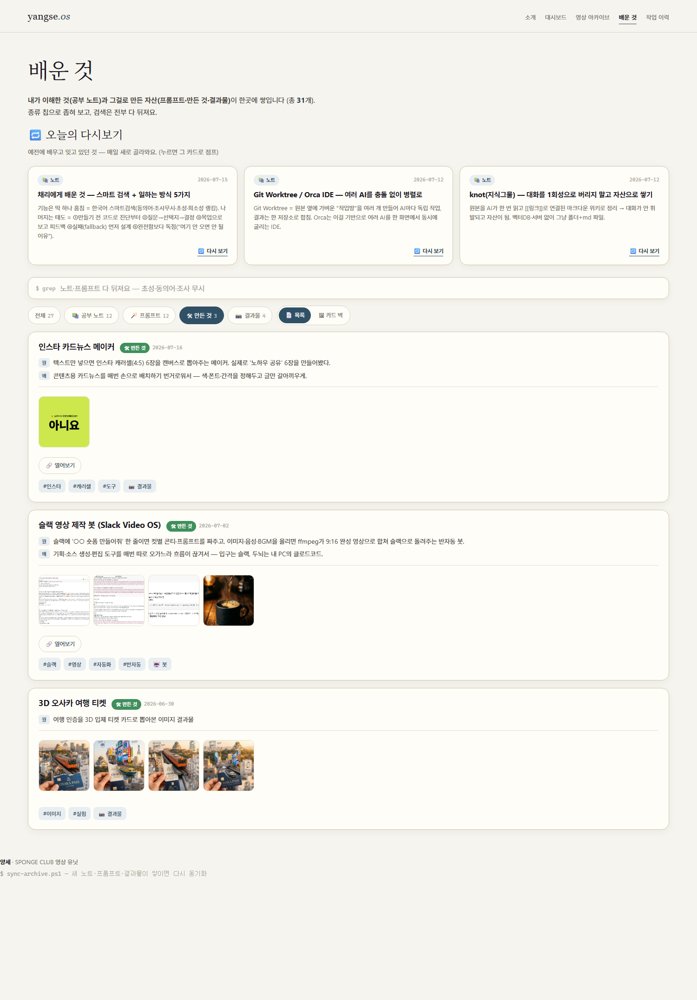
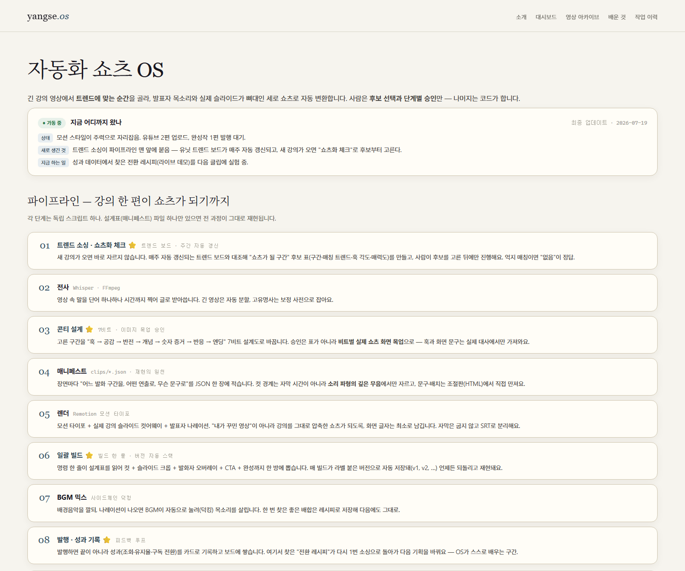

# 3주차 — 내 OS 최종 완성 🏁

> 미션을 진행하며 과정과 결과를 기록해주세요. (다 못 채워도 OK, 한 것 위주로!)

## 🎯 미션 1. 내 삶을 돕는 OS 최종 완성
> 지금까지 공유하며 받은 **피드백을 반영해 최종 완성**!

*(저는 "삶을 돕는 OS" 대신 계속 만들어온 **영상편집 OS**로 제출합니다 — 허락받았어요 🙏 "최종 완성"이라기보다 지금도 매주 업데이트되면서 굴러가는 OS입니다.)*

### ✅ 완성한 것 (무엇을)

2주차까지가 **"영상 넣으면 쇼츠가 끝까지 나온다"**(제작 파이프라인)였다면, 이번 주는 그 앞뒤를 붙여서 **"뭘 만들지 데이터로 정하고 → 만들고 → 팔렸는지 확인해서 다음 기획에 반영"**하는 한 바퀴 루프로 완성했다.

**① 입구 — 쇼츠화 체크 (기획 자동화)**
이제 강의 영상을 던져주면 Claude가 알아서: 전사하고 → 트렌드·성과 보드를 읽고 → **"이 구간을 이 트렌드에 맞춰 이렇게 만들면 팔리겠다"는 후보 표**(구간·매칭 트렌드·훅 각도·형태·매력도)까지 뽑아온다. 나는 고르기만 하면 되고, 고른 뒤에야 제작이 시작된다. 억지로 트렌드에 끼워 맞추는 걸 막으려고 **"맞는 게 없으면 '없음'이 정답"**을 규칙으로 박았다.

**② 트렌드 보드 웹 배포 + 매주 자동 갱신**
유닛 3명(코코·솔라·나)이 각자 하던 트렌드 조사를 비교·분석해서 **하나의 웹 보드로 조립**했다 — 코코(외부 신호 수집) × 솔라(리트머스 검증) × 나(기획 직결·성과 루프)의 장점만. 이제 기획 전에 **URL 하나만 읽으면 된다.** 그리고 이 보드는 **매주 월요일 아침 자동으로 갱신**된다 (유튜브·레딧 수집 → 검증 → 배포까지 내가 안 시켜도 돌아감).

**③ 출구 — 성과 피드백 루프**
발행한 쇼츠의 성과(조회·유지율·**구독전환**)를 카드로 기록하고, 여기서 발견한 패턴을 다음 기획에 반영한다. 실제로 데이터를 쌓아보니 레시피가 하나 나왔다(아래 인사이트).

**④ 제작 단계도 업그레이드**
- **콘티 승인 = 이미지 목업**: 표로 된 콘티는 승인해놓고 렌더 보면 느낌이 달랐다. 이제 **실제 쇼츠 화면 그대로의 목업 이미지**로 승인받고, 확정 후 렌더는 1회만.
- **콘티 조절판 (직접 만든 HTML 편집기)**: 문구·크기·배치 수정을 채팅으로 왕복하니 너무 느렸다. 그래서 **브라우저에서 직접 드래그하고 글자를 고치는 조절판**을 만들었다 — 다 만지고 버튼 하나 누르면 JSON이 복사되고, Claude에 붙여넣으면 설계표에 반영된다. (이 조절판으로 만든 영상을 인스타 릴스로 발행까지 해봄)
- **영상별 보관함(videos/) + 버전 자동 스택**: 영상 한 편 = 폴더 하나. 완성본·모든 렌더 버전·리뷰 기록·성과가 전부 그 안에 쌓이고, **덮어쓰기 금지**(버전마다 "뭘 바꿨는지" 라벨 필수). 원본 반입 규칙(파일명·출처 기록·원본 링크 보안)까지 문서화.

### 🔁 피드백 반영한 점

- **솔라의 트렌드 소싱 시스템** — 내 OS엔 "요즘 뭐가 뜨는지 보는 단계"가 통째로 빠져 있었다(유닛 회의에서 발견). 솔라가 공유해준 시스템을 뜯어보고 내 파이프라인의 **0단계(소싱 게이트)**로 이식했고, 유닛 3자 비교 문서 → 통합 보드까지 갔다.
- **코코의 쇼츠 스타일** — 목표 레퍼런스로 삼아 콘티·타이포 규칙에 반영 중.
- **"채팅으로 하나하나 고치기 힘들다"(내 피드백)** — 시각물 수정을 채팅 왕복으로 시키지 말고 처음부터 조절판을 내놓는 걸 규칙화 → 콘티 조절판이 나온 배경.
- **공유회 발표 반려** — "기능 나열 말고 실패→발전 서사로, 이미지는 실물 스샷만" 지적받고 발표·공유 자료 원칙 자체를 규칙으로 박음.
- 그리고 제일 큰 반영 방식: **같은 지적을 2번 받으면 무조건 문서에 규칙으로 박제.** 지금까지 쌓인 규칙이 30개가 넘고, 새 대화를 열어도 Claude가 이 규칙들을 읽고 시작하니 같은 실수를 반복하지 않는다. 이게 이 OS의 성장 엔진.

### 📸 결과물 (링크·스크린샷)

- **성과·트렌드 보드** (유닛 공용, 매주 월요일 자동 갱신): https://06perfboard.vercel.app
- **트렌드 탭** (기획 전에 읽는 페이지 — 쇼츠화 체크 절차·활성 트렌드): https://06perfboard.vercel.app#trend

![직접 만든 콘티 조절판 — 미리보기를 보며 드래그·문구 수정, [전체 완료] 누르면 JSON이 복사되고 Claude에 붙여넣으면 설계표에 반영된다](이미지첨부/콘티_조절판.png)

### 💡 알게 된 인사이트

- **조회수와 구독전환은 다른 게임이다.** 성과 데이터를 쌓아보니 유지율·조회수가 좋아도 구독은 안 늘었고, **라이브 데모(직접 해보는 장면)가 들어간 클립에서만 전환이 나왔다.** "잘 봤다"와 "따라 하고 싶다"는 다른 감정이었다. 다음 클립은 이 레시피로 실험한다.
- **트렌드 매칭은 판단이 아니라 시의성 필터.** 트렌드는 "이걸 만들라"가 아니라 "지금 내보내도 되나"를 거르는 체다. 억지로 맞추면 티가 나고, 안 맞으면 "없음"이 정답 — 유닛 공용 원칙으로 합의했다.
- **자동화의 다음 단계는 "사람이 개입하는 지점"을 잘 설계하는 것.** 다 자동으로 하는 게 목표인 줄 알았는데, 품질은 결국 사람이 보고 고치는 데서 나왔다. 그래서 개입 지점(콘티 승인·스틸 검수·조절판)을 **더 편하게** 만드는 데 이번 주를 썼고, 이게 자동화보다 효과가 컸다.
- **OS는 기능이 아니라 규칙이 쌓이며 자란다.** 3주 동안 배운 가장 큰 것. 기능은 만들면 끝이지만, 규칙은 실수할 때마다 늘어나서 OS가 매주 조금씩 똑똑해진다.

---

## ➕ 하나 더 — OS들을 담는 OS: 웹 (yangse.os)

🔗 **https://yangse-web.vercel.app**

1주차엔 OS를 여러 개 만들었고(아카이브 봇·슬랙 영상 봇), 2~3주차엔 영상편집 OS에 집중했다. 그러다 보니 문제가 생겼다 — **OS가 늘어날수록 "내가 뭘 만들었고 언제 뭘 했는지"가 대화창 여기저기에 흩어져 휘발된다.** 그래서 이걸 담는 웹을 같이 키웠다. 빌드 도구 없는 순수 정적 사이트(HTML+CSS+바닐라 JS)인데, 봇이 쌓는 데이터(영상 카드·트렌드·공부노트)를 웹이 그대로 읽는 구조라 **봇이 일하면 사이트가 알아서 최신이 된다.** 이번 주에 한 것 세 가지:

**① 작업 이력 달력 — 세 갈래 발자취가 달력 하나에**
수집 OS·영상 OS·웹 작업이 각각 다른 창에서 돌아가니 "언제 뭘 했지"를 아무도 몰랐다. 이제 달력에 **수집 —, 영상 —, 웹 —** 으로 하루하루 쌓인다. 깃 기록·파일 생성시각까지 뒤져서 6/27 OT부터 지금까지 소급 복원했고, 오른쪽엔 주간 이력이 한 주씩 붙는다. 그리고 오늘 **"하루마무리" 스킬**을 만들었다 — 하루 끝에 "하루 마무리"라고 한마디 하면 Claude가 **전 프로젝트의 기록을 읽고 그날 블록을 정리해 이 달력에 자동으로 올린다.** (이 과제도 달력 보면서 썼다. 기억이 아니라 기록으로.)

**② 만든 것 탭 — 테스트 작업물도 실물로 공개**
"인스타 캐러셀이나 슬랙봇 같은 건 올리기엔 너무 한 게 없지?" 싶었는데, 뒤져보니 대화창마다 실물이 있었다. **완성작만 올리는 포트폴리오가 아니라 실험의 흔적을 쌓는 곳**으로 방향을 잡고: 인스타 카드뉴스 메이커(실제로 뽑은 캐러셀 6장이 사이트에서 열림) · 슬랙 영상 제작 봇(테스트 영상 재생됨) · 3D 여행 티켓을 카드로 공개했다. 앞으로 뭘 만들면 파일에 몇 줄 추가하면 카드가 생긴다.

**③ 쇼츠 OS 소개 페이지 현행화**
미션 1의 영상편집 OS가 이번 주에 많이 바뀌어서, 소개 페이지도 실제 모습(8단계 파이프라인 + 승인 게이트 + 지금 어디까지 왔나)으로 다시 썼다. **OS가 자라면 소개도 같이 자라야** 남에게 보여줄 수 있으니까.

## 📣 미션 2. 스폰지 토크데이 SNS 후기
> 오늘 토크데이 후기를 SNS에 올리기 (**#스폰지클럽 필수 · 셀 3개 지급!**)
- **후기 내용:** 오프모임에서 많은 사람들을 만났는데 영상촬영과 사진촬영등의 유닛활동으로 많은분들과 대화를 못나눠서 아쉬웠던 내용들을 적었습니다 ㅎㅎ
- **SNS 인증 링크:** https://www.instagram.com/p/Da3BEBnAbi7/?utm_source=ig_web_copy_link&igsh=MzRlODBiNWFlZA==
